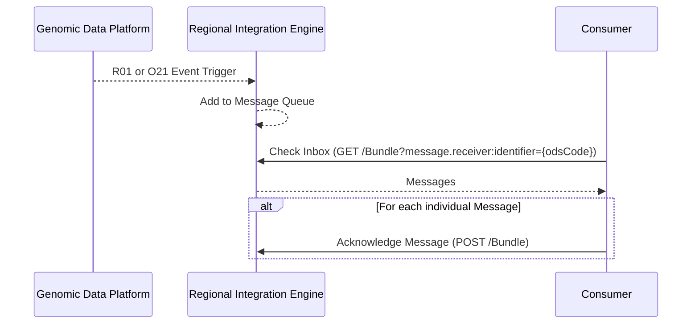
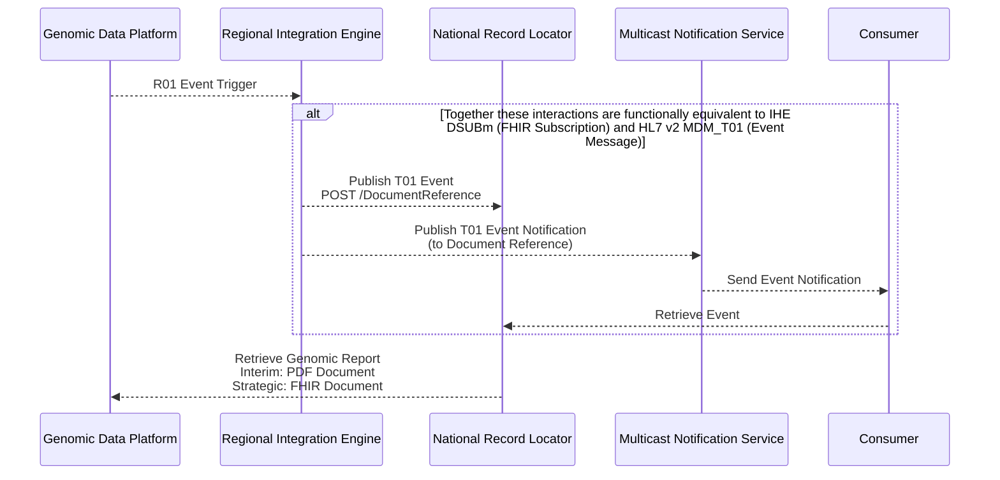

### NE&Y Genomics - Interim

```mermaid
sequenceDiagram

participant gdp as Genomic Data Platform
participant RIE as Regional Integration Engine
participant consumer as Consumer


gdp -->> RIE: R01 or O21 Event Trigger
RIE -->> RIE: Add to Message Queue
consumer ->> RIE: Check Inbox (GET /Bundle?message.receiver:identifier={odsCode})
RIE -->> consumer: Messages
alt For each individual Message
    consumer ->> RIE: Acknowledge Message (POST /Bundle) 
end
```

### LS&C + UGR

```mermaid
sequenceDiagram

participant gdp as Genomic Data Platform
participant RIE as Regional Integration Engine
participant nrl as National Record Locator
participant mns as Multicast Notification Service
participant consumer as Consumer


gdp -->> RIE: R01 Event Trigger
alt Together these interactions are functionally equivalent to IHE DSUBm (FHIR Subscription) and HL7 v2 MDM_T01 (Event Message)
RIE -->> nrl: Publish T01 Event<br/>POST /DocumentReference
RIE -->> mns: Publish T01 Event Notification<br/>(to Document Reference)
mns -->> consumer: Send Event Notification
consumer -->> nrl: Retrieve Event 
end

nrl -->> gdp: Retrieve Genomic Report<br/>Interim: PDF Document<br/>Strategic: FHIR Document
```