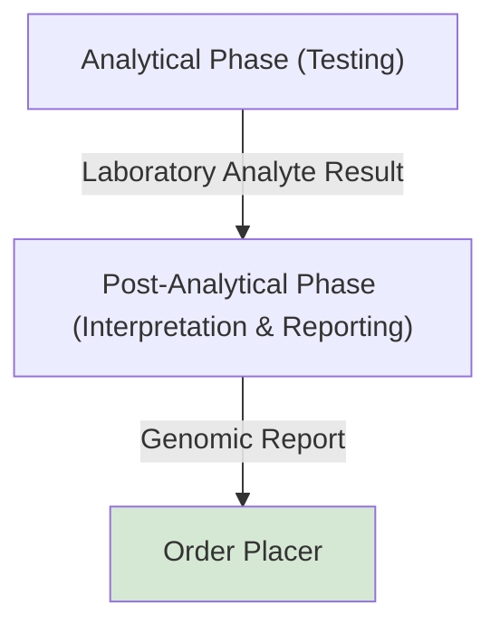

This is currently being elaborated and subject to change.

## References

1. [Laboratory Analyte Result - Data Mapping](LaboratoryAnalyteResult.html#data-mapping)
2. [Test Results Management (LAB-5)](LTW.html#test-results-management-lab-5)
3. [69380-4](https://loinc.org/69380-4/) t(9;22)(q34.1;q11)(ABL1,BCR) b2a2+b3a2 fusion transcript/control transcript (International Scale) [# Ratio] in Blood or Tissue by Molecular genetics method

## Actors

| Actor          | Role                                    | System                          |
|-------------------|---------------------------------------|--------------------------------------|
| Analyser           | Performs the analytical phase (testing) | Cepheid GeneXpert (ASTM-communicating) |
| Order Filler       | Laboratory Information Management System | iGene                              |
| Order Placer        | Requesting clinician (treatment response monitoring) | Requesting Trust EPR       |
{:.grid}

## Transactions

| Transaction                      | Description                                   |
|--------------------------------------|----------------------------------------------|
| Laboratory Analyte Result (LAB-5) | Analyser → Order Filler (analytical result)     |
| Genomic Report                    | Order Filler → Order Placer (validated report)  |
{:.grid}

## Current Process

<b>Domain Archetype:</b> <a href="StructureDefinition-LaboratoryAnalyteResult.html" _target="_blank">Laboratory Analyte Result</a>

<b>FHIR Questionnaire (Result Panel):</b> <a href="Questionnaire-BCRABLResultPanel.html">BCR-ABL Monitoring Result Panel</a>

> BCR-ABL1 concentration testing is used to monitor the amount of the fusion gene (Philadelphia chromosome) in chronic myeloid leukemia (CML) patients, with results typically reported on an International Scale (%IS) to measure treatment response.

This use case reflects BCR-ABL1 quantification performed on an ASTM-communicating
analyser (e.g. Cepheid GeneXpert) with results ultimately consumed by iGene,
following the generic Analytical/Post-Analytical phases below.

### Analytical Phase (Testing)

This is the core stage where the targeted substance (analyte) is actually measured.
- Calibration & Quality Control (QC): Before testing patient samples, laboratory technicians calibrate the instrument and run Quality Control materials with known values to ensure the equipment is operating perfectly.
- Analysis: The processed sample is placed into an automated analyzer. Depending on the analyte, the machine uses techniques like mass spectrometry, chromatography, or colorimetric spectroscopy to quantify or detect the substance.
- Validation: The instrument produces raw data which is processed and mathematically converted into a meaningful concentration.

Output: [Laboratory Analyte Result](LaboratoryAnalyteResult.html)

### Post-Analytical Phase (Interpretation & Reporting)

Once the analyzer generates a value, the results must be evaluated and distributed to the requesting physician or client.
- Verification: The laboratory scientist reviews the result against the laboratory's reference ranges (what is considered "normal") and validates the data quality.
- Reporting: The final validated result is transmitted to the clinician's health record or client file.
- Critical Action: If the analyte is at a dangerously abnormal level, immediate protocols (e.g., direct calls to the doctor) are enacted.

Output: [Genomic Test Report](StructureDefinition-DiagnosticReport.html)
Process Flow: [Test Results Management (LAB-5)](LTW.html#test-results-management-lab-5)

## Future Process

No distinct future-state changes are currently defined for this pathway - this
section will be populated as further Cepheid/ASTM analyser integrations are
brought onto the same pattern.

## Data Models

- [Laboratory Analyte Result](StructureDefinition-LaboratoryAnalyteResult.html) - the `Observation` this use case populates
- [Genomic Test Report (DiagnosticReport)](StructureDefinition-DiagnosticReport.html) - the validated report returned to the Order Placer
- [BCR-ABL Monitoring Result Panel](Questionnaire-BCRABLResultPanel.html) - the result panel Questionnaire, `item.definition`/`item.code` inferred from this IG's own `Observation-BCRABL-Valid`/`Observation-BCRABL-Invalid` examples

### Result Detail

See [Laboratory Analyte Result - Data Mapping](LaboratoryAnalyteResult.html#data-mapping)
for the full field mapping (openEHR / HL7 v2 / LOINC-SNOMED / FHIR / iGene) this use
case populates. These entries are expressed in `Observation.component`, structured as
the [BCR-ABL Monitoring Result Panel](Questionnaire-BCRABLResultPanel.html)
Questionnaire - its `item.definition`/`item.code` values are inferred directly from
this IG's own `Observation-BCRABL-Valid`/`Observation-BCRABL-Invalid` examples.

#### BCRABL

| Data Element     | Local Code    | LOINC | SNOMED | iGene                      | Data Type | Unit    | Example |
|------------------|---------------|-------|--------|----------------------------|-----------|---------|---------|
| MR                         | MR               |       |        | MR                         | String    |      | 4.52    |
| ABL_Analyte_Result         | ??               |       |        | ABL_Analyte_Result         | String    |      | ?? PASS |
| ABL_Ct                     | ABL&Ct           |       |        | ABL_Ct                     | String    |      | 12.2    |
| ABL_EndPt                  | ABL&EndPt        |       |        | ABL_EndPt                  | String    |      | 434     |
| ABL_Probe_Check_Result     | ABL&             |       |        | ABL_Probe_Check_Result     | String    |      | PASS    |
| BCR-ABL_Analyte_Result     | BCR-ABL&         |       |        | BCR-ABL_Analyte_Result     | String    |      | POS     |
| BCR-ABL_Ct                 | BCR-ABL&Ct       |       |        | BCR-ABL_Ct                 | String    |      | 30.3    |
| BCR-ABL_EndPt              | BCR-ABL&EndPt    |       |        | BCR-ABL_EndPt              | String    |      | 164     |
| BCR-ABL_Probe_Check_Result | ??               |       |        | BCR-ABL_Probe_Check_Result | String    |      | ?? PASS     |
| BCR-ABL_Target_Delta_Ct    | BCR-ABL&Delta Ct |       |        | BCR-ABL_Target_Delta_Ct    | String    |      | -18.1        |
{:.grid}

## Examples

| Example                              | Description                                                    |
|------------------------------------------|------------------------------------------------------------------|
| [Observation-BCRABL-Valid](Observation-BCRABL-Valid.html)   | A normal result - `valueQuantity` populated                     |
| [Observation-BCRABL-Invalid](Observation-BCRABL-Invalid.html) | An out-of-range result - `dataAbsentReason` populated instead of `valueQuantity` |
{:.grid}
