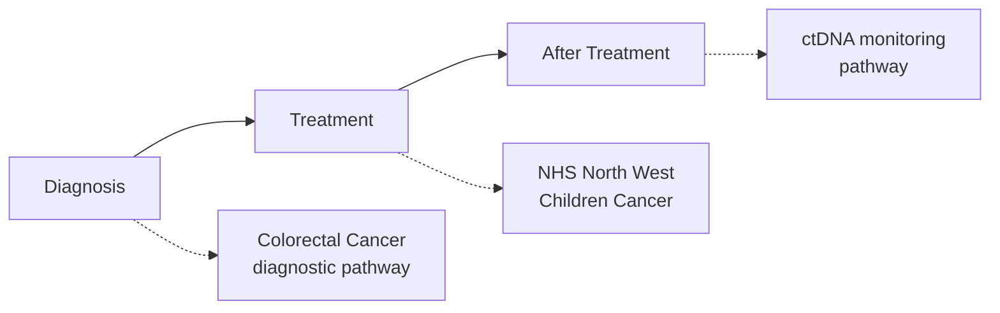
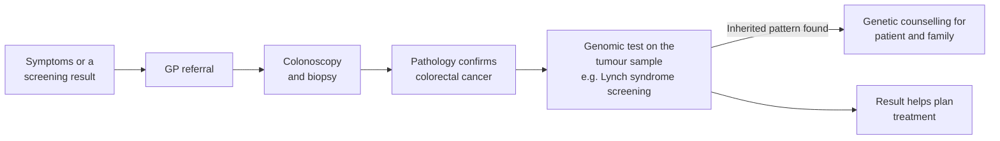
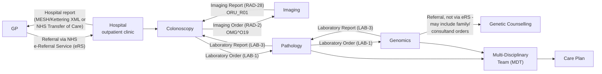
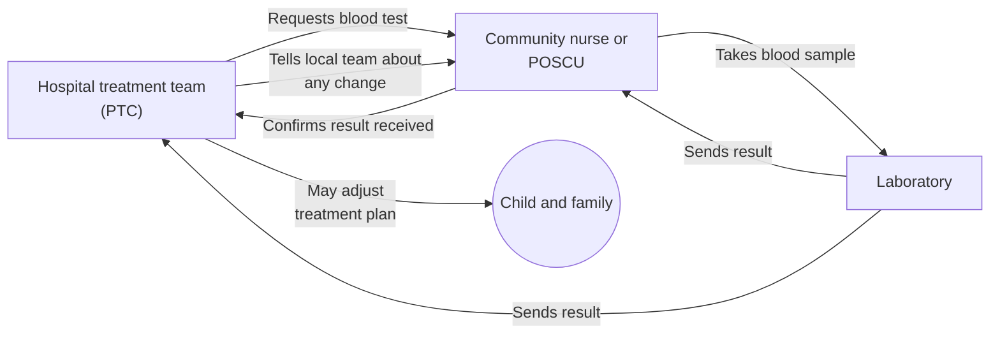
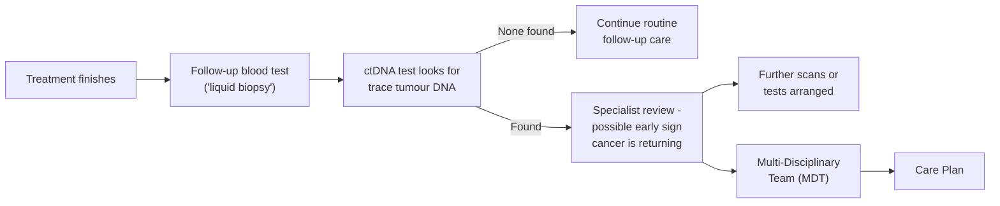

This is for information/analysis purposes only and is not a planned piece of work.

Cancer Background Information for Use Cases is a high-level page that pulls
together several of this IG's other diagnostic testing and
treatment-monitoring use cases - a genomics test following on from a
pathology test order can often
occur around cancer, and cancer referrals bring their own notification
patterns. Rather than a single pathway, this page follows the same simple
three-stage structure Macmillan Cancer Support uses on
[macmillan.org.uk/cancer-information-and-support](https://www.macmillan.org.uk/cancer-information-and-support) -
**Diagnosis**, **Treatment**, and **After Treatment** - and shows where
genomic/genetic testing fits within each, using worked examples from the
[Cheshire and Merseyside Pathology](CheshireAndMerseysidePathology.html) and
[Haemato-Oncology Diagnostic Pathway](HaematoOncologyPathway.html#haematological-malignancy-diagnostic-services)
use cases.

## References

1. [Macmillan Cancer Support - Cancer information and support](https://www.macmillan.org.uk/cancer-information-and-support) - the Diagnosis / Treatment / After Treatment structure this page follows
2. [Getting It Right First Time (GIRFT) Best Practice Timed Diagnostic Cancer pathways](https://gettingitrightfirsttime.co.uk/wp-content/uploads/2024/03/BestPracticeTimedDiagnosticCancerPathwayssummary-guide-March-24-V3.pdf)
3. [macmillan.org.uk - Genomic Tests on the bowel cancer cells](https://www.macmillan.org.uk/cancer-information-and-support/bowel-cancer/tests-on-the-bowel-cancer-cells)
4. [NICE DG27 Molecular testing strategies for Lynch syndrome in people with colorectal cancer](https://www.nice.org.uk/guidance/dg27)
5. [Inherited MMR deficiency (Lynch syndrome) - R210](DiagnosticReport.html#inherited-mmr-deficiency-lynch-syndrome---r210)
6. [ctDNA NHS England Unified Genomic Record (UGR)](ctDNAUGR.html) - the source of the After Treatment ctDNA monitoring pathway below

## Actors

| IHE Actor                                                                                                                   | Role                                    |
|----------------------------------------------------------------------------------------------------------------------------------|------------------------------------------|
| [Order Placer](ActorDefinition-OrderPlacer.html) / [Order Result Tracker](ActorDefinition-OrderResultTracker.html) | Primary Treatment Centre (PTC) - requests testing, acts on results |
| *(no IHE actor defined for this role yet)*                                                                                          | Community Nurse / POSCU - specimen collection, notification relay |
| [Order Filler](ActorDefinition-OrderFiller.html)                                                                                     | Laboratory - performs testing, writes laboratory report |
{:.grid}

## Transactions

This page is cross-cutting narrative rather than its own transaction set - see the
`LAB-1`/`LAB-3`/`LAB-35`/`LAB-36` transactions on
[Cheshire and Merseyside Pathology](CheshireAndMerseysidePathology.html) and
[Haemato-Oncology Diagnostic Pathway](HaematoOncologyPathway.html) for the
underlying genomics ordering transactions these cancer pathways occur within.

## Current Process

Genomic and genetic testing does not happen at just one point in a cancer
pathway - it can help confirm a diagnosis, choose or adjust treatment, and
watch for the cancer coming back afterwards. The three sections below follow
Macmillan's own structure for
[cancer information and support](https://www.macmillan.org.uk/cancer-information-and-support),
so a family carer or patient reading this alongside a Macmillan guide can see
where the genomic/genetic testing fits in the wider picture.

### Diagnosis

[Macmillan - Diagnosis](https://www.macmillan.org.uk/cancer-information-and-support/diagnosis)
covers what happens when cancer is suspected and how a diagnosis is
confirmed. Genomic testing at this stage usually looks at the tumour sample
itself, to help confirm the diagnosis and check for an inherited condition
that could run in the family.

#### Diagnostic Cancer Pathways

<!--

 

Cancer Diagnostics
 
 
-->

##### Colorectal Cancer—Diagnostic Pathways Example

The details of this are beyond the scope of this guide, for more details see [Getting It Right First Time (GIRFT) Best Practice Timed Diagnostic Cancer pathways ](https://gettingitrightfirsttime.co.uk/wp-content/uploads/2024/03/BestPracticeTimedDiagnosticCancerPathwayssummary-guide-March-24-V3.pdf). The diagram below is a simplified view of the same journey, in the style of a [Macmillan cancer information](https://www.macmillan.org.uk/cancer-information-and-support/bowel-cancer/tests-on-the-bowel-cancer-cells) guide:

Underneath that simplified view, each step is really a **closed-loop referral** -
a request goes out, and a report or result comes back to whoever made the
request, before the next step begins:

- The **GP referral** is most likely made via the [NHS e-Referral Service (eRS)](https://digital.nhs.uk/services/e-referral-service). The resulting hospital outpatient/clinic report is returned to the GP via [MESH](https://digital.nhs.uk/services/message-exchange-for-social-care-and-health-mesh) (in the "Kettering" EDT/XML format many GP systems still expect) or, increasingly, the NHS England Transfer of Care standard.
- The **colonoscopy** itself may also generate a separate Imaging Report, alongside the biopsy specimen sent for pathology - following the equivalent IHE Radiology transactions, Imaging Order (`RAD-2`, `OMG^O19`) and Imaging Report (`RAD-28`, `ORU_R01`).
- **Colonoscopy to Pathology** follows this IG's own pattern: a Laboratory Order (`LAB-1`) is placed with the pathology lab, and a Laboratory Report (`LAB-3`) is returned.
- **Pathology to Genomics** follows the same pattern again: a Laboratory Order (`LAB-1`) is placed with the genomics lab, and a Laboratory Report (`LAB-3`) is returned.
- The link between **Genomics Testing and Genetic Counselling** is itself another referral, and may include orders for other family members (consultands), not just the patient (proband), as described in [Distributed WGS (dWGS)](dWGS.html)'s Family Structure/Participant Type pattern. This referral cannot use eRS in the same way the initial GP referral does - eRS is only available to GPs, so a referral from Genomics/Genetic Counselling (a hospital-based service) to arrange counselling has to use a different mechanism.
- Planning and monitoring of treatment is often coordinated by a **Multi-Disciplinary Team (MDT)**, drawing on the pathology and genomics reports above, who may produce a **Care Plan**.

This elaboration also relates to [Inherited MMR deficiency (Lynch syndrome) -
R210](DiagnosticReport.html#inherited-mmr-deficiency-lynch-syndrome---r210), a
genomic test that can be requested on this pathway - see that section for the
full set of Genomics, Patient Care and Genetic Counseling examples (Diagnostic
Implication, Condition, FamilyMemberHistory, etc.) built around it.

For information on `Genomic Tests on the bowel cancer cells`, see [macmillan.org.uk](https://www.macmillan.org.uk/cancer-information-and-support/bowel-cancer/tests-on-the-bowel-cancer-cells) and [NICE DG27 Molecular testing strategies for Lynch syndrome in people with colorectal cancer](https://www.nice.org.uk/guidance/dg27)

<!--

 

Colorectal Cancer Diagnostics and Patient Referrals
 
 
-->

### Treatment

[Macmillan - Treatment](https://www.macmillan.org.uk/cancer-information-and-support/treatment)
covers the different types of cancer treatment and what to expect. During
treatment, blood tests and other laboratory results are used regularly to
check how a patient is responding and to guide medicine doses - keeping
results flowing quickly and accurately between the hospital, community teams
and the laboratory matters just as much as the test itself.

#### NHS North West Children Cancer Example

> **Note:** This example is a pathology (blood test) example, not necessarily
> a genomic one - it is included as background information to illustrate the
> wider testing and notification processes a child on a cancer pathway goes
> through. The blood testing processes used for adults may not be as
> distributed as this example. The blood test itself may also link into ctDNA
> testing, which likewise starts with a blood sample - see the
> [ctDNA Monitoring Pathway](#ctdna-monitoring-pathway) under After Treatment
> below.

<!--

 

Genomic Order Notifications - Use Case 4
 
 
-->

The diagram below is a simplified view of the same as-is process, showing how a
blood test result reaches everyone who needs to see it and act on it:

##### As is Process

(From North West Children Cancer. This is centred around laboratory tests, genomic tests will have similar notification systems)

- Blood test requested by Primary Treatment Centre (PTC)
- Blood sample taken by Community Nurse or Paediatric Oncology Shared Care Unit (POSCU) and the specimen details are documented
- Blood Laboratory Order is created and a laboratory order request is sent to the laboratory
- Blood test performed by laboratory
- Laboratory writes up a blood results report (laboratory report)
- Laboratory report sent to Community Nurse or POSCU
- Laboratory report then sent to PTC
- Community Nurse or POSCU calls PTC by phone to notify that the results have been sent and to confirm that they have been received
- If results cannot be understood, PTC will call Community Nurse or POSCU to inform them. This is usually due to a defective message
    - Community Nurse or POSCU sends results in a different format (via telephone or re-writes the results out)
- PTC may edit a child's prescription on regimen in light of blood results and may need to recall a patient into hospital for additional tests
- If prescription is amended then PTC must notify POSCU

### After Treatment

[Macmillan - After Treatment](https://www.macmillan.org.uk/cancer-information-and-support/after-treatment)
covers [follow-up care](https://www.macmillan.org.uk/cancer-information-and-support/after-treatment/follow-up-care-after-treatment)
once treatment finishes, including watching for signs the cancer may be
coming back. One newer approach is testing a blood sample for tiny traces of
tumour DNA circulating in the blood - often called "ctDNA" or a "liquid
biopsy" - which can pick up early warning signs without needing a further
scan or biopsy of the tumour itself.

#### ctDNA Monitoring Pathway

This is a simplified view of the [ctDNA NHS England Unified Genomic Record
(UGR)](ctDNAUGR.html) use case, framed as a patient follow-up pathway rather
than a system integration:

As with the colorectal pathway above, planning and monitoring of ongoing or
follow-up treatment is often coordinated by a Multi-Disciplinary Team (MDT),
who may produce a Care Plan in response to the ctDNA result.

The underlying test result is a genomic report produced by NW Genomics and
shared nationally via the [ctDNA NHS England Unified Genomic Record
(UGR)](ctDNAUGR.html) use case, drawing on the discrete result values (variant
Observations) described in [OMICS DSS Result Integration](reportable-variants.html).

## Future Process

No distinct future-state changes are currently defined for the Diagnosis or
Treatment pathways above. The After Treatment ctDNA monitoring pathway is
itself a future integration - see [ctDNA NHS England Unified Genomic Record
(UGR)](ctDNAUGR.html) for its planned phases.

## Data Models

- [Inherited MMR deficiency (Lynch syndrome) - R210](DiagnosticReport.html#inherited-mmr-deficiency-lynch-syndrome---r210) - Genomics, Patient Care and Genetic Counseling examples (Diagnostic Implication, Condition, FamilyMemberHistory)

## Examples

<b>Example Scenario:</b> <a href="ExampleScenario-BiopsyProcedure.html">Collect Specimen - Biopsy Procedure</a>

[ExampleScenario-BiopsyProcedure](ExampleScenario-BiopsyProcedure.html) documents
the specimen collection process (day case admission, biopsy procedure) for a real
patient on this Colorectal Cancer pathway in the North Midlands - background
information on how the specimen behind a genomic test order is actually obtained,
not itself part of this genomic specification.

## Developer Guides

No [Developer Guides](DeveloperGuides.html) notebook covers this use case yet.
