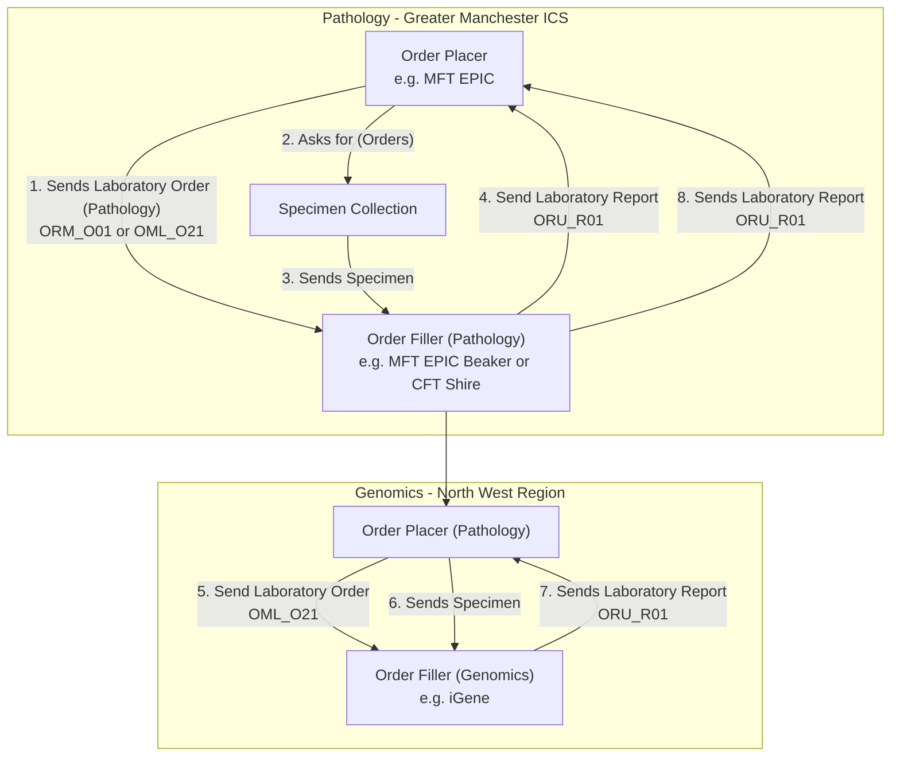
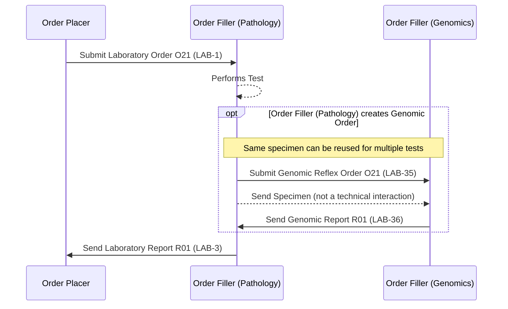

This is for information/analysis purposes only and is not a planned piece of work.

## References

1. [Inter Laboratory Workflow (ILW)](ILW.html) - the generic sub-order/reflex pattern this follows (`LAB-35`/`LAB-36`)
2. [Haemato-Oncology Diagnostic Pathway](HaematoOncologyPathway.html) - the related HODS-orchestrated scenario
3. [Cancer NOS - Colorectal Cancer Diagnostic Pathways](CancerNOS.html#diagnostic-cancer-pathways) - this use case can often occur around cancer
4. LAB-40 HL7 v2.9 SET <a href="https://wiki.ihe.net/index.php/Specimen_Event_Tracking" _target="_blank">IHE Specimen Event Tracking (SET)</a> and <a href="https://hl7-definition.caristix.com/v2/HL7v2.7/TriggerEvents/OSM_R26" _target="_blank">Hl7 v2.7 OSM_R26 Unsolicited Specimen Shipment Manifest Message</a>

## Actors

| IHE Actor                                                                                                            | Role                                    | System (example)                        |
|---------------------------------------------------------------------------------------------------------------------------|----------------------------------------|-----------------------------------------|
| [Order Placer](ActorDefinition-OrderPlacer.html)                                                                            | Referring clinician                      | MFT EPIC                                  |
| [Order Filler](ActorDefinition-OrderFiller.html) (receiving `LAB-1`) / [Requestor](ActorDefinition-Requestor.html) (ILW, if sending `LAB-35`) | Pathology laboratory                     | MFT EPIC Beaker or CFT Shire               |
| [Order Filler](ActorDefinition-OrderFiller.html) / [Subcontractor](ActorDefinition-Subcontractor.html) (ILW, if reflexed)   | Genomics laboratory                      | iGene                                     |
{:.grid}

## Transactions

| Transaction | Description                          | Direction                                    |
|-------------|-----------------------------------------|------------------------------------------------|
| `LAB-1`     | Laboratory Order (Pathology)              | Order Placer → Order Filler (Pathology)          |
| `LAB-3`     | Laboratory Report (Pathology)             | Order Filler (Pathology) → Order Placer          |
| `LAB-1`     | Laboratory Order (Genomics, if placed directly by Order Placer) | Order Placer → Order Filler (Genomics) |
| `LAB-35`    | Genomic Reflex Order (if placed by Pathology) | Order Filler (Pathology) → Order Filler (Genomics) |
| `LAB-36`    | Genomic Report (reflex)                   | Order Filler (Genomics) → Order Filler (Pathology) |
| `LAB-3`     | Laboratory Report (Genomics, either path) | Order Filler (Genomics or Pathology) → Order Placer |
{:.grid}

## Current Process

### Use Case: Genomic Test Order following on from Pathology Test Order

<b>Specimen Event Tracking:</b> See LAB-40 HL7 v2.9 SET <a href="https://wiki.ihe.net/index.php/Specimen_Event_Tracking" _target="_blank">IHE Specimen Event Tracking (SET)</a> and  <a href="https://hl7-definition.caristix.com/v2/HL7v2.7/TriggerEvents/OSM_R26" _target="_blank">Hl7 v2.7 OSM_R26 Unsolicited Specimen Shipment Manifest Message</a>

 

Genomic LTW Business Process - Use Case 3
 
 

In this use case the original order is raised by the `Order Placer` and sent to a Pathology LIMS (`Pathology Order Filler`). The Pathology LIMS follows the processes outlined in [Process Flow: Genomic Test Order](LTW.html#lab-1-process-flow) and [Process Flow: Genomic Test Report](LTW.html#lab-3-process-flow) for pathology testing.  
As part of this testing, the clinical process requires a genomics test to be performed.
This genomics process is largely the same except for:
- The order is sent as one interaction as the sample does not need to be collected.
- The order should contain the pathology report detailing the results of the pathology tests.

#### Main Process Flow

- Initial Laboratory Order
    - Step 1: The Order Placer submits a Laboratory Order O21 (LAB-1) to Order Filler (Pathology).
    - Step 2: Order Filler (Pathology) sends back a Laboratory Report R01 (LAB-3).
    - Note: As required by local clinical guidelines, this step can also include imaging orders.
- Optional Path 1 – Genomic Order created by original order placer
    - Condition: [Genomic Order created by original order placer].
    - Note: The same specimen can be reused for multiple tests.
    - Step 3: Order Placer submits a Genomic Order O21 (LAB-1) to Order Filler (Genomics).
    - Step 4: Specimen is sent from Order Placer to Genomics.
    - Step 5: Order Filler (Genomics) sends a Genomic Report R01 (LAB-3) back to the Order Placer.
- Optional Path 2 – Genomic Order created by Pathology
    - Condition: [Order Filler (Pathology) creates Genomic Order].
    - Note: The same specimen can be reused for multiple tests.
    - Step 6: Order Filler (Pathology) submits a Genomic Order O21 (LAB-35) to Order Filler (Genomics).
    - Step 7: Specimen is sent from Pathology to Genomics.
    - Step 8: Order Filler (Genomics) sends a Genomic Report R01 (LAB-36) to Order Filler (Pathology).
    - Step 9: Pathology sends the Genomic Report R01 (LAB-3) to the Order Placer.

This use case can often occur around cancer - see [Cancer NOS](CancerNOS.html#diagnostic-cancer-pathways)
for the Colorectal Cancer diagnostic pathway example.

## Future Process

No distinct future-state changes are currently defined for this pathway.

## Data Models

- [ServiceRequest](StructureDefinition-ServiceRequest.html) - `LAB-1` placer orders and `LAB-35` reflex sub-order
- [DiagnosticReport](StructureDefinition-DiagnosticReport.html) - `LAB-3`/`LAB-36` reports

## Examples

No example resources are published yet for this scenario.
