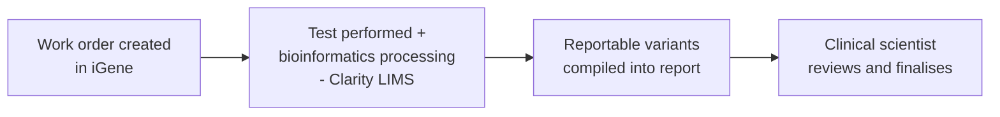
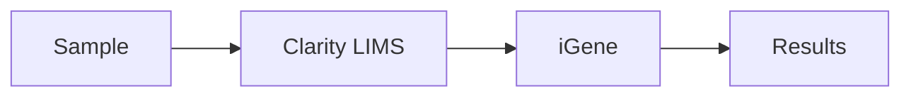
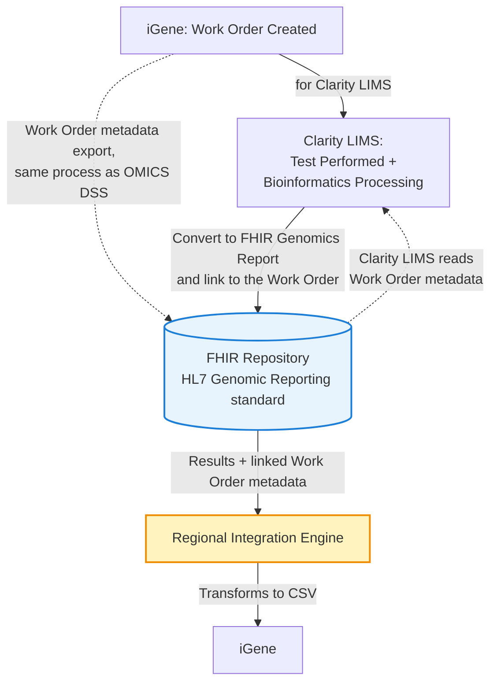

This is a proposed future direction, not yet an active project - details below are
this IG's own best-effort sketch of what the replacement would need to cover, not a
confirmed integration design.

Clarity LIMS Integration - proposed replacement for DLIMS and Omics DSS.

## References

1. [OMICS DSS Result Integration](reportable-variants.html) - the use case this is
   intended to eventually replace; most of this page's Actors, Transactions and Data
   Models are unchanged from that use case, just with a different system playing the
   DLIMS/Omics DSS role
2. [StarLIMS / iGene Integration](starLIMS.html) - the general pattern for a
   sub-contracted/satellite LIMS reporting back to iGene as master LIMS
3. Clarity LIMS - a commercial laboratory information management system (LIMS)
   platform from Illumina, commonly used in NGS/genomics laboratories for sample and
   workflow tracking

## Clinical Pathway Overview

### What is being tested

As with [OMICS DSS Result Integration](reportable-variants.html#what-is-being-tested),
this isn't a specific clinical test in its own right - it's the same underlying
pipeline (work order → testing → bioinformatics processing → reportable variants →
report), with **Clarity LIMS proposed to eventually replace both DLIMS and Omics
DSS** as a single system, rather than two separate systems each covering part of
that pipeline.

### The end-to-end clinical journey

The clinical journey itself is unchanged from [OMICS DSS Result
Integration](reportable-variants.html#the-end-to-end-clinical-journey) - a work order
is created, testing is performed, the raw output is processed into discrete
reportable variants, the report is compiled, and a clinical scientist/clinician
reviews it. What changes is which system performs steps 2 and 3:

### Why this matters for developers

- **Clarity LIMS is proposed to replace both DLIMS and Omics DSS** - collapsing two
  systems (a satellite testing LIMS, plus a separate bioinformatics processing/
  decision-support layer) into one commercial platform. Today's [work order → test →
  bioinformatics processing](reportable-variants.html#the-end-to-end-clinical-journey)
  steps become work order → Clarity LIMS, a single integration point instead of two.
- **This is directly relevant to [OMICS DSS Result Integration - Outstanding Issues,
  item 3](reportable-variants.html#outstanding-issues)** - the DLIMS Lab
  Number-to-iGene-Test-ID lookup chain exists today because Omics DSS is a
  downstream processing layer that never holds enough patient-identifiable
  information (no NHS Number) to resolve the patient/test itself. Clarity LIMS, as a
  full LIMS rather than a downstream processing layer, would be expected to hold
  proper sample/patient tracking natively - potentially removing the need for that
  lookup chain (or the proposed DLIMS Lab Number-on-`Specimen`/RIE wire-tap
  workarounds) altogether, if Clarity LIMS can either resolve the iGene Test ID
  itself or expose a reliable sample identifier the RIE can match against the work
  order directly. **Not yet confirmed** - depends on exactly what identifiers
  Clarity LIMS holds and exposes, which isn't known at this stage.
- **The interoperability model doesn't change.** Results still need to conform to
  the same [HL7 Genomics Reporting](https://build.fhir.org/ig/HL7/genomics-reporting/)
  `Variant`/`DiagnosticReport` shape already defined for [OMICS DSS Result
  Integration](reportable-variants.html#data-models) - this is a system
  substitution behind an existing interoperability boundary, not a new data model to
  agree.

## Actors

| IHE Actor                                                                | Role                                                    |
|-------------------------------------------------------------------------------|----------------------------------------------------------|
| [Order Filler](ActorDefinition-OrderFiller.html)                                 | iGene - master LIMS, creates the work order, ultimate destination for processed results (unchanged from [OMICS DSS Result Integration](reportable-variants.html#actors)) |
| [Automation Manager](ActorDefinition-AutomationManager.html)                     | **Clarity LIMS** (proposed) - performs the test *and* processes the output into discrete, reportable variants, linked back to the originating work order. Replaces both the DLIMS and Omics DSS rows in [OMICS DSS Result Integration](reportable-variants.html#actors) |
| [Resource Access Provider](ActorDefinition-ResourceAccessProvider.html)          | FHIR Repository - stores the work order and the resulting FHIR Genomics Report (unchanged) |
| [Intermediary](ActorDefinition-Intermediary.html)                              | Regional Integration Engine (RIE) - transforms the FHIR Genomics Report into iGene's CSV format (unchanged) |
{:.grid}

## Transactions

| Transaction                                | Description                                             | Direction                          |
|-----------------------------------------------|----------------------------------------------------------|---------------------------------------|
| `LAB-4`                                          | Work order created for Clarity LIMS                         | iGene → Clarity LIMS                   |
| `LAB-5` (proposed)                               | Test performed and processed within Clarity LIMS, no separate DLIMS→Omics DSS handoff | Clarity LIMS (internal) |
| FHIR RESTful create (proposed)                   | Work Order metadata export, the same pattern as [OMICS DSS Result Integration](reportable-variants.html#transactions) | iGene → FHIR Repository |
| FHIR RESTful read (proposed)                     | Work Order metadata read, so results can be linked back to the originating work order | Clarity LIMS → FHIR Repository |
| `LAB-5` / FHIR RESTful create (proposed)         | Processed output converted to a FHIR Genomics Report and linked to the Work Order | Clarity LIMS → FHIR Repository |
| CSV transform (proposed)                         | Results + linked Work Order metadata transformed for iGene  | FHIR Repository → RIE → iGene          |
{:.grid}

## Current Process

There is no current process specific to Clarity LIMS - today's process is DLIMS
performing the test and Omics DSS separately processing the output, exactly as
described in [OMICS DSS Result Integration - Current
Process](reportable-variants.html#current-process). This use case only describes the
proposed future state once Clarity LIMS replaces both.

## Future Process

The intended future state is a simpler, more direct chain than today's
DLIMS/Omics DSS split:

Clarity LIMS is proposed to take over both the test-performance role (currently
DLIMS) and the bioinformatics-processing role (currently Omics DSS), as a single
system sitting between the sample and iGene. Technically, this is still expected to
reuse the same FHIR Repository/RIE mechanism [OMICS DSS Result
Integration](reportable-variants.html#future-process) already establishes for
getting a result from a processing system back to iGene, rather than Clarity LIMS
writing to iGene directly:

**Not yet confirmed:** whether Clarity LIMS really does route via the FHIR
Repository/RIE the same way Omics DSS does, or whether the simpler Sample → Clarity
LIMS → iGene → Results chain above implies a more direct integration - see
[Outstanding Issues](#outstanding-issues) below.

**What's expected to change from [OMICS DSS Result
Integration](reportable-variants.html#future-process):**

- One work order → Clarity LIMS integration, instead of one to DLIMS and a separate
  one to Omics DSS.
- One system (Clarity LIMS) producing the FHIR Genomics Report, rather than DLIMS
  producing test output that Omics DSS then separately converts.
- Potentially, a cleaner answer to [OMICS DSS Result Integration - Outstanding
  Issues, item 3](reportable-variants.html#outstanding-issues) (matching a DSS
  result back to the correct iGene Test ID) - if Clarity LIMS holds its own
  authoritative sample/patient identifiers, it may not need the DLIMS Lab
  Number/referral-number lookup chain that exists today precisely because Omics DSS
  doesn't hold that information itself.

**What's expected to stay the same:**

- The FHIR Repository remains the handoff point between the testing/processing
  system and iGene - Clarity LIMS, like Omics DSS today, wouldn't write results back
  to iGene directly.
- The RIE's CSV transform to iGene is unchanged.
- The underlying data model (`ServiceRequest`, `DiagnosticReport`, `Variant`,
  `Molecular Consequence`) is unchanged - see [Data Models](#data-models) below.

## Data Models

No new data model - this use case reuses exactly the same resources already defined
for [OMICS DSS Result Integration](reportable-variants.html#data-models):

- [ServiceRequest (Work Order)](StructureDefinition-ServiceRequest.html) - the work
  order exported to the FHIR Repository
- [DiagnosticReport](StructureDefinition-DiagnosticReport.html) - the FHIR Genomics
  Report Clarity LIMS would produce
- [Variant (Reportable Variant)](StructureDefinition-Variant.html) - the discrete
  result Observations, following the [HL7 Genomics Reporting
  IG](https://build.fhir.org/ig/HL7/genomics-reporting/)
- [Molecular Consequence](StructureDefinition-MolecularConsequence.html) - a separate
  `derivedFrom` Observation for a variant's downstream effect

See [OMICS DSS Result Integration - Data
Models](reportable-variants.html#data-models) for the full erDiagram and field-level
detail - not repeated here, to avoid the two pages drifting apart.

### Outstanding Issues

1. **Scope and timeline are not yet confirmed** - this page describes a proposed
   direction, not a committed project plan.
2. **What integration surface Clarity LIMS actually exposes is not yet confirmed** -
   whether that's a native FHIR API, an HL7 v2 interface, or requires a custom
   integration layer (e.g. Clarity's own EPP/API scripting) changes how much of the
   [Future Process](#future-process) diagram above is accurate.
3. **Whether DLIMS is retired outright or coexists with Clarity LIMS during a
   transition period is not yet confirmed** - a phased migration would likely need
   both systems modelled side by side for a period, rather than a clean cutover.
4. **Whether Clarity LIMS resolves [OMICS DSS Result Integration - Outstanding
   Issues, item 3](reportable-variants.html#outstanding-issues) (the DLIMS Lab
   Number/iGene Test ID linkage problem) depends on identifiers not yet
   confirmed** - see [Why this matters for developers](#why-this-matters-for-developers)
   above.

## Examples

No examples yet - no Clarity LIMS integration has been built to draw examples from.

## Security Considerations

Includes:

- OAuth2 Standard for [Authorisation](api-security.html#authorisation---oauth2)
  - including use of JWT access tokens and future support for [SMART-on-FHIR Scopes](api-security.html#scopes)
- FHIR AuditEvent/IHE BALP for [Audit Logging](api-security.html#audit-logging)
- TLS for [Transport Security/Encryption](api-security.html#encryption)

## Developer Guides

No developer guides yet - see [OMICS DSS Result Integration - Developer
Guides](reportable-variants.html#developer-guides) for the notebooks covering
today's DLIMS/Omics DSS pipeline, which this use case would eventually replace.

