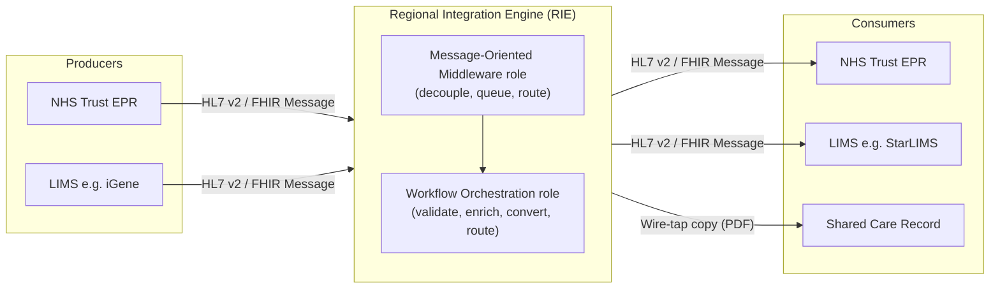
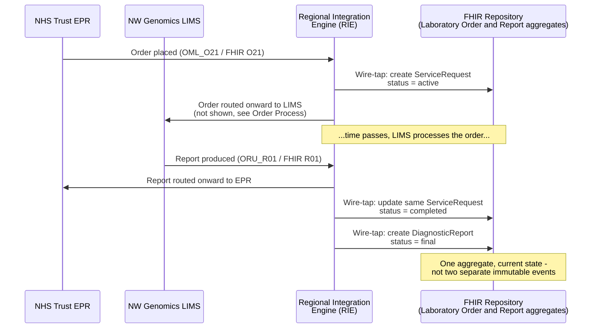
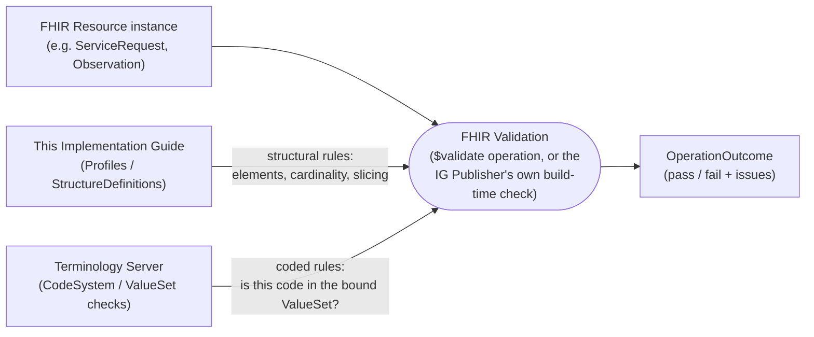

This is currently being elaborated and subject to change.

## Introduction

This page is aimed at **Integration Developers**, **Data Scientists** and **Data
Engineers** building against this Implementation Guide. It gives an overview of
where FHIR is actually used in this implementation, before the worked-example
notebooks below get into specifics.

North West Genomics runs two InterSystems products that both use HL7, but for
different purposes and in different styles:

### Regional Integration Engine (RIE)

Built on InterSystems Health Connect. This is the messaging layer: it
supports workflows *between* NHS Organisations (Trust EPR to NW Genomics and
back), and internal process-to-process workflows *between* LIMS (e.g. iGene
to StarLIMS Work Orders). Its design style follows [Enterprise Integration
Patterns](https://www.enterpriseintegrationpatterns.com/patterns/messaging/)
- message routing, transformation and a canonical data model, described in
detail in [Overview - Regional Integration Engine (RIE)](overview.html) and
[Architecture - Enterprise Integration Patterns (EIP)](exchange.html). The
workflows it supports are documented as business processes in **Analysis and
Design (Volume 1)** - e.g. [Laboratory Testing Workflow (LTW)](LTW.html),
[Inter-Laboratory Workflow (ILW)](ILW.html) - and as the technical
interactions themselves in **Interfaces (Volume 2)**.

> **Note:** the RIE plays a similar role to a Trust Integration Engine (TIE)
> - see [Enterprise Integration](architecture.html#enterprise-integration) -
> but the two aren't doing the same job. The RIE carries more
> integration-engine features than a typical Trust-local TIE: **routing**
> (to the correct destination Trust or LIMS), **enrichment** (PDS/ODT lookups
> adding patient/organisation detail a source message didn't include),
> **terminology mapping** (using a [Terminology
> Service](#fhir-terminology-services) to translate a code from one
> destination's coding system to another, rather than each destination
> having to understand every source system's own local codes), and
> orchestration of the multi-step validate/enrich/convert/route sequence
> described above. In exchange, it does **less** HL7 v2 flavour-to-flavour
> transformation than a TIE: rather than every source/destination pair
> negotiating its own bespoke mapping, the RIE only ever deals in a single
> canonical NW Standard format - the flavour-specific conversion each Trust's
> or lab's own local system actually needs happens at the edges, in that
> Trust's or lab's own TIE, before the message ever reaches the RIE. See
> [Order Process](overview.html#order-process) for exactly where that
> boundary sits.

For a Data Engineer coming from a modern data stack, it helps to place the
RIE against the two familiar categories of tooling shown in the diagram
above, since it doesn't map cleanly onto either one alone:

- **Message-Oriented Middleware (MOM)** - like [Apache
  Kafka](https://kafka.apache.org/), [RabbitMQ](https://www.rabbitmq.com/)
  or AWS SQS, the RIE decouples producers and consumers and moves data
  asynchronously, so a LIMS sending a report doesn't need to know or wait
  on which Trusts will receive it. Unlike a general-purpose broker, though,
  the RIE isn't a neutral pipe with topics/queues any consumer can
  subscribe to - the transformation and routing logic (which destination,
  in what HL7 flavour) is built into the RIE itself as configured
  integration production rules, not left to consumer-side code.
- **Workflow Orchestration Tools** - like [Apache
  Airflow](https://airflow.apache.org/), [Prefect](https://www.prefect.io/)
  or [Dagster](https://dagster.io/), the RIE coordinates a sequence of
  dependent steps for each message (validate, enrich via a PDS/ODT lookup,
  convert, route) and handles retries/error routing when a step fails. The
  difference is scope and cadence: these tools schedule and orchestrate
  batch ETL/ELT DAGs over datasets on a timer; the RIE orchestrates a
  workflow per individual message, in near real time, as each order or
  report arrives.

In effect, the RIE fuses what a modern data stack would usually split
across two separate tools (a broker plus an orchestrator) into a single
integration engine. It is programmed in Caché ObjectScript (InterSystems'
own language) - though InterSystems IRIS also supports embedding Python
directly, so RIE-adjacent development doesn't have to be done in
ObjectScript alone.

### FHIR Repository

Built on the InterSystems FHIR Repository. This is an **operational data
platform**, not a messaging engine: it is populated by
[wire-tapping](overview.html#fhir-repository) the messages and data flows
already passing through the RIE, rather than being sent to directly. Its
design style is different from the RIE's messaging patterns - it follows
**aggregates** from [Domain Driven
Design](https://martinfowler.com/bliki/DomainDrivenDesign.html), the
operational-data-platform pattern (query the current state of an entity, not
just the event stream that produced it), and domain archetypes from [Data
Mesh](https://en.wikipedia.org/wiki/Data_mesh) - see
[Architecture](architecture.html) for how the domain split works. Its
interactions are FHIR RESTful (`GET`/`search`/`batch`/`transaction`, per
[notebook 07](https://github.com/nw-gmsa/Testing/blob/main/notebooks/07-fhir-repository-events-and-aggregates.ipynb)
below) - it also supports SQL, via InterSystems' own SQL projection over the
stored FHIR resources, for analysts and reporting tools that don't speak
FHIR natively.

The diagram below shows the pattern notebook 07 works through: each event the
RIE processes for a given order is wire-tapped into the FHIR Repository as an
update to **one** `ServiceRequest` aggregate, rather than being appended as
a growing log of separate immutable events - a query against the FHIR
Repository always sees that resource's current state, however many events
contributed to it.

| | Regional Integration Engine (RIE) | FHIR Repository |
|---|---|---|
| Product | InterSystems Health Connect | InterSystems FHIR Repository |
| Role | Messaging hub between NHS Organisations, and between LIMS | Operational data platform, populated by wire-tap from the RIE |
| Design style | Enterprise Integration Patterns | Domain Driven Design aggregates, Operational Data Platform, Data Mesh domain archetypes |
| Standards used | HL7 v2 **and** FHIR | FHIR **only** |
| Interaction style | Messaging (HL7 v2 MLLP, FHIR Messaging `$process-message`) | FHIR RESTful API, plus SQL |
| Documented in | Analysis and Design (Volume 1), Interfaces (Volume 2) | Data Models (Volume 3) |
{:.grid}

Both products are expected to receive content that conforms to a **data
contract**: an HL7 v2 message's segments, or a FHIR resource's elements, must
match a defined shape before the RIE or FHIR Repository will accept them. In
FHIR, a data contract is expressed as a **FHIR Profile** (a `StructureDefinition`)
- the [Data Models (Volume 3)](diagnostic-core.html) pages document this IG's
own profiles. A FHIR Profile is not just documentation: it can be used to
**test** whether a given resource instance actually conforms, using [FHIR
Validation](https://hl7.org/fhir/validation.html) (the same `$validate`
operation and IG Publisher checks this IG's own examples are checked against)
- see [How To Engineer (scale and deliver)
Interoperability](HowToEngineerInteroperability.html) for why this IG builds
profiles the way it does.

## Introduction to FHIR

[HL7 FHIR](https://hl7.org/fhir/) (Fast Healthcare Interoperability Resources)
is the standard both products above are built on. A few concepts recur
throughout this IG and are worth being familiar with before working through
the notebooks:

- **Resource** - a discrete unit of healthcare data with a fixed set of
  elements defined by the base FHIR specification - e.g. `Patient`,
  `ServiceRequest` (an order), `DiagnosticReport`, `Observation` (a single
  result/finding). Genomics-specific detail (a variant, a genomic study) is
  still expressed using these same general-purpose resources, per [HL7 FHIR
  Genomics
  Reporting](https://hl7.org/fhir/uv/genomics-reporting/) - not a bespoke
  genomics resource type.
- **Profile** (`StructureDefinition`) - constrains a resource's general-purpose
  elements down to what a specific use case actually requires: which elements
  are mandatory, which codes are allowed, how it must be sliced. This is the
  "data contract" referred to above - see [Data Models
  (Volume 3)](diagnostic-core.html) for this IG's own profiles.
- **Extension** - a way to add an element a profile needs but the base FHIR
  resource doesn't already have, without breaking compatibility with software
  that only understands base FHIR.
- **CodeSystem / ValueSet** - how FHIR represents coded terminology (e.g.
  SNOMED CT, LOINC, or this IG's own local codes) and constrains which codes
  are valid in a given element - see **Data Models (Volume 3)** and
  **Artefacts (Volume 4)**.
- **RESTful API** - the query style the FHIR Repository uses: `GET`/`search`
  to read resources, `batch`/`transaction` `Bundle`s to read or write several
  at once. This is how a Data Scientist or Data Engineer would normally pull
  data out of the FHIR Repository.
- **Messaging** - the style the RIE uses instead: a `Bundle` of type `message`
  (a `MessageHeader` plus the resources it concerns), sent via the
  `$process-message` operation, or carried inside HL7 v2 as the wire format.
  This is closer to how an Integration Developer working on the RIE side will
  encounter FHIR.
- **FHIR Validation** - checking a resource instance against a Profile,
  producing a pass/fail plus a list of the specific constraints violated. Both
  this IG's own build (via the HL7 FHIR IG Publisher) and a running FHIR
  server's `$validate` operation use the same mechanism - it is how a data
  contract in FHIR is actually enforced, not just documented.

The diagram below shows what FHIR Validation (above) actually checks a
resource instance against: this Implementation Guide's own Profiles for the
*structural* rules (which elements, cardinalities, slices), and a
Terminology Server for the *coded* rules (is this code actually a member of
the ValueSet this element is bound to) - see [FHIR Terminology
Services](#fhir-terminology-services) below for what that second box is
doing.

### FHIR Terminology Services

A **Terminology Server** is a FHIR server specialised in serving coded
content - `CodeSystem`s and `ValueSet`s - and running the terminology
operations that go with them, rather than every consuming application having
to hold and maintain a full local copy of, say, SNOMED CT:

- `$lookup` - look up the details (display text, properties) of a single code.
- `$validate-code` - check whether a code is a valid member of a given
  `ValueSet`/`CodeSystem` - the operation FHIR Validation (above) actually
  calls, once per coded element, when it validates a resource.
- `$expand` - list every code a `ValueSet` currently contains.
- `$translate` - map a code from one `CodeSystem` to another via a
  `ConceptMap`.

This IG's own build uses [tx.fhir.org](https://tx.fhir.org) - HL7's shared
public terminology server - to validate the SNOMED CT, LOINC and UK Core
codes used throughout its own examples and profiles.

A second, separate terminology server is also used in this ecosystem: the
**Genomics England Terminology Server**
(`https://ontoserver.aws.gel.ac/fhir`), purpose-built for genomics-specific
terminology mappings that a general-purpose terminology server doesn't cover
- in particular, converting a SNOMED CT clinical finding into a [Human
Phenotype Ontology (HPO)](https://hpo.jax.org/) term via
`ConceptMap/sct-to-hpo/$translate`, used to derive a `GenomicClinicalIndication`
code from a patient's EPR problem list. [Notebook
13](https://github.com/nw-gmsa/Testing/blob/main/notebooks/13-snomed-to-hpo-genomic-clinical-indication.ipynb)
queries it live and is worth reading in full, since it also documents where
the mapping *doesn't* work today: discrete findings (e.g. Ataxia, Seizure)
translate reliably, but coded diagnoses (e.g. Marfan syndrome, Cystic
fibrosis, Lynch syndrome) currently produce no mapping at all. The same
server and `sct-to-hpo` map were used to hand-build this IG's own static
[GMSWGSGuideHPOTermsToSCT](ConceptMap-GMSWGSGuideHPOTermsToSCT.html)
`ConceptMap` - see [notebook
13](https://github.com/nw-gmsa/Testing/blob/main/notebooks/13-snomed-to-hpo-genomic-clinical-indication.ipynb)'s
own closing note on [IHE Sharing Valuesets, Codes, and Maps
(SVCM)](https://profiles.ihe.net/ITI/SVCM/index.html) for where this pattern
is heading.

## Integration and Interoperability Developer Notebooks

Worked-example Jupyter notebooks from
[nw-gmsa/Testing](https://github.com/nw-gmsa/Testing/tree/main/notebooks) - each
builds a piece of this IG's FHIR/HL7 v2 conversion by hand, in Python, against real
example data. They form a series (`01` onward assumes the reader has read the earlier
ones), and most relate directly to one or more of this IG's [Use Cases](index.html#use-cases).

| Notebook | What it covers | Related Use Case(s) |
|---|---|---|
| [01 - FHIR Search Basics](https://github.com/nw-gmsa/Testing/blob/main/notebooks/01-fhir-search-basics.ipynb) | How this app talks to the FHIR R4 server with plain `GET` searches - foundational reading for the rest of the series, not tied to a specific use case. | - |
| [02 - Work Orders: A Worked Example](https://github.com/nw-gmsa/Testing/blob/main/notebooks/02-work-orders-worked-example.ipynb) | Finding a laboratory's current work orders (`Task`-based filtering) for Liverpool GLH (ODS `K1S6S`), one of the regional LIMS the RIE integrates. | [Regional Integration Engine (RIE)](overview.html), [StarLIMS / iGene Integration](starLIMS.html), [OMICS DSS Result Integration](reportable-variants.html) |
| [03 - Orders: Building a FHIR Order Message from a CSV](https://github.com/nw-gmsa/Testing/blob/main/notebooks/03-laboratory-order-from-csv.ipynb) | Builds a laboratory-order `Bundle` from a row of `Input/NEYctDNA.csv`, following the `laboratory-order` `MessageDefinition`. | [NE&Y Management Information (ctDNA)](NEYManagementInformation.html) |
| [04 - Reports: HL7 v2 `ORU^R01` into FHIR](https://github.com/nw-gmsa/Testing/blob/main/notebooks/04-laboratory-report-fhir-from-hl7v2.ipynb) | Converts a lab's own HL7 v2 report into a FHIR `R01` Message, and on to the `MDM_T02` document feed sent to shared care record providers. | [Regional Integration Engine (RIE)](overview.html), [Greater Manchester Care Record (GMCR)](GMCR.html) |
| [05 - Test Results: GA4GH VCF to FHIR Genomics Reporting](https://github.com/nw-gmsa/Testing/blob/main/notebooks/05-test-results-from-vcf.ipynb) | Converts a GA4GH VCF file into discrete `variant` Observations conforming to the HL7 Genomics Reporting IG, plus an NW-GMSA `R01` Test Results message. | [OMICS DSS Result Integration](reportable-variants.html) |
| [06 - EU Laboratory Report: FHIR Messages to a FHIR Document](https://github.com/nw-gmsa/Testing/blob/main/notebooks/06-eu-laboratory-report-fhir-document.ipynb) | Builds a FHIR Document (`Composition`-led `Bundle`) from the same ctDNA source data as 04/05 - the shape NHS England's Unified Genomic Record (UGR) Phase 2 expects. | [ctDNA NHS England Unified Genomic Record (UGR)](ctDNAUGR.html), [NE&Y Management Information (ctDNA)](NEYManagementInformation.html) |
| [07 - FHIR Repository: RESTful Events and Aggregates](https://github.com/nw-gmsa/Testing/blob/main/notebooks/07-fhir-repository-events-and-aggregates.ipynb) | RESTful `GET`/`batch`/`transaction` access against the FHIR Repository the RIE populates via wire-tap, versus the Messaging `$process-message` interactions notebooks 03-06 use. | [Regional Integration Engine (RIE)](overview.html#fhir-repository) |
| [08 - Subcontracted Laboratory Order from an External GLH](https://github.com/nw-gmsa/Testing/blob/main/notebooks/08-subcontracted-laboratory-order-from-external-glh.ipynb) | Builds a `LAB-35` sub-order manifest and Bundle for a distributed WGS referral from an external Requesting Genomic Laboratory - the source of this IG's dWGS examples. | [Distributed WGS (dWGS)](dWGS.html) |
| [09 - LIMS Integration with the Genomic Order Management Service](https://github.com/nw-gmsa/Testing/blob/main/notebooks/09-genomic-order-management-fhir-to-hl7v2-for-lims.ipynb) | Converts a FHIR order from NHS England's Genomic Order Management Service (GOMS) API into the HL7 v2 this region's LIMS expects. | [Regional Integration Engine (RIE)](overview.html), [NHS England Genomic Order Management Service (GOMS)](GenomicOrderManagementService.html) |
| [10 - Histocompatibility and Immunogenetics: HL7 v2 to and from the NW Standard](https://github.com/nw-gmsa/Testing/blob/main/notebooks/10-histocompatibility-immunogenetics-hl7v2-nw-standard.ipynb) | Stays entirely in HL7 v2 (no FHIR) and hand-builds the field-level conversion a Trust Integration Engine (TIE) does to turn its own Trust's local HL7 v2 flavour into the shared [NW HL7 v2 standard](hl7v2.html), using Clatterbridge's Meditech-originated order as the worked example. | [Histocompatibility and Immunogenetics](HistocompatibilityAndImmunogenetics.html), [iGene Orders and Reports (Alder Hey, MFT, Liverpool)](RegionalOrdersAndReports.html) |
| [11 - Order Entry Forms: Questionnaire to a FHIR O21](https://github.com/nw-gmsa/Testing/blob/main/notebooks/11-order-entry-forms-questionnaire-to-fhir-o21.ipynb) | Builds a FHIR Message `O21` `Bundle` from a completed `QuestionnaireResponse`, starting from `Questionnaire-dWGSSubOrder`, and closes by explaining how the same extracted answers become an HL7 v2 `O21` instead - the `Questionnaire`-in/FHIR-order-out counterpart to `09`'s FHIR-order-in/HL7-v2-out. | [Distributed WGS (dWGS)](dWGS.html) |
| [12 - Haemato-Oncology Cytogenetics: From Free-Text HL7 v2 to Structured Observations](https://github.com/nw-gmsa/Testing/blob/main/notebooks/12-haemato-oncology-cytogenetics-structured-observations.ipynb) | Extracts the karyotype/FISH findings buried in `Shire-1.txt`/`Shire-2.txt`'s free-text `OBX\|FT\|CYTO` lines, then builds them as the discrete, LOINC-coded `Observation`/`DiagnosticReport` shape that page's own [Future genomic data model](HaematoOncologyPathway.html#future-genomic-data-model-proposed) proposes - the source of that page's two structured-example `Bundle`s. | [Haemato-Oncology Diagnostic Pathway](HaematoOncologyPathway.html) |
| [13 - SNOMED to HPO: Genomic Clinical Indication](https://github.com/nw-gmsa/Testing/blob/main/notebooks/13-snomed-to-hpo-genomic-clinical-indication.ipynb) | Tests, live against Genomics England's terminology server (`https://ontoserver.aws.gel.ac/fhir`), where SNOMED CT-to-HPO conversion actually works and where it doesn't: discrete clinical *findings* (e.g. Ataxia, Seizure) translate reliably via `ConceptMap/sct-to-hpo/$translate`, but coded *diagnoses* (e.g. Marfan syndrome, Cystic fibrosis, Lynch syndrome) produce no mapping - so an EPR problem list entered as a diagnosis, not a finding, has no automated route to a `GenomicClinicalIndication` code today. This is the same terminology server and `sct-to-hpo` map used to build [GMSWGSGuideHPOTermsToSCT](ConceptMap-GMSWGSGuideHPOTermsToSCT.html). | [GMS WGS Rare Disease](Questionnaire-GMSWGSRareDisease.html) |
| [14 - Refreshing the National Genomic Test Directory CodeSystems](https://github.com/nw-gmsa/Testing/blob/main/notebooks/14-national-genomic-test-directory-codesystems.ipynb) | The first notebook that writes its output back into this IG rather than just reading from it: re-derives [Genomic Test Code](CodeSystem-GenomicTestCode.html) (`R*`/`M*`) and [Genomic Clinical Indication](CodeSystem-GenomicClinicalIndication.html) directly from NHS England's live master spreadsheets, and grows [Digital Genomic Test Services](CodeSystem-DigitalGenomicTestServices.html) from a 2-code placeholder to the real TP/GT content of the two directories (Haematological Oncology, Cancer CNS) that have gone digital so far - plus the `ConceptMap`s linking all three together. Meant to be **rerun**, not run once, as NHS England republishes each directory and more clinical areas migrate to the digital TP/GT scheme. | [Genomic Test Code](CodeSystem-GenomicTestCode.html), [Digital Genomic Test Services](CodeSystem-DigitalGenomicTestServices.html) |
| [15 - Closing the Loop: Genomic Results Back Onto the EPR Problem List](https://github.com/nw-gmsa/Testing/blob/main/notebooks/15-genomic-results-to-epr-problem-list.ipynb) | Follows a genomic result the other way round - back onto the referring Trust's own EPR problem list (Epic as the worked example) - using a suspected-Lynch-syndrome scenario built on this IG's own published Lynch syndrome patient/report examples: SNOMED `716318002` in, manually cross-referenced (no automated route exists, per `13`/`14`) to legacy `R210` for the order, then a coded `DiagnosticReport.conclusionCode`/`DiagnosticImplication` on the way back confirming the same SNOMED `Condition`, now with an evidence trail. | [Genomic Test Report](Questionnaire-GenomicTestReport.html) |
{:.grid}

Notebook 13's terminology-server pattern (querying a remote FHIR server's `$lookup`/`$translate` operations live, rather than hand-maintaining a static map) is the same shape [IHE Sharing Valuesets, Codes, and Maps (SVCM)](https://profiles.ihe.net/ITI/SVCM/index.html) formalises as a profile - this IG is likely to adopt an SVCM-conformant terminology service for SNOMED CT/HPO/Genomic Test Directory conversions in future, rather than continuing to hand-build `ConceptMap`s like [GMSWGSGuideHPOTermsToSCT](ConceptMap-GMSWGSGuideHPOTermsToSCT.html) notebook-by-notebook.

## Data Science and Analytics Notebooks

The notebooks above are aimed at integration/interoperability developers - FHIR and HL7
v2 message shapes, not analysis of genomic data itself. For that audience, Genomics
England publishes its own separate set of tutorials aimed at researchers and data
analysts working inside the Genomics England Research Environment: [Genomics England
Research Environment - How-to
guides](https://re-docs.genomicsengland.co.uk/tutorials/). These cover cohort building
(phenotype-first and genotype-first, via Participant Explorer/CloudOS), querying
aggregate VCF datasets (AggV2/AggV3/somAgg), downstream analysis (association testing,
variant screening, survival analysis), and desktop tooling (LabKey, Airlock, IVA) using
Python, R, Jupyter notebooks and HPC workflows - a different layer of the same overall
genomics ecosystem this IG's own notebooks integrate with at the message/API level.
