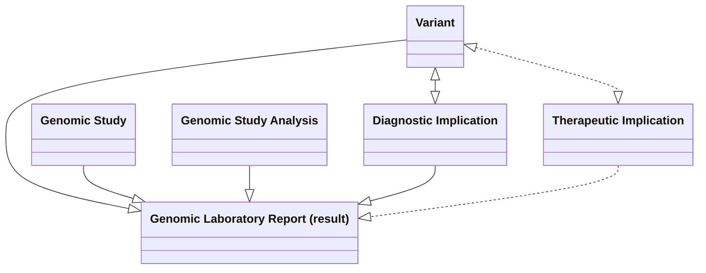

## References

- [HL7 Lab Results Interface (LRI), Release 1 from May 2017](https://confluence.hl7.org/download/attachments/25559919/2018%2004%2003%20-%20V2%20LRI%20-%20Ch.%205%20CG%20and%20Code%20System%20Tables.pdf?api=v2) (HL7 v2,5,1)
- HL7 International [Genomics Reporting Implementation Guide](https://build.fhir.org/ig/HL7/genomics-reporting/index.html) (HL7 FHIR)
    - HL7 USA [minimal Common Oncology Data Elements (mCODE) Implementation Guide - Genomics](https://build.fhir.org/ig/HL7/fhir-mCODE-ig/group-genomics.html)
- [openEHR Genomics Project](https://ckm.openehr.org/ckm/projects/1013.30.50)
- [NHS England FHIR Genomics Implementation Guide—Clinical Headings](https://simplifier.net/guide/fhir-genomics-implementation-guide/home/design/clinicalheadings)
- The Royal College of Radiologists [Reporting networks - understanding the technical options](https://www.rcr.ac.uk/media/wwtp2mif/rcr-publications_radiology-reporting-networks-understanding-the-technical-options_march-2022.pdf)
- [NHS England Genomics DiagnosticReport](https://simplifier.net/guide/fhir-genomics-implementation-guide/Home/FHIRAssets/Profiles/All-Profiles/UKCore-DiagnosticReport) use text descriptions only, not the rendered profile.
- [HL7 Europe Core - DiagnosticReport](https://hl7.eu/fhir/base/2.0.0-ballot/StructureDefinition-diagnosticReport-eu-core.html)

## Domain Archetype

<b>HL7 FHIR Profile:</b> <a href="StructureDefinition-DiagnosticReport.html" _target="_blank">DiagnosticReport</a> 

<b>HL7 v2 Segment:</b> <a href="hl7v2.html#obr" _target="_blank">OBR</a>

<figure>


Laboratory Report - MindMap

</figure>
 

### Diagnostic Report

#### Unstructured and Structured Laboratory Reports

A laboratory report contains both structured and unstructured information, and they complement each other rather than replace one another.

- Structured data consists of discrete, machine-readable elements such as the patient, specimen, request, observations (test results), identifiers, and reporting clinician. In HL7 FHIR these are represented by resources such as Patient, Specimen, ServiceRequest, Observation, Practitioner, and DiagnosticReport. In HL7 v2 these correspond to segments such as PID, SPM, ORC, OBR, and OBX.
- Unstructured data is the human-readable laboratory report (typically a PDF) that includes the full clinical interpretation, comments, formatting, signatures, and contextual information that may not be represented as discrete data. In FHIR this is attached to the DiagnosticReport.presentedForm (or referenced via DocumentReference), while in HL7 v2 it is commonly carried in OBX segments using encapsulated data (ED).

The Laboratory Report acts as the bridge between these two worlds. It references the structured observations for computer processing, clinical decision support, analytics, and interoperability, while also linking to the complete unstructured report that clinicians view as the authoritative laboratory document. This approach ensures that systems can exchange computable data without losing the rich narrative and legal record contained in the original laboratory report.

##### Laboratory Report with FHIR and V2 Mappings

 

 

##### Laboratory Report with detailed FHIR Mappings

 

##### FHIR Document / Clinical Document Architecture

> The FHIR DiagnosticReport illustrated above is well suited to workflow-based information exchange, where structured clinical data is exchanged between systems and individual observations can be processed, queried, and acted upon. However, it may be less suitable for document sharing use cases, such as IHE XDS/MHD or the NHS England National Record Locator (NRL), where the laboratory report is exchanged as a complete clinical document. In these scenarios, the preferred approach is a FHIR Document (the FHIR equivalent of a Clinical Document Architecture (CDA) document), which packages the report into a self-contained, attested document with a Composition resource as its root. This preserves the report as a legal and clinical record while still allowing structured data to be included.
>
> Further details are available in the Document Perspective section of the HL7 Europe Laboratory Implementation Guide: [HL7 Europe Laboratory Report](https://build.fhir.org/ig/hl7-eu/laboratory/index.html)
>
> NW Genomics example [FHIR Document - Genomic Report](Bundle-FHIRDocumentGeneticReportBundle2.html)

##### Laboratory Report with FHIR Composition Mappings

 

### Detailed Model

Metadata is data that applies to the patient's entire clinical pathway and so it extends beyond diagnostic tests.
Test detail tends to be common across all diagnostic tests in a patient's pathway, not just genomics.

Patient Demographics

| Name                  | LOINC | Value Set / Data Type                                                 | Cardinality | HL7 v2 OML_O21 Message | HL7 FHIR [ServiceRequest](StructureDefinition-ServiceRequest.html) | HL7 FHIR Resource (Message + RESTful)       |
|-----------------------|-------|-----------------------------------------------------------------------|-------------|------------------------|--------------------------------------------------------------------|---------------------------------------------|
| NHS Number            |       | [NHS Number](StructureDefinition-NHSIdentifier.html)                  | 0..1        | [PID](hl7v2.html#pid)  | ServiceRequest.subject.identifier                                  | [Patient](StructureDefinition-Patient.html) |
| Medical Record Number |       | [Medical Record Number](StructureDefinition-MedicalRecordNumber.html) | 0..1        | [PID](hl7v2.html#pid)  | ServiceRequest.subject.identifier                                  | [Patient](StructureDefinition-Patient.html) |
{:.grid}

Hospital Spell

Treat as mandatory for reflex or subcontracted orders.

| Name                                  | LOINC   | Value Set / Data Type                                                                       | Cardinality | HL7 v2 OML_O21 Message   | HL7 FHIR [ServiceRequest](StructureDefinition-ServiceRequest.html)                                                       | HL7 FHIR Resource (Message + RESTful)                                        |
|---------------------------------------|---------|---------------------------------------------------------------------------------------------|-------------|--------------------------|--------------------------------------------------------------------------------|------------------------------------------------------------------------------|
| Hospital Service                      |         | [Service](ValueSet-service.html)                                                            | 0..1        | [PV1](hl7v2.html#pv1)-10 |                                                                                | Encounter.serviceType                                                        | 
| Case Identification or Account Number | 56797-4 | [HospitalProviderSpellIdentifier](StructureDefinition-HospitalProviderSpellIdentifier.html) | 0..1        | [PV1](hl7v2.html#pv1)-19 | ServiceRequest.encounter.identifier | Encounter.identifier [HospitalSpell](StructureDefinition-HospitalSpell.html) |
{:.grid}

Diagnostic Workflow

| Name                     | Description                                                                                                                           | Value Set / Data Type                                                                          | Cardinality | HL7 v2 ORU_RO1 Message                   | HL7 FHIR [DiagnosticReport](StructureDefinition-DiagnosticReport.html) | HL7 FHIR Resource (RESTful)                               |
|--------------------------|---------------------------------------------------------------------------------------------------------------------------------------|------------------------------------------------------------------------------------------------|-------------|------------------------------------------|------------------------------------------------------------------------|-----------------------------------------------------------|
| Order Number             | The Unique order number assigned by the Order Placer (order comms or EHR), that requested the report.                                 | [Order Identifier](StructureDefinition-OrderIdentifier.html)                                   | 1..1        | [ORC](hl7v2.html#orc)-2                  | DiagnosticReport.basedOn                                               | [ServiceRequest](StructureDefinition-ServiceRequest.html) |
| Report Number            | Identifies the report, assigned by Order Filler (LIMS)                                                                                | [Report Identifier](StructureDefinition-ReportIdentifier.html)                                 | 1..1        | [OBR](hl7v2.html#obr)-3                  | DiagnosticReport.identifier[ReportNumber]                              |                                                             |
| (Order) Procedure Code   | For Genomics this is Test Directory Code. (For Radiology this is NICIP code)                                                          | See below                                                                                      | 1..1        | [OBR](hl7v2.html#obr)-4                  | DiagnosticReport.code                                                  |                                                             |
| Account(/Visit) Number   | Assigned by the Order Placer where it is known as spell or episode id. It is used by all diagnostics to link tests to a spell/episode | [Hospital Provider Spell Identifier](StructureDefinition-HospitalProviderSpellIdentifier.html) |             | PV1-19                                   | DiagnosticReport.encounter                                             |                                                             |
| Report date              | Date/time the report was issued                                                                                                       |                                                                                                | 1..1        | [OBR](hl7v2.html#obr)-7                  | DiagnosticReport.effectiveDateTime                                     |                                                             |
| Report Status            |                                                                                                                                       |                                                                                                | 1..1        | OBR-22                                   | DiagnosticReport.status                                                |                                                             |
| Conclusion               | Conclusion                                                                                                                            |                                                                                                |             |                                          | DiagnosticReport.conclusion                                            |                                                             |
| Outcome                  | Conclusion Code                                                                                                                       | [Genomic Test Outcome Codes](ValueSet-GenomicTestOutcomeCodes.html)                            | 0..1        | [OBX](hl7v2.html#obx) LOINC 51968-6             | DiagnosticReport.conclusionCode                                        |                                                             |
| Results Interpreter      | Who created the report                                                                                                                | [England Practitioner Identifier](StructureDefinition-PractitionerIdentifier.html)             | 0..*        | [OBR](hl7v2.html#obr)-32 and OBR-33      | DiagnosticReport.resultsInterpreter                                    | [Practitioner](StructureDefinition-Practitioner.html)     |                                                                                            
| Performer (operator)     |                                                                                                                                       | [England Practitioner Identifier](StructureDefinition-PractitionerIdentifier.html)             | 1..*        | [OBR](hl7v2.html#obr)-34                 | DiagnosticReport.performer[operator]                                   | [Practitioner](StructureDefinition-Practitioner.html)     |
| Performer (organisation) | The organisation who created the report                                                                                               | [Organisation Code](StructureDefinition-OrganisationCode.html)                                 | 1..*        |                                          | DiagnosticReport.performer[organization]                               | [Organizaton](StructureDefinition-Organization.html)      |
| Specimen                 | The sample(s) that were used for testing                                                                                              | See [Genomic Test Order - Specimen](StructureDefinition-ServiceRequest.html#specimen)          | 0..1        | [SPM](hl7v2.html#spm)                    | DiagnosticReport.specimen.identifier                                   | [Specimen](StructureDefinition-Specimen.html)             |
| Results                  | Detailed (strucutured) results                                                                                                        | Domain specific - see below                                                                    | 0..*        | [OBX](hl7v2.html#obx)                    | DiagnosticReport.results                                               | Varies                                                    |   
| Narrative Report         | Results and entire Report in PDF representation                                                                                       | Domain specific - see below                                                                    | 0..*        | [OBX (type=ED)](hl7v2.html#obx-type--ed) | DiagnosticReport.presentedForm                                         |                                                             |
{:.grid}

### Results

This is for elaboration and subject to change.

Results section is specific to genomics and is focused on the requirements of general clinicians, not genomic specialists. For this reason this section will tend to be an extract of the wider genomics reporting specifications.

A more detailed mapping of the results section of the laboratory report, see [Genomics Reporting Implementation Guide](https://build.fhir.org/ig/HL7/genomics-reporting/general.html)

| Name              | LOINC   | Value Set / Data Type | Example | Cardinality | HL7 v2 ORU_RO1 Message                   | HL7 v2 OBX-4 | HL7 FHIR Resource (RESTful)                                                                                                                                                     |
|-------------------|---------|----------|---------|-------------|------------------------------------------|--------------|---------------------------------------------------------------------------------------------------------------------------------------------------------------------------------|
| Narrative Report  | 51969-4 |          |         | 1..1        | [OBX (type=ED)](hl7v2.html#obx-type--ed) | 1            | DiagnosticReport.presentedForm [Attachment](StructureDefinition-NWAttachment.html) and Binary                                                                                   |
| Gene studied [ID] | 48018-6 |          | ACAD9   | 0..1        | [OBX](hl7v2.html#obx)                    | 1.a          | [Observation](StructureDefinition-Observation.html) Profile [Variant](https://build.fhir.org/ig/HL7/genomics-reporting/StructureDefinition-variant.html).component:gene-studied |
{:.grid}

### Genomic Study

Description: [Genomic Study](https://build.fhir.org/ig/HL7/genomics-reporting/general.html#genomic-study)

#### Genomic Study (Procedure)

<b>HL7 FHIR Profile:</b> <a href="StructureDefinition-GenomicStudy.html" _target="_blank">Procedure Genomic Study</a> 

#### Genomic Study Analysis

This section is currently being elaborated and subject to change. It is expected to include Gene studied [ID] (48018-6) and Gene mutations tested (36908-2), possibly as a requirement from oncology.

This appears to be part of [FHIR R6 GenomicStudy](https://build.fhir.org/genomicstudy.html)

| Name                        | LOINC   | Value Set / Data Type                               | Example | Cardinality | HL7 v2 OBX-4 | FHIR Observation Profile                                                                                                                                   |
|-----------------------------|---------|-----------------------------------------------------|---------|-------------|--------------|------------------------------------------------------------------------------------------------------------------------------------------------------------|
| regions                     |         |                                                     |         |             |              | [Genomic Study Analysis ](https://build.fhir.org/ig/HL7/genomics-reporting/StructureDefinition-genomic-study-analysis.html).extension[regions]             |
| Genomic source class [Type] | 48002-0 | [Genetic variant source](https://loinc.org/LL378-1) | Somatic | 0..1        |            | [Genomic Study Analysis](https://build.fhir.org/ig/HL7/genomics-reporting/StructureDefinition-genomic-study-analysis.html).extension[genomic-source-class] |
| specimen                    |         |                                                     |         |             |           | [Genomic Study Analysis](https://build.fhir.org/ig/HL7/genomics-reporting/StructureDefinition-genomic-study-analysis.html).extension[specimen]             |
{:.grid}

### Findings / Observations

#### Laboratory Analyte Result

<b>HL7 FHIR Profile:</b> <a href="StructureDefinition-LaboratoryAnalyteResult.html" _target="_blank">Laboratory Analyte Result (Observation)</a> 

#### Reportable Variant

<b>HL7 FHIR Profile:</b> <a href="StructureDefinition-Variant.html" _target="_blank">Variant (Observation)</a> 

### Implications

Description: [Genomic Implications](https://build.fhir.org/ig/HL7/genomics-reporting/general.html#genomic-implications)

#### Diagnostic Implication

<b>HL7 FHIR Profile:</b> <a href="StructureDefinition-DiagnosticImplication.html" _target="_blank">Diagnostic Implication (Observation)</a> 

## Examples

### Inherited MMR deficiency (Lynch syndrome) - R210

HL7 LRI (Ref A) Example 2 (5.9.1.2) - FOUND DISCRETE – TARGETED MUTATIONS ANALYSIS THAT STUDIES MANY MUTATIONS (106)

- [Patient LIVERPOOL](Patient-Patient-Liverpool.html) Patient Administration
- [Genomic Study- Inherited MMR deficiency (Lynch syndrome)](Procedure-f0036554-cd1a-463c-ac8a-d891ca409af9.html) Genomics
- [Diagnostic Implication - Lynch syndrome](Observation-6beb613f-d303-42af-b025-86e8e0872061.html) Genomics
- [Variant NTHL1](Observation-8385c2fd-313d-4fd5-b98e-d5ea4bae6f99.html) Genomics

#### Primary or Secondary Care Examples

- [Condition - Lynch syndrome](Condition-c8f82825-e4cb-4e1f-b728-3fd2808e93db.html) Patient Care
- [Observation - Lynch Syndrome Mutation Finding](Observation-4490c092-c78c-480a-8cb7-653b70113fd5.html) Patient Care

#### Genetic Counseling Examples

- [FamilyMemberHistory - Son Patient Leeds](FamilyMemberHistory-074ea905-8d91-452c-af3c-15b5b860fdb2.html) Patient Care
- [FamilyMemberHistory - Mother Patient Nottingham](FamilyMemberHistory-c76b8bc2-ec36-4ce1-a2ea-8c57215115e2.html) Patient Care

### Cystic fibrosis Carrier R184

HL7 LRI (Ref A) Example 3 (5.9.1.3)  - SIMPLE VARIANT – MUTATION ANALYSIS WITH SEQUENCE PLUS DELETION-DUPLICATION STUDY

- [Patient LANCASTER](Patient-Patient-Lancaster.html) Patient Administration
- [RelatedPerson](StructureDefinition-RelatedPerson-examples.html)  Patient Administration
- [Genomic Study - Cystic fibrosis carrier testing](Procedure-7b362aa5-41a7-4168-94b4-f12dff0dfb2a.html) Genomics
- [Diagnostic Implication - Cystic Fibrosis Carrier](Observation-a954a98c-f427-4968-9022-8b760de66628.html) Genomics
- [Variant CFTR](Observation-bca547c1-78a5-41be-8cfc-03c05805ac85.html) Genomics

