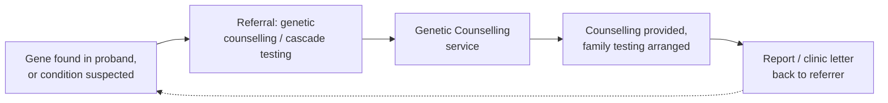
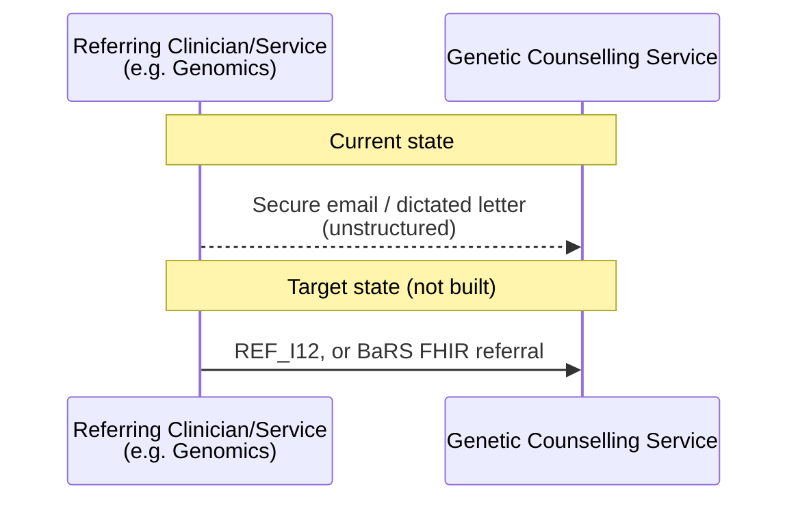
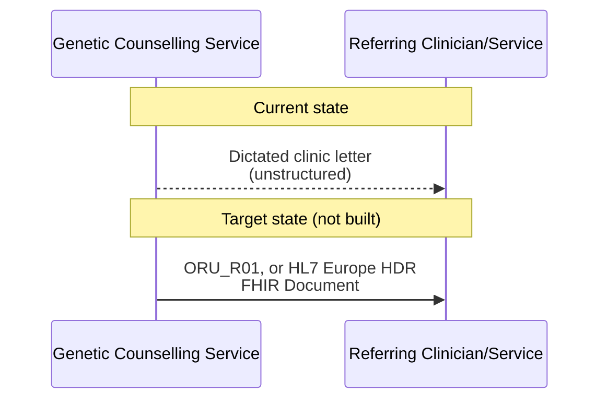

This is for information and analysis purposes only and is not in active development.

Genetic Counselling Referral: a closed-loop referral pattern - similar in concept to
IHE 360X - for genetic counselling and cascade (predictive) family testing, following
the same referral-out/report-back shape as [Laboratory Order and Report LAB-1 and
LAB-3](LTW.html#laboratory-order-and-report-lab-1-and-lab-3).

## References

1. IHE PCC Technical Framework Supplement - [360X: Closed Loop Referrals](https://www.ihe.net/uploadedFiles/Documents/PCC/IHE_PCC_Suppl_360X.pdf) - the closed-loop referral profile this pattern is analogous to (not itself adopted here)
2. HL7 v2 `REF_I12` (Patient Referral) - the initial model for the referral message
3. NHS England [Booking and Referral Standard (BaRS)](https://digital.nhs.uk/services/booking-and-referral-standard) / [FHIR API](https://digital.nhs.uk/developer/api-catalogue/booking-and-referral-fhir) - a possible FHIR-native alternative to `REF_I12`
4. HL7 v2 `ORU_R01` - a possible model for the report/clinic letter back, already used elsewhere in this IG for hospital reports (see [Cancer Background Information for Use Cases](CancerNOS.html))
5. [HL7 Europe Hospital Discharge Report (HDR)](https://build.fhir.org/ig/hl7-eu/hdr/) - a possible FHIR-native alternative for the report/clinic letter back
6. [NHS e-Referral Service (eRS)](https://digital.nhs.uk/services/e-referral-service) - the GP-facing referral service this pattern does not use - eRS is GP-only, so a referral from a hospital-based Genomics/Genetic Counselling service can't use it the way an initial GP referral does
7. [NHS England FHIR Genomics Implementation Guide - Clinical Scenarios](https://simplifier.net/guide/fhir-genomics-implementation-guide/Home/Design/Clinical-Scenarios?version=0.5.3) - may contain scenarios relevant to this pattern
8. [Cancer Background Information for Use Cases - Genetic Counselling Referral Across Regions](CancerNOS.html#genetic-counselling-referral-across-regions) - the worked narrative example this page generalises
9. Macmillan - [What is genetic counselling?](https://www.macmillan.org.uk/cancer-information-and-support/worried-about-cancer/causes-and-risk-factors/what-is-genetic-counselling) - background on cascade/predictive testing

## Overview

This page is **not** about diagnostic genomic testing itself - that is covered by
[Laboratory Testing Workflow (LTW)](LTW.html) and the use cases built on it. It is
about the **clinical referral workflow** that happens around a genomic finding, in
either of two directions:

- A pathogenic variant is **found** in a patient (the proband), and at-risk relatives
  need to be offered genetic counselling and predictive/cascade testing; or
- A condition is **suspected** from family history alone (no variant found yet), and
  genetic counselling needs arranging to assess whether testing the family is
  appropriate.

In both cases the shape of the interaction is the same closed-loop pattern already
used for [Laboratory Order and Report (LAB-1 and
LAB-3)](LTW.html#laboratory-order-and-report-lab-1-and-lab-3): a referral goes out,
and a report (the clinic letter) comes back, closing the loop - just as IHE's Closed
Loop Referral profile (360X) does for general clinical referrals. Today, in North
West Genomics, this loop is closed manually - by secure NHS.net email and dictated
hospital correspondence - not by a defined referral transaction; this page describes
what a more structured version of that same loop could look like.

### Why this matters for developers

- This is the referral-level counterpart to the [Distributed WGS
  (dWGS)](dWGS.html) Family Structure/Participant Type pattern: dWGS covers ordering
  a *test* for multiple family members at once, whereas this page covers the
  *referral* that decides which relatives should be offered counselling/testing in
  the first place, and reports back the outcome.
- It deliberately mirrors LAB-1/LAB-3's actor/transaction shape (referral out, report
  back) rather than inventing a new pattern - see [Actors and
  Transactions](#actors-and-transactions) below.

## Actors and Transactions

| Actor                        | Role                                                                                                       |
|--------------------------------|----------------------------------------------------------------------------------------------------------------|
| Referring Clinician/Service     | The genomics/genetics service (or another specialist, e.g. oncology) that found the variant or suspects a condition, and initiates the referral - analogous to [Order Placer](ActorDefinition-OrderPlacer.html) |
| Genetic Counselling Service     | Receives the referral, provides counselling, and arranges predictive/cascade testing for relevant relatives - analogous to [Order Filler](ActorDefinition-OrderFiller.html) |
{:.grid}

| Transaction                                        | Description                                                            | Direction                                          |
|------------------------------------------------------|------------------------------------------------------------------------------|---------------------------------------------------------|
| Referral (`REF_I12`, target state)                    | Refers a patient/relative for genetic counselling and/or cascade testing        | Referring Clinician/Service → Genetic Counselling Service |
| Referral (secure email/letter, current state)         | The same referral, today sent as unstructured correspondence, not a defined transaction | Referring Clinician/Service → Genetic Counselling Service |
| Report/clinic letter (`ORU_R01`, target state)        | Reports back the outcome of counselling/testing, closing the loop              | Genetic Counselling Service → Referring Clinician/Service |
| Report/clinic letter (dictated correspondence, current state) | The same report, today sent as unstructured correspondence, not a defined transaction | Genetic Counselling Service → Referring Clinician/Service |
{:.grid}

### Genetic Counselling / Cascade Testing Referral

**Current state:** as described in [Cancer Background Information for Use Cases -
Genetic Counselling Referral Across Regions](CancerNOS.html#genetic-counselling-referral-across-regions),
the referral travels as a secure NHS.net email or a dictated letter - the same
generic mechanism as any inter-Trust referral, carrying no structured/coded data.
When the relative lives under a different regional genetics service, this takes the
form of a **family letter** summarising the variant, inheritance pattern and at-risk
relatives.

**Target state (not built):** the referral could instead be modelled as an HL7 v2
`REF_I12` message (Patient Referral), or via NHS England's FHIR-native [Booking and
Referral Standard (BaRS)](https://digital.nhs.uk/services/booking-and-referral-standard) -
both carry structured referral data (the referring service, the reason for referral,
and relevant clinical/genomic context) rather than free text.

### Referral Report / Clinic Letter

**Current state:** the outcome of counselling and any family testing arranged is
reported back as dictated hospital correspondence - the same mechanism used for any
other outpatient clinic letter (see [Cancer Background Information for Use
Cases](CancerNOS.html) for the equivalent pattern on the initial GP referral).

**Target state (not built):** the report could be modelled as an HL7 v2 `ORU_R01`
(as already used elsewhere in this IG for hospital reports/discharge summaries), or
as a FHIR Document following the [HL7 Europe Hospital Discharge Report
(HDR)](https://build.fhir.org/ig/hl7-eu/hdr/) implementation guide.

## Scheduling (Out of Scope)

Booking the counselling appointment itself is deliberately out of scope for this
page. IHE's Closed Loop Referral profile (360X) includes its own dedicated
scheduling transactions, and NHS England's [Booking and Referral Standard
(BaRS)](https://digital.nhs.uk/services/booking-and-referral-standard) is itself
primarily a booking-and-referral service - either could be the natural place
scheduling would live if this pattern were ever built out, but neither is analysed
further here.

## Clinical Scenarios

This page's scope is specifically:

1. **Gene found → testing the family** - a pathogenic variant is confirmed in a
   proband, and relatives at risk of carrying the same variant are referred for
   counselling and predictive/cascade testing.
2. **Condition suspected → testing the family** - no variant has been found yet, but
   family history alone is enough to warrant a genetic counselling referral to assess
   whether testing the family is appropriate.

The [NHS England FHIR Genomics Implementation Guide - Clinical
Scenarios](https://simplifier.net/guide/fhir-genomics-implementation-guide/Home/Design/Clinical-Scenarios?version=0.5.3)
page may contain further scenarios relevant to both of these - not reviewed in
detail here. The worked example already in this IG is [Cancer Background Information
for Use Cases - Genetic Counselling Referral Across
Regions](CancerNOS.html#genetic-counselling-referral-across-regions), covering
scenario 1 (a confirmed Lynch syndrome variant, with relatives under different
regional genetics services referred for cascade testing).

## Data Models

Not yet modelled in this IG - no `ServiceRequest`/`DiagnosticReport` profile
currently represents a genetic counselling referral or its report specifically (the
existing [ServiceRequest](StructureDefinition-ServiceRequest.html)/[DiagnosticReport](StructureDefinition-DiagnosticReport.html)
profiles are scoped to diagnostic laboratory orders/reports, per [Diagnostic
Core](diagnostic-core.html)). If this pattern were taken forward, the natural
starting point would be a `ServiceRequest` for the referral (category distinguishing
it from a laboratory order) and a `DiagnosticReport` or `Composition`-led FHIR
Document for the report, following the same closed-loop shape as LAB-1/LAB-3.
