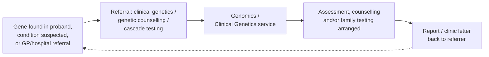
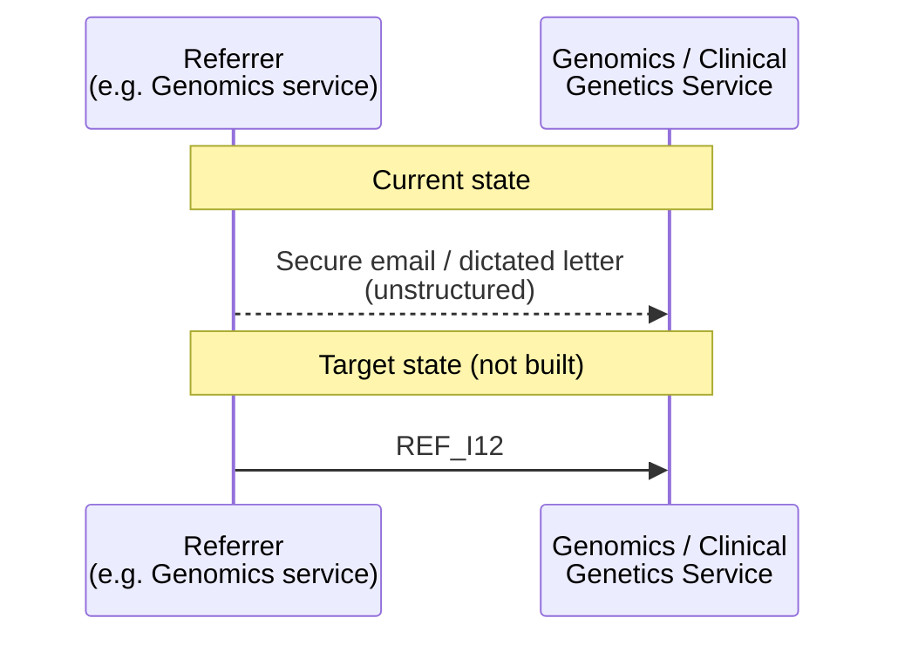
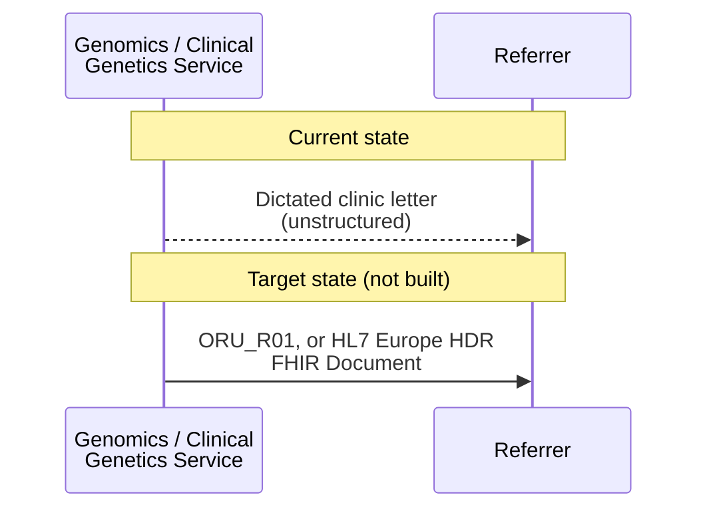
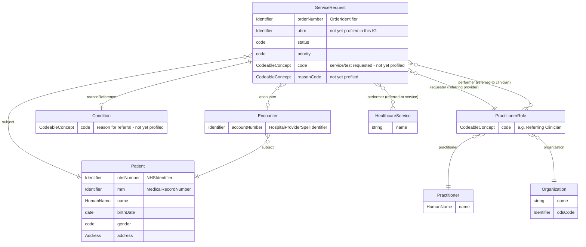
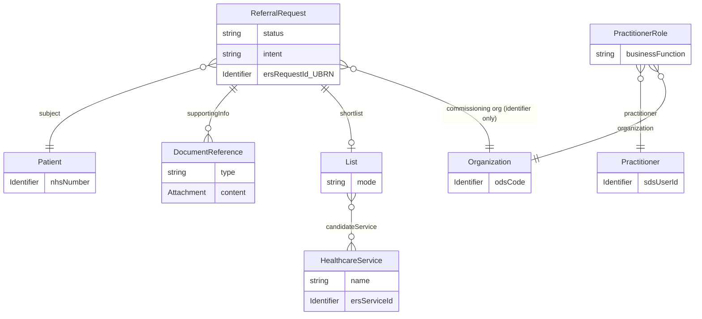

This is for information and analysis purposes only and is not in active development.

Genetic Referrals: a closed-loop referral pattern - similar in concept to IHE
360X - for referring a patient (or an at-risk relative) into a clinical
genetics/genomics service for genetic counselling and, where appropriate, testing.
This covers both directions a referral into North West genomics can arise:

- **Referral for genetic counselling / cascade (predictive) testing**, following a
  variant already found or a condition already suspected - see [Clinical
  Scenarios](#clinical-scenarios) below and [Cancer Background Information for Use
  Cases - Genetic Counselling Referral Across Regions](CancerNOS.html#genetic-counselling-referral-across-regions).
- **A GP or hospital referral direct into a regional clinical genetics service**, such
  as [Manchester Centre for Genomic Medicine](https://www.mangen.co.uk/healthcare-professionals/clinical-genomic-services/)
  or the [Liverpool Centre for Genomic Medicine (LCGM)](https://www.uhliverpool.nhs.uk/services/service-finder/liverpool-centre-genomic-medicine-lcgm) -
  the entry point into the same referral-out/report-back pattern, most commonly made
  today via [NHS e-Referral Service (eRS)](#referral-via-nhs-e-referral-service-ers)
  when the referrer is a GP.

Both follow the same referral-out/report-back shape as [Laboratory Order and Report
LAB-1 and LAB-3](LTW.html#laboratory-order-and-report-lab-1-and-lab-3).

## References

1. IHE PCC Technical Framework Supplement - [360X: Closed Loop Referrals](https://www.ihe.net/uploadedFiles/Documents/PCC/IHE_PCC_Suppl_360X.pdf) - the closed-loop referral profile this pattern is analogous to (not itself adopted here)
2. HL7 v2 `REF_I12` (Patient Referral) - one model for the referral message, used as the basis for the [Referral Data Model](#referral-data-model) below
3. NHS [e-Referral Service (eRS)](https://digital.nhs.uk/services/e-referral-service) / [FHIR API](https://digital.nhs.uk/developer/api-catalogue/e-referral-service-fhir) - the service GPs use today to refer into secondary care, including regional clinical genetics services; the other basis for the [Referral Data Model](#referral-data-model) below
4. NHS England [Booking and Referral Standard (BaRS) - FHIR API](https://digital.nhs.uk/developer/api-catalogue/booking-and-referral-fhir/v1.0.7) - a possible alternative to eRS; checked for referral-specific data modelling in the [Mapping to NHS Booking and Referral Standard (BaRS)](#mapping-to-nhs-booking-and-referral-standard-bars) section below
5. HL7 v2 `ORU_R01` - a possible model for the report/clinic letter back, already used elsewhere in this IG for hospital reports (see [Cancer Background Information for Use Cases](CancerNOS.html))
6. [HL7 Europe Hospital Discharge Report (HDR)](https://build.fhir.org/ig/hl7-eu/hdr/) - a possible FHIR-native alternative for the report/clinic letter back
7. [Manchester Centre for Genomic Medicine - Clinical Services](https://www.mangen.co.uk/healthcare-professionals/clinical-genomic-services/)
8. [Liverpool Centre for Genomic Medicine (LCGM)](https://www.uhliverpool.nhs.uk/services/service-finder/liverpool-centre-genomic-medicine-lcgm)
9. [NHS England FHIR Genomics Implementation Guide - Clinical Scenarios](https://simplifier.net/guide/fhir-genomics-implementation-guide/Home/Design/Clinical-Scenarios?version=0.5.3) - may contain scenarios relevant to this pattern
10. [Cancer Background Information for Use Cases - Genetic Counselling Referral Across Regions](CancerNOS.html#genetic-counselling-referral-across-regions) - the worked narrative example this page generalises
11. Macmillan - [What is genetic counselling?](https://www.macmillan.org.uk/cancer-information-and-support/worried-about-cancer/causes-and-risk-factors/what-is-genetic-counselling) - background on cascade/predictive testing
12. [Diagnostic Core](diagnostic-core.html) - the identifier profiles reused in the [Referral Data Model](#referral-data-model) below

## Overview

This page is **not** about diagnostic genomic testing itself - that is covered by
[Laboratory Testing Workflow (LTW)](LTW.html) and the use cases built on it. It is
about the **clinical referral workflow** that brings a patient or relative into a
genomics/clinical genetics service in the first place, whichever of these starts it:

### Terminology

This page uses two genetics-specific terms that may not be familiar outside a
clinical genetics context:

- **Proband** - the patient in whom a genetic condition or pathogenic variant is
  first identified, or in whom one is suspected - the starting point of the
  referral/testing process.
- **Consultand** - a relative of the proband being counselled and/or tested as a
  result (e.g. for cascade/predictive testing), as distinct from the proband
  themselves. The same distinction is used in [Distributed WGS
  (dWGS)](dWGS.html)'s Family Structure/Participant Type pattern.

- A pathogenic variant is **found** in a patient (the proband), and at-risk relatives
  need to be offered genetic counselling and predictive/cascade testing;
- A condition is **suspected** from family history alone (no variant found yet), and
  genetic counselling needs arranging to assess whether testing the family is
  appropriate; or
- A GP or hospital clinician **suspects a genetic condition** in a patient directly
  (not via a prior genomics finding) and refers them into a regional clinical
  genetics service such as Manchester Centre for Genomic Medicine or LCGM for
  assessment.

In all cases the shape of the interaction is the same closed-loop pattern already
used for [Laboratory Order and Report (LAB-1 and
LAB-3)](LTW.html#laboratory-order-and-report-lab-1-and-lab-3): a referral goes out,
and a report (the clinic letter) comes back, closing the loop - just as IHE's Closed
Loop Referral profile (360X) does for general clinical referrals. Today, in North
West Genomics, this loop is most often closed either by **eRS** (a GP referral into a
regional genetics service) or manually - by secure NHS.net email and dictated
hospital correspondence, particularly for genomics-to-genomics or cross-region
referrals; this page describes what a more structured version of that same loop
could look like.

### Why this matters for developers

- This is the referral-level counterpart to the [Distributed WGS
  (dWGS)](dWGS.html) Family Structure/Participant Type pattern: dWGS covers ordering
  a *test* for multiple family members at once, whereas this page covers the
  *referral* that decides which relatives should be offered counselling/testing in
  the first place, and reports back the outcome.
- It deliberately mirrors LAB-1/LAB-3's actor/transaction shape (referral out, report
  back) rather than inventing a new pattern - see [Actors and
  Transactions](#actors-and-transactions) below.
- Regardless of which system originates the referral (eRS, a genomics service, or
  secure email/letter), the same small set of common data items recur - see
  [Referral Data Model](#referral-data-model) below.

## Actors and Transactions

| Actor                        | Role                                                                                                       |
|--------------------------------|----------------------------------------------------------------------------------------------------------------|
| Referrer                        | A GP practice (via eRS), or the genomics/genetics service (or another specialist, e.g. oncology) that found the variant or suspects a condition - analogous to [Order Placer](ActorDefinition-OrderPlacer.html) |
| Genomics / Clinical Genetics Service | Receives the referral, triages, provides counselling and/or genomic testing, and arranges predictive/cascade testing for relevant relatives - analogous to [Order Filler](ActorDefinition-OrderFiller.html). Examples: Manchester Centre for Genomic Medicine, Liverpool Centre for Genomic Medicine (LCGM) |
{:.grid}

| Transaction                                        | Description                                                            | Direction                                          |
|------------------------------------------------------|------------------------------------------------------------------------------|---------------------------------------------------------|
| Referral (eRS, current state - GP referrers)          | A GP refers a patient into a regional clinical genetics service            | Referrer (GP) → Genomics / Clinical Genetics Service |
| Referral (`REF_I12`, target state - non-eRS referrers) | Refers a patient/relative for genetic counselling and/or cascade testing, where eRS is not used (e.g. genomics-to-genomics, cross-region) | Referrer → Genomics / Clinical Genetics Service |
| Referral (secure email/letter, current state - non-eRS referrers) | The same referral, today sent as unstructured correspondence, not a defined transaction | Referrer → Genomics / Clinical Genetics Service |
| Report/clinic letter (`ORU_R01`, target state)        | Reports back the outcome of assessment/counselling/testing, closing the loop              | Genomics / Clinical Genetics Service → Referrer |
| Report/clinic letter (dictated correspondence, current state) | The same report, today sent as unstructured correspondence, not a defined transaction | Genomics / Clinical Genetics Service → Referrer |
{:.grid}

### Referral via NHS e-Referral Service (eRS)

**Current state:** where the referrer is a GP practice, the referral into a regional
clinical genetics service (e.g. Manchester Centre for Genomic Medicine, LCGM) is most
commonly made today via [NHS e-Referral Service
(eRS)](https://digital.nhs.uk/services/e-referral-service) - the national service GPs
already use to refer into secondary care generally, not a genomics-specific
mechanism. eRS is being generalised into this page's scope (rather than excluded, as
in an earlier version of this page) because it is, in practice, the primary route by
which patients first reach these services. eRS assigns each referral a **Unique
Booking Reference Number (UBRN)**, which the receiving service uses to identify and
triage it.

eRS's [FHIR API](https://digital.nhs.uk/developer/api-catalogue/e-referral-service-fhir)
currently represents the referral as a `ReferralRequest` resource (STU3), profiled
as `eRS-ReferralRequest-1`; a newer `ServiceRequest`-based (R4) endpoint is in
development, on which the UBRN appears explicitly as
`ServiceRequest.identifier` (system `https://fhir.nhs.uk/Id/UBRN`), with
`intent = order` and `category` coded `referral` (system
`https://fhir.nhs.uk/CodeSystem/message-category-servicerequest`) - see the [FHIR
Resource Model](#ers-fhir-resource-model) below.

**Not in scope here:** eRS's own booking/scheduling functions (see [Scheduling (Out
of Scope)](#scheduling-out-of-scope) below) - only the referral itself, and the data
items it carries, are considered.

### Genetic Counselling / Cascade Testing Referral (non-eRS)

**Current state:** as described in [Cancer Background Information for Use Cases -
Genetic Counselling Referral Across Regions](CancerNOS.html#genetic-counselling-referral-across-regions),
a referral between genomics/genetics services (e.g. cascade testing for a relative
under a different regional service) travels as a secure NHS.net email or a dictated
letter - the same generic mechanism as any inter-Trust referral, carrying no
structured/coded data. When the relative lives under a different regional genetics
service, this takes the form of a **family letter** summarising the variant,
inheritance pattern and at-risk relatives.

**Target state (not built):** the referral could instead be modelled as an HL7 v2
`REF_I12` message (Patient Referral) - both carrying structured referral data (the
referring service, the reason for referral, and relevant clinical/genomic context)
rather than free text.

### Referral Report / Clinic Letter

**Current state:** the outcome of assessment, counselling and any family testing
arranged is reported back as dictated hospital correspondence - the same mechanism
used for any other outpatient clinic letter (see [Cancer Background Information for
Use Cases](CancerNOS.html) for the equivalent pattern on the initial GP referral).

**Target state (not built):** the report could be modelled as an HL7 v2 `ORU_R01`
(as already used elsewhere in this IG for hospital reports/discharge summaries), or
as a FHIR Document following the [HL7 Europe Hospital Discharge Report
(HDR)](https://build.fhir.org/ig/hl7-eu/hdr/) implementation guide.

## Scheduling (Out of Scope)

Booking the counselling/genetics appointment itself is deliberately out of scope for
this page. eRS has its own booking functionality, IHE's Closed Loop Referral profile
(360X) includes its own dedicated scheduling transactions, and NHS England's
[Booking and Referral Standard (BaRS)](https://digital.nhs.uk/services/booking-and-referral-standard)
is itself primarily a booking-and-referral service for non-eRS pathways - any of
these could be the natural place scheduling would live if this pattern were ever
built out, but none is analysed further here.

## Referral Data Model

This is a **high-level sketch of the referral only** - not the report back, and not
scheduling. It only lists elements that are common data items already needed
elsewhere in this pathway (e.g. identifiers already elaborated under [Specimen
Transportation and Management](SpecimenTransportationAndManagement.html#key-identifiers)
and [Diagnostic Core](diagnostic-core.html)), mapped from HL7 v2 `REF_I12` segments on
one side and FHIR resources (as used by eRS and generally in this IG) on the other.
It is not a proposal to build either interface - it exists so that a future
`ServiceRequest`-based referral profile, if ever built, can reuse identifiers this IG
already defines rather than inventing new ones.

| Common Data Item                     | `REF_I12` Segment.Field                              | FHIR Resource.Element                              | This IG's Profile (if reused)                                                             |
|-----------------------------------------|-----------------------------------------------------------|-----------------------------------------------------------|--------------------------------------------------------------------------------------------------|
| Patient - NHS Number                    | `PID-3` (identifier, NHS Number assigning authority)       | `Patient.identifier` (NHS Number system)                    | [NHSIdentifier](StructureDefinition-NHSIdentifier.html)                                            |
| Patient - Medical Record Number (MRN)   | `PID-3` (identifier, MRN assigning authority)               | `Patient.identifier` (MRN system)                            | [MedicalRecordNumber](StructureDefinition-MedicalRecordNumber.html)                                |
| Patient - name, date of birth, sex, address | `PID-5`, `PID-7`, `PID-8`, `PID-11`                     | `Patient.name`, `.birthDate`, `.gender`, `.address`          | Not specific to referral - standard `Patient` demographics                                        |
| Patient Account/Episode Number          | `PID-18` (Patient Account Number)                          | `Encounter.identifier`, or `Account.identifier`               | [HospitalProviderSpellIdentifier](StructureDefinition-HospitalProviderSpellIdentifier.html)        |
| Referral (order) identifier             | `RF1-6` (Originating Referral Identifier)                    | `ServiceRequest.identifier`                                 | [OrderIdentifier](StructureDefinition-OrderIdentifier.html)                                        |
| Referral identifier - eRS-specific      | *(no `REF_I12` equivalent)*                                 | `ServiceRequest.identifier` (system `https://fhir.nhs.uk/Id/UBRN`) | Not currently modelled - a new identifier profile, analogous to `OrderIdentifier`, would be needed if eRS referrals were represented |
| Referral status                         | `RF1-1` (Referral Status)                                   | `ServiceRequest.status`                                     | Standard FHIR status code, not separately profiled                                                |
| Referral priority                       | `RF1-2` (Referral Priority)                                 | `ServiceRequest.priority`                                   | Standard FHIR priority code, not separately profiled                                              |
| Service/test requested                  | `RF1-4` (Referral Type)                                     | `ServiceRequest.code`                                        | Not currently modelled for this use case - would need a genetics-referral-specific code system/ValueSet |
| Reason for referral                     | `RF1-12` (Reason for Referral), `DG1` (Diagnosis)             | `ServiceRequest.reasonCode`, or `Condition`                   | Not currently modelled for this use case                                                          |
| Referring provider/organisation         | `PRD` (role = Referring Provider)                            | `Practitioner`/`PractitionerRole`, `Organization`             | Analogous to [Order Placer](ActorDefinition-OrderPlacer.html)                                       |
| Referred-to provider/service            | `PRD` (role = Referred-to Provider)                          | `Practitioner`/`PractitionerRole`, `Organization`, `HealthcareService` | Analogous to [Order Filler](ActorDefinition-OrderFiller.html)                                       |
| Visit/encounter context (if any)        | `PV1`                                                       | `Encounter`                                                  | Not currently modelled for this use case                                                          |
{:.grid}

Notes on this sketch:

- `REF_I12`'s `PID-18` (Patient Account Number) is the v2 field that corresponds to
  this IG's existing Account/Episode Number identifier - it is **not** the v2 `ACC`
  segment, which is unrelated (Accident information).
- eRS's own referral identifier, the UBRN, has no `REF_I12` equivalent - it is an
  eRS-specific concept that would need its own identifier profile if this pathway
  were ever modelled in FHIR, following the same pattern as the existing
  [OrderIdentifier](StructureDefinition-OrderIdentifier.html).
- The FHIR resource types listed (`ServiceRequest`, `Patient`, `Practitioner`/
  `PractitionerRole`, `Organization`, `HealthcareService`, `Encounter`, `Condition`)
  are the standard FHIR building blocks generally used to represent a referral, and
  are consistent with how eRS's own FHIR API and this IG's existing
  [ServiceRequest](StructureDefinition-ServiceRequest.html) profile are built - see
  the [eRS FHIR Resource Model](#ers-fhir-resource-model) above for how eRS itself
  relates them; those are NHS Digital's own profiles and are not adopted here.
- Nothing in this table has been built as a profile in this IG - see [Data
  Models](#data-models) below.

### Target Referral Model

The diagram below is the FHIR resource model implied by the mapping table above -
**this is likely the model this IG would actually build**, if a genetics referral
profile were taken forward, as distinct from [eRS's own resource
model](#ers-fhir-resource-model) below (which documents an external API, not a
target for this IG).

Notes on this diagram:

- `ServiceRequest` carries two distinct identifiers - the Order Number (already
  covered by [OrderIdentifier](StructureDefinition-OrderIdentifier.html)) and, only
  where the referral originated via eRS, the UBRN (not yet profiled - see [Notes on
  this sketch](#referral-data-model) above).
- `requester` and `performer` are kept separate because the mapping table
  distinguishes "Referring provider/organisation" from "Referred-to
  provider/service" - the former is modelled as a single required `PractitionerRole`,
  the latter as zero-or-many, and may be a clinician (`PractitionerRole`) or a
  service (`HealthcareService`) directly, per the table.
- `Condition` is only needed if the reason for referral is a coded/structured
  reference rather than inline text on `ServiceRequest.reasonCode` - both options are
  shown in the mapping table above.
- None of this has been built as a profile in this IG yet - see [Data
  Models](#data-models) below.

### eRS FHIR Resource Model

The diagram below sketches how eRS's own FHIR API relates the resources involved in
a referral, taken from the worked examples published in [eRS's FHIR API
catalogue](https://digital.nhs.uk/developer/api-catalogue/e-referral-service-fhir).
It uses the current (STU3) `ReferralRequest` resource name; the same shape applies to
the newer `ServiceRequest`-based (R4) endpoint once it is generally available.

Notes on this diagram:

- `ReferralRequest.subject` references the `Patient` by NHS Number identifier only
  (`http://fhir.nhs.net/Id/nhs-number` in STU3, `https://fhir.nhs.uk/Id/nhs-number`
  in R4) - not a full `Patient` resource.
- The candidate services in the shortlist `List` are likewise identified rather than
  fully represented, by an `ers-service` identifier, corresponding to a
  `HealthcareService`.
- The commissioning organisation on `ReferralRequest` is carried as a bare
  `Identifier` (ODS organisation code) via an extension, not a full `Organization`
  reference - shown here as a relationship to `Organization` for clarity.
- `PractitionerRole` (linking a `Practitioner` and an `Organization`, e.g. with
  business function `REFERRING_CLINICIAN`) is how eRS identifies "who" elsewhere in
  its API (e.g. Advice and Guidance/Communication) - it is not shown wired directly
  into the `ReferralRequest` example above because that relationship was not found in
  the published examples.
- Booking (`Appointment`/`Slot`/`Schedule`) is omitted from this diagram - eRS's own
  API does link a booked `ReferralRequest` directly to an `Appointment`, but
  scheduling remains [out of scope](#scheduling-out-of-scope) for this page.

### Mapping to NHS Booking and Referral Standard (BaRS)

[NHS Booking and Referral Standard
(BaRS)](https://digital.nhs.uk/developer/api-catalogue/booking-and-referral-fhir/v1.0.7)
is NHS England's other FHIR-based referral mechanism, intended as a general-purpose
alternative to eRS for non-GP referral pathways. Checking its published
`CapabilityStatement` and `MessageDefinition` resources directly: **BaRS defines no
referral-specific data model of its own** - there is no BaRS equivalent of eRS's
UBRN, `ReferralPriority`, `ReferralState` or `Shortlist` extensions, and no
referral-specific identifier system was found anywhere in its published API
documentation.

What BaRS does define is a generic FHIR Messaging pattern (`POST /$process-message`)
carrying a `Bundle` of standard UK Core resources, with a `ServiceRequest` as the
`MessageHeader.focus` - for example, its `casetransfer` message profile
(`BARSServiceRequest-request-casetransfer`) requires exactly one each of:
`ServiceRequest`, `Patient` (`UKCore-Patient`), `Encounter`, `Location`,
`Organization`, `Practitioner`, `PractitionerRole`, `Observation`, `Flag`,
`MedicationStatement`, `AllergyIntolerance`, `QuestionnaireResponse` and `Consent`
(all standard [UK Core](https://simplifier.net/hl7fhirukcorer4) profiles). Which
specific `ServiceRequest`/`Bundle` fields carry which data item (referral reason,
priority, referring clinician, etc.) is left to be defined per BaRS use case (e.g. its
published `referraltopharmacy` use case) rather than fixed by BaRS itself.

**Practical conclusion:** unlike eRS (or `REF_I12`), BaRS has no ready-made mapping
row to add to the table above - it provides the raw UK Core building blocks
(`ServiceRequest`, `Patient`, `Organization`, `Practitioner`/`PractitionerRole`,
`Encounter`) a genetics-referral use case could be built from, but none of this IG's
common data items (Order Number/UBRN-equivalent, referral priority/status, reason for
referral) are pre-defined by BaRS the way they are by eRS. If a genetics referral
were ever built on BaRS, this IG would need to define its own `MessageDefinition`,
in the same way BaRS's existing use cases (e.g. `referraltopharmacy`) each do.

## Clinical Scenarios

This page's scope is specifically:

1. **Gene found → testing the family** - a pathogenic variant is confirmed in a
   proband, and relatives at risk of carrying the same variant are referred for
   counselling and predictive/cascade testing.
2. **Condition suspected → testing the family** - no variant has been found yet, but
   family history alone is enough to warrant a genetic counselling referral to assess
   whether testing the family is appropriate.
3. **GP or hospital referral direct into a regional genetics service** - a GP or
   hospital clinician suspects a genetic condition and refers the patient (via eRS,
   if the referrer is a GP) into a service such as Manchester Centre for Genomic
   Medicine or LCGM for assessment, which may lead to genomic testing and/or family
   counselling.

The [NHS England FHIR Genomics Implementation Guide - Clinical
Scenarios](https://simplifier.net/guide/fhir-genomics-implementation-guide/Home/Design/Clinical-Scenarios?version=0.5.3)
page may contain further scenarios relevant to all three - not reviewed in detail
here. The worked example already in this IG is [Cancer Background Information for
Use Cases - Genetic Counselling Referral Across
Regions](CancerNOS.html#genetic-counselling-referral-across-regions), covering
scenario 1 (a confirmed Lynch syndrome variant, with relatives under different
regional genetics services referred for cascade testing).

## Data Models

Not yet modelled in this IG - no `ServiceRequest`/`DiagnosticReport` profile
currently represents a genetics referral or its report specifically (the existing
[ServiceRequest](StructureDefinition-ServiceRequest.html)/[DiagnosticReport](StructureDefinition-DiagnosticReport.html)
profiles are scoped to diagnostic laboratory orders/reports, per [Diagnostic
Core](diagnostic-core.html)). The [Target Referral Model](#target-referral-model)
sketched above is the most likely starting point were this profile ever built,
reusing this IG's existing identifiers (`OrderIdentifier`, `NHSIdentifier`,
`MedicalRecordNumber`, `HospitalProviderSpellIdentifier`) alongside a small number of
not-yet-profiled elements (the UBRN identifier, referral priority/status/reason). The
report side would separately need a `DiagnosticReport` or `Composition`-led FHIR
Document, following the same closed-loop shape as LAB-1/LAB-3.
