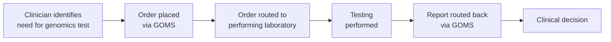
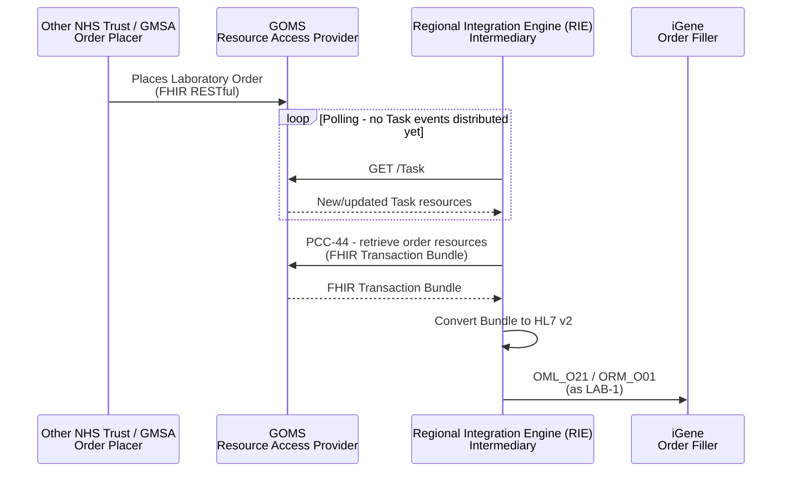
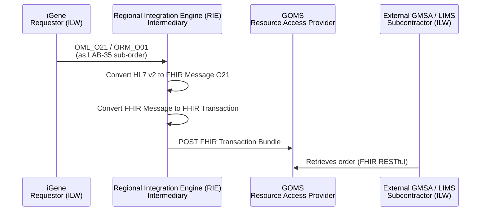

This is for information and analysis purposes only and is not in active development.

NHS England Genomic Order Management Service (GOMS) FHIR API - future integration.

## References

1. [NHS England - Genomic Order Management Service FHIR API](https://digital.nhs.uk/developer/api-catalogue/genomic-order-management-service-fhir) - a [FHIR Workflow](https://hl7.org/fhir/R4/workflow.html) based service for managing orders and results at a national level
2. [09 - LIMS Integration with the Genomic Order Management Service](https://github.com/nw-gmsa/Testing/blob/main/notebooks/09-genomic-order-management-fhir-to-hl7v2-for-lims.ipynb) - worked example of retrieving a Transaction Bundle from GOMS and converting it to HL7 v2 for an internal LIMS
3. [nw-gmsa/Testing - NHSDigital-Examples/O21](https://github.com/nw-gmsa/Testing/tree/main/Input/FHIR/NHSDigital-Examples/O21) - example order Bundles sourced from GOMS's own FHIR Implementation Guide
4. [FHIR Genomics Implementation Guide - Examples](https://simplifier.net/guide/fhir-genomics-implementation-guide/Home/Examples/Bundle) on Simplifier - the source of the examples above
5. [Regional Integration Engine (RIE)](overview.html)
6. [HIE - Resource Exchange (PCC-44)](HIE.html#resource-exchange-pcc-44)
7. [Inter Laboratory Workflow (ILW) - Sub-orders LAB-35 and LAB-36](ILW.html#sub-orders-lab-35-and-lab-36)
8. [FHIR Workflow](https://hl7.org/fhir/R4/workflow.html) - the `Task`-based event and coordination model GOMS uses
9. [Enterprise Integration Patterns - Conversation Patterns](https://www.enterpriseintegrationpatterns.com/patterns/conversation/) - the pattern family this `Task`-based coordination follows
10. [StarLIMS / iGene Integration](starLIMS.html) - uses the same FHIR Workflow / `Task` polling method

## Clinical Pathway Overview

### What is being tested

GOMS itself isn't a specific clinical test - it's a national "order comms" system
that lets a clinician (or another Genomic Medicine Service Alliance) place a
genomics test order without needing to know in advance which laboratory will
actually perform it, and receive the report back the same way.

### The end-to-end clinical journey

1. **Clinical need identified** - a clinician, potentially outside the North West, decides a patient needs a genomics test.
2. **Order placed via GOMS** - the order is placed through the national service rather than directly into a specific laboratory's LIMS.
3. **Order routed to a laboratory** - GOMS routes the order to whichever laboratory (e.g. NW Genomics) is designated to perform that test.
4. **Testing performed**.
5. **Report routed back** - the report reaches the ordering clinician via GOMS.
6. **Clinical decision** - the clinician acts on the result.

### Why this matters for developers

- GOMS decouples *who ordered the test* from *who performs it*, similar in spirit to how iGene/StarLIMS allocation is invisible to the clinician (see [StarLIMS / iGene Integration](starLIMS.html)), but at a national rather than regional scale.
- Orders currently focus on the proband only - see the note under [Receiving Orders from GOMS (LAB-1)](#receiving-orders-from-goms-lab-1) below for the known gap around family/consultand orders.

## Actors

| IHE Actor                                                                | Role                                                                                                                    |
|-------------------------------------------------------------------------------|------------------------------------------------------------------------------------------------------------------------------|
| [Order Placer](ActorDefinition-OrderPlacer.html)                                 | Other NHS Trusts / GMSAs - place Laboratory Orders that GOMS exposes on their behalf, commonly known in the NHS as Order Comms |
| [Resource Access Provider](ActorDefinition-ResourceAccessProvider.html)          | NHS England Genomic Order Management Service (GOMS) - exposes Laboratory Orders and results via a FHIR RESTful API             |
| [Intermediary](ActorDefinition-Intermediary.html)                              | Regional Integration Engine (RIE) - retrieves/posts FHIR Transaction Bundles to and from GOMS, converting to/from HL7 v2 for internal LIMS |
| [Order Filler](ActorDefinition-OrderFiller.html)                                 | iGene (NW Genomics master LIMS) - receives orders converted from GOMS, same as any other LAB-1 order                           |
| [Requestor](ActorDefinition-Requestor.html) (ILW)                                | NW Genomics (iGene) - sub-contracts orders out to other GMSAs via GOMS                                                         |
| [Subcontractor](ActorDefinition-Subcontractor.html) (ILW, via GOMS)              | External GMSA / LIMS - fulfils orders NW Genomics sub-contracts out via GOMS                                                   |
{:.grid}

## Transactions

| Transaction                                                          | Description                                                                                    | Direction              |
|--------------------------------------------------------------------------|----------------------------------------------------------------------------------------------------|----------------------------|
| FHIR RESTful `GET /Task` (polling)                                       | RIE polls GOMS for new/updated `Task` resources, since Task events are not yet distributed as push notifications | RIE → GOMS                  |
| PCC-44 (Resource Exchange) / FHIR RESTful read                           | RIE retrieves the FHIR Transaction Bundle representing a Laboratory Order (plus other GOMS interactions) | GOMS → RIE                  |
| FHIR Transaction Bundle → HL7 v2 `OML_O21`/`ORM_O01` (LAB-1 equivalent)   | RIE converts the retrieved Bundle into an HL7 v2 order for delivery to an internal LIMS             | RIE → iGene                 |
| HL7 v2 `OML_O21`/`ORM_O01` → FHIR Message O21 → FHIR Transaction (future) | Reverse of the above: NW Genomics sub-contracts an order out; RIE converts it to a FHIR Message and then a FHIR Transaction Bundle, and posts it to GOMS | iGene → RIE → GOMS |
{:.grid}

## Current Process

There is currently no integration with GOMS. Laboratory Orders for the North West arrive via the mechanisms already described in [Regional Integration Engine (RIE) - Current Process](overview.html#current-process) (direct HL7 v2 from NHS Trusts, or manual/paper order entry) - GOMS is a future additional source of orders, and a future additional route for delivering sub-contracted orders out to other Genomic Laboratory Hubs.

## Future Process

### Receiving Orders from GOMS (LAB-1)

GOMS exposes Laboratory Orders and related resources (e.g. `Patient`, `ServiceRequest`) via a FHIR RESTful API. As described in notebook [09 - LIMS Integration with the Genomic Order Management Service](https://github.com/nw-gmsa/Testing/blob/main/notebooks/09-genomic-order-management-fhir-to-hl7v2-for-lims.ipynb), the process starts from a FHIR Transaction Bundle:

Events and workflow are coordinated via [FHIR `Task`](https://hl7.org/fhir/R4/workflow.html) resources rather than messaging - GOMS's incorporation of the national service into FHIR Workflow. In Enterprise Integration Patterns terms, this is a [Conversation](https://www.enterpriseintegrationpatterns.com/patterns/conversation/) pattern. At present, `Task` events are not distributed as push notifications, so they must instead be retrieved via polling (`GET /Task`) - the same method already used to retrieve StarLIMS work orders from the FHIR Repository (see [StarLIMS / iGene Integration](starLIMS.html)), as demonstrated in notebook [02 - Work Orders: A Worked Example](https://github.com/nw-gmsa/Testing/blob/main/notebooks/02-work-orders-worked-example.ipynb).

1. The RIE polls GOMS for new/updated `Task` resources (`GET /Task`).
2. For each relevant `Task`, the RIE retrieves the linked resources from GOMS using [PCC-44 (Resource Exchange)](HIE.html#resource-exchange-pcc-44) interactions (and other interactions defined in the GOMS API), assembling them into a FHIR Transaction Bundle.
3. The RIE converts this Bundle into an HL7 v2 `OML_O21`/`ORM_O01` order.
4. From there, the process is the same as any other order: delivered to iGene and handled via the processes already described in [overview.md](overview.html).

> **Note:** Orders retrieved from GOMS currently focus on the proband (the child, in a family/trio scenario) - orders for other family members (parents / consultands) are excluded. This is because NW Genomics' LIMS does not currently support representing consultand orders. Such orders may instead relate to a different pathway - general genetic services referred by an NHS Trust to NW Services, rather than the diagnostic services this IG otherwise covers - but this has not yet been analysed, so this may not be correct.

### Delivering Sub-Contracted Orders via GOMS

GOMS can also be used to deliver orders that NW Genomics sub-contracts out to another Genomic Laboratory Hub - roughly the reverse of the process above:

1. iGene raises a sub-contracted order as HL7 v2 `OML_O21`/`ORM_O01` (the same as any other [ILW sub-order](ILW.html#sub-orders-lab-35-and-lab-36)).
2. The RIE converts this into a FHIR Message O21.
3. The RIE converts the FHIR Message into a FHIR Transaction and posts it to GOMS, for the receiving GMSA to retrieve.

This fits inside the IHE Inter Laboratory Workflow, with NW Genomics acting as Requestor and the external GMSA acting as Subcontractor - the same LAB-35/LAB-36 relationship as [Sub-orders LAB-35 and LAB-36](ILW.html#sub-orders-lab-35-and-lab-36), delivered via GOMS's FHIR RESTful API instead of a direct message exchange.

## Data Models

- [ServiceRequest](StructureDefinition-ServiceRequest.html) - the Laboratory Order, converted from the resources GOMS exposes
- [Patient](StructureDefinition-Patient.html) - patient demographics carried in the GOMS Transaction Bundle

GOMS itself is an NHS England service using profiles from the [FHIR Genomics Implementation Guide](https://simplifier.net/guide/fhir-genomics-implementation-guide) and UK Core, not this IG's own profiles - see the Examples below for the resource shapes it exposes.

## Examples

Example order Bundles sourced from the [FHIR Genomics Implementation Guide](https://simplifier.net/guide/fhir-genomics-implementation-guide/Home/Examples/Bundle) on Simplifier, via [nw-gmsa/Testing](https://github.com/nw-gmsa/Testing/tree/main/Input/FHIR/NHSDigital-Examples/O21):

| Example                                                                                                                             | Description                                                                 |
|------------------------------------------------------------------------------------------------------------------------------------------|----------------------------------------------------------------------------------|
| [Bundle-NonWGSTestOrderForm-Example](Bundle-NonWGSTestOrderForm-Example.html)                                                             | Non-WGS test order form - base example                                           |
| [Bundle-NonWGSTestOrderForm-CancerSolidTumor-Example](Bundle-NonWGSTestOrderForm-CancerSolidTumor-Example.html)                          | Non-WGS test order form - solid tumour cancer scenario                           |
| [Bundle-NonWGSTestOrderForm-FetalScenario-Example](Bundle-NonWGSTestOrderForm-FetalScenario-Example.html)                                | Non-WGS test order form - fetal scenario                                         |
| [Bundle-NonWGSTestOrderForm-Reanalysis-Example](Bundle-NonWGSTestOrderForm-Reanalysis-Example.html)                                      | Non-WGS test order form - reanalysis request                                     |
| [Bundle-NonWGSTestOrderFormQRPatientExtensions-Example](Bundle-NonWGSTestOrderFormQRPatientExtensions-Example.html)                      | Non-WGS test order form - `QuestionnaireResponse` with UK Core Patient extensions |
| [Bundle-WGSTestOrderForm-Example](Bundle-WGSTestOrderForm-Example.html)                                                                  | WGS test order form                                                              |
| [Bundle-NonWGSScenario3-FetusAsProband-Example-FetusA](Bundle-NonWGSScenario3-FetusAsProband-Example-FetusA.html)                        | Fetus as proband scenario                                                        |
| [Bundle-NonWGSScenario4-ProbandWithMultipleFetus-Example-FetusA](Bundle-NonWGSScenario4-ProbandWithMultipleFetus-Example-FetusA.html)    | Proband with multiple fetuses - Fetus A                                          |
| [Bundle-NonWGSScenario4-ProbandWithMultipleFetus-Example-FetusB](Bundle-NonWGSScenario4-ProbandWithMultipleFetus-Example-FetusB.html)    | Proband with multiple fetuses - Fetus B                                          |
| [Bundle-NonWGSScenario5-ProductsofConception-Example](Bundle-NonWGSScenario5-ProductsofConception-Example.html)                          | Products of conception scenario                                                  |
| [UKCore-Bundle-MichaelJonesRequest-Example (minimal)](Bundle-UKCore-MichaelJonesRequest-Example-Minimal.html)                            | UK Core request example, minimally populated                                     |
| [UKCore-Bundle-MichaelJonesRequest-Example (v3 message)](Bundle-UKCore-MichaelJonesRequest-Example.html)                                 | UK Core request example, as a fully-populated FHIR message                       |
{:.grid}

> **Note:** the three `NonWGSTestOrderForm` examples above (base, CancerSolidTumor, FetalScenario, Reanalysis) were previously adapted with North West-specific organisation/sender details; the remaining examples are otherwise unmodified copies of the Simplifier source, with only an `id` (where missing) and the `BundleMessage` profile added for consistency with this IG's other message Bundle examples.

## Developer Guides

- [09 - LIMS Integration with the Genomic Order Management Service](https://github.com/nw-gmsa/Testing/blob/main/notebooks/09-genomic-order-management-fhir-to-hl7v2-for-lims.ipynb) - converts a FHIR order from GOMS into the HL7 v2 this region's LIMS expects

See [Developer Guides](DeveloperGuides.html) for the full notebook series.
