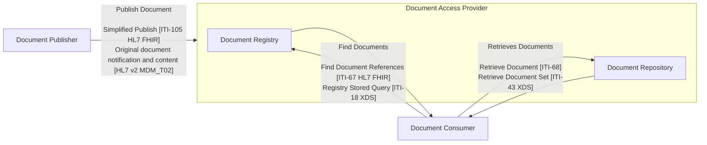
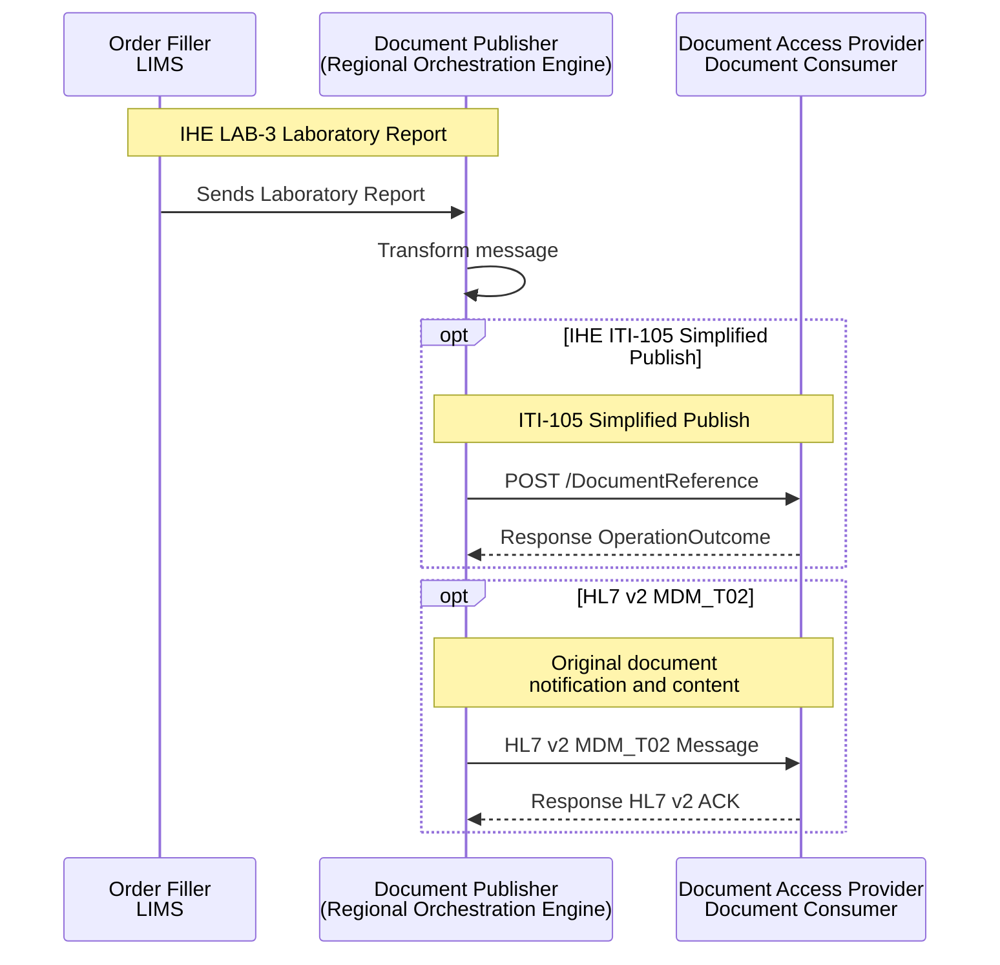
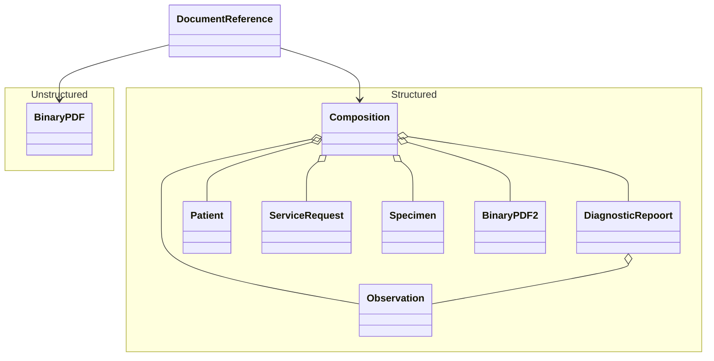
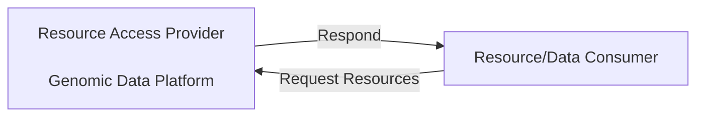
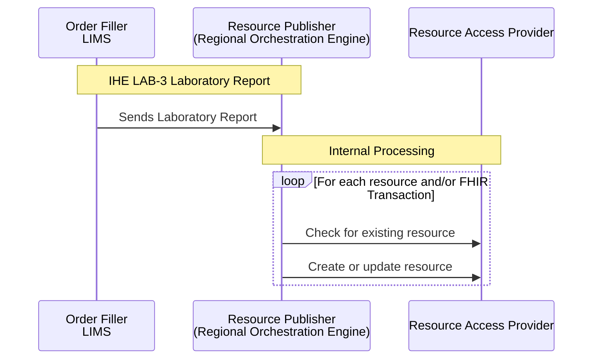

Follow **API Contracts** from EURIDICE [EU Health Data API](https://hl7.eu/fhir/health-data-api/1.0.0-ballot/en/index.html) and **Data Contracts** from EHDS in particular:

1. [HL7 Europe Base and Core FHIR IG](https://build.fhir.org/ig/hl7-eu/base/)
2. [HL7 Europe Laboratory Report](https://hl7.eu/fhir/laboratory/)

This specification adds England-specific data modeling from NHS England Canonical Data Model ([NHS Futures - Canonical Data Model (CDM)](https://future.nhs.uk/DataArchitecture/view?objectId=59464656)).
This specification also conforms to HL7 UK Core.

Process flows and background information are the same as [EU Health Data API](https://hl7.eu/fhir/health-data-api/1.0.0-ballot/en/index.html) and so are not repeated here.

## API Security

See also [API Security](api-security.html)

HL7 SMART Backend Services - Defines authorization in FHIR. We use the SMART Backend Services profile for system-system authorization, and FHIR scopes.
[Authorisation [IUA]](IUA.html) - Defines authorization and access control actors and mechanisms. We use the actors and transactions model.

## Patient Identity Matching

[Patient Identity Matching [PDQm]](PDQm.html) - Defines how a client can perform patient lookup given demographics against a server.

## Document Exchange

[Document Exchange [MHD]](MHD.html) - Defines exchange of Documents, which we use to exchange FHIR document content.

The IHE XDS/MHD document-sharing pattern used in health information exchange, has three actor roles:

- Document Publisher — pushes documents into the system using either the FHIR-based Simplified Publish (ITI-105) transaction or the older HL7 v2 MDM_T02 notification.
- Document Access Provider — a grouping of two services:
  - Document Registry, which indexes document metadata and answers queries (Find Document References ITI-67 in FHIR, or the older Registry Stored Query ITI-18 in XDS).
  - Document Repository, which stores and serves the actual document content (Retrieve Document ITI-68 in FHIR, or Retrieve Document Set ITI-43 in XDS).
- Document Consumer — queries the registry to find documents and retrieves them from the repository.

In short: a publisher submits documents into the registry/repository, and a consumer discovers them via the registry then fetches the content from the repository — with each interaction supporting both a modern FHIR transaction and its older HL7v2/XDS equivalent.

### Sharing Laboratory Reports (Document)

The diagram below shows how an IHE LAB-3 / HL7 v2 ORU_R01 laboratory report is transformed by the Document Publisher and pushed on to a Document Consumer or Document Access Provider, using one of two supported publish transactions:

- [HL7 v2 MDM_T02](MHD.html#document-publish)
- [IHE-105 Simplified Publish (HL7 FHIR)](https://hl7.eu/fhir/health-data-api/1.0.0-ballot/en/document-exchange.html#iti-105-simplified-publish)

The document content, for either transaction, can be:

- Unstructured - PDF
- Structured - [HL7 Europe Laboratory Report](https://build.fhir.org/ig/hl7-eu/laboratory/) FHIR Document
  - Note the content of the structured report is similar to IHE LAB-3 / HL7 v2 ORU_R01 laboratory report, with the addition of a composition which may also contain a html version of the PDF report.

Using a HL7 Europe Laboratory Report FHIR Document to share laboratory reports is a modernisation of [IHE Sharing Laboratory Reports (XD-LAB)](https://wiki.ihe.net/index.php/Sharing_Laboratory_Reports), replacing HL7 Clinical Document Architecture (CDA) with a HL7 FHIR Document.

## Resource Exchange

[Resource Access [IPA/QEDm]](QEDm.html) - using HL7 International Patient Access (IPA), aligned with IHE Query for Existing Data for Mobile (QEDm) — for querying individual FHIR resources such as conditions, medications, and observations

### Sharing Laboratory Reports (Resource)

The diagram below shows how an IHE LAB-3 / HL7 v2 ORU_R01 laboratory report is used to populate resources in the Resource Access Provider. The internal processing uses a combination of FHIR RESTful interactions and FHIR Transactions.

