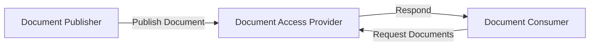
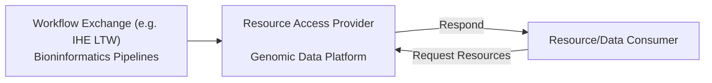

Follow **API Contracts** from EURIDICE [EU Health Data API](https://hl7.eu/fhir/health-data-api/1.0.0-ballot/en/index.html) and **Data Contracts** from EHDS in particular:

1. [HL7 Europe Base and Core FHIR IG](https://build.fhir.org/ig/hl7-eu/base/)
2. [HL7 Europe Laboratory Report](https://hl7.eu/fhir/laboratory/)

This specification adds England-specific data modeling from NHS England Canonical Data Model ([NHS Futures - Canonical Data Model (CDM)](https://future.nhs.uk/DataArchitecture/view?objectId=59464656)).
This specification also conforms to HL7 UK Core.

Process flows and background information are the same as [EU Health Data API](https://hl7.eu/fhir/health-data-api/1.0.0-ballot/en/index.html) and so are not repeated here.

## API Security 

See [API Security](api-security.html)

### Authorization

HL7 SMART Backend Services - Defines authorization in FHIR. We use the SMART Backend Services profile for system-system authorization, and FHIR scopes.
[Authorisation [IUA]](IUA.html) - Defines authorization and access control actors and mechanisms. We use the actors and transactions model.

## Patient Identity Matching

[Patient Identity Matching [PDQm]](PDQm.html) - Defines how a client can perform patient lookup given demographics against a server.

## Document Exchange

[Document Exchange [MHD]](MHD.html) - Defines exchange of Documents, which we use to exchange FHIR document content.

## Resource Exchange

[Resource Access [IPA/QEDm]](QEDm.html) - using HL7 International Patient Access (IPA), aligned with IHE Query for Existing Data for Mobile (QEDm) — for querying individual FHIR resources such as conditions, medications, and observations
