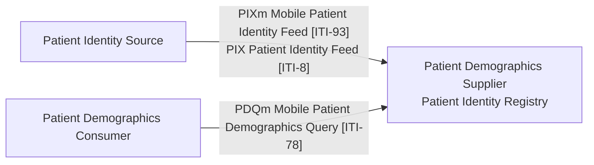
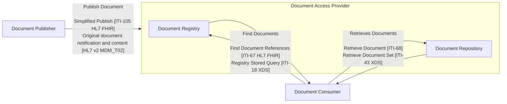
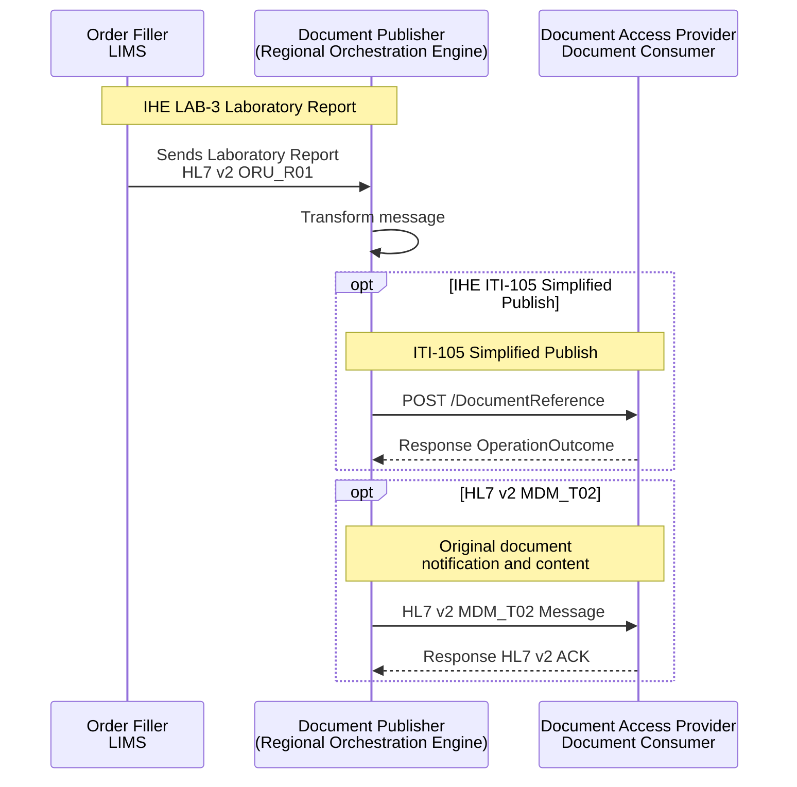
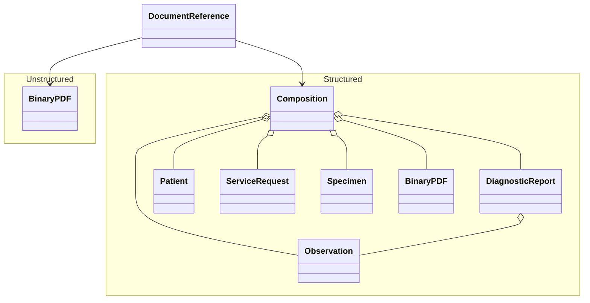
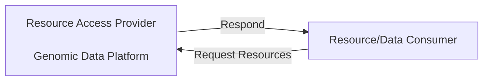
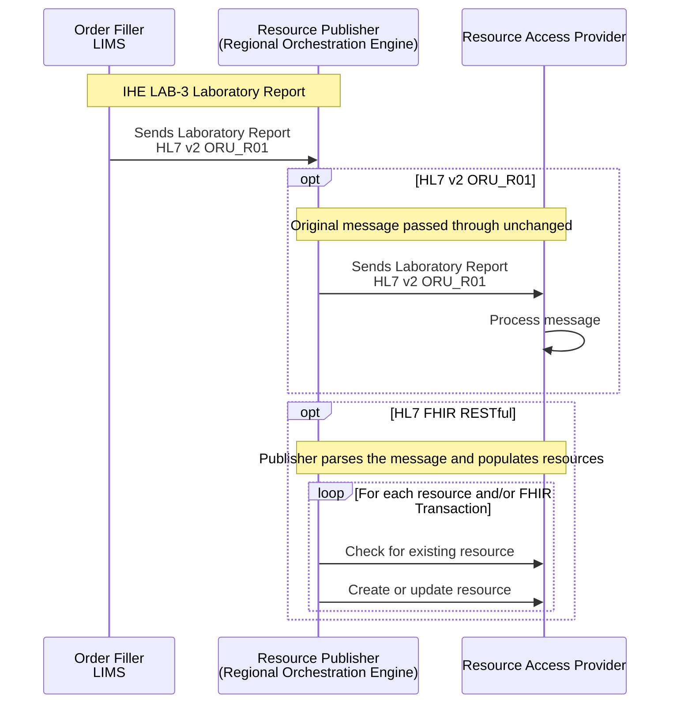
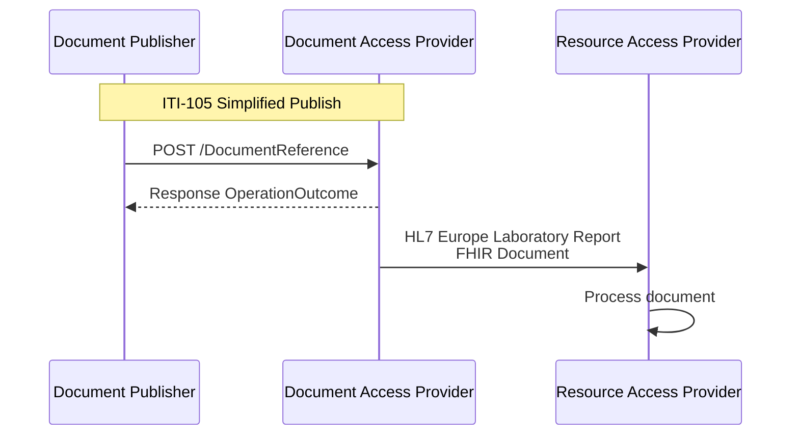

Follow **API Contracts** from EURIDICE [EU Health Data API](https://hl7.eu/fhir/health-data-api/1.0.0-ballot/en/index.html) and **Data Contracts** from EHDS in particular:

1. [HL7 Europe Base and Core FHIR IG](https://build.fhir.org/ig/hl7-eu/base/)
2. [HL7 Europe Laboratory Report](https://hl7.eu/fhir/laboratory/)

This specification adds England-specific data modeling from NHS England Canonical Data Model ([NHS Futures - Canonical Data Model (CDM)](https://future.nhs.uk/DataArchitecture/view?objectId=59464656)).
This specification also conforms to HL7 UK Core.

Process flows and background information are the same as [EU Health Data API](https://hl7.eu/fhir/health-data-api/1.0.0-ballot/en/index.html) and so are not repeated here.

## Actors

The table below summarises the actors referenced throughout this page.

| Actor                                                     | Definition                                                                                                                                                                                                                                                                                                             |
|-----------------------------------------------------------|------------------------------------------------------------------------------------------------------------------------------------------------------------------------------------------------------------------------------------------------------------------------------------------------------------------------|
| Patient Identity Source                                   | Feeds patient identity data into the Patient Identity Registry (PIX Patient Identity Feed ITI-8, or the mobile equivalent PIXm ITI-93). The NHS England HL7 v2 standard for this feed is the [NHS England HL7 v2 ADT Message Specification](https://drive.google.com/drive/folders/1FRkyZvWpZB1nCKbvQbo-eW_q9VtlR3Ws). |
| Patient Demographics Consumer                             | Queries the Patient Identity Registry for patient demographics (PDQm Mobile Patient Demographics Query ITI-78). This is roughly equivalent to the [NHS Personal Demographics Service - FHIR API](https://digital.nhs.uk/developer/api-catalogue/personal-demographics-service-fhir).                                   |
| Patient Demographics Supplier / Patient Identity Registry | The master patient index, receiving identity feeds from the Patient Identity Source and answering demographics queries from Patient Demographics Consumers. In NHS England this is the Spine; in NHS Trusts it is typically the Patient Administration System (PAS).                                                   |
| Order Filler (LIMS)                                       | The laboratory information system that places the original order and produces the IHE LAB-3 / HL7 v2 ORU_R01 laboratory report.                                                                                                                                                                                        |
| Document Publisher                                        | The Regional Orchestration Engine, transforming the IHE LAB-3 / HL7 v2 ORU_R01 laboratory report and pushing it to a Document Consumer or Document Access Provider, using ITI-105 Simplified Publish or HL7 v2 MDM_T02.                                                                                                |
| Document Access Provider                                  | A grouping of the Document Registry and Document Repository, indexing document metadata and serving document content to Document Consumers. Other names include Electronic Document Management Systems (EDMS) and IHE XDS.                                                                                             |
| Document Registry                                         | Indexes document metadata and answers queries (Find Document References ITI-67 in FHIR, or the older Registry Stored Query ITI-18 in XDS). NHS England National Record Locator is a Document Registry.                                                                                                                 |
| Document Repository                                       | Stores and serves the actual document content (Retrieve Document ITI-68 in FHIR, or Retrieve Document Set ITI-43 in XDS).                                                                                                                                                                                              |
| Document Consumer                                         | Queries the Document Registry to find documents and retrieves them from the Document Repository.                                                                                                                                                                                                                       |
| Resource Publisher                                        | The Regional Orchestration Engine, parsing the IHE LAB-3 / HL7 v2 ORU_R01 laboratory report and populating individual FHIR resources in the Resource Access Provider.                                                                                                                                                  |
| Resource Access Provider                                  | The Genomic Data Platform, storing FHIR resources populated by the Resource Publisher and serving them to Resource/Data Consumers. Other examples include Shared Care Records and NHS England Patient Data Manager.                                                                                                    |
| Resource/Data Consumer                                    | Requests and retrieves individual FHIR resources, such as conditions, medications, and observations, from the Resource Access Provider.                                                                                                                                                                                |
{:.grid}

Note: the Document Publisher and Resource Publisher are logical roles played by the same Regional Orchestration Engine — the former publishes whole documents, the latter populates individual FHIR resources.

## API Security

See also [API Security](api-security.html)

HL7 SMART Backend Services - Defines authorization in FHIR. We use the SMART Backend Services profile for system-system authorization, and FHIR scopes.
[Authorisation [IUA]](IUA.html) - Defines authorization and access control actors and mechanisms. We use the actors and transactions model.

## Patient Identity Matching (ITI-78)

[Patient Identity Matching [PDQm]](PDQm.html) - Defines how a client can perform patient lookup given demographics against a server.

## Document Exchange (MHD)

[Document Exchange [MHD]](MHD.html) - Defines exchange of Documents, which we use to exchange FHIR document content.

The IHE XDS/MHD document-sharing pattern used in health information exchange has three actor roles:

- Document Publisher — pushes documents into the system using either the FHIR-based Simplified Publish (ITI-105) transaction or the older HL7 v2 MDM_T02 notification.
- Document Access Provider — a grouping of two services:
  - Document Registry, which indexes document metadata and answers queries (Find Document References ITI-67 in FHIR, or the older Registry Stored Query ITI-18 in XDS).
  - Document Repository, which stores and serves the actual document content (Retrieve Document ITI-68 in FHIR, or Retrieve Document Set ITI-43 in XDS).
- Document Consumer — queries the registry to find documents and retrieves them from the repository.

In short: a publisher submits documents into the registry/repository, and a consumer discovers them via the registry then fetches the content from the repository — with each interaction supporting both a modern FHIR transaction and its older HL7v2/XDS equivalent.

### Sharing Laboratory Reports (Document) (ITI-105 and MDM_T02)

Used by these Use Cases:
- [Regional Integration Engine (RIE)](overview.html) - including the [Shared Care Record Feeds](overview.html#shared-care-record-feeds---wire-tap-on-lab-3oru_r01) wire-tap to GMCR, Lancashire and South Cumbria, and the NHS England Unified Genomic Record

The diagram below shows how an IHE LAB-3 / HL7 v2 ORU_R01 laboratory report is transformed by the Document Publisher and pushed on to a Document Consumer or Document Access Provider, using one of two supported publish transactions:

- [HL7 v2 MDM_T02](MHD.html#document-publish)
- [ITI-105 Simplified Publish (HL7 FHIR)](https://hl7.eu/fhir/health-data-api/1.0.0-ballot/en/document-exchange.html#iti-105-simplified-publish)

The document content, for either transaction, can be:

- Unstructured — PDF
- Structured — [HL7 Europe Laboratory Report](https://build.fhir.org/ig/hl7-eu/laboratory/) FHIR Document
  - The content of the structured report is similar to the IHE LAB-3 / HL7 v2 ORU_R01 laboratory report, with the addition of a Composition, which may also contain an HTML version of the PDF report.

Using an HL7 Europe Laboratory Report FHIR Document to share laboratory reports is a modernisation of [IHE Sharing Laboratory Reports (XD-LAB)](https://wiki.ihe.net/index.php/Sharing_Laboratory_Reports), replacing HL7 Clinical Document Architecture (CDA) with an HL7 FHIR Document.

## Resource Exchange (PCC-44)

[Resource Access [IPA/QEDm]](QEDm.html) - using HL7 International Patient Access (IPA), aligned with IHE Query for Existing Data for Mobile (QEDm) — for querying individual FHIR resources such as conditions, medications, and observations

### Sharing Laboratory Reports (Resource)

Used by these Use Cases:
- [OMICS DSS Result Integration](reportable-variants.html)
- [StarLIMS / iGene Integration](starLIMS.html)

The diagram below shows how an IHE LAB-3 / HL7 v2 ORU_R01 laboratory report is used to populate resources in the Resource Access Provider. The internal processing uses a combination of FHIR RESTful interactions and FHIR Transactions.
This method of sharing results is aimed at populating a FHIR repository for resource/data consumers. The order placer (hospital) will typically prefer the more traditional method of receiving structured laboratory reports: a direct, point-to-point HL7 v2 ORU_R01 feed into their own LIMS/EPR, rather than retrieving results via this resource-population flow.
The "Process message" step represents the point at which the received message is parsed to persist or share individual resources.

### Sharing Laboratory Reports (Resource and Document)  (ITI-105 plus XD-LAB)

When the document format is an HL7 Europe Laboratory Report FHIR Document, the Resource and Document sharing methods described above can be combined. As noted previously, the FHIR Document contains the same clinical content as the IHE LAB-3 / HL7 v2 ORU_R01 message, so it can be processed in the same way to persist or share individual resources.

