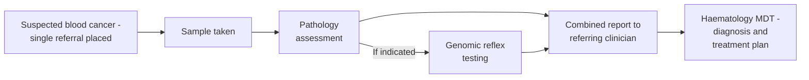
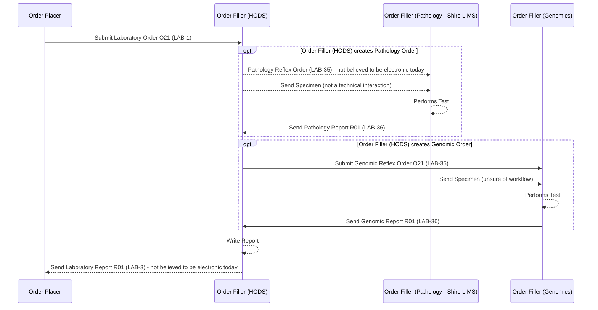

This is currently being elaborated and subject to change.

## References

1. [Inter Laboratory Workflow (ILW) - Sub-orders LAB-35 and LAB-36](ILW.html#sub-orders-lab-35-and-lab-36)
2. [Cheshire and Merseyside Pathology](CheshireAndMerseysidePathology.html) - the related pathology-LIMS (CFT Shire) reflex scenario without HODS orchestration
3. [Cancer Background Information for Use Cases - NHS North West Children Cancer Example](CancerNOS.html#nhs-north-west-children-cancer-example)

## Clinical Pathway Overview

### What is being tested

A single referral for suspected haematological malignancy (blood cancer) triggers
both a pathology assessment (e.g. blood film or bone marrow morphology) and, where
indicated, genomic/molecular testing - without the referring clinician needing to
place two separate orders. Genomic testing here typically looks for the specific
chromosomal/molecular abnormalities that confirm a haematological malignancy
subtype and guide treatment choice.

### The end-to-end clinical journey

1. **Patient presents** - a clinician sees a patient with findings suggestive of a blood cancer (e.g. an abnormal blood count) and places a single haemato-oncology referral.
2. **Sample taken** - a blood or bone marrow sample is collected.
3. **Pathology assessment** - the referral is orchestrated to the pathology laboratory first. *(A `LAB-35` reflex order.)*
4. **Genomic reflex, if indicated** - based on the pathology findings and local protocol, a further reflex order is placed with the genomics laboratory. *(Another `LAB-35` reflex order.)*
5. **Combined report** - pathology and genomic results are brought together into a single report back to the referring clinician. *(`LAB-3`.)*
6. **Clinical decision** - the haematology MDT confirms the diagnosis and subtype, and plans treatment accordingly.

### Why this matters for developers

- One referral becomes **two separate sub-orders** (pathology, then genomics) orchestrated by HODS - not a single combined order - see the Transactions table below.
- The genomic reflex order is **conditional**, triggered by the pathology result/local protocol, not by the original referring clinician - this reflex decision logic sits inside HODS/pathology and isn't modelled by this IG.
- The report the referring clinician ultimately receives is a single **combined** `LAB-3` report, not two separate pathology and genomics reports.
- The pathology reflex order goes to **Shire LIMS**, but this order is not believed to be electronic today - see [Current Process](#current-process).
- The combined `LAB-3` report back to the referring clinician is also not believed to be sent as HL7 `ORU_R01`/`LAB-3` today. Of the transactions in this pathway, only the Shire → HODS pathology report (`LAB-36`) is confirmed electronic - see [Current Process](#current-process).

## Actors

| IHE Actor                                                                                                                        | Role                                                     |
|---------------------------------------------------------------------------------------------------------------------------------------|----------------------------------------------------------|
| [Order Placer](ActorDefinition-OrderPlacer.html)                                                                                          | Referring clinician / EPR                                 |
| [Order Filler](ActorDefinition-OrderFiller.html) (receiving `LAB-1`) / [Requestor](ActorDefinition-Requestor.html) (ILW, sending `LAB-35`) | HODS - haemato-oncology order comms system, orchestrates pathology and genomics reflex testing for a single referral |
| [Subcontractor](ActorDefinition-Subcontractor.html) (ILW)                                                                                 | Pathology laboratory - **Shire LIMS**. The `LAB-35` order to Shire is not believed to be electronic today - see [Current Process](#current-process) |
| [Subcontractor](ActorDefinition-Subcontractor.html) (ILW)                                                                                 | Genomics laboratory                                         |
{:.grid}

## Transactions

| Transaction | Description                          | Direction                          |
|-------------|------------------------------------------|-------------------------------------|
| `LAB-1`     | Laboratory Order                          | Order Placer → Order Filler (HODS)   |
| `LAB-35` (not believed to be electronic) | Pathology Reflex Order | Order Filler (HODS) → Order Filler (Pathology - Shire LIMS) |
| `LAB-36`    | Pathology Report                          | Order Filler (Pathology - Shire LIMS) → Order Filler (HODS) |
| `LAB-35`    | Genomic Reflex Order                      | Order Filler (HODS) → Order Filler (Genomics)  |
| `LAB-36`    | Genomic Report                            | Order Filler (Genomics) → Order Filler (HODS)  |
| `LAB-3` (not believed to be electronic today) | Laboratory Report (combined) | Order Filler (HODS) → Order Placer   |
{:.grid}

Only the Shire → HODS pathology report (`LAB-36`) above is confirmed as an
electronic transaction today; the electronic status of the genomic reflex
order/report (`LAB-35`/`LAB-36` to/from the genomics laboratory) has not been
separately confirmed for this pathway.

## Current Process

A haemato-oncology order comms system (HODS) orchestrates pathology and genomics
reflex testing for a single referral - see [Inter Laboratory Workflow
(ILW)](ILW.html) for the generic sub-order/reflex pattern this follows
(`LAB-35`/`LAB-36`), and [Cheshire and Merseyside
Pathology](CheshireAndMerseysidePathology.html) for the related pathology-LIMS
(CFT Shire) reflex scenario without HODS orchestration.

The pathology laboratory here is **Shire LIMS**, the same LIMS as the Cheshire
and Merseyside scenario. The pathology reflex order (`LAB-35`) from HODS to
Shire is not believed to be an electronic transaction today, and the combined
report (`LAB-3`) from HODS back to the referring clinician is also not
believed to be sent electronically (as HL7 `ORU_R01`) today - both are shown
in the sequence diagram below as such, pending confirmation. Of the
transactions in this pathway, only the Shire → HODS pathology report
(`LAB-36`) is confirmed electronic.

### Haematological Malignancy Diagnostic Services

This pathway can also apply to children's cancer referrals - see [Cancer
NOS](CancerNOS.html#nhs-north-west-children-cancer-example) for the NHS North
West Children Cancer notification example.

## Future Process

No distinct future-state changes are currently defined for this pathway - this
section will be populated as the HODS orchestration workflow above is formalised.

## Data Models

- [ServiceRequest](StructureDefinition-ServiceRequest.html) - `LAB-1` placer order and `LAB-35` reflex sub-orders
- [DiagnosticReport](StructureDefinition-DiagnosticReport.html) - `LAB-36` reflex results and the combined `LAB-3` report

## Examples

No example resources are published yet for this scenario.

## Developer Guides

No [Developer Guides](DeveloperGuides.html) notebook covers this use case yet.
