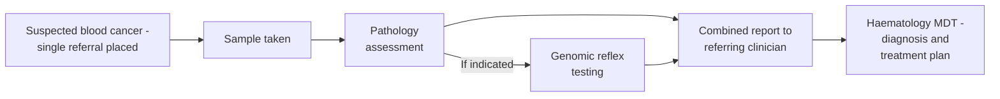
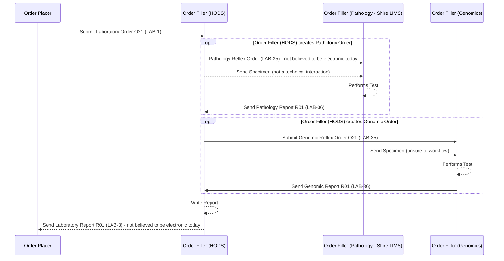

This is currently being elaborated and subject to change.

## References

1. [Inter Laboratory Workflow (ILW) - Sub-orders LAB-35 and LAB-36](ILW.html#sub-orders-lab-35-and-lab-36)
2. [Cheshire and Merseyside Pathology](CheshireAndMerseysidePathology.html) - the related pathology-LIMS (CFT Shire) reflex scenario without HODS orchestration
3. [Cancer Background Information for Use Cases - NHS North West Children Cancer Example](CancerNOS.html#nhs-north-west-children-cancer-example)
4. [HL7 FHIR Genomics Reporting Implementation Guide](https://hl7.org/fhir/uv/genomics-reporting/) - see [Future Process](#future-process) and [Data Models](#data-models) below
5. Sample Shire `LAB-36` cytogenetics messages: [Shire-1](https://github.com/nw-gmsa/Testing/blob/main/Input/V2/R01/Shire-1.txt), [Shire-2](https://github.com/nw-gmsa/Testing/blob/main/Input/V2/R01/Shire-2.txt) - raw HL7 v2, today's actual format
6. The same two messages, illustrating a **future structured** FHIR equivalent: [Shire-1-structured](https://github.com/nw-gmsa/Testing/blob/main/Output/FHIR/R01/Shire-1-structured.json), [Shire-2-structured](https://github.com/nw-gmsa/Testing/blob/main/Output/FHIR/R01/Shire-2-structured.json) - published in this IG as [Examples](#examples) below

## Clinical Pathway Overview

### What is being tested

A single referral for suspected haematological malignancy (blood cancer) triggers
both a pathology assessment (e.g. blood film or bone marrow morphology) and, where
indicated, genomic/molecular testing - without the referring clinician needing to
place two separate orders. Genomic testing here typically looks for the specific
chromosomal/molecular abnormalities that confirm a haematological malignancy
subtype and guide treatment choice.

### The end-to-end clinical journey

1. **Patient presents** - a clinician sees a patient with findings suggestive of a blood cancer (e.g. an abnormal blood count) and places a single haemato-oncology referral.
2. **Sample taken** - a blood or bone marrow sample is collected.
3. **Pathology assessment** - the referral is orchestrated to the pathology laboratory first. *(A `LAB-35` reflex order.)*
4. **Genomic reflex, if indicated** - based on the pathology findings and local protocol, a further reflex order is placed with the genomics laboratory. *(Another `LAB-35` reflex order.)*
5. **Combined report** - pathology and genomic results are brought together into a single report back to the referring clinician. *(`LAB-3`.)*
6. **Clinical decision** - the haematology MDT confirms the diagnosis and subtype, and plans treatment accordingly.

### Why this matters for developers

- One referral becomes **two separate sub-orders** (pathology, then genomics) orchestrated by HODS - not a single combined order - see the Transactions table below.
- The genomic reflex order is **conditional**, triggered by the pathology result/local protocol, not by the original referring clinician - this reflex decision logic sits inside HODS/pathology and isn't modelled by this IG.
- The report the referring clinician ultimately receives is a single **combined** `LAB-3` report, not two separate pathology and genomics reports.
- The pathology reflex order goes to **Shire LIMS**, but this order is not believed to be electronic today - see [Current Process](#current-process).
- The combined `LAB-3` report back to the referring clinician is also not believed to be sent as HL7 `ORU_R01`/`LAB-3` today. Of the transactions in this pathway, only the Shire → HODS pathology report (`LAB-36`) is confirmed electronic - see [Current Process](#current-process).

## Actors

| IHE Actor                                                                                                                        | Role                                                     |
|---------------------------------------------------------------------------------------------------------------------------------------|----------------------------------------------------------|
| [Order Placer](ActorDefinition-OrderPlacer.html)                                                                                          | Referring clinician / EPR                                 |
| [Order Filler](ActorDefinition-OrderFiller.html) (receiving `LAB-1`) / [Requestor](ActorDefinition-Requestor.html) (ILW, sending `LAB-35`) | HODS - haemato-oncology order comms system, orchestrates pathology and genomics reflex testing for a single referral |
| [Subcontractor](ActorDefinition-Subcontractor.html) (ILW)                                                                                 | Pathology laboratory - **Shire LIMS**. The `LAB-35` order to Shire is not believed to be electronic today - see [Current Process](#current-process) |
| [Subcontractor](ActorDefinition-Subcontractor.html) (ILW)                                                                                 | Genomics laboratory                                         |
{:.grid}

## Transactions

| Transaction | Description                          | Direction                          |
|-------------|------------------------------------------|-------------------------------------|
| `LAB-1`     | Laboratory Order                          | Order Placer → Order Filler (HODS)   |
| `LAB-35` (not believed to be electronic) | Pathology Reflex Order | Order Filler (HODS) → Order Filler (Pathology - Shire LIMS) |
| `LAB-36`    | Pathology Report                          | Order Filler (Pathology - Shire LIMS) → Order Filler (HODS) |
| `LAB-35`    | Genomic Reflex Order                      | Order Filler (HODS) → Order Filler (Genomics)  |
| `LAB-36`    | Genomic Report                            | Order Filler (Genomics) → Order Filler (HODS)  |
| `LAB-3` (not believed to be electronic today) | Laboratory Report (combined) | Order Filler (HODS) → Order Placer   |
{:.grid}

Only the Shire → HODS pathology report (`LAB-36`) above is confirmed as an
electronic transaction today; the electronic status of the genomic reflex
order/report (`LAB-35`/`LAB-36` to/from the genomics laboratory) has not been
separately confirmed for this pathway.

## Current Process

A haemato-oncology order comms system (HODS) orchestrates pathology and genomics
reflex testing for a single referral - see [Inter Laboratory Workflow
(ILW)](ILW.html) for the generic sub-order/reflex pattern this follows
(`LAB-35`/`LAB-36`), and [Cheshire and Merseyside
Pathology](CheshireAndMerseysidePathology.html) for the related pathology-LIMS
(CFT Shire) reflex scenario without HODS orchestration.

The pathology laboratory here is **Shire LIMS**, the same LIMS as the Cheshire
and Merseyside scenario. The pathology reflex order (`LAB-35`) from HODS to
Shire is not believed to be an electronic transaction today, and the combined
report (`LAB-3`) from HODS back to the referring clinician is also not
believed to be sent electronically (as HL7 `ORU_R01`) today - both are shown
in the sequence diagram below as such, pending confirmation. Of the
transactions in this pathway, only the Shire → HODS pathology report
(`LAB-36`) is confirmed electronic.

### Haematological Malignancy Diagnostic Services

This pathway can also apply to children's cancer referrals - see [Cancer
NOS](CancerNOS.html#nhs-north-west-children-cancer-example) for the NHS North
West Children Cancer notification example.

## Future Process

No distinct future-state changes are currently defined for the order/report
orchestration in this pathway - this section will be populated as the HODS
orchestration workflow above is formalised.

However, the genomic content of the Shire → HODS `LAB-36` report is itself a
candidate for future modelling. The sample messages for this pathway
([Shire-1](https://github.com/nw-gmsa/Testing/blob/main/Input/V2/R01/Shire-1.txt),
[Shire-2](https://github.com/nw-gmsa/Testing/blob/main/Input/V2/R01/Shire-2.txt))
carry cytogenetic/molecular findings for suspected MDS and AML - a karyotype
(ISCN nomenclature) and, in Shire-2, a FISH result - but represent them
entirely as narrative free text: every line of the report is a separate
`OBX|n|FT|CYTO||...` segment, `OBR-4` (Universal Service Identifier) is not
populated with a coded test name, and there is no structured representation
of the abnormal karyotype, the FISH probe/assay used, or the proportion of
cells affected (e.g. "93 out of 100 interphase cells"). Report amendments are
also represented only as an inline text marker (`-Amendment 14/10/20` in
Shire-2) rather than as a distinct report/observation status. This is genomic
reporting in substance but does not currently align with the HL7 [FHIR
Genomics Reporting Implementation
Guide](https://hl7.org/fhir/uv/genomics-reporting/).

A future state for this pathway should consider re-expressing these results
as discrete, coded FHIR resources rather than a single narrative block, so
that findings such as "7q deletion" or "trisomy 8" are computable rather than
requiring text-mining of `OBX-5`. See [Data Models](#data-models) below for a
proposed direction, and [Developer Guide 12](DeveloperGuides.html) for a
worked build of that conversion against these two messages, whose output is
published as this page's [Examples](#examples).

## Data Models

- [ServiceRequest](StructureDefinition-ServiceRequest.html) - `LAB-1` placer order and `LAB-35` reflex sub-orders
- [DiagnosticReport](StructureDefinition-DiagnosticReport.html) - `LAB-36` reflex results and the combined `LAB-3` report

### Future genomic data model (proposed)

The genomics laboratory's `LAB-36` result (and any genomic content folded
into the combined `LAB-3` report) is a candidate for restructuring in place
of the current free-text `OBX|FT|CYTO` pattern seen in the [sample Shire
messages](https://github.com/nw-gmsa/Testing/tree/main/Input/V2/R01). Two
complementary sources were reviewed for this:

**HL7 FHIR Genomics Reporting IG.** As of this IG's current build, the [HL7
FHIR Genomics Reporting Implementation
Guide](https://hl7.org/fhir/uv/genomics-reporting/)'s own [Cytogenomic
Reporting](https://build.fhir.org/ig/HL7/genomics-reporting/cytogenomics.html)
section states that the Clinical Genomics work group is still reviewing this
use case and has not yet prioritised it - there is currently no finalised,
balloted profile for karyotype/FISH results. An earlier (2018, work-in-progress,
never balloted) draft of the IG sketched four candidate observation shapes -
*Chromosome analysis G-banding panel*, *Chromosome analysis FISH panel*,
*Copy Number Change* (a structural-variant finding), and *Chromosome Analysis
Overall Interpretation* - but marked them incomplete
("TODO - detailed explanation of these observations") and they were not
carried forward. **Building against this IG's cytogenomics content today
would mean building against an acknowledged gap, not a stable target.**

**LOINC cytogenetics panels.** LOINC already publishes a mature, granular
panel structure for exactly this content, which maps more directly onto
today's `OBX` segments than waiting on the FHIR IG to mature:

| LOINC code | Panel/result |
|------------|--------------|
| `62389-2`  | Chromosome analysis master panel |
| `62386-8`  | Chromosome analysis summary panel |
| `77314-3`  | Chromosome analysis basic associated observations panel - Blood or Tissue by Cytogenetics |
| `62356-1`  | Chromosome analysis result in ISCN expression |
| `62349-6`  | Chromosome analysis panel - Blood [from Fetus] by G-banded *(a non-fetal, blood/bone-marrow equivalent should be selected for this pathway)* |
| `62367-8`  | Chromosome analysis panel by FISH |
| `50684-0`  | Chromosome analysis.interphase [Interpretation] in Blood by FISH Narrative |
| `62343-9`  | Chromosome analysis copy number change panel by Microarray |
| `82255-1`  | Marker and derivative chromosome analysis in Blood or Tissue Document by Cytogenetics |
{:.grid}

*(Codes sourced from [loinc.org](https://loinc.org/) search; the exact panel
members and the correct non-fetal specimen variant should be confirmed
against the full LOINC hierarchy and with the genomics laboratory before
adoption.)*

Candidate direction, to be confirmed with the genomics and pathology
laboratories:

- **`DiagnosticReport`** as the container for the genomic result, distinct
  from the pathology `DiagnosticReport`, with `DiagnosticReport.conclusion`
  carrying the free-text interpretive summary (e.g. *"Complex abnormal
  hyperdiploid karyotype ... consistent with AML"*) and
  `DiagnosticReport.conclusionCode` carrying a coded diagnosis/impression
  (e.g. SNOMED CT MDS/AML) where the laboratory is willing to commit to one.
- **`Specimen`** identifying blood vs. bone marrow, referenced by the
  report, rather than left as an uncoded OBR field.
- **Discrete `Observation` resources per finding, coded to the LOINC panel
  members above**, one per karyotype/FISH result rather than one per line
  of prose, for example:
  - an `Observation` coded `62356-1` (ISCN expression) carrying the
    karyotype string (e.g. `46,XY,del(20)(q*q*)[]`) as a structured value,
    with the plain-language description as `Observation.note` rather than
    the sole representation of the finding;
  - a separate `Observation` per FISH probe/locus tested, coded under the
    `62367-8` FISH panel (e.g. a 7q36.1 deletion probe), with
    `Observation.method` for the assay/probe set used (e.g. Cytocell
    MyProbe [Del(7q) Plus]), and a component for the count/percentage of
    cells positive (e.g. "93/100 interphase cells") as a quantity rather
    than embedded in a sentence;
  - individual cytogenetic findings (e.g. monosomy 7, trisomy 8, 12p loss)
    as their own coded Observations grouped via `Observation.hasMember`
    under the `62389-2` master panel (or `DiagnosticReport.result`), so
    each can be queried independently rather than only as part of one long
    karyotype string.
- **`DiagnosticReport.status = corrected`**, with a linked `Provenance`
  history for amendments, replacing the current inline `-Amendment <date>`
  text markers seen in Shire-2.
- SNOMED CT codes for the coded diagnosis/impression, and confirmation of
  the exact LOINC panel members to use, are not yet selected and should be
  agreed with the genomics laboratory as this model is developed - this
  section records a proposed resource shape and starting-point codes, not a
  final specification.

This is additive to, not a replacement for, the existing
[ServiceRequest](StructureDefinition-ServiceRequest.html)/[DiagnosticReport](StructureDefinition-DiagnosticReport.html)
models already listed above for the order/report envelope.

[Developer Guide 12](DeveloperGuides.html) builds this conversion by hand against
`Shire-1.txt`/`Shire-2.txt`, and its output is published below as this page's
[Examples](#examples) - a first illustrative pass, using LOINC `62356-1` (ISCN
expression), `62389-2` (master panel) and `62367-8` (FISH panel) from the table
above, rather than a laboratory-agreed final shape.

## Examples

Illustrative **future structured** FHIR equivalents of the raw HL7 v2 `LAB-36`
messages in [References](#references) above - not today's actual format (see
[Current Process](#current-process)), and not yet agreed with the genomics
laboratory (see [Future genomic data model](#future-genomic-data-model-proposed)
above):

| Example | Source message | Content |
|---|---|---|
| [Bundle/Shire1StructuredR01](Bundle-Shire1StructuredR01.html) | [Shire-1.txt](https://github.com/nw-gmsa/Testing/blob/main/Input/V2/R01/Shire-1.txt) | A single karyotype finding (20q deletion, MDS) as a coded `62356-1` `Observation` under a `62389-2` master panel, with a `33893-9` `DiagnosticReport` |
| [Bundle/Shire2StructuredR01](Bundle-Shire2StructuredR01.html) | [Shire-2.txt](https://github.com/nw-gmsa/Testing/blob/main/Input/V2/R01/Shire-2.txt) | As above, plus a `62367-8` FISH panel result (complex hyperdiploid AML karyotype) |
{:.grid}

## Developer Guides

[Developer Guide 12 - Haemato-Oncology Cytogenetics: From Free-Text HL7 v2 to
Structured Observations](DeveloperGuides.html) builds the conversion above by hand
against the two sample messages, and is the source of the [Examples](#examples)
published on this page.
