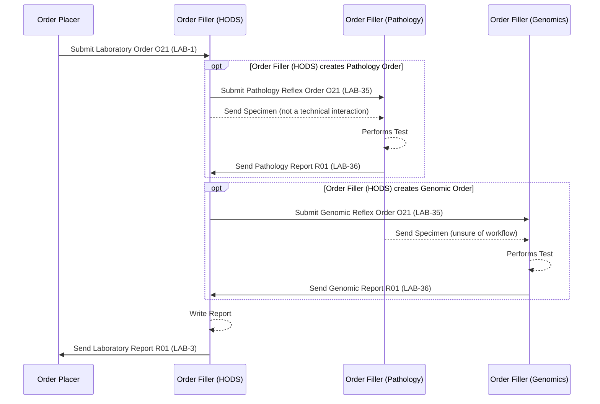

This is currently being elaborated and subject to change.

A haemato-oncology order comms system (HODS) orchestrates pathology and genomics
reflex testing for a single referral - see [Inter Laboratory Workflow
(ILW)](ILW.html) for the generic sub-order/reflex pattern this follows
(`LAB-35`/`LAB-36`), and [Cheshire and Merseyside
Pathology](CheshireAndMerseysidePathology.html) for the related pathology-LIMS
(CFT Shire) reflex scenario without HODS orchestration.

### Haematological Malignancy Diagnostic Services

This pathway can also apply to children's cancer referrals - see [Cancer
NOS](CancerNOS.html#nhs-north-west-children-cancer-example) for the NHS North
West Children Cancer notification example.
