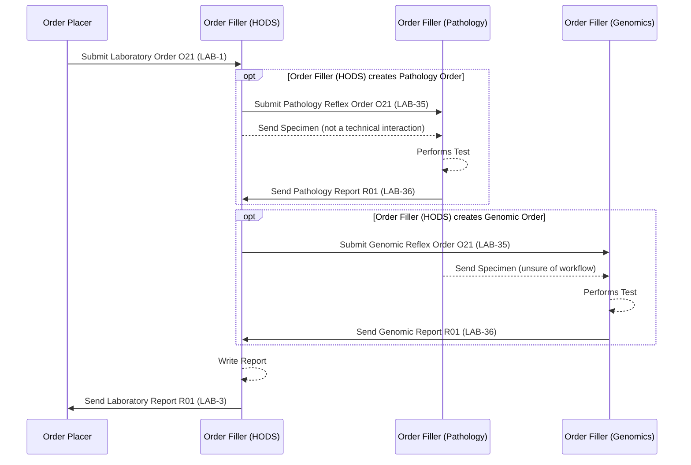

This is currently being elaborated and subject to change.

## References

1. [Inter Laboratory Workflow (ILW) - Sub-orders LAB-35 and LAB-36](ILW.html#sub-orders-lab-35-and-lab-36)
2. [Cheshire and Merseyside Pathology](CheshireAndMerseysidePathology.html) - the related pathology-LIMS (CFT Shire) reflex scenario without HODS orchestration
3. [Cancer Background Information for Use Cases - NHS North West Children Cancer Example](CancerNOS.html#nhs-north-west-children-cancer-example)

## Actors

| IHE Actor                                                                                                                        | Role                                                     |
|---------------------------------------------------------------------------------------------------------------------------------------|----------------------------------------------------------|
| [Order Placer](ActorDefinition-OrderPlacer.html)                                                                                          | Referring clinician / EPR                                 |
| [Order Filler](ActorDefinition-OrderFiller.html) (receiving `LAB-1`) / [Requestor](ActorDefinition-Requestor.html) (ILW, sending `LAB-35`) | HODS - haemato-oncology order comms system, orchestrates pathology and genomics reflex testing for a single referral |
| [Subcontractor](ActorDefinition-Subcontractor.html) (ILW)                                                                                 | Pathology laboratory                                       |
| [Subcontractor](ActorDefinition-Subcontractor.html) (ILW)                                                                                 | Genomics laboratory                                         |
{:.grid}

## Transactions

| Transaction | Description                          | Direction                          |
|-------------|------------------------------------------|-------------------------------------|
| `LAB-1`     | Laboratory Order                          | Order Placer → Order Filler (HODS)   |
| `LAB-35`    | Pathology Reflex Order                    | Order Filler (HODS) → Order Filler (Pathology) |
| `LAB-36`    | Pathology Report                          | Order Filler (Pathology) → Order Filler (HODS) |
| `LAB-35`    | Genomic Reflex Order                      | Order Filler (HODS) → Order Filler (Genomics)  |
| `LAB-36`    | Genomic Report                            | Order Filler (Genomics) → Order Filler (HODS)  |
| `LAB-3`     | Laboratory Report (combined)              | Order Filler (HODS) → Order Placer   |
{:.grid}

## Current Process

A haemato-oncology order comms system (HODS) orchestrates pathology and genomics
reflex testing for a single referral - see [Inter Laboratory Workflow
(ILW)](ILW.html) for the generic sub-order/reflex pattern this follows
(`LAB-35`/`LAB-36`), and [Cheshire and Merseyside
Pathology](CheshireAndMerseysidePathology.html) for the related pathology-LIMS
(CFT Shire) reflex scenario without HODS orchestration.

### Haematological Malignancy Diagnostic Services

This pathway can also apply to children's cancer referrals - see [Cancer
NOS](CancerNOS.html#nhs-north-west-children-cancer-example) for the NHS North
West Children Cancer notification example.

## Future Process

No distinct future-state changes are currently defined for this pathway - this
section will be populated as the HODS orchestration workflow above is formalised.

## Data Models

- [ServiceRequest](StructureDefinition-ServiceRequest.html) - `LAB-1` placer order and `LAB-35` reflex sub-orders
- [DiagnosticReport](StructureDefinition-DiagnosticReport.html) - `LAB-36` reflex results and the combined `LAB-3` report

## Examples

No example resources are published yet for this scenario.

## Developer Guides

No [Developer Guides](DeveloperGuides.html) notebook covers this use case yet.
