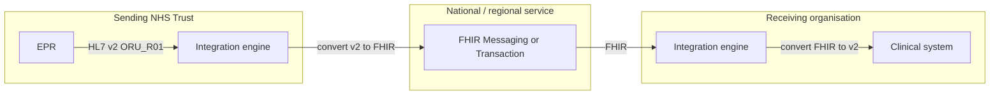
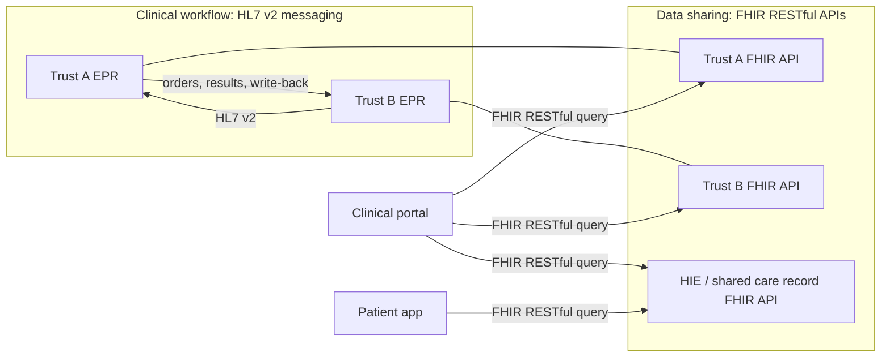
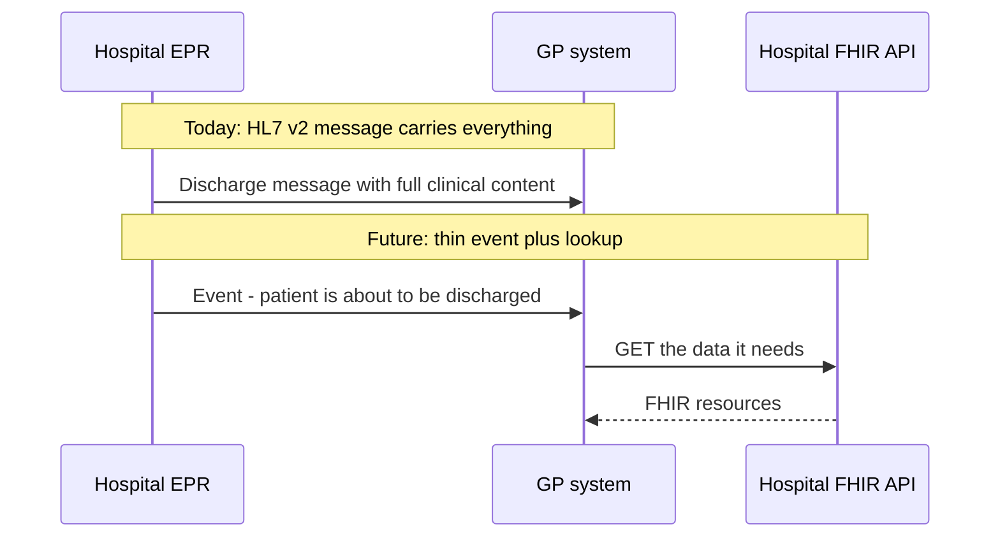
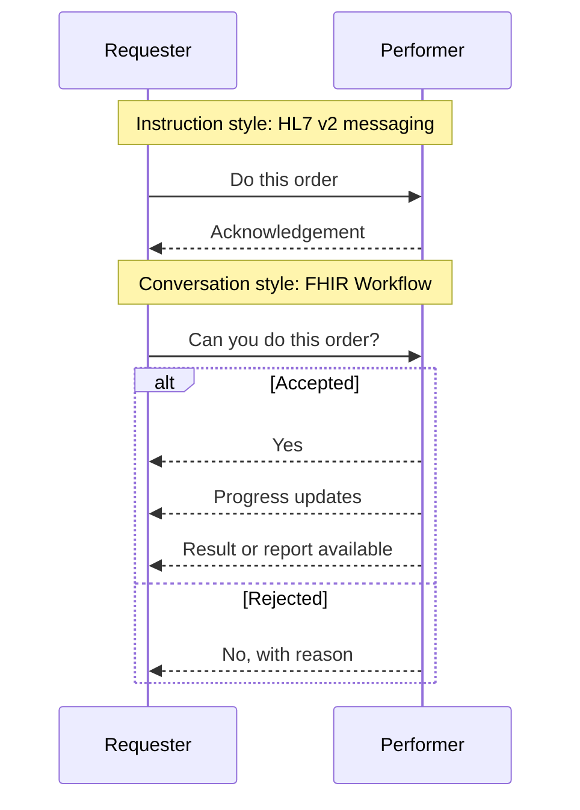
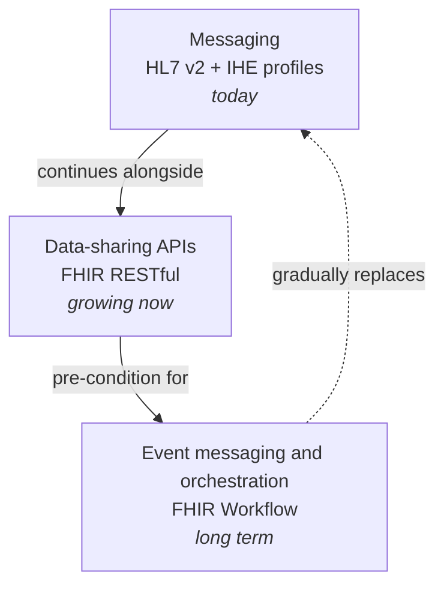
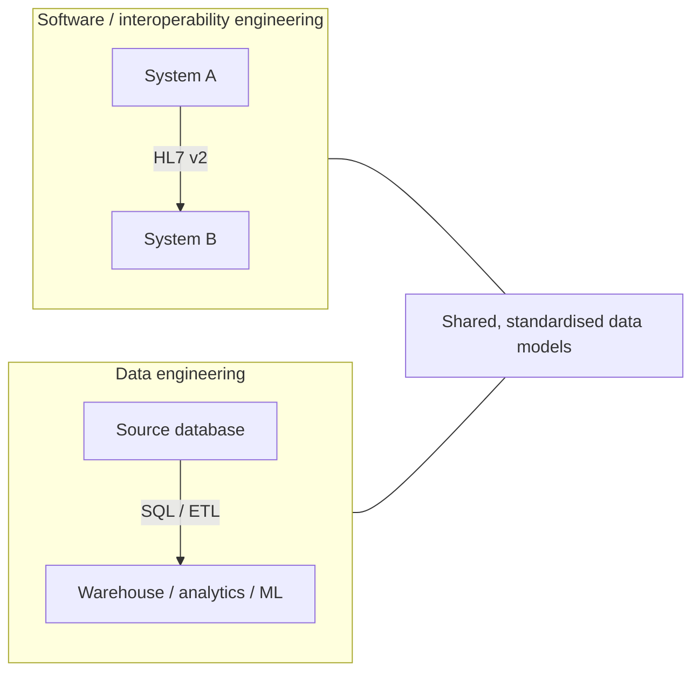
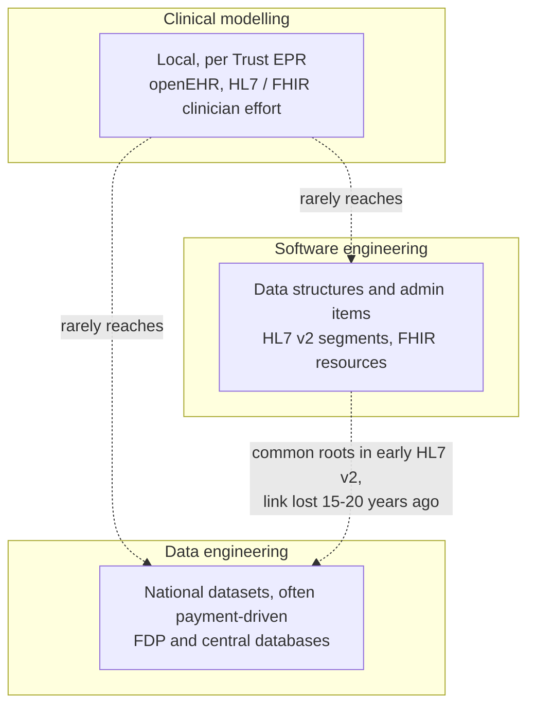
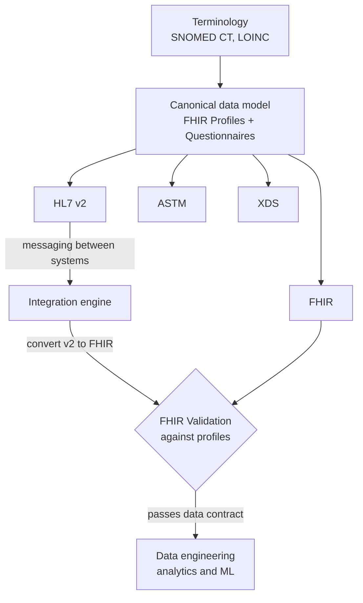
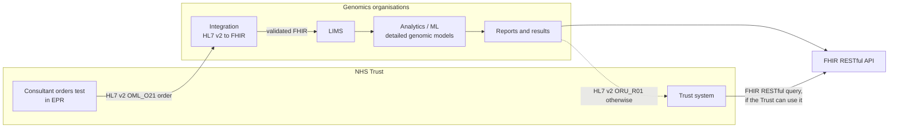

I've been thinking about how best to approach health interoperability. The guiding principle is that we support practitioners, not data or technology, and in practice this usually means aligning with clinical workflow.

The second principle matters in a health system with limited funding and limited engineering capacity: keep costs low, in both money and time.

## Where we are today: HL7 v2 messaging

At present, this usually means exchanging health data through **messaging**, and in almost every case that means **HL7 v2**. Large health systems add **IHE profiles** on top, such as RAD (Radiology) and LTW (Laboratory Testing Workflow, including genomics). These add structure to HL7 v2 and fit better with workflows that cross organisations.

**FHIR** is less established here, probably because HL7 v2 is so widely used. FHIR can support these use cases, but it needs clear demand and the resources to establish it. An individual NHS Trust can't realistically take that on alone. Even so, several projects have introduced FHIR Messaging or Transactions:

1. Transfer of Care
2. NHS Pathology
3. GP Connect Send Document
4. My current genomics project
5. National Event Messaging System (NEMS)

These work, but a closer look at the messaging pipeline usually shows that most of it is still HL7 v2. Many of these interfaces start as an HL7 v2 ORU_R01, because that's what the EPR supports and getting the supplier to change is too expensive for the Trust. It's cheaper for the Trust to convert between HL7 v2 and FHIR.

*Most of a typical "FHIR" pipeline is still HL7 v2. FHIR often appears only on the hop between organisations.*

Even that conversion can be expensive. Connecting two NHS organisations (or suppliers) with HL7 v2 might take two weeks; doing the same with FHIR can take months. There are several reasons for this:

- **Inexperience** with FHIR.
- **Varied exchange methods.** FHIR supports many exchange methods (it's a bit of a Swiss Army knife), and the choice varies from project to project. HL7 v2 generally only supports messaging.
- **More variation.** In England, FHIR resources tend to vary more between implementations than HL7 v2 segments do.
- **Re-engineering a solved problem.** HL7 v2 already has established workflow patterns and data models. Rebuilding them in FHIR takes effort, and the result is often brittle.

## So are we stuck with HL7 v2? Shared care records and data repository APIs

No. HL7 v2 is good at messaging but poor at giving API access to EHRs and data repositories. FHIR is very good at this, using a different exchange method called **FHIR RESTful**. As the name says, it's RESTful and resource-based, and it usually uses JSON (HL7 v2 uses a delimited, CSV-like format).

FHIR is becoming the main standard for health APIs. Several commercial EHRs now include FHIR RESTful APIs as standard, including Epic, Meditech and Oracle Health (Cerner), and possibly Nervecentre, though I haven't seen confirmation. Health information exchanges (HIEs) such as the Yorkshire and Humber Care Record also provide them.

These APIs are valuable for sharing data along a clinical pathway, so any clinician (or patient) can see the full clinical record through a clinical portal or HIE. Used this way, FHIR isn't a Swiss Army knife. It's a new tool in the box for sharing clinical data. HL7 v2 remains in place for communication between clinicians, specialties and organisations in clinical workflow, including write-back.

*Two tools side by side: HL7 v2 for workflow between organisations, FHIR RESTful for viewing the record along the pathway.*

Costs to NHS Trusts go down because the suppliers build these FHIR APIs. Over time we should see more suppliers offering them. The US mandates FHIR APIs for EHRs, and the EU is moving the same way ([EURIDICE](https://euridice.org/)). The UK and NHS don't mandate this, but any supplier that wants to sell in the EU or US has good reason to provide them.

Using APIs to share data isn't new: IHE XDS, IM1, GP Connect and openEHR APIs all do it. FHIR RESTful is a more modern, standardised approach, and it often reuses patterns and models from the older standards. For example, IHE MHD (Mobile access to Health Documents) is built on FHIR and carries over the XDS DocumentEntry metadata model. GP Connect is the odd one out: it uses FHIR, but it was influenced by CDA thinking, so it doesn't behave like a typical FHIR API.

## FHIR complements HL7 v2 rather than replacing it: events

As FHIR data-sharing APIs become more widespread, we can reduce how much data we send through HL7 v2 messages, and those slimmed-down messages become **events**. For example, instead of sending a lot of information with "patient is about to be discharged", we send an event that says just that. If more data is needed, the receiver looks it up through a FHIR data-sharing API.

A related concept is **orchestration**, which modernises workflows. An instruction such as "Do this laboratory or radiology order / prescription / clinical referral" becomes a conversation: "Can you do this laboratory or radiology order / prescription / clinical referral?", with a yes or no answer expected.

For me, this is the long-term replacement for HL7 v2 messaging. FHIR calls it **FHIR Workflow**, and in messaging terms these are [Conversation Patterns](https://www.enterpriseintegrationpatterns.com/patterns/conversation/index.html).

## A summary so far: the software engineering view

So far I've described a software engineering approach to health interoperability. In outline:

- **Messaging:** stays on HL7 v2.
- **Data-sharing APIs:** FHIR RESTful is the main standard.
- **Event messaging:** FHIR Workflow is the long-term replacement for HL7 v2 messaging. It depends on data-sharing APIs being in place first.

## Data engineering

I haven't yet mentioned **data engineering**, which here includes AI and machine learning. In the NHS it has always been treated as a separate field from interoperability, and it still is, but the gap is narrowing.

"Data engineer" covers several NHS developer roles, including SQL developers, data analysts and data scientists. They move data into and out of databases, much as interoperability developers move data between systems and organisations with HL7 v2 messaging.

The two roles sound similar because they are, and the similarity is becoming more obvious. Machine learning and analytics are driving demand for better-quality data. In both software and data engineering we want data models to be as standardised as possible, because every variation adds cost. That standardisation probably has to be agreed across many NHS organisations, which is a major problem in its own right.

*Both groups move data between places. Both benefit from the same standardised models.*

## Data modelling

In practice, data modelling has been limited:

- **Interoperability and software engineering** have mostly modelled data structures and administrative data items. You can see this most clearly in HL7 v2 segments and now in FHIR resources.
- **Data engineering** has mostly focused on nationally required datasets, often linked to payments. Some shared structures do exist. For example, the Federated Data Platform (FDP) and related central databases look a lot like early HL7 v2, but that connection was lost 15–20 years ago. As a result, the NHS ServiceRequest used in genomics, laboratory and referrals is now more comprehensive than the NHS England / FDP equivalent.

**Clinical modelling** has usually been done locally, around each Trust's EPR, and has rarely reached software or early data engineering. Clinicians want clinical modelling, and many have got involved in openEHR or HL7/FHIR to move it forward. Unfortunately that work has mostly focused on EPRs. It hasn't reached software and data engineering, which is where it would improve data across the health system.

## What we've been doing

I'm not sure what the solution is. It looks mostly like an organisational problem. This is what we've been doing:

1. **One canonical data model.** Whatever the standard (HL7 v2, FHIR, ASTM or XDS) or the exchange method, we've aimed for a single canonical data model. It's defined as FHIR Profiles and Questionnaires and implemented in several formats, including HL7 v2.
2. **Standard coding.** Where codes need to be standardised, we use SNOMED CT and LOINC.
3. **Collaborative models.** We now have data models that meet most NHS Trusts' requirements, though these are mostly administrative at present.
4. **HL7 v2 converted to FHIR for data engineers.** Interoperability engineers still use HL7 v2 for messaging, and we also convert it to FHIR, which is easier for data engineers to work with.
5. **HL7 v2 aligned with the other standards.** We've moved our default HL7 v2 version to 2.5.1, and moved laboratory orders from ORM_O01 to OML_O21. Both changes bring the HL7 v2 data model closer to the models used in the other standards.
6. **Profiles as data contracts.** We encourage validating all data against the FHIR Profiles, so the profiles act as data contracts for data engineering.

We're not yet at what clinical informatics would call **clinical models**, but we've started along that path.

The place to push this hardest is probably the conversion between HL7 v2 and FHIR, because it's also where software engineers and data engineers meet. At present the work there is based on workflow. Soon we'll extend it to include detailed genomic models that are ready for analytics and machine learning.

We may then be able to automate the whole path. It would start with a consultant ordering a test in an NHS Trust. It would then pass through the genomics organisations involved and their LIMS and analytics processes. Reports and results could be returned through a FHIR RESTful API, where the Trust has a system that can use one.

