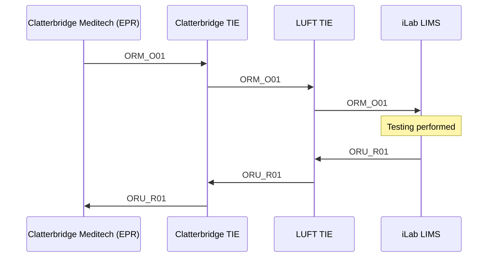
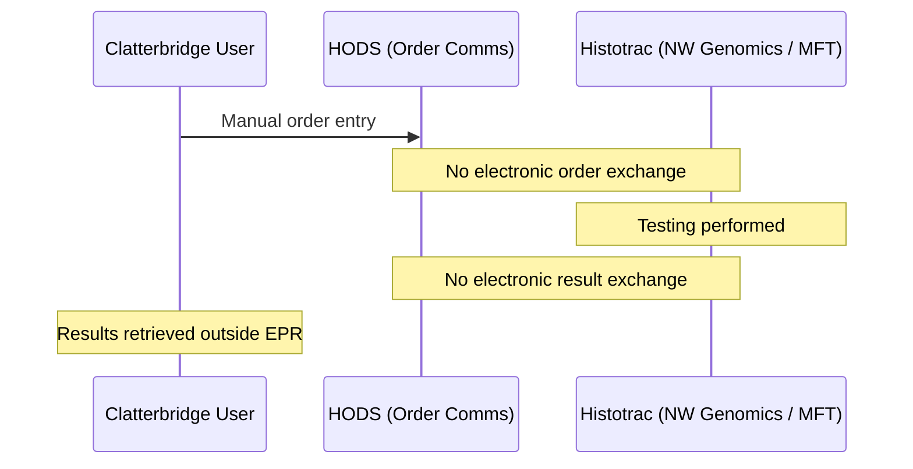
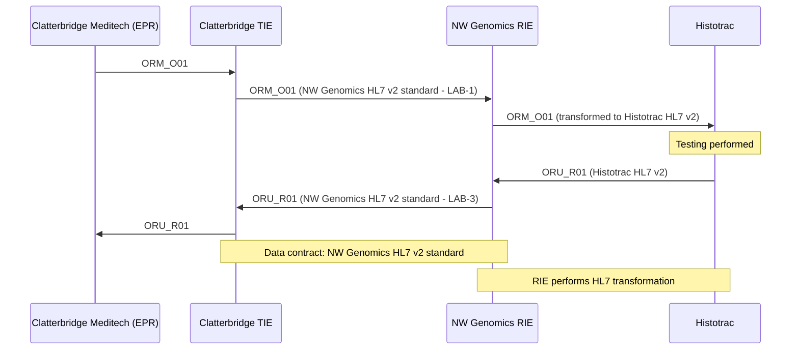
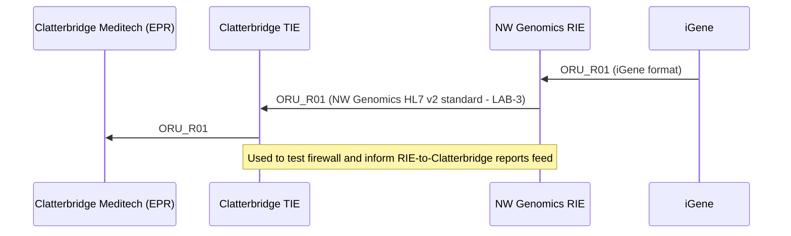

# Clatterbridge Chimerism Testing — Process Overview

## Original Process

Chimerism testing at Clatterbridge originally worked as follows:

1. Clatterbridge (Meditech EPR) sent an ORM_O01 message to the Clatterbridge TIE, which forwarded it to the LUFT TIE, which in turn forwarded it to the iLab LIMS.
2. Once testing was complete, Clatterbridge (Meditech EPR) received a structured ORU_R01 message back from iLab, routed via the LUFT TIE and then the Clatterbridge TIE.

This closed-loop process corresponds to the IHE Laboratory Testing Workflow.

## Interim Process

Following organisational restructuring, testing was transferred to North West Genomics (hosted by Manchester Foundation Trust). As part of this change, Histotrac replaced iLab as the testing system. The electronic exchange of results was discontinued, and HODS was adopted as an interim order comms system for Clatterbridge users to submit lab orders.

## Future Process

The current project aims to re-establish electronic ordering and reporting. The new message flows are:

- Clatterbridge Meditech → Clatterbridge TIE → NW Genomics Regional Integration Engine (RIE) → Histotrac — still an ORM_O01 message, though no longer classified as LAB-1 due to the involvement of a regional integration engine.
- Histotrac → NW Genomics Regional Integration Engine → Clatterbridge TIE → Clatterbridge Meditech — still an ORU_R01 message, classified as LAB-3.

Communication between the Clatterbridge TIE and the NW RIE will follow the NW Genomics HL7 v2 standard — a data contract shared across NHS Trusts in the North West. NW Genomics will not build Trust-specific transformations; instead, the standard is designed collectively to meet the needs of all participating NHS organisations. 

The data contract (North West Genomics HL7 v2 standard) is based on a union of:

- NHS England HL7 v2 ADT
- DHCW (NHS Wales) HL7 v2 ORU
- NHS Data Model and Dictionary

HL7 v2.5.1 was chosen as the version for the standard, as it uses a model compatible with HL7 FHIR and also aligns with the version used by NHS Wales (DHCW).

> **Note:** The Data Contract only exists between NHS Trusts and NW Genomics — it does not apply to local integrations with EPR or LIMS systems. See also the [Canonical Data Model](https://www.enterpriseintegrationpatterns.com/patterns/messaging/CanonicalDataModel.html) pattern.

The NW Genomics RIE will handle the necessary transformations between the NW HL7 standard and Histotrac's HL7 v2 format.

This separation of responsibilities enables modular delivery. For example, the reporting flow from NW Genomics to Clatterbridge can be implemented and tested independently — which is useful for validating the firewall between NW Genomics (hosted by MFT) and Clatterbridge.

This modularity also allows components to be reused across other projects. For instance, the iGene Genomic Reports feed into the RIE for Clatterbridge has already been built, and — being nearly identical to the Histotrac reports flow — can be used both to test the firewall and to inform development of the NW Genomics RIE-to-Clatterbridge reports feed.

### Outstanding Issues

1. It has not yet been decided, from a business process perspective, whether HODS will be replaced as the order comms system. It is desired that orders originating from Meditech are reinstated.
2. The proposed payload is unstructured. The original payload contained structured data

| Data Item            | Data Type    | Code  | Example                                               |
|----------------------|--------------|-------|-------------------------------------------------------|
| Test Method          | NTE/string   | -     | Chimerism analysis by STR technique.                  |
| Device               | NTE/string   | -     | Test performed using Promega GenePrint 24 kit.        |
| Average % chimerism  | OBX/quantity | STR   | 100%                                                  | 
| Informative Markers  | OBX/string   | IM    | D13S317 PENTA E CSF1PO PENTA D D21S11 D8S1179 D12S391 |
| Range                | OBX/string   | RANGE | NA                                                    |
| CV                   | OBX/string   | CV    | NA                                                    |
| Extraction Method    | OBX/string   | EXT   | DNA extracted from peripheral blood leukocyte         |
| % Purity             | OBX/quantity | PURE  | 87%                                                   |
| Time post transplant | OBX/string   | POST  | 2YR 7 MONTHS                                          |
| Date of transplant   | OBX/string   | DTP   | 2024-01-10                                            |
| Donor ID             | OBX/string   | DID   | 6939 DKM0 0096 2141 100                               |

3. The full narrative report will be in PDF format (this was not present in the original process), the provisional UK SNOMED CT of `909871000000100 Histocompatibility and immunogenetics` will be used (this is from NHS Scotland standards).	