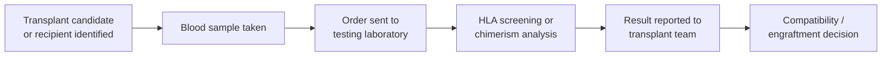
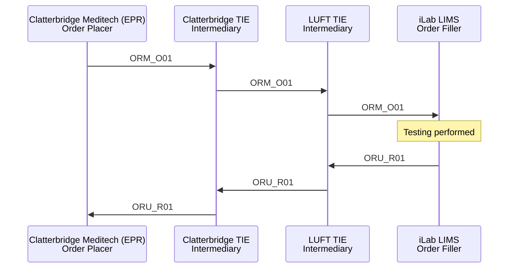
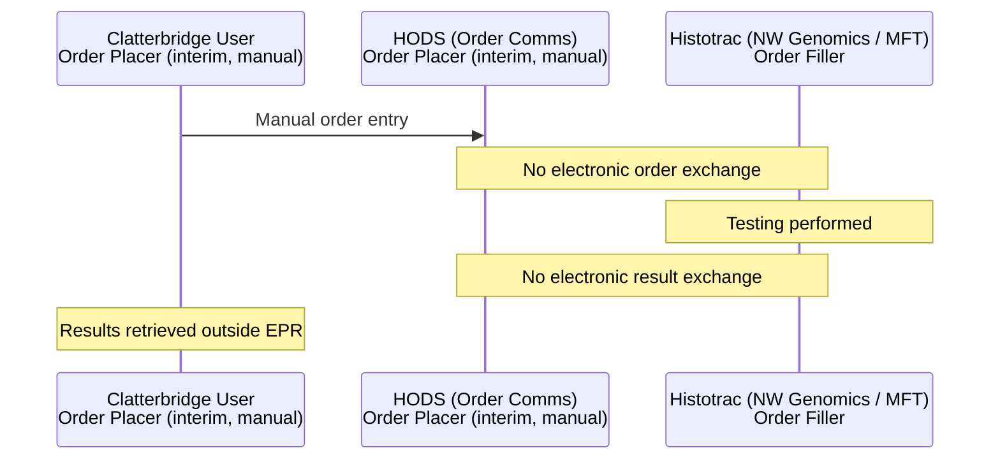
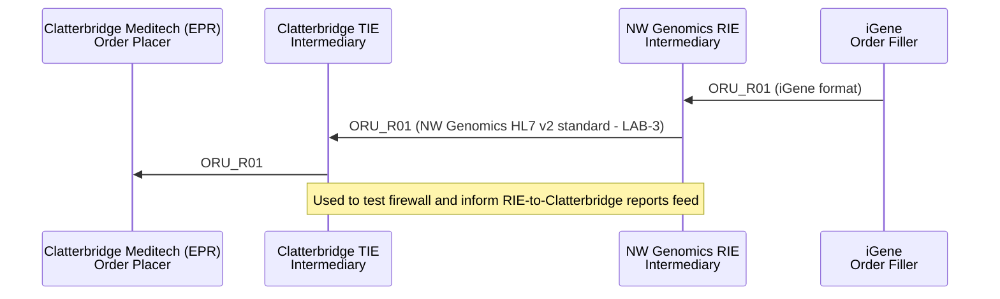

<div class="alert alert-danger" role="alert">
This is currently being elaborated and subject to change.
</div>

Clatterbridge Chimerism Testing - process overview.

## References

1. [HL7 FHIR Genomics Reporting - Histocompatibility and Immunogenetic Reporting](http://hl7.org/fhir/uv/genomics-reporting/histocompatibility.html) (a dependency of this IG)
2. [ServiceRequest - Order Entry Questions](ServiceRequest.html#order-entry-questions)
3. [HL7 v2 OML_O21](hl7v2.html#oml_o21-laboratory-order)
4. Original Histotrac `ORM^O01` order (HLA Antibody Screening) - [histotrac-MFT.txt](https://github.com/nw-gmsa/Testing/blob/main/Input/V2/O01/histotrac-MFT.txt)

## Clinical Pathway Overview

### What is being tested

| Test | Clinical purpose |
|---|---|
| HLA Antibody Screening | Checks a transplant candidate's or recipient's blood for antibodies against donor HLA types, to assess compatibility and rejection risk before or after a solid organ transplant (e.g. kidney) |
| Chimerism (STR) testing | After a stem cell/bone marrow transplant, tracks the proportion of donor vs recipient DNA in the patient's blood over time, to monitor how well the donor cells have engrafted |
{:.grid}

### The end-to-end clinical journey

1. **Patient identified** - the transplant team, or a renal/haematology clinician, identifies a transplant candidate needing HLA compatibility screening, or a post-transplant patient needing chimerism monitoring.
2. **Sample taken** - a blood sample is collected.
3. **Order sent** - the referring clinician's EPR sends the order to the testing laboratory. *(This is the Order Placer → Order Filler step in the technical process below.)*
4. **Testing performed** - HLA antibody screening or STR-based chimerism analysis is carried out.
5. **Result reported** - the report reaches the referring clinician/transplant team.
6. **Clinical decision** - the transplant team uses the HLA result to assess compatibility/rejection risk before transplant, or uses the chimerism trend to decide whether to adjust immunosuppression or investigate possible graft failure/relapse.



### Why this matters for developers

- HLA screening data (HLA Type, Patient type, Organ, Specimen source) currently arrives as free-text `NTE` segments on the order - see [Ask At Order Entry Questions](#ask-at-order-entry-questions) for how these map onto structured Ask At Order Entry answers.
- Chimerism results are currently unstructured local `OBX`/`NTE` codes (`STR`/`IM`/`RANGE`/`CV`/`EXT`/`PURE`/`POST`/`DTP`/`DID`) - see [Chimerism Testing Result Panel (Future?)](#chimerism-testing-result-panel-future) for the proposed structured data model.
- The interim manual order-entry step via HODS is a temporary workaround while electronic ordering/reporting is re-established - not the target state.

## Actors

| IHE Actor                                                | Role                                    | System                                    |
|-------------------------------------------------------------|----------------------------------------|-----------------------------------------------|
| [Order Placer](ActorDefinition-OrderPlacer.html)               | Referring clinician / EPR              | Clatterbridge Meditech (EPR)                   |
| [Intermediary](ActorDefinition-Intermediary.html)             | Message routing                        | Clatterbridge TIE, LUFT TIE (historical), NW Genomics Regional Integration Engine (RIE) (future) |
| [Order Filler](ActorDefinition-OrderFiller.html)                | Testing laboratory                     | Histotrac (NW Genomics / MFT) - previously iLab LIMS |
| [Order Placer](ActorDefinition-OrderPlacer.html) (interim, manual only) | Manual order entry                     | HODS                                           |
{:.grid}

## Transactions

| Transaction                    | Description               | Direction                                                    |
|-----------------------------------|-------------------------------|--------------------------------------------------------------|
| `ORM_O01` (historical)             | Laboratory order               | Clatterbridge Meditech → Clatterbridge TIE → LUFT TIE → iLab LIMS |
| `ORU_R01` (historical)             | Laboratory report               | iLab LIMS → LUFT TIE → Clatterbridge TIE → Clatterbridge Meditech |
| Manual order entry (interim, no electronic transaction) | Order comms | Clatterbridge User → HODS → Histotrac |
| `ORM_O01` / `LAB-1` (future)       | Laboratory order               | Clatterbridge Meditech → Clatterbridge TIE → RIE → Histotrac  |
| `ORU_R01` / `LAB-3` (future)       | Laboratory report               | Histotrac → RIE → Clatterbridge TIE → Clatterbridge Meditech  |
{:.grid}

## Current Process

### Historical Background (Original Process, now retired)

Chimerism testing at Clatterbridge originally worked as follows:

1. Clatterbridge (Meditech EPR) sent an ORM_O01 message to the Clatterbridge TIE, which forwarded it to the LUFT TIE, which in turn forwarded it to the iLab LIMS.
2. Once testing was complete, Clatterbridge (Meditech EPR) received a structured ORU_R01 message back from iLab, routed via the LUFT TIE and then the Clatterbridge TIE.

This closed-loop process corresponds to the IHE Laboratory Testing Workflow.



### Current State (Interim Process)

Following organisational restructuring, testing was transferred to North West Genomics (hosted by Manchester Foundation Trust). As part of this change, Histotrac replaced iLab as the testing system. The electronic exchange of results was discontinued, and HODS was adopted as an interim order comms system for Clatterbridge users to submit lab orders.



## Future Process

The current project aims to re-establish electronic ordering and reporting. The new message flows are:

- Clatterbridge Meditech → Clatterbridge TIE → NW Genomics Regional Integration Engine (RIE) → Histotrac — still an ORM_O01 message, though no longer classified as LAB-1 due to the involvement of a regional integration engine.
- Histotrac → NW Genomics Regional Integration Engine → Clatterbridge TIE → Clatterbridge Meditech — still an ORU_R01 message, classified as LAB-3. See [Regional Integration Engine (RIE) - Report Process](overview.html#report-process) for how the RIE validates, enriches and routes this report before it reaches Clatterbridge.

Communication between the Clatterbridge TIE and the NW RIE will follow the NW Genomics HL7 v2 standard — a data contract shared across NHS Trusts in the North West. NW Genomics will not build Trust-specific transformations; instead, the standard is designed collectively to meet the needs of all participating NHS organisations. 

The data contract (North West Genomics HL7 v2 standard) is based on a union of:

- NHS England HL7 v2 ADT
- DHCW (NHS Wales) HL7 v2 ORU
- NHS Data Model and Dictionary

HL7 v2.5.1 was chosen as the version for the standard, as it uses a model compatible with HL7 FHIR and also aligns with the version used by NHS Wales (DHCW).

> **Note:** The Data Contract only exists between NHS Trusts and NW Genomics — it does not apply to local integrations with EPR or LIMS systems. See also the [Canonical Data Model](https://www.enterpriseintegrationpatterns.com/patterns/messaging/CanonicalDataModel.html) pattern.

The NW Genomics RIE will handle the necessary transformations between the NW HL7 standard and Histotrac's HL7 v2 format.


This separation of responsibilities enables modular delivery. For example, the reporting flow from NW Genomics to Clatterbridge can be implemented and tested independently — which is useful for validating the firewall between NW Genomics (hosted by MFT) and Clatterbridge.

This modularity also allows components to be reused across other projects. For instance, the iGene Genomic Reports feed into the RIE for Clatterbridge has already been built, and — being nearly identical to the Histotrac reports flow — can be used both to test the firewall and to inform development of the NW Genomics RIE-to-Clatterbridge reports feed. Genomic Reports from iGene to Clatterbridge follow exactly the same [Report Process](overview.html#report-process) as the Histotrac reports flow above - only the originating LIMS differs.



### Outstanding Issues

1. It has not yet been decided, from a business process perspective, whether HODS will be replaced as the order comms system. It is desired that orders originating from Meditech are reinstated.
2. The full narrative report will be in PDF format (this was not present in the original process), the provisional UK SNOMED CT of `909871000000100 Histocompatibility and immunogenetics` will be used (this is from NHS Scotland standards).	
3. NW Genomics would prefer the order to use `OML_O21` rather than `ORM_O01`, to future-proof the exchange - specifically so it can carry an `SPM` (Specimen) segment. See [Specimen - Domain Archetype](StructureDefinition-Specimen.html#domain-archetype) for the specimen fields this would carry; the main fields needed here are Specimen ID and Specimen Type.

## Data Models

### Ask At Order Entry Questions

<div class="alert alert-info" role="alert">
<b>FHIR Questionnaire:</b> <a href="Questionnaire-HistocompatibilityAskAtOrderEntry.html">Histocompatibility and Immunogenetics Ask At Order Entry</a>
</div>

Histocompatibility and Immunogenetics orders use the same [common core order
form](ServiceRequest.html) as every other order/test type
([HL7 v2 OML_O21](hl7v2.html#oml_o21-laboratory-order) /
[FHIR Message O21](MessageDefinition-laboratory-order.html)), with their own
**Ask At Order Entry Questionnaire** for the questions specific to this test type - see
[Order Entry Questions](ServiceRequest.html#order-entry-questions).

These questions were extracted from a live Histotrac `ORM^O01` order for an HLA
Antibody Screening (Transplant) test: five `NTE` segments, each carrying comment type
`OSQ` and a local `Label:->Value` convention in `NTE-3`:

```
NTE|1||Patient Test(s):->HLA ANTIBODY SCREENING (TRANSPLANT)|OSQ
NTE|2||HLA Type:->Patient|OSQ
NTE|3||Patient type:->Renal|OSQ
NTE|4||Organ:->Kidney|OSQ
NTE|5||Specimen source->Blood|OSQ
```

#### Field mapping: NTE → FHIR

| NTE Label         | Example Value                        | FHIR Field                                                             |
|--------------------|----------------------------------------|--------------------------------------------------------------------------|
| Patient Test(s)    | HLA ANTIBODY SCREENING (TRANSPLANT)   | ServiceRequest.code (restates OBR-4, not a new mapping)                  |
| HLA Type           | Patient                                | Observation.valueCodeableConcept (via ServiceRequest.supportingInfo)     |
| Patient type       | Renal                                  | Observation.valueCodeableConcept (via ServiceRequest.supportingInfo)     |
| Organ              | Kidney                                 | Observation.valueCodeableConcept (via ServiceRequest.supportingInfo, low confidence - no confirmed SNOMED CT mapping yet) |
| Specimen source    | Blood                                  | Specimen.type (SNOMED CT coding)                                        |
{:.grid}

### Chimerism Testing Result Panel (Future?)

<div class="alert alert-info" role="alert">
<b>FHIR Questionnaire (Result Panel):</b> <a href="Questionnaire-ChimerismResultPanel.html">Chimerism Testing Result Panel</a>
</div>

The proposed payload is unstructured. The original payload contained structured data.
See [HL7 FHIR Genomics Reporting - Histocompatibility and Immunogenetic
Reporting](http://hl7.org/fhir/uv/genomics-reporting/histocompatibility.html) (a
dependency of this IG) for the international FHIR pattern this could structure onto -
a `DiagnosticReport` (Genomic Report) referencing per-gene `Genotype Observation`s,
each of which can reference `Haplotype Observation`s and the `MolecularSequence`
evidence behind them. That page profiles HLA allele genotyping specifically, though,
not STR-based chimerism analysis - most rows below have no direct fit and are noted
as such rather than forced onto it.

| Data Item            | Data Type    | Code  | Example                                               | FHIR Genomic Report Field |
|----------------------|--------------|-------|--------------------------------------------------------|----------------------------|
| Test Method          | NTE/string   | -     | Chimerism analysis by STR technique.                  | `DiagnosticReport.method` - not profiled by the Histocompatibility Reporting page (candidate only) |
| Device               | NTE/string   | -     | Test performed using Promega GenePrint 24 kit.        | `Device` referenced from `DiagnosticReport`/`Observation` - not profiled by the Histocompatibility Reporting page |
| Average % chimerism  | OBX/quantity | STR   | 100%                                                  | `Observation.valueQuantity` referenced from `DiagnosticReport.result` - the same result-referencing shape as `Genotype Observation`, generalised to a percentage rather than an assigned allele (low confidence - that profile is defined for allele assignments, not chimerism %) |
| Informative Markers  | OBX/string   | IM    | D13S317 PENTA E CSF1PO PENTA D D21S11 D8S1179 D12S391 | `MolecularSequence` (the STR loci examined) - the same role as the sequence evidence a `Haplotype Observation` references, but for STR loci rather than HLA alleles |
| Range                | OBX/string   | RANGE | NA                                                    | `Observation.referenceRange` |
| CV                   | OBX/string   | CV    | NA                                                    | `Observation.component` (QC metric) - not profiled by the Histocompatibility Reporting page |
| Extraction Method    | OBX/string   | EXT   | DNA extracted from peripheral blood leukocyte         | `Specimen.collection.method` - the same field dWGS's `dna_extraction_protocol` uses, see [dWGS field mapping](dWGS.html#field-mapping-csv--hl7-v2--fhir) |
| % Purity             | OBX/quantity | PURE  | 87%                                                   | Specimen quality `Observation` - not profiled by the Histocompatibility Reporting page |
| Time post transplant | OBX/string   | POST  | 2YR 7 MONTHS                                          | `Observation` referenced from `ServiceRequest.supportingInfo` - the Ask At Order Entry pattern used elsewhere in this IG (dWGS's Family Structure/Participant Type, this page's [Ask At Order Entry Questions](#ask-at-order-entry-questions)) |
| Date of transplant   | OBX/string   | DTP   | 2024-01-10                                            | `Procedure.performedDateTime` (the transplant event) - outside the Histocompatibility Reporting page's scope, which starts from the genotyping result, not the clinical transplant history |
| Donor ID             | OBX/string   | DID   | 6939 DKM0 0096 2141 100                               | `Specimen.identifier` / donor `Patient` reference - the same identifier-on-Specimen pattern dWGS uses for its `PLAC`/`FILL` identifiers |
{:.grid}

## Examples

| Source                                                                                                                       | Example                                                                                                            |
|--------------------------------------------------------------------------------------------------------------------------------|------------------------------------------------------------------------------------------------------------------------|
| HL7 v2 `ORM^O01` (original)                                                                                                     | [histotrac-MFT.txt](https://github.com/nw-gmsa/Testing/blob/main/Input/V2/O01/histotrac-MFT.txt)                       |
| FHIR `QuestionnaireResponse` answering [Histocompatibility and Immunogenetics Ask At Order Entry](Questionnaire-HistocompatibilityAskAtOrderEntry.html) | [QuestionnaireResponse-HistocompatibilityAskAtOrderEntry-HLAAS](QuestionnaireResponse-HistocompatibilityAskAtOrderEntry-HLAAS.html) |
| FHIR `Questionnaire` (Result Panel) - [Chimerism Testing Result Panel](Questionnaire-ChimerismResultPanel.html) | See [Chimerism Testing Result Panel (Future?)](#chimerism-testing-result-panel-future) above for the source data table |
{:.grid}

## Developer Guides

- [10 - Histocompatibility and Immunogenetics: HL7 v2 to and from the NW Standard](https://github.com/nw-gmsa/Testing/blob/main/notebooks/10-histocompatibility-immunogenetics-hl7v2-nw-standard.ipynb) - hand-builds the field-level conversion a Trust Integration Engine (TIE) does to turn Clatterbridge's Meditech-originated order into the shared [NW HL7 v2 standard](hl7v2.html)

See [Developer Guides](DeveloperGuides.html) for the full notebook series.
