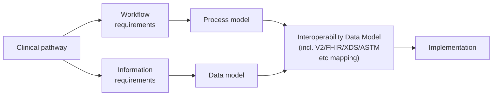
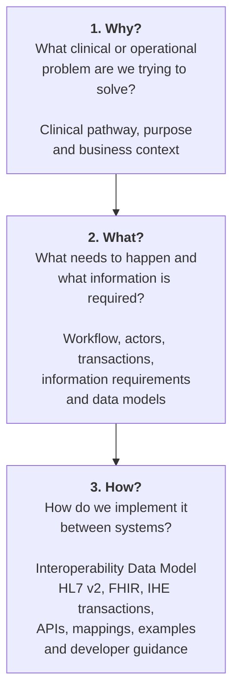
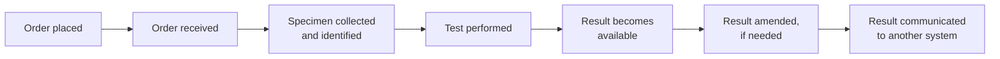
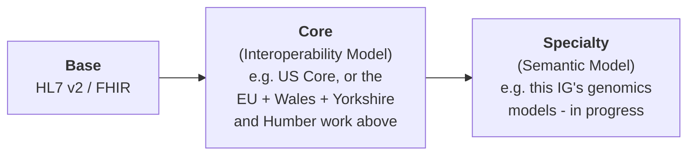
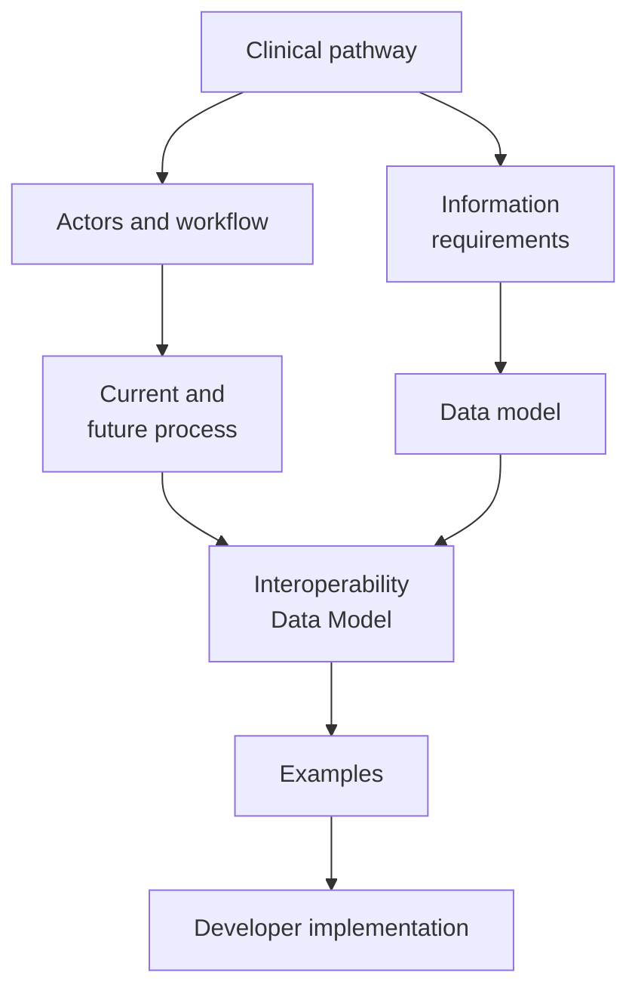
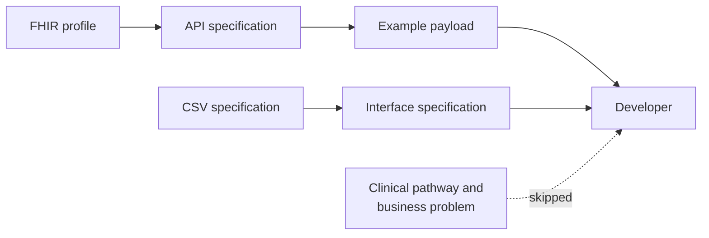

# How To Engineer (scale and deliver) Interoperability

<b>This Implementation Guide is, in several areas, a core standard for the English NHS</b> - the same role played by <a href="https://www.hl7.org/fhir/us/core/" target="_blank">US Core</a> in the US, or <a href="https://build.fhir.org/ig/hl7au/au-fhir-core/" target="_blank">AU Core</a> in Australia. Where that's the case, the Use Case format below isn't just project documentation for one local integration - it's how the underlying shared standard itself gets engineered, agreed and scaled across the region, not just delivered for a single project.

None of this is new. The Use Case format and the layered Base → Core →
Specialty pattern described below largely restate long-established
principles from **Domain Driven Design**, **Data Mesh**, **Data Contracts**,
**IHE methodology** and **Enterprise Integration Patterns** - this IG doesn't
invent a new approach, it applies established ones to NHS genomics
interoperability. Basic software delivery approaches such as **waterfall**
are still evident too: within a single Use Case, the Clinical Pathway →
Workflow/Information requirements → Data model → Interoperability Data Model
→ Implementation progression shown below is itself a phased, broadly
sequential structure, even though the two branches within it run
concurrently and inform each other rather than being agreed once and never
revisited.

The Use Case format used in this project is deliberately structured so that different sections support different stages of the project — and, importantly, different people involved in the project.

It is **not intended to be a technical specification written solely for developers**.

Instead, it provides a progression from the clinical and business problem through to the technical implementation:

`Workflow requirements → Process model` and `Information requirements → Data
model` run **concurrently**, both stemming from the Clinical Pathway - they
aren't a strict sequence, and in practice inform each other as they're
developed. Both then feed into the **`Interoperability Data Model`** - the
HL7 v2 Message Definition, XDS Document Entry, FHIR Profile or ASTM mapping
that the agreed data model gets mapped onto, normally produced by a Senior
Integration Specialist/Software Engineer - see [Documenting the Data
Model](#documenting-the-data-model) below for why that technical model is
related to, but not the same as, the data model that feeds it.

This split matters because the two branches tend to draw on different
existing bodies of work. **Workflow requirements** generally align with
existing designs already published by **IHE and HL7 v2** - actors,
transactions and message interactions that IHE profiles and HL7 v2 have
already standardised for exactly this kind of problem. **Information
requirements**, on the other hand, tend to align more with **openEHR and FHIR
profiles**, the tools clinical informatics uses to model the content of a
clinical record independently of how it's exchanged. Because these two
branches often come from different disciplines and different prior art, the
**rejoin at the `Interoperability Data Model`** - where the workflow side and the
information side have to be reconciled into one technical/interoperability
data model - is the step most likely to surface a genuine disagreement
between them, and is worth paying deliberate attention to rather than
assuming it will resolve itself.

This allows people from different disciplines to work on the same problem while concentrating on the parts that are relevant to their role.

A note on the name: these pages are called **Use Cases**, and they do start out
that way - a single clinical/business scenario, described end-to-end. In
practice, as delivery progresses, a Use Case page tends to evolve into **the
single-page description of that whole project** - accumulating Outstanding
Issues, Future Process updates, further examples and Developer Guide links as
the work continues. Don't expect a Use Case page to be a static, one-off
document; expect it to keep growing alongside the project it describes.

## The Clinical Pathway Overview

The starting point is the **Clinical Pathway Overview**.

This explains what is happening in the real world: what is being tested, who is involved, what the clinical journey looks like and where the proposed integration fits into that journey.

This provides a common starting point for everyone.

For **clinicians and clinical managers**, it provides enough context to understand what the technical work is trying to achieve without requiring them to understand HL7, FHIR or integration engines.

For **business analysts and clinical informatics**, it provides the context from which the processes, actors and information requirements can be identified.

For **technical staff and developers**, it provides something equally important: the context behind the technical solution.

It explains **why** a particular message, transaction or piece of data exists rather than simply telling them **how** to implement it.

This is important because the Clinical Pathway Overview is often not given to developers — they may instead simply be given the technical instructions.

For example, a developer might receive:

> Send the laboratory report to this endpoint using FHIR.

That may be enough to build an interface, but it doesn't necessarily explain what the report represents, where it came from, what happened to the patient before it was generated, or what the receiving organisation is going to do with it.

The pathway provides that missing context.

## Different sections support different project stages

The sections then progressively move from the real-world use case towards implementation.

### Clinical Pathway Overview
**What is happening clinically and operationally?**

Primarily useful to clinicians, managers, business analysts and clinical informatics, while also providing essential background for technical staff.

### Actors and Transactions
**Who is involved and what interactions take place?**

This starts turning the clinical/business process into a system and workflow model.

It is particularly useful to business analysts, architects and interoperability specialists.

### Current Process
**How does it actually work today?**

This is important because the existing process often contains constraints, workarounds and organisational responsibilities that aren't obvious from a future-state technical design.

### Future Process
**What are we trying to change?**

This provides the bridge between the business requirement and the technical architecture.

It allows the proposed solution to be discussed before jumping into individual messages or APIs.

### Data Models
**What information actually needs to be exchanged?**

This is where the focus moves towards business analysts and clinical informatics.

The model describes the information itself independently of whether it is ultimately implemented using HL7 v2, FHIR, a CSV export or another mechanism.

This separation is important.

**The data model is the thing we are agreeing; HL7 v2 and FHIR are mechanisms for representing or exchanging that model.**

### Documenting the Data Model
**What format should the data model itself be captured in?**

A data model can be captured as a spreadsheet or a Word document, and both
are perfectly usable starting points, particularly for early analysis or
when working with people who aren't going to touch a computer parser. But
neither is *computable* - nothing can validate, generate or test against
them, and they tend to drift out of sync with the actual interfaces as a
project progresses.

Our preference in this IG is a **computable data model**, expressed in one of:

- **FHIR `Questionnaire`** - our most commonly used approach. A
  Questionnaire's items describe each individual data element (name, type,
  cardinality, answer set), independently of whether it's later exchanged as
  HL7 v2, a CSV export or a FHIR resource. See, for example, [Genomic Test
  Order](Questionnaire-GenomicTestOrder.html), the [iGene Laboratory Order
  Export](Questionnaire-iGeneLaboratoryOrderExport.html), and the various
  Ask-At-Order-Entry Questionnaires used across this IG's Use Cases.
- **openEHR archetypes** - a mature, clinically-led modelling approach with
  its own large public library ([openEHR Clinical Knowledge
  Manager](https://ckm.openehr.org/ckm/)). See [Laboratory Analyte
  Result](StructureDefinition-LaboratoryAnalyteResult.html) in this IG, which
  is built directly against the openEHR [Laboratory analyte
  result](https://ckm.openehr.org/ckm/archetypes/1013.1.2881) archetype.
- **LOINC panels** - for laboratory/genomics results specifically, a defined
  LOINC panel (a fixed set of LOINC-coded observations) can itself act as the
  data model for a result, since it already specifies the discrete elements a
  result needs. See the LRI Discrete Variant Panel used in [OMICS DSS Result
  Integration](reportable-variants.html) and the LOINC cytogenetics panel
  table in [Haemato-Oncology Diagnostic
  Pathway](HaematoOncologyPathway.html#future-genomic-data-model-proposed).

**How the data model leads to the technical/wire model.** Once agreed, in
whichever of these forms, the data model still has to be mapped onto whatever
technical mechanism actually carries it between systems - an HL7 v2 Message
Definition (segments/fields), an XDS Document Entry (document metadata
attributes), a FHIR Profile (a `StructureDefinition`), or an ASTM mapping.
That mapping is what the "Interoperability Data Model" section below is for.

These are **related, but they are not the same thing**, and treating them as
interchangeable causes real problems: a FHIR Profile constrains a specific
FHIR resource for a specific exchange, an HL7 v2 Message Definition constrains
a specific v2 message, and an XDS Document Entry constrains a specific set of
document metadata - none of them is a substitute for agreeing the underlying
data model first. Building the technical profile directly, without an
independent data model behind it, is exactly the trap explored later in
[Examples of Common Interoperability Project
Problems](#examples-of-common-interoperability-project-problems).

### Interoperability Data Model
**How does the agreed model become something developers can implement?**

This is the **technical/interoperability data model** - the HL7 v2 Message
Definition, FHIR Profile, XDS Document Entry, ASTM mapping (or other
technical mechanism) that the agreed data model gets mapped onto. It's
normally produced by a **Senior Integration Specialist/Software Engineer**,
since it requires both the standards knowledge to map onto HL7 v2/FHIR/XDS/
ASTM correctly and a working understanding of the agreed data model it's
built from.

The mappings therefore refer back to the data model rather than becoming the primary definition of the information.

This gives developers something much more useful than a collection of FHIR profiles or message specifications: they can see where each technical field comes from and what it means.

### Examples and Developer Guides
**How do I actually build and test this?**

Only at this point are we primarily talking to developers.

The examples, mappings, message structures, APIs and implementation guidance can therefore be treated as the final implementation layer rather than the starting point.

### Security Considerations
**What does this Use Case need from authentication, authorisation, audit and consent?**

Where a Use Case has security guidance beyond the IG-wide baseline - for
example a transaction that needs a particular OAuth2 scope, an audit event
type, or a consent check - it should be called out in its own **Security
Considerations** section, placed after `Examples` and before `Developer
Guides`, rather than left implicit in the transaction descriptions.

That section should **link to the [API Security](api-security.html) page**
for the underlying mechanism (encryption, authorisation, audit logging,
patient consent) rather than restating it, and only describe what is
specific to this Use Case. See [Laboratory Testing Workflow
(LTW)](LTW.html#security-considerations) for an example of this pattern.

If a Use Case has no security requirements beyond the IG-wide baseline
already documented on the API Security page, this section can be omitted.

## The General Structure of a Use Case Page

Most Use Case pages in this IG follow the same section order, so once you know
this structure you can find the part relevant to you in any of them without
reading the whole page. `References`, `Data Models` and `Examples` are
consistently named across pages; `Actors`/`Transactions` and
`Current Process`/`Future Process` are sometimes combined into a single
section where a use case is too small to need the split.

| Section | Question it answers | Primary audience |
|---|---|---|
| References | Where did this come from - which standards, specifications or source data is it built on? | Everyone |
| Clinical Pathway Overview | What is happening clinically and operationally, and why does this integration exist? | Clinicians, clinical managers, business analysts, clinical informatics |
| Actors | Who is involved, in IHE actor terms (Order Placer, Order Filler, etc.)? | Business analysts, architects, interoperability specialists |
| Transactions | What interactions/messages take place between those actors? | Business analysts, architects, interoperability specialists |
| Current Process | How does it actually work today, including any manual steps or workarounds? | Business analysts, architects, clinical informatics |
| Future Process | What is changing, or proposed to change? | Business analysts, architects, clinical informatics |
| Data Models | What information needs to be exchanged, described independently of HL7 v2/FHIR? | Clinical informatics, business analysts |
| Examples | Worked, real (or realistic) instances of the data model | Developers, interoperability specialists |
| Security Considerations | What does this Use Case need from authentication, authorisation, audit and consent, beyond the IG-wide baseline? (optional - see [API Security](api-security.html)) | Architects, interoperability specialists, developers |
| Developer Guides | Step-by-step, hands-on implementation guidance (notebooks, worked builds) | Developers |
{:.grid}

## Check for Existing Patterns Before Modelling New Ones

Workflow and information requirements in a new Use Case very often turn out
to already be documented - the actors, transactions and identifiers a new
clinical pathway needs are frequently the same ones another Use Case has
already established.

Before writing new Actors/Transactions or a new Data Model for a Use Case,
check whether it already exists in:

- **Analysis and Design (Volume 1)** - generic workflow patterns already
  documented for this region, e.g. [Laboratory Testing Workflow
  (LTW)](LTW.html), [Inter Laboratory Workflow
  (ILW)](ILW.html) sub-orders, [Specimen Transportation and
  Management](SpecimenTransportationAndManagement.html), [Genetic
  Referrals](GeneticReferrals.html).
- **Data Models (Volume 3)** - identifiers, resources and profiles already
  defined, e.g. [Diagnostic Core](diagnostic-core.html), [Genomic Test
  Order](Questionnaire-GenomicTestOrder.html), [Genomic Test Report
  (DiagnosticReport)](StructureDefinition-DiagnosticReport.html), [Laboratory
  Analyte Result](StructureDefinition-LaboratoryAnalyteResult.html).

This checking step matters for more than tidiness:

- **It encourages reuse**, rather than each Use Case inventing its own
  version of the same identifier or interaction.
- **It improves delivery time** - a workflow or data model that's already
  documented doesn't need to be re-analysed from scratch.
- **Most critically, it supports clinical pathways consistently** - patients,
  orders and reports that flow through more than one pathway are recognised
  the same way in each, rather than each pathway building its own
  incompatible view of the same information.

---

# The Use Case as a common language

The same Use Case can therefore be read differently by different people.

| Project role | Primary interest |
|---|---|
| Clinician | Clinical pathway and purpose |
| Clinical manager | Clinical pathway, current/future process |
| Business Analyst | Actors, processes and data model |
| Clinical Informatics | Clinical meaning and data model |
| Solution Architect | Process, transactions, models and architecture |
| Interoperability Developer | Transactions, interoperability data model and examples |
| Software Developer | FHIR/v2 structures, APIs, examples and developer guides |
| Data Engineer | Data models, interoperability data model and implementation examples |

The important point is that **these aren't separate documents describing different solutions**.

They are different views of the **same use case**, progressively moving from *why* to *what* to *how*.

That also means that changes can be traced through the layers.

If the clinical workflow changes, the process model can change.

That may change the information requirements.

That may change the data model.

The interoperability data model (HL7 v2, FHIR, XDS or ASTM mappings) can then be updated to reflect the agreed model.

The developer implementation follows from those decisions.

This is very different from starting with a FHIR profile or spreadsheet and trying to work backwards to discover what the clinical workflow must have been.

---

# In effect: Why → What → How

The Use Case format is therefore trying to maintain a clear separation between three questions:

This separation allows each discipline to contribute its expertise without making one discipline's model the definition of the entire problem.

**The clinical pathway defines the problem.**

**The workflow defines what needs to happen.**

**The data model defines what information is needed.**

**The interoperability data model defines how that information is exchanged.**

**The developer guide defines how to implement it.**

The aim is therefore not to produce more documentation.

It is to make sure that when a developer is eventually given the technical instructions, they understand **what those instructions are actually implementing**.

Otherwise, we risk building a very good technical solution to the wrong problem.

---

# Examples of Common Interoperability Project Problems

The sections below work through what tends to go wrong when a project skips
straight to the technical layer without the Clinical Pathway, workflow and
data model steps above.

## Another example: starting with technical instructions

There is another common variation of the same problem.

A developer may simply be given a data model to exchange.

It might be documented as a **spreadsheet, CSV or archetype**, with an instruction such as:

> Here is the data model. Exchange these fields using FHIR.

Again, this sounds perfectly reasonable — but it can miss an important part of the problem.

The data model being provided may describe the information that exists within an EPR, but not **how clinicians are actually using that information within a workflow**.

For example, a clinician does not normally think:

> I am going to create a MedicationRequest containing these 17 data elements.

They think:

> I need to request this prescription.

Similarly, a laboratory doesn't think:

> I am going to produce a DiagnosticReport containing these fields.

It thinks:

> We have received an order, performed the test and now need to report the result.

The workflow creates the context in which the data is meaningful.

If developers are given only the data model, the implementation can therefore become a technically correct exchange of data which doesn't properly represent the clinical workflow.

The missing pieces are often the **data relationships, identifiers, state changes, actors and events** that occur along the pathway.

### EPR data modelling versus workflow interoperability

This is particularly complicated because **clinical informatics and interoperability can approach modelling from different directions**.

Clinical informatics often quite reasonably concentrates on the data structures within the EPR — what information needs to be recorded and how it is represented in the clinical system.

Interoperability, however, often needs to model the **interaction between systems and organisations**:

These are related, but they are **not the same modelling problem**.

One way of thinking about this is the difference between **EPR-oriented modelling and workflow interoperability**.

For example, **openEHR** is primarily concerned with modelling the clinical information held within an EPR.

In contrast, technologies and standards such as **HL7, ASTM and IHE** have historically placed much more emphasis on the exchange of information and the workflows between systems.

This doesn't mean one approach is better than the other.

They are solving different problems.

The danger comes when an **EPR data model is assumed to be sufficient to define an interoperability workflow**.

A model can accurately describe a prescription, laboratory result or clinical observation while still failing to describe the process by which that information is requested, created, updated and exchanged.

That process is often what the interoperability project actually needs to solve.

### Four common data modelling failure patterns

In practice, most NHS interoperability projects that struggle with their data
model fall into one of four patterns, depending on which discipline is
driving the work and whether the workflow side and the semantic side ever
actually get reconciled into a single [Interoperability Data
Model](#interoperability-data-model).

**Semantic-only modelling** tends to occur when a project focuses on clinical
informatics data needs only. The workflow side still carries genuine NHS
interoperability requirements of its own - including the practitioner and
organisational data needed to support the workflow, not just the clinical
content - and those requirements don't go away just because they weren't
modelled. In an ideal world the two are married together via an
Interoperability Data Model, as above. This pattern is quite common on large
NHS programmes, where the clinical data model gets significant investment but
the workflow/transactional side it needs to travel inside doesn't get the
same rigour.

**Workflow-only modelling** tends to occur on local NHS projects, which will
often lean on supplier HL7 standards for the workflow/transactional side. A
semantic model may still be present, but tends to be localised to that one
supplier or site rather than shared - properly modelling and funding a shared
semantic model needs additional funding and resourcing that a local project
may not have. At times it's simply easier to switch to a PDF/document-based
exchange than to invest in that structured semantic model.

Workflow-only modelling is often the **default** outcome of HL7 v2
integrations specifically. The basic data elements needed to turn that into a
shared Interoperability Data Model are usually already present in the
message, but end up modelled slightly differently on each point-to-point
integration - which segment/field a given piece of information lands in, or
which local code system it uses, varies from site to site. This is a large
part of why HL7 v2 is often criticised as "not really a standard" - but, as
this IG tries to demonstrate, it can be, following similar prior work done by
Digital Health and Care Wales. FHIR doesn't automatically solve this either -
in many cases it can make the problem worse, since FHIR's own flexibility
(extensions, profiling, slicing) makes it just as easy for two systems to
represent the same information differently. Where FHIR is used more
consistently - for example, across many US EPR systems - it's usually
because those systems are built against a shared, mandated interoperability
data model such as **US Core**, not because FHIR is inherently more
standardised than HL7 v2.

This IG deliberately doesn't try to solve that problem from scratch. The
Yorkshire and Humber Care Record has already done considerable work
standardising FHIR for that region, and where possible we've followed it and
married it to the Welsh work above. Separately, HL7
Europe has started work on a core FHIR IG, which we've used as the base for
FHIR in this guide. In effect, the HL7 v2/FHIR work in this guide is built by
layering **EU + Wales + Yorkshire and Humber + North West Genomics** work on
top of one another, rather than starting again from the base HL7 v2/FHIR
standards - which is exactly the kind of reuse [Check for Existing Patterns
Before Modelling New
Ones](#check-for-existing-patterns-before-modelling-new-ones) above
recommends doing at a regional/national level too, not only within this IG.

On a practical level, that layering follows a general **Base → Core (Interoperability Model) →
Specialty (Semantic Model)** modelling pattern: a base standard (HL7 v2/FHIR) is constrained
into a national/regional **Core** model (US Core, or the
EU/Wales/Yorkshire and Humber work layered together above), which is then
constrained further into **Specialty models** for a specific clinical
domain - and "specialty" here includes the **semantic** (clinical content)
model, not just the technical/interoperability one. This IG follows that
same Base → Core → Specialty pattern for genomics.

At the time of writing, the semantic models specific to genomics are still
being developed alongside this IG.

**Bypassing semantic and interoperability data modelling entirely** is often
caused by building directly against base models from HL7 v2, FHIR or UK Core
(this doesn't include the common English NHS interoperability data models
this IG is built on, e.g. [Diagnostic Core](diagnostic-core.html)). Base
standards define what's possible to represent, not what a specific NHS
workflow actually needs - building directly against them skips the step
where the workflow and information requirements are agreed and reconciled,
which is exactly the trap explored in [Examples of Common Interoperability
Project Problems](#examples-of-common-interoperability-project-problems)
above.

**Modelling in one standard only** treats HL7 v2, FHIR, XDS and ASTM as
competing choices rather than as technical mechanisms that are expected to
work together. On a practical level, most interoperability standards
already convert between each other - XDS commonly converts to/from HL7 v2 or
FHIR, HL7 v2 commonly converts to/from FHIR, and so on. That conversion also
has to cope with older and newer versions of the same standard, or of
different standards, coexisting in the same live estate - this is normal in
a live implementation, not a defect that needs fixing: if it ain't broke,
don't fix it. So, for example, if a system and an NHS Trust already have a
working HL7 v2 interaction, they're unlikely to move that interaction to
FHIR just to solve the same problem again (moving version within a single
standard is uncommon enough on its own). FHIR tends to earn its place
instead by solving problems in a genuinely new way - such as querying via a
RESTful API - rather than as a like-for-like replacement for an
already-working message-based interaction. FHIR RESTful **read-only query**
approaches, in particular, tend to work quite well precisely because they're
solving that kind of new problem - exposing data for lookup - rather than
re-implementing an existing message-based workflow. The data model behind
HL7 v2 is, in many workflow interactions, quite mature and well understood
by the people running them; a blanket move away from HL7 v2 risks discarding
that understanding along with the messages themselves. This has happened
more than once with message-based interactions - moves to replace a working
HL7 v2 message-based interaction with FHIR RESTful, driven more by ideology
than by a problem FHIR actually solves and HL7 v2 doesn't, have tended to
carry a correspondingly high failure/slow delivery rate.

All four patterns above are, in one way or another, failures to properly
build out - or properly combine - the same underlying layers:

**Semantic-only modelling** effectively jumps straight from Base to
Specialty's semantic content without a shared Core to reconcile it against.
**Workflow-only modelling** stalls at Base or Core and never reaches a
Specialty semantic model at all. **Bypassing modelling entirely** implements
directly against Base (or a generic Core such as UK Core), without building
out a Specialty model for the workflow actually being solved. **Modelling in
one standard only** sits across all three layers - it discards a working
Base/Core/Specialty stack built in one standard (typically HL7 v2) in favour
of rebuilding the same stack in another (typically FHIR), rather than
converting between the two where they're already expected to interoperate.

## Why the Clinical Pathway matters to developers

This is why the Clinical Pathway Overview should not be treated as optional background reading for technical staff.

It is part of the **technical context**.

Consider two ways of giving a developer the same requirement.

### Technical-only approach

> Create a FHIR `DiagnosticReport`, populate these fields, reference the `Patient` and `Specimen`, and POST it to this endpoint.

The developer can implement this.

But they may not know:

- why the report exists;
- which clinical process generated it;
- whether this is the original report or a copy;
- whether the receiving system is expecting a result, notification or management-information record;
- what identifiers link it back to the order;
- what happens if the result is amended;
- which organisation owns the clinical workflow;
- or what should happen when the expected information isn't available.

### Use Case approach

The developer can instead work down through:

`Actors and workflow → Current and future process` and `Information
requirements → Data model` run **concurrently**, the same as in the first
diagram above - both then feed into the `Interoperability Data Model` layer,
where the IHE/HL7 v2-aligned workflow side and the openEHR/FHIR-profile-aligned
information side have to be reconciled (see the note on the first diagram).

Each layer provides the context needed to understand the next one.

The technical instruction is still there — but it is no longer disconnected from the problem it is trying to solve.

## Why this matters for interoperability

A lot of interoperability documentation effectively starts at the bottom of this chain.

The developer is given:

That can work when the workflow is already well understood.

But when the workflow itself is the thing being designed, it risks producing a technically good solution to an incompletely understood problem.

The Use Case format deliberately works in the opposite direction.

It starts with the **clinical pathway and business problem**, then progressively introduces the technical detail.

This is particularly important in healthcare because interoperability is rarely just about transferring a collection of data elements.

It is usually about supporting a **clinical or operational workflow across organisational and system boundaries**.

A laboratory order isn't just a collection of fields.

A laboratory report isn't just a collection of fields.

A prescription request isn't just a collection of fields.

They are **events and interactions within a workflow**, with actors, responsibilities, identifiers, states and relationships.

The data model needs to represent the information required by that workflow, and the interoperability standard then needs to represent the model in a way that allows the workflow to operate across systems.
