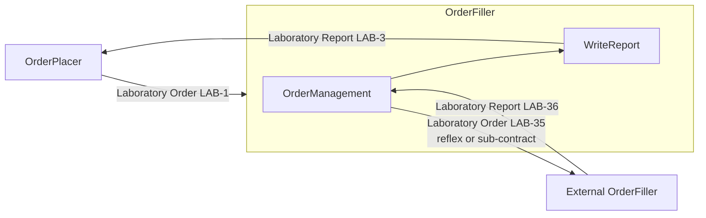
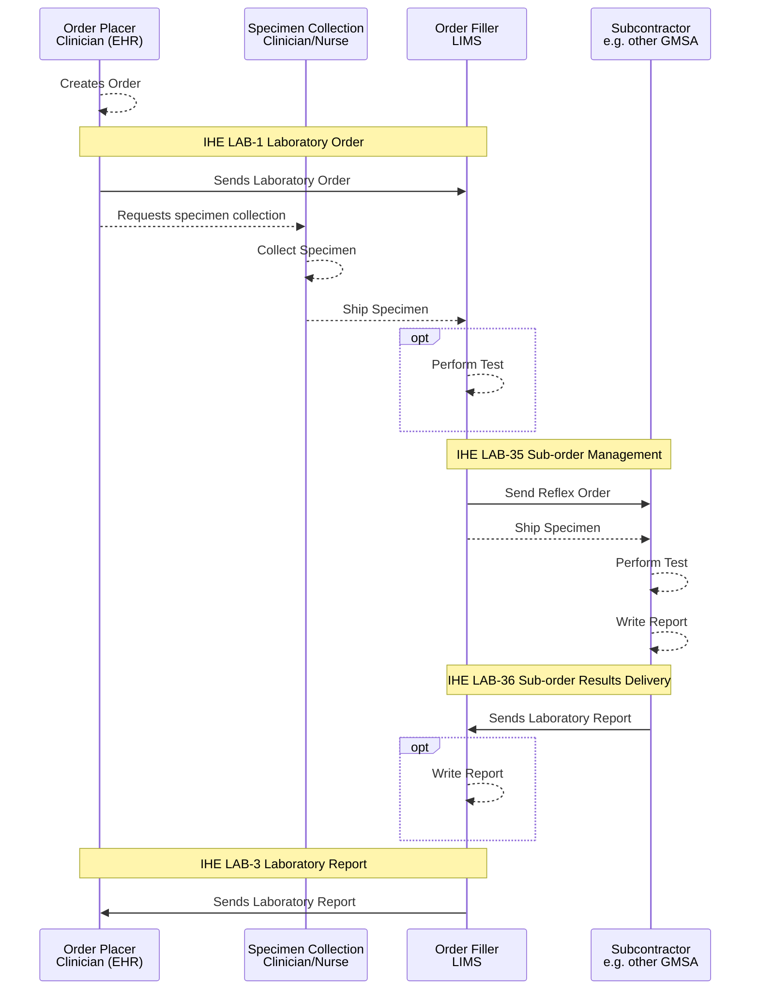
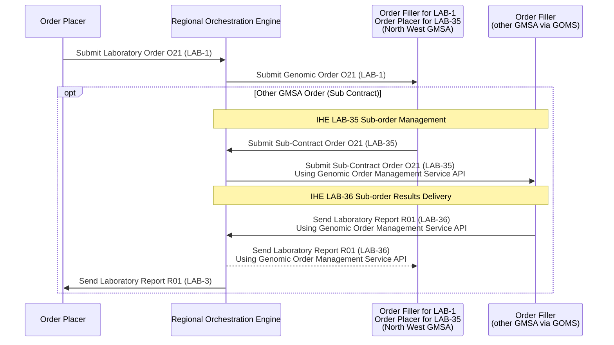
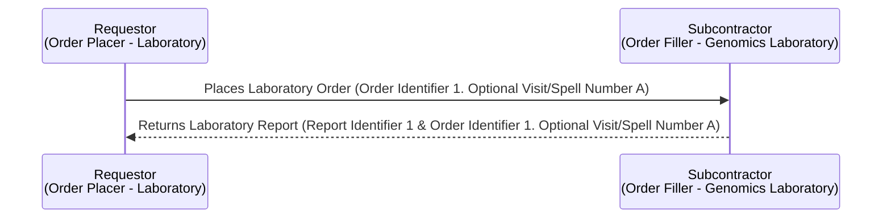
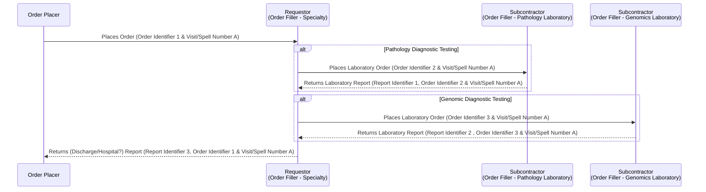
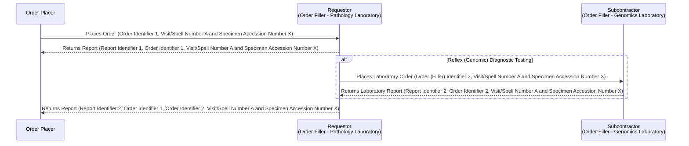
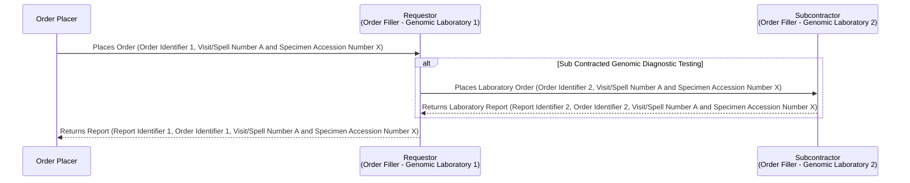

This is currently being elaborated and subject to change.

## References

1. [IHE Inter Laboratory Workflow](https://wiki.ihe.net/index.php/Inter_Laboratory_Workflow)
2. [IHE Laboratory Technical Framework Supplement Inter-Laboratory Workflow (ILW)](https://www.ihe.net/uploadedFiles/Documents/Laboratory/IHE_LAB_Suppl_ILW.pdf)

## Actors and Transactions

| Actor                                               | Definition                                                                                                                                                                                             |
|-----------------------------------------------------|--------------------------------------------------------------------------------------------------------------------------------------------------------------------------------------------------------|
| [Requestor](ActorDefinition-Requestor.html)         | A hospital laboratory that subcontracts a part of an Order or of an Order Group to another laboratory, e.g. Pathology or HODS. Is known in IHE LTW as [Order Placer](ActorDefinition-OrderPlacer.html) |
| [Subcontractor](ActorDefinition-Subcontractor.html) | Receives Sub-orders, acknowledges specimen arrival and sends back results fulfilling these Sub-orders, e.g. Genomics. Is known in IHE LTW as [Order Filler](ActorDefinition-OrderFiller.html)                                                           |
{:.grid}

## Overview

See Ref 1 for details.

 

IHE ILW Summary
 
 

## Sub-orders LAB-35 and LAB-36

### Sub Order Management (LAB-35)

<b>Domain Archetype:</b> <a href="diagnostic-core.html#filler-order" _target="_blank">Diagnostic Core - Filler Order</a> 

<b>Interaction:</b> <a href="MQ.html" _target="_blank">Message Exchange</a> LAB-35

Used by these Use Cases:
- [Distributed WGS (dWGS)](dWGS.html)
- [Haemato-Oncology Diagnostic Pathway](HaematoOncologyPathway.html)
- [Cheshire and Merseyside Pathology](CheshireAndMerseysidePathology.html)
- [Regional Integration Engine (RIE)](overview.html)
- [StarLIMS / iGene Integration](starLIMS.html)

### Sub-order Results Delivery (LAB-36)

<b>Domain Archetype:</b> <a href="StructureDefinition-DiagnosticReport.html" _target="_blank">Genomic Test Report</a> 

<b>Interaction:</b> <a href="MQ.html" _target="_blank">Message Exchange</a> LAB-36

Used by these Use Cases:
- [Distributed WGS (dWGS)](dWGS.html)
- [Haemato-Oncology Diagnostic Pathway](HaematoOncologyPathway.html)
- [Regional Integration Engine (RIE)](overview.html)
- [StarLIMS / iGene Integration](starLIMS.html)

### Modernisation

The current IHE ILW specification relies on HL7 v2.x, HL7 v3, and IHE XDS. Several modernization paths are available, most of which focus on adopting FHIR, updating relevant IHE profiles, and shifting from Clinical Documents (HL7 CDA and FHIR Documents) to IHE QEDm for data exchange.

 

IHE ILW Modernisation with FHIR
 
 

## Scenarios

### NHS England Genomic Order Management Service FHIR API

- [NHS England - Genomic Order Management Service FHIR API](https://digital.nhs.uk/developer/api-catalogue/genomic-order-management-service-fhir) a [FHIR Workflow](https://hl7.org/fhir/R4/workflow.html) based service for managing orders and results at a national level.

See [Haemato-Oncology Diagnostic Pathway](HaematoOncologyPathway.html) for the
CFT Shire → HODS-orchestrated reflex use case (pathology test order following on
to a genomics test order, and the HODS-orchestrated haematological malignancy
pathway), including the NHS North West Children Cancer notification example.

## Options 

Variations on the basic LTW scenario. 

Order Order Placer MUST include Ordering Facility (ODS Code) if the Order Filler is outside the organisation (i.e. ICS Pathology Lab or Regional Genomics Lab).
Order Filler MUST respond with a Report Identifier and the Order Identifier (if supplied in the Order) in the laboratory report.

### Orchestrated Order 

e.g. Haematology and oncology services

The specialty is responsible for sending a consolidated report to the Order Placer.
For both the Pathology and Genomics Orders, the original Order Identifier SHOULD be included in the order (ServiceRequest.basedOn)

### Reflex Order

Is this around cancer? Is similar to above but both Lab and Genomics use the specimen for testing, so the genomic order is raised by the Pathology Lab.

Who has the responsibility for sending the genomic report to the Order Placer?

For the Reflex Order, the original Order Identifier SHOULD be included in the order (ServiceRequest.basedOn)

### Sub Contract 

Genomic Lab sub contracts to another Genomics Lab for testing.

For the Sub Contracted Order, the original Order Identifier SHOULD be included in the order (ServiceRequest.basedOn)

