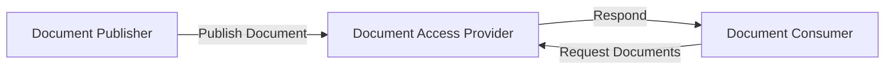
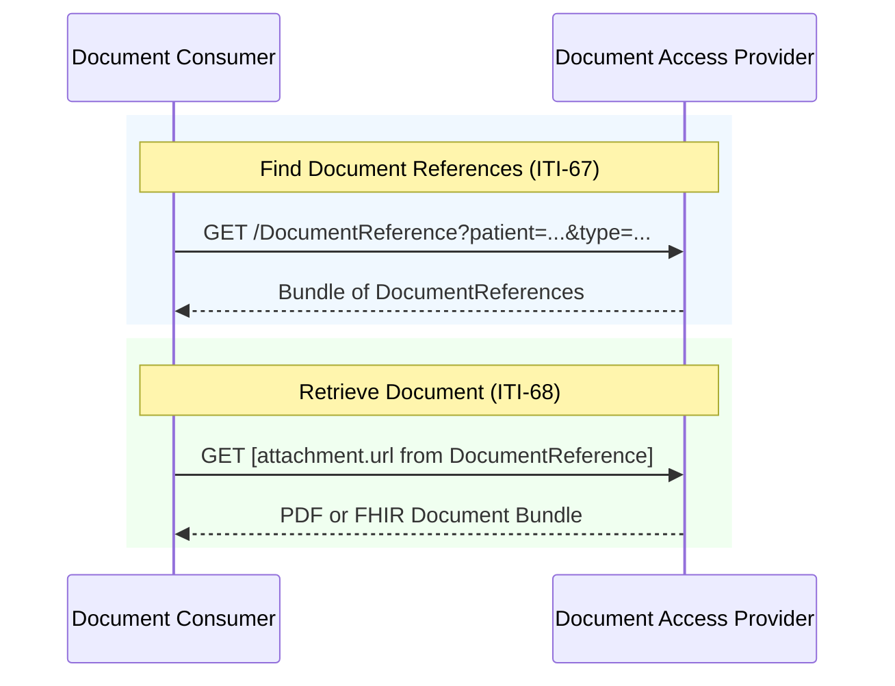
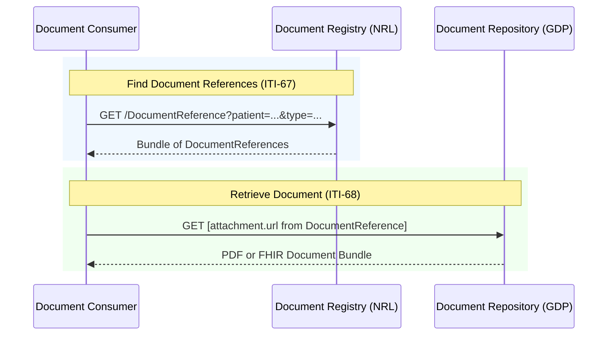

<div class="alert alert-danger" role="alert">
This is currently being elaborated and subject to change.
</div>


This API for the NW GMSA Clinical Data Repository is based on the following:

- [EURIDICE EU Health Data API - Document Exchange](https://hl7.eu/fhir/health-data-api/1.0.0-ballot/en/document-exchange.html)
- [IHE Mobile access to Health Documents [MHD]](https://profiles.ihe.net/ITI/MHD/index.html)
- [INTEROPen/NHS England Care Connect API](https://nhsconnect.github.io/CareConnectAPI) updated to FHIR R4.


The search parameters are based on [FHIR Search](https://hl7.org/fhir/R4/search.html) which provides a detailed description of the parameters and value types.




## Document Consumption 

The sequence diagram below relates to Genomics Data Platform (GDP).




### Binary [ITI-68]

Binary can be FHIR Document or PDF.

[Retrieve Document [ITI-68]](https://profiles.ihe.net/ITI/MHD/ITI-68.html)

<table style="">
    <tr>
        <td>
            <div class="alert alert-danger" role="alert">
            <b>FHIR CapabilityStatement:</b> <a href="CapabilityStatement-HealthDataAPI.html#Binary1-2" _target="_blank">Binary</a> 
            </div>
        </td>
	</tr>
</table>

#### Read

<div class="alert alert-success" role="alert">
GET [base]/Binary/{id}
</div>

### DocumentReference [ITI-67]

<div class="alert alert-danger" role="alert">
This is currently being elaborated and subject to change.
</div>

[Find Document References [ITI-67]](https://profiles.ihe.net/ITI/MHD/ITI-67.html)

<table style="">
    <tr>
        <td>
            <div class="alert alert-danger" role="alert">
            <b>FHIR CapabilityStatement:</b> <a href="CapabilityStatement-HealthDataAPI.html#DocumentReference1-3" _target="_blank">DocumentReference</a> 
            </div>
        </td>
        <td>
            <div class="alert alert-info" role="alert">
            <b>FHIR Profile:</b> <a href="StructureDefinition-DocumentReference.html" _target="_blank">DocumentReference</a> 
            </div>
        </td>
        <td>
            <div class="alert alert-secondary" role="alert">
                <b>Related to HL7 v2 Segment:</b> <a href="hl7v2.html#obx" _target="_blank">OBX</a> type=ED  
            </div>
        </td>
	</tr>
</table>

#### Read

<div class="alert alert-success" role="alert">
GET [base]/DocumentReference/{id}
</div>

#### Search

<div class="alert alert-success" role="alert">
GET [base]/DocumentReference?[parameter]=[value]]
</div>

| Parameter    | Type      | Search                                                       | Note                                     |
|--------------|-----------|--------------------------------------------------------------|------------------------------------------|
| _lastUpdated | date      | GET [base]/DocumentReference?_lastUpdated=[date]             | Date the resource was last updated       |
| identifier   | token     | GET [base]/DocumentReference?identifier=[system&#124;][code] | Master Version Specific Identifier       |
| patient      | reference | GET [base]/DocumentReference?patient=[id]                    | Who/what is the subject of the document  |
| date         | date      | GET [base]/DocumentReference?date=[date]                     | When this document reference was created |
| category     | token     | GET [base]/DocumentReference?category=[system&#124;][code]   | Categorisation of document               |
| type         | token     | GET [base]/DocumentReference?type=[system&#124;][code]       | Kind of document                         |
{:.grid}

##### Example

Searching for a DocumentReference by type (Genetic report) and patient.

```
GET [base]/DocumentReference?type=http://snomed.info/sct|1054161000000101&patient=995525
Accept: application/fhir+json
```

### NRL Document Consumption

In the NRL version, Genomics Data Platform (GDP) is a Document Repository, and NRL is a Document Registry.




## Document Publish

### MDM_T02 Original document notification and content

Document is currently PDF.


See [MDM_T02 Original document notification and content](hl7v2.html#mdm_t02-original-document-notification-and-content)
