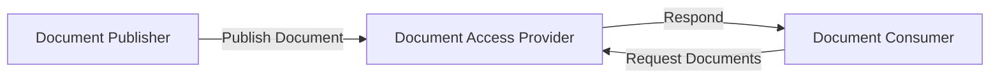
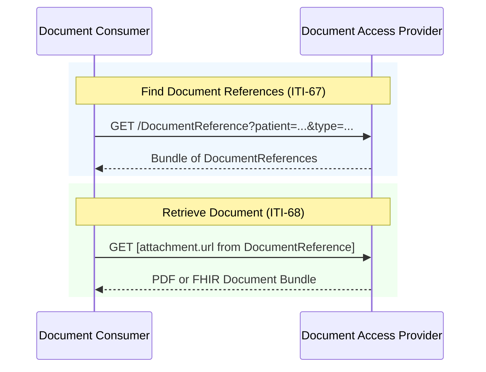
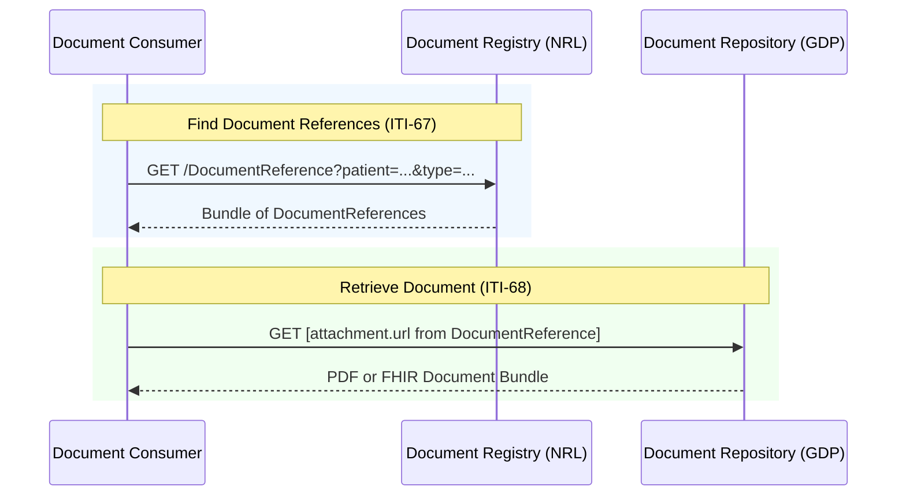
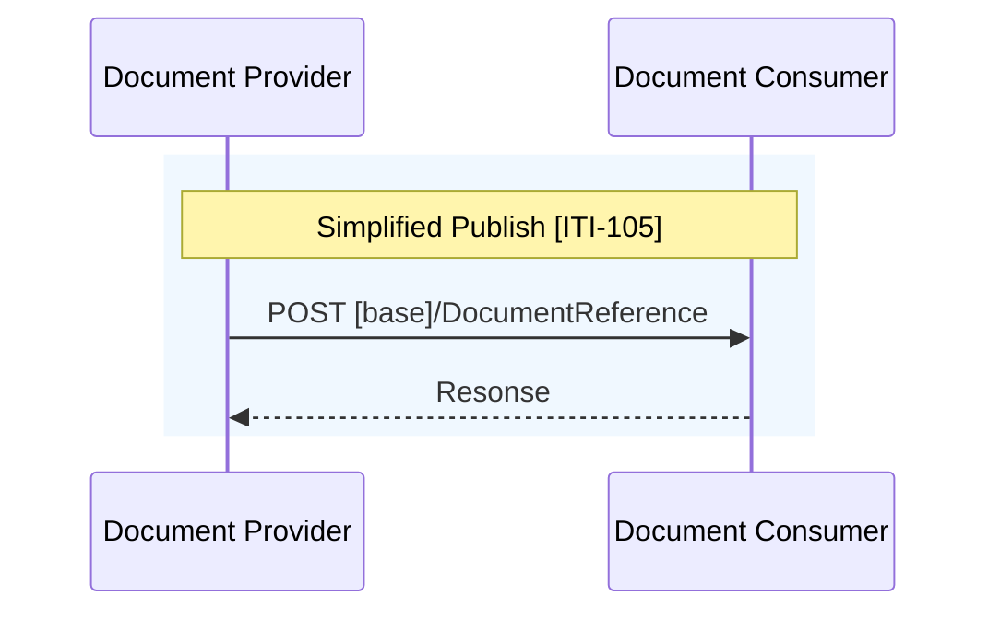
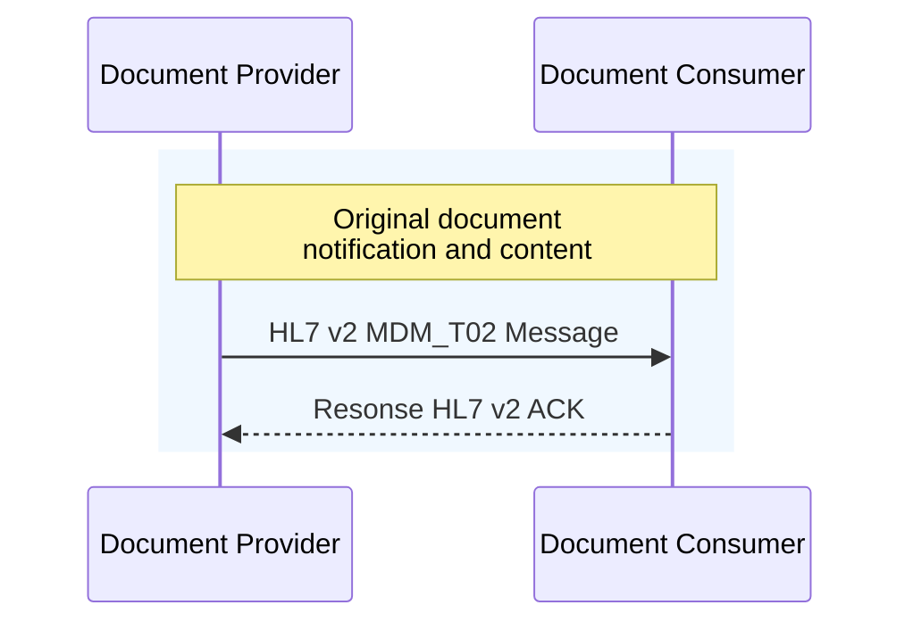
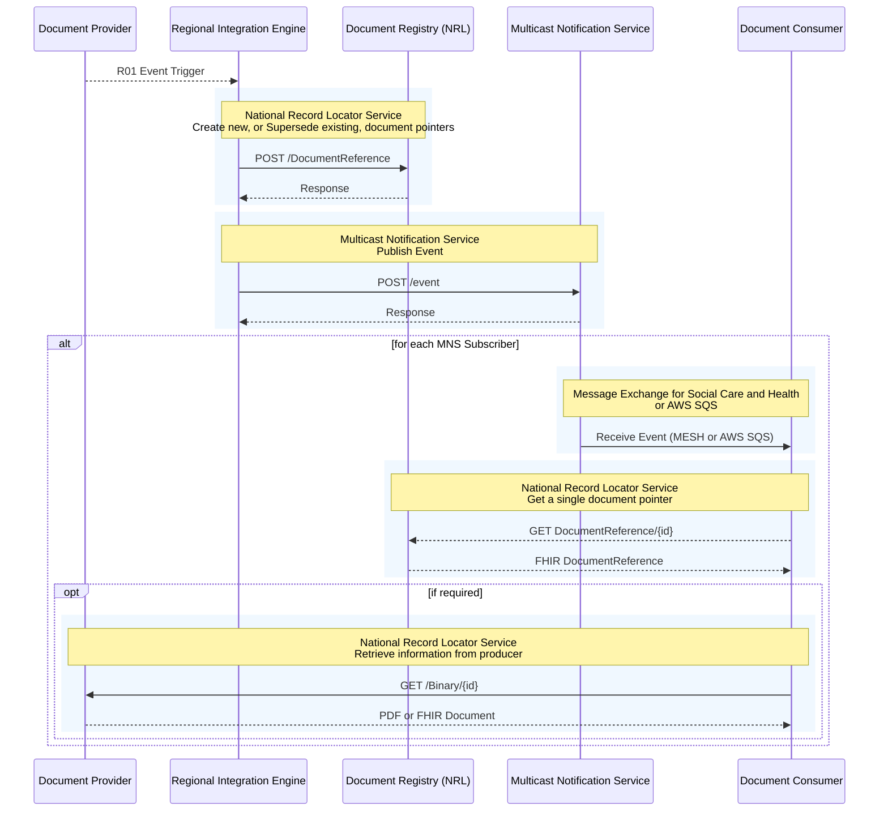

<div class="alert alert-danger" role="alert">
This is currently being elaborated and subject to change.
</div>


This API for the NW GMSA Clinical Data Repository is based on the following:

- [EURIDICE EU Health Data API - Document Exchange](https://hl7.eu/fhir/health-data-api/1.0.0-ballot/en/document-exchange.html)
- [IHE Mobile access to Health Documents [MHD]](https://profiles.ihe.net/ITI/MHD/index.html)
- [INTEROPen/NHS England Care Connect API](https://nhsconnect.github.io/CareConnectAPI) updated to FHIR R4.
- NHS England
  - [National Record Locator Service API](https://digital.nhs.uk/developer/api-catalogue/multicast-notification-service)
  - [Message Exchange for Social Care and Health (MESH) API](https://digital.nhs.uk/developer/api-catalogue/message-exchange-for-social-care-and-health-api)
  - [Multicast Notification Service API](https://digital.nhs.uk/developer/api-catalogue/multicast-notification-service)

The search parameters are based on [FHIR Search](https://hl7.org/fhir/R4/search.html) which provides a detailed description of the parameters and value types.




## Document Consumption 

The sequence diagram below relates to Genomics Data Platform (GDP).



In the NRL version, Genomics Data Platform (GDP) is a Document Repository and NRL is a Document Registry.



### Binary [ITI-68]

Binary can be FHIR Document or PDF.

[Retrieve Document [ITI-68]](https://profiles.ihe.net/ITI/MHD/ITI-68.html)

<table style="">
    <tr>
        <td>
            <div class="alert alert-danger" role="alert">
            <b>FHIR CapabilityStatement:</b> <a href="CapabilityStatement-HealthDataAPI.html#Binary1-2" _target="_blank">Binary</a> 
            </div>
        </td>
	</tr>
</table>

#### Read

<div class="alert alert-success" role="alert">
GET [base]/Binary/{id}
</div>

### DocumentReference [ITI-67]

<div class="alert alert-danger" role="alert">
This is currently being elaborated and subject to change.
</div>

[Find Document References [ITI-67]](https://profiles.ihe.net/ITI/MHD/ITI-67.html)

<table style="">
    <tr>
        <td>
            <div class="alert alert-danger" role="alert">
            <b>FHIR CapabilityStatement:</b> <a href="CapabilityStatement-HealthDataAPI.html#DocumentReference1-3" _target="_blank">DocumentReference</a> 
            </div>
        </td>
        <td>
            <div class="alert alert-info" role="alert">
            <b>FHIR Profile:</b> <a href="StructureDefinition-DocumentReference.html" _target="_blank">DocumentReference</a> 
            </div>
        </td>
        <td>
            <div class="alert alert-secondary" role="alert">
                <b>Related to HL7 v2 Segment:</b> <a href="hl7v2.html#obx" _target="_blank">OBX</a> type=ED  
            </div>
        </td>
	</tr>
</table>

#### Read

<div class="alert alert-success" role="alert">
GET [base]/DocumentReference/{id}
</div>

#### Search

<div class="alert alert-success" role="alert">
GET [base]/DocumentReference?[parameter]=[value]]
</div>

| Parameter    | Type      | Search                                                       | Note                                     |
|--------------|-----------|--------------------------------------------------------------|------------------------------------------|
| _lastUpdated | date      | GET [base]/DocumentReference?_lastUpdated=[date]             | Date the resource was last updated       |
| identifier   | token     | GET [base]/DocumentReference?identifier=[system&#124;][code] | Master Version Specific Identifier       |
| patient      | reference | GET [base]/DocumentReference?patient=[id]                    | Who/what is the subject of the document  |
| date         | date      | GET [base]/DocumentReference?date=[date]                     | When this document reference was created |
| category     | token     | GET [base]/DocumentReference?category=[system&#124;][code]   | Categorisation of document               |
| type         | token     | GET [base]/DocumentReference?type=[system&#124;][code]       | Kind of document                         |

##### Example

Searching for a DocumentReference by type (Genetic report) and patient.

```
GET [base]/DocumentReference?type=http://snomed.info/sct|1054161000000101&patient=995525
Accept: application/fhir+json
```

## Document Publish

### Simplified Publish [ITI-105] Option

Note: the Binary is embedded in the DocumentReference. Document can be FHIR Document or PDF.



See [Simplified Publish [ITI-105]](https://hl7.eu/fhir/health-data-api/1.0.0-ballot/en/document-exchange.html#iti-105-simplified-publish)

### Linear Exchange Option

Document can be FHIR Document or PDF.



See [MDM_T02 Original document notification and content](hl7v2.html#mdm_t02-original-document-notification-and-content)

### System Exchange Option

The diagram below illustrates the full sequence for a Document Publish; the later parts reuse the 'Document Publish' APIs described above.
The document retrieval (NRL: Retrieve information from producer) is optional, and the early section can be used to provide a [Document Subscription for Mobile (DSUBm)](https://profiles.ihe.net/ITI/DSUBm/index.html) service. 

1. From a R01 event trigger, the RIE (creates and) posts the FHIR DocumentReference to NRL. The url of the (PDF or FHIR) document is embedded in the DocumentReference.
2. The RIE publishes an event to the MNS, this has a link to the FHIR DocumentReference stored in NRL.
3. MNS Subscribers receive the event (note a subscription will need to be created by the consumer in MNS beforehand) via MESH or AWS SQS, and retrieve the FHIR DocumentReference from NRL.
4. The consumer retrieves the document (PDF or FHIR Document) from the producer. For NW Genomics, the FHIR Document will be generated on demand and PDF will be concurrently supported, which type of document that is returned is controlled by Accept header (e.g. application/fhir+json or application/pdf).



