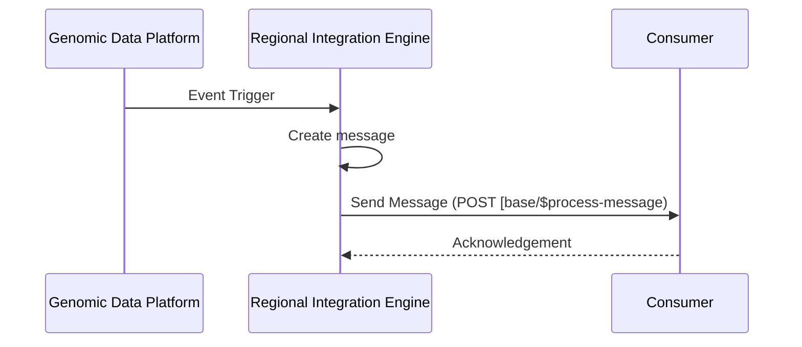
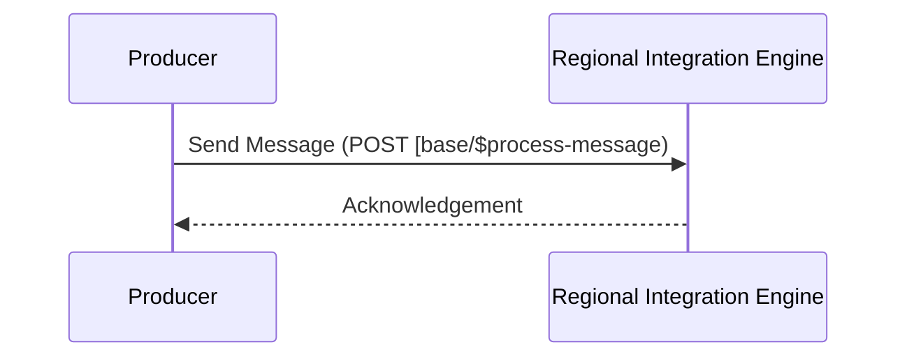
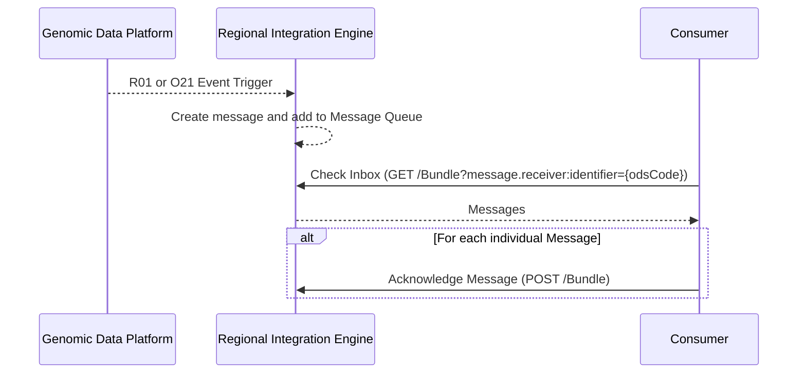

## Reference

- [FHIR Messaging](https://hl7.org/fhir/R4/messaging.html)
- NHS Standards
  - [Message Exchange for Social Care and Health (MESH) API](https://digital.nhs.uk/developer/api-catalogue/message-exchange-for-social-care-and-health-api)
  - [Digital Health and Care Wales - HL7 ORU_R01 2.5.1 Implementation Guide](DHCW-HL7-v2-5-1-ORUR01-Specification.pdf)
  - [NHS England HL7 v2 ADT Message Specification](https://drive.google.com/drive/folders/1FRkyZvWpZB1nCKbvQbo-eW_q9VtlR3Ws).
- [IHE Pathology and Laboratory Medicine (PaLM) Technical Framework - Volume 2a (PaLM TF-2a) Transactions](https://www.ihe.net/uploadedFiles/Documents/PaLM/IHE_PaLM_TF_Vol2a.pdf)
- [HL7 Version 2.5.1 Implementation Guide: Lab Results Interface (LRI), Release 1 from May 2017](https://confluence.hl7.org/download/attachments/25559919/2018%2004%2003%20-%20V2%20LRI%20-%20Ch.%205%20CG%20and%20Code%20System%20Tables.pdf?api=v2)

## Message Types

| Event | Event Trigger                 | IHE Interaction Code      | HL7 FHIR Message Definition                                                    | HL7 v2 Message Definition                                                                                           | EIP Type                                                                                                  |
|-------|-------------------------------|---------------------------|--------------------------------------------------------------------------------|---------------------------------------------------------------------------------------------------------------------|-----------------------------------------------------------------------------------------------------------|
| O21   | An order has been created     | LAB-1                     | [Laboratory Order](MessageDefinition-laboratory-order.html)                    | [OML_O21 Laboratory Order](hl7v2.html#oml_o21-laboratory-order)                                                     | [Document Message](https://www.enterpriseintegrationpatterns.com/patterns/messaging/DocumentMessage.html) |
| R01   | A report has been created     | LAB-3                     | [Laboratory Results](MessageDefinition-unsolicited-observation.html)           | [ORU_R01 Unsolicited transmission of an observation message](hl7v2.html#oru_r01-unsolicited-transmission-of-an-observation-message)                                                                                                                | [Document Message](https://www.enterpriseintegrationpatterns.com/patterns/messaging/DocumentMessage.html) |
| T01   | A document has been published | none - related to ITI-105 | [Document and Document Notification](MessageDefinition-original-document.html) | [MDM_T02 Original document notification and content](hl7v2.html#mdm_t02-original-document-notification-and-content) | [Document Message](https://www.enterpriseintegrationpatterns.com/patterns/messaging/DocumentMessage.html) |
{:.grid}

## Send Message

### NW Genomics as a Producer



### NW Genomics as a Consumer



### Send Message (FHIR)

<div class="alert alert-info" role="alert">
<b>Operation:</b> <a href="https://hl7.org/fhir/R4/messageheader-operation-process-message.html" _target="_blank">$process-message</a>
</div>

<div class="alert alert-success" role="alert">
POST [base]/$process-message<br/>
Authorization: Bearer {accessToken}<br/>
Content-Type: application/fhir+json
</div>

Examples
- LAB-1/O21 payload [Bundle 'Message' - Genomics Order](Bundle-GenomicsOrderMessageAttachment.html)
- LAB-3/R01 payload [Bundle 'Message' - Genomics Result](Bundle-GenomicsReportMessage.html)
- /T02 payload [Bundle 'Message' - Original Document](Bundle-OriginalDocumentMessage.html)

### Send Message (V2)

Uses Minimal Lower Layer Protocol (MLLP) over TCP/IP.
HL7 over http can be supported. 

<div class="alert alert-success" role="alert">
POST [base]/<br/>
Authorization: Bearer {accessToken}<br/>
Content-Type: application/hl7-v2+er7
</div>

## Receive Message – Synchronous Messaging

TODO

## Receive Message – Asynchronous Messaging

This is based on [Asynchronous Messaging using the RESTful API](https://hl7.org/fhir/R4/messaging.html#rest)



### Search - Checking an Inbox (FHIR)

<div class="alert alert-success" role="alert">
GET [base]/Bundle?[parameter]=[value]]
</div>


| Parameter    | Type      | Search                                                                | Note                                                    |
|--------------|-----------|-----------------------------------------------------------------------|---------------------------------------------------------|
| _lastUpdated | date      | GET [base]/Bundle?_lastUpdated=[date]                                 | Date the resource was last updated                      |
| message.receiver:identifier   | token     | GET [base]/Bundle?message.receiver:identifier=[system&#124;][ODScode] | ODS Code of calling organisation |
| message.event | token | GET [base]/Bundle?message.event=[system&#124;][eventcode] | Event Code of the message |
{:.grid}

`message.receiver:identifier` is a mandatory parameter and must match the OAuth2 clientID associated with the ODS code.

#### Examples

Searching for Messages for NE&Y Genomics after 1st May 2026..

```
GET [base]/Bundle?message.receiver:identifier=699N0&_lastUpdated=gt2026-05-01
Accept: application/fhir+json
Authorization: Bearer {accessToken}
```

[Search Response](Bundle-312fb428-0f63-4814-b6e3-ed6aa6e6bbe0.json.html)

```
GET [base]/Bundle?message.reciever:identifier=R0A&_lastUpdated=>2025-03-01T02:00:02+01:00
Accept: application/fhir+json
Authorization: Bearer {accessToken}
```

 [Search Response - Bundle 'SearchSet' - Genomics Order](Bundle-GenomicsOrderSearchSet.html)

### Acknowledge a Message

<div class="alert alert-success" role="alert">
POST [base]/Bundle
</div>

Acknowledging a Message removes it from the Inbox.

The Bundle is taken from the `Check Inbox` search, only the MessageHeader resource is required where the source and destination elements are swapped over, and posts it back to the server. E.g. 

**Original MessageHeader**



**Reversed MessageHeader**




#### Examples

Acknowledge a single message.

```
POST [base]/Bundle
Content-Type: application/fhir+json
Authorization: Bearer {accessToken}
```

[Request](Bundle-5.json.html)
