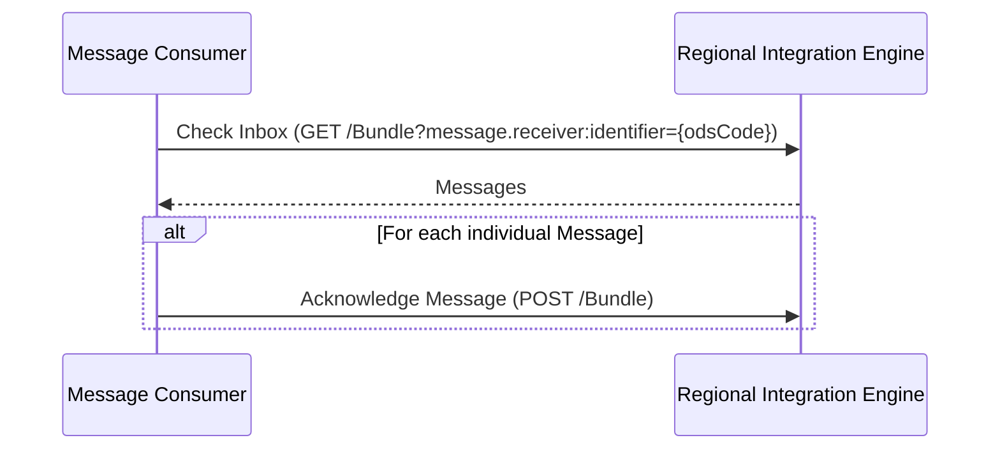

## Reference

1. [FHIR Messaging](https://hl7.org/fhir/R4/messaging.html)
2. See also [Message Exchange for Social Care and Health (MESH) API](https://digital.nhs.uk/developer/api-catalogue/message-exchange-for-social-care-and-health-api)

## Asynchronous Messaging

This is based on [Asynchronous Messaging using the RESTful API](https://hl7.org/fhir/R4/messaging.html#rest)



### Search - Checking an Inbox

<div class="alert alert-success" role="alert">
GET [base]/Bundle?[parameter]=[value]]
</div>


| Parameter    | Type      | Search                                                                | Note                                                    |
|--------------|-----------|-----------------------------------------------------------------------|---------------------------------------------------------|
| _lastUpdated | date      | GET [base]/Bundle?_lastUpdated=[date]                                 | Date the resource was last updated                      |
| message.receiver:identifier   | token     | GET [base]/Bundle?message.receiver:identifier=[system&#124;][ODScode] | ODS Code of calling organisation |
| message.event | token | GET [base]/Bundle?message.event=[system&#124;][eventcode] | Event Code of the message |

`message.receiver:identifier` is a mandatory parameter and must match the OAuth2 clientID associated with the ODS code.

#### Examples

Searching for Messages for NE&Y Genomics after 1st May 2026..

```
GET [base]/Bundle?message.receiver:identifier=699N0&_lastUpdated=gt2026-05-01
Accept: application/fhir+json
Authorization: Bearer {accessToken}
```

[Search Response](Bundle-312fb428-0f63-4814-b6e3-ed6aa6e6bbe0.json.html)

```
GET [base]/Bundle?message.reciever:identifier=R0A&_lastUpdated=>2025-03-01T02:00:02+01:00
Accept: application/fhir+json
Authorization: Bearer {accessToken}
```

 [Bundle 'SearchSet' - Genomics Order](Bundle-GenomicsOrderSearchSet.html)

### Acknowledge a Message

<div class="alert alert-success" role="alert">
POST [base]/Bundle
</div>

Acknowledging a Message removes it from the Inbox.

The Bundle is taken from the `Check Inbox` search, only the MessageHeader resource is required where the source and destination elements are swapped over, and posts it back to the server. E.g. 

**Original MessageHeader**



**Reversed MessageHeader**




#### Examples

Acknowledge a single message.

```
POST [base]/Bundle
Content-Type: application/fhir+json
Authorization: Bearer {accessToken}
```

[Request](Bundle-5.json.html)
