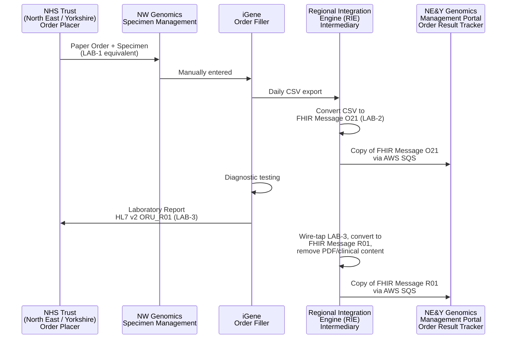

This is currently being elaborated and subject to change.

NE&Y Management Information (ctDNA) - copies of ctDNA Laboratory Orders and
Reports sent to North East and Yorkshire (NE&Y) Genomics for their own
regional management information/portal, rather than NE&Y being the ordering
or testing party.

## References

1. [Regional Integration Engine (RIE)](overview.html)
2. [LTW - Laboratory Order (LAB-1)](LTW.html#laboratory-order-lab-1)
3. [LTW - Filler Order Management (LAB-2)](LTW.html#filler-order-management-lab-2)
4. [LTW - Laboratory Report (LAB-3)](LTW.html#laboratory-report-lab-3)
5. [03 - Orders: Building a FHIR Order Message from a CSV](https://github.com/nw-gmsa/Testing/blob/main/notebooks/03-laboratory-order-from-csv.ipynb) - worked example building the FHIR Message O21 from a CSV row
6. [Bundle-GenomicsOrderMessage-ctDNA](Bundle-GenomicsOrderMessage-ctDNA.html) - example FHIR Message O21
7. [Bundle-GenomicsReportMessage-ctDNA](Bundle-GenomicsReportMessage-ctDNA.html) - example FHIR Message R01 (PDF removed)
8. [nw-gmsa/Testing - Input](https://github.com/nw-gmsa/Testing/tree/main/Input) - `NEYctDNA.csv` and `NorthEnglandctDNA100.csv`, examples of the iGene CSV export

## Actors

| IHE Actor                                                                | Role                                                                                                          |
|-------------------------------------------------------------------------------|------------------------------------------------------------------------------------------------------------------|
| [Order Placer](ActorDefinition-OrderPlacer.html)                                 | NHS Trust (North East or Yorkshire) - sends the order and specimen, paper-based                                |
| [Order Filler](ActorDefinition-OrderFiller.html)                                 | NW Genomics (iGene) - clerks in the order and performs the diagnostic testing                                  |
| [Intermediary](ActorDefinition-Intermediary.html)                              | Regional Integration Engine (RIE) - converts the daily CSV export into a FHIR Message O21, wire-taps LAB-3/`ORU_R01` into a FHIR Message R01 (with clinical content/PDF removed), and routes copies of both to NE&Y via AWS SQS |
| [Order Result Tracker](ActorDefinition-OrderResultTracker.html)                  | NE&Y Genomics / NE&Y Management Portal - receives copies of order and report messages for regional management visibility; not itself the ordering or testing party |
{:.grid}

## Transactions

| Transaction                                                          | Description                                                                                    | Direction              |
|--------------------------------------------------------------------------|----------------------------------------------------------------------------------------------------|----------------------------|
| Paper order (LAB-1 equivalent, no electronic transaction)                | NHS Trust sends the order and specimen to NW Genomics on paper                                     | NHS Trust → NW Genomics    |
| Manual entry + daily CSV export                                          | NW Genomics Specimen Management manually enters the order into iGene; a daily extraction job exports it as a CSV file | iGene → RIE                |
| CSV → FHIR Message O21 (LAB-2)                                           | RIE converts the CSV export into a FHIR Message O21                                                | RIE (internal)             |
| FHIR Message O21 copy, via AWS SQS                                       | RIE sends a copy of the O21 message to NE&Y for their Management Portal                            | RIE → NE&Y (AWS SQS)       |
| HL7 v2 `ORU_R01` (LAB-3)                                                 | NW Genomics sends the diagnostic report to the NHS Trust                                           | NW Genomics → NHS Trust    |
| FHIR Message R01 copy (PDF/clinical content removed), via AWS SQS        | RIE wire-taps the LAB-3 report, strips the PDF/clinical content, and sends a copy to NE&Y           | RIE → NE&Y (AWS SQS)       |
{:.grid}

## Current Process

1. An NHS Trust in the North East or Yorkshire region sends a Laboratory Order and specimen to NW Genomics - this is paper-based, corresponding to a LAB-1 interaction without an electronic transaction.
2. The order is manually entered into iGene by NW Genomics (MFT) Specimen Management.
3. A daily extraction process exports newly-entered orders from iGene as a CSV file.
4. The Regional Integration Engine (RIE) converts the CSV export into a FHIR Message O21 (LAB-2).
5. A copy of this FHIR Message O21 is sent to NE&Y Genomics via AWS SQS, for processing into the NE&Y Management Portal.
6. NW Genomics carries out the diagnostic testing.
7. The resulting report is sent to the NHS Trust as HL7 v2 `ORU_R01` (LAB-3). The RIE wire-taps a copy of this and converts it into a FHIR Message R01, removing the clinical content (the PDF), and sends this copy to NE&Y via AWS SQS, again for processing into the NE&Y Management Portal.

## Future Process

No distinct future-state changes are currently defined for this process.

## Data Models

- [ServiceRequest](StructureDefinition-ServiceRequest.html) - the Laboratory Order, carried in the FHIR Message O21
- [DiagnosticReport](StructureDefinition-DiagnosticReport.html) - the Laboratory Report, carried in the FHIR Message R01 without its `presentedForm` PDF attachment
- [Message Exchange [MQ]](MQ.html) - the FHIR Messaging pattern both O21 and R01 use

## Examples

| Example                                                                          | Description                                                                 |
|---------------------------------------------------------------------------------------|------------------------------------------------------------------------------|
| [Bundle-GenomicsOrderMessage-ctDNA](Bundle-GenomicsOrderMessage-ctDNA.html)            | FHIR Message O21 - the order copy sent to NE&Y                              |
| [Bundle-GenomicsReportMessage-ctDNA](Bundle-GenomicsReportMessage-ctDNA.html)          | FHIR Message R01 - the report copy sent to NE&Y, with the PDF removed        |
| [NEYctDNA.csv](https://github.com/nw-gmsa/Testing/blob/main/Input/NEYctDNA.csv)       | Example of the daily iGene CSV export                                        |
| [NorthEnglandctDNA100.csv](https://github.com/nw-gmsa/Testing/blob/main/Input/NorthEnglandctDNA100.csv) | Further example of the daily iGene CSV export                                |
{:.grid}

## Developer Guides

- [03 - Orders: Building a FHIR Order Message from a CSV](https://github.com/nw-gmsa/Testing/blob/main/notebooks/03-laboratory-order-from-csv.ipynb) - builds the FHIR Message O21 `Bundle` from a row of `Input/NEYctDNA.csv`

See [Developer Guides](DeveloperGuides.html) for the full notebook series.
