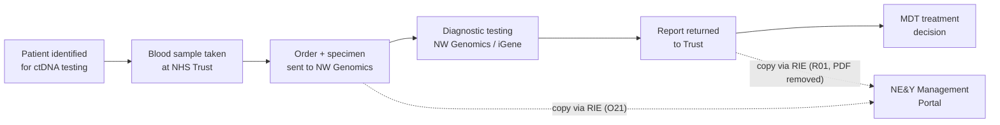
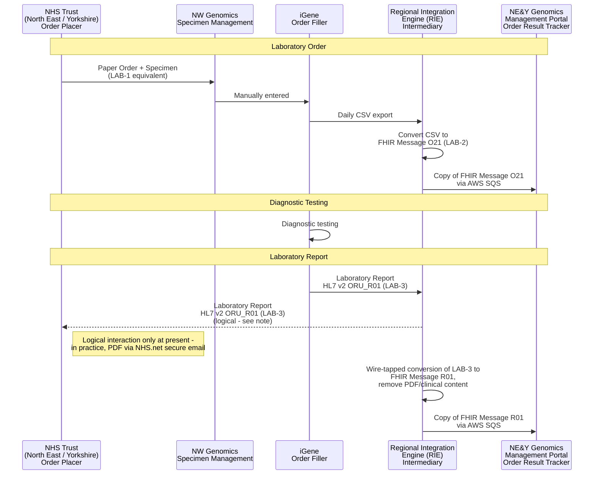
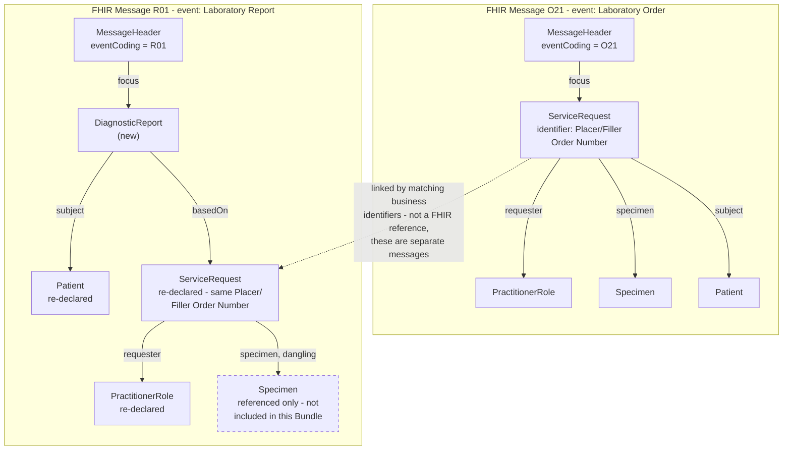

This is currently being elaborated and subject to change.

NE&Y Management Information (ctDNA) - copies of ctDNA Laboratory Orders and
Reports sent to North East and Yorkshire (NE&Y) Genomics for their own
regional management information/portal, rather than NE&Y being the ordering
or testing party.

## References

1. [Regional Integration Engine (RIE)](overview.html)
2. [LTW - Laboratory Order (LAB-1)](LTW.html#laboratory-order-lab-1)
3. [LTW - Filler Order Management (LAB-2)](LTW.html#filler-order-management-lab-2)
4. [LTW - Laboratory Report (LAB-3)](LTW.html#laboratory-report-lab-3)
5. [03 - Orders: Building a FHIR Order Message from a CSV](https://github.com/nw-gmsa/Testing/blob/main/notebooks/03-laboratory-order-from-csv.ipynb) - worked example building the FHIR Message O21 from a CSV row
6. [Bundle-GenomicsOrderMessage-ctDNA](Bundle-GenomicsOrderMessage-ctDNA.html) - example FHIR Message O21
7. [Bundle-GenomicsReportMessage-ctDNA](Bundle-GenomicsReportMessage-ctDNA.html) - example FHIR Message R01 (PDF removed)
8. [nw-gmsa/Testing - Input](https://github.com/nw-gmsa/Testing/tree/main/Input) - `NEYctDNA.csv` and `NorthEnglandctDNA100.csv`, examples of the iGene CSV export

## Clinical Pathway Overview

This page documents copies of ctDNA laboratory orders and reports flowing to NE&Y for management information - not the clinical pathway itself. This section gives project staff and developers the clinical context behind those messages: why the test is ordered, what the data fields mean clinically, and why NE&Y receives order/report metadata rather than full clinical content.

### What is being tested

`NGTDTestCode` on each order identifies one of two ctDNA panels from the NHS National Genomic Test Directory:

| Test Code | Cancer type | Panel | Clinical purpose |
|---|---|---|---|
| **M4.14** | Non-small cell lung cancer (NSCLC) | Combined small-variant + structural-variant ctDNA NGS panel (EGFR, ALK, BRAF, KRAS, MET exon 14 skipping/CNV, ROS1, RET, NTRK1-3) | Identify an actionable driver mutation/fusion to select first-line targeted therapy - typically when tissue is unavailable or insufficient, or run alongside tissue NGS to reduce time-to-treatment. Also used at disease progression to detect acquired resistance mutations (e.g. EGFR T790M/C797S) and guide the next line of targeted therapy. |
| **M3.13** | Breast cancer | ctDNA NGS panel (ESR1) | Detect acquired ESR1 resistance mutations in HR+/HER2- advanced breast cancer patients progressing on an aromatase inhibitor, to guide a switch to an ESR1-directed treatment (e.g. a fulvestrant-based regimen or an oral SERD). |
{:.grid}

Both are blood-based ("liquid biopsy") tests: a plasma sample is used instead of, or alongside, a tumour tissue biopsy, because ctDNA shed by the tumour into the bloodstream can be sequenced non-invasively and turned around faster than a repeat tissue biopsy.

### The end-to-end clinical journey

1. **Patient identified** - an oncologist/respiratory physician at an NE&Y Trust identifies a patient with suspected or confirmed advanced NSCLC, or HR+/HER2- advanced breast cancer progressing on endocrine therapy, who needs molecular profiling to choose or change systemic treatment.
2. **Blood sample taken** - a blood specimen is drawn at the Trust, instead of or alongside a tissue biopsy.
3. **Order + specimen sent to the lab** - the Trust sends the paper order and specimen to NW Genomics. *(This is the Order Placer → Order Filler step - LAB-1 - in the technical process below.)*
4. **Diagnostic testing** - NW Genomics extracts cell-free DNA and runs the relevant NGS panel. *(Order Filler internal processing, between LAB-2 and LAB-3.)*
5. **Result reported back to the Trust** - a diagnostic report is issued to the ordering clinician. *(LAB-3, `ORU_R01`.)*
6. **Clinical decision** - the Trust's MDT reviews the result: an actionable variant triggers starting or switching to a matched targeted therapy; no actionable variant means falling back to standard chemo-immunotherapy or other endocrine options.

Steps 3 and 5 are where this IG's process attaches: iGene's daily CSV export is converted by the RIE into FHIR O21/R01 messages, and copies are routed to NE&Y. **NE&Y Genomics is not the ordering clinician and plays no part in the step 6 treatment decision** - it receives copies of the order and report purely for regional management information (test volumes, turnaround times, activity by Trust) via its Management Portal. This is why the RIE strips the PDF/clinical content before forwarding the report copy (R01): NE&Y needs to know *that* a test happened and *when* it was reported, not the clinical result itself.

### Why this matters for developers

- `NGTDTestCode`/`NGTDTestName` (`M4.14`/`M3.13`) map to `ServiceRequest.code` in the O21 message - this identifies which panel was ordered, and is the field most likely to expand as new NGTD ctDNA panels are added to the Test Directory.
- `ObservationResultStatus = F` on a CSV row means the report has been finalised in iGene - this is what should trigger treating a LAB-3 `ORU_R01`/R01 copy as a completed test; anything not yet `F` is still in progress.
- The timestamp fields (`SpecimenTakenDateTime`, `SpecimenReceivedDateTime`, `ObservationDateTime`, `ReportStatusDateTime`) are what NE&Y's Management Portal uses to calculate turnaround time - their accuracy in the daily CSV export matters more for this management-information use case than it does for the Trust's own clinical use, where the report itself remains the authoritative record.
- Because this flow is copy/management-information only, any change here must preserve the exclusion of clinical content (the PDF/`presentedForm`) from the R01 copy - that's an information governance requirement, not just a technical convenience.
- The RIE → NHS Trust leg of LAB-3 (`ORU_R01`) is a **logical interaction only at present** - the RIE's conversion of that same report into the R01 copy for NE&Y is real, but in practice the Trust itself currently receives the report as a PDF via NHS.net secure email, not as an electronic HL7 v2 message. Don't assume the Trust-facing leg is already electronic when building against this flow.

## Actors

| IHE Actor                                                                | Role                                                                                                          |
|-------------------------------------------------------------------------------|------------------------------------------------------------------------------------------------------------------|
| [Order Placer](ActorDefinition-OrderPlacer.html)                                 | NHS Trust (North East or Yorkshire) - sends the order and specimen, paper-based                                |
| [Order Filler](ActorDefinition-OrderFiller.html)                                 | NW Genomics (iGene) - clerks in the order and performs the diagnostic testing                                  |
| [Intermediary](ActorDefinition-Intermediary.html)                              | Regional Integration Engine (RIE) - converts the daily CSV export into a FHIR Message O21, relays LAB-3/`ORU_R01` on to the NHS Trust, converts that same report into a FHIR Message R01 (with clinical content/PDF removed), and routes copies of both the O21 and R01 to NE&Y via AWS SQS |
| [Order Result Tracker](ActorDefinition-OrderResultTracker.html)                  | NE&Y Genomics / NE&Y Management Portal - receives copies of order and report messages for regional management visibility; not itself the ordering or testing party |
{:.grid}

## Transactions

| Transaction                                                          | Description                                                                                    | Direction              |
|--------------------------------------------------------------------------|----------------------------------------------------------------------------------------------------|----------------------------|
| Paper order (LAB-1 equivalent, no electronic transaction)                | NHS Trust sends the order and specimen to NW Genomics on paper                                     | NHS Trust → NW Genomics    |
| Manual entry + daily CSV export                                          | NW Genomics Specimen Management manually enters the order into iGene; a daily extraction job exports it as a CSV file | iGene → RIE                |
| CSV → FHIR Message O21 (LAB-2)                                           | RIE converts the CSV export into a FHIR Message O21                                                | RIE (internal)             |
| FHIR Message O21 copy, via AWS SQS                                       | RIE sends a copy of the O21 message to NE&Y for their Management Portal                            | RIE → NE&Y (AWS SQS)       |
| HL7 v2 `ORU_R01` (LAB-3)                                                 | NW Genomics sends the diagnostic report to the RIE                                                 | iGene → RIE                |
| HL7 v2 `ORU_R01` (LAB-3) - **logical interaction, not yet electronic**   | RIE relays the diagnostic report on to the NHS Trust. In practice, at present, this leg is not an electronic transaction: the report reaches the Trust as a PDF sent via NHS.net secure email | RIE → NHS Trust            |
| FHIR Message R01 copy (PDF/clinical content removed), via AWS SQS        | RIE converts the same LAB-3 report into a FHIR Message R01, strips the PDF/clinical content, and sends a copy to NE&Y | RIE → NE&Y (AWS SQS)       |
{:.grid}

## Current Process

1. An NHS Trust in the North East or Yorkshire region sends a Laboratory Order and specimen to NW Genomics - this is paper-based, corresponding to a LAB-1 interaction without an electronic transaction.
2. The order is manually entered into iGene by NW Genomics (MFT) Specimen Management.
3. A daily extraction process exports newly-entered orders from iGene as a CSV file.
4. The Regional Integration Engine (RIE) converts the CSV export into a FHIR Message O21 (LAB-2).
5. A copy of this FHIR Message O21 is sent to NE&Y Genomics via AWS SQS, for processing into the NE&Y Management Portal.
6. NW Genomics carries out the diagnostic testing.
7. The resulting report (HL7 v2 `ORU_R01`, LAB-3) is sent from NW Genomics to the RIE, which relays it on to the NHS Trust - **this NHS Trust leg is currently a logical interaction only: in practice, the Trust receives the report as a PDF via NHS.net secure email, not as an electronic HL7 v2 message.** The RIE also converts this same report into a FHIR Message R01, removing the clinical content (the PDF), and sends this copy to NE&Y via AWS SQS, again for processing into the NE&Y Management Portal.

## Future Process

No distinct future-state changes are currently defined for this process.

## Data Models

- [ServiceRequest](StructureDefinition-ServiceRequest.html) - the Laboratory Order, carried in the FHIR Message O21
- [DiagnosticReport](StructureDefinition-DiagnosticReport.html) - the Laboratory Report, carried in the FHIR Message R01 without its `presentedForm` PDF attachment
- [Message Exchange [MQ]](MQ.html) - the FHIR Messaging pattern both O21 and R01 use

### How the Two Event Messages Link Together

If you haven't worked with **HL7 v2/FHIR Messaging "events"** before: an event
message (`Bundle.type = message`) is a **self-contained, standalone package**,
not a delta or update against some shared state the receiver is assumed to
already hold. Its `MessageHeader.eventCoding` says what kind of event this is
(`O21` = a laboratory order, `R01` = a laboratory report), and
`MessageHeader.focus` points to the one resource that *is* the event (the
`ServiceRequest` for O21, the `DiagnosticReport` for R01). Everything else in
the Bundle exists to support that focus resource.

This matters here because the O21 and R01 for the *same* laboratory order are
sent as two **separate, independent messages**, at different times - the order
copy as soon as it's entered in iGene, the report copy once testing is
finalised, potentially days or weeks later. There is no FHIR `Reference`
spanning across the two Bundles, because event messages don't work that way -
each one has to stand on its own.

**Why the R01 re-declares Patient and ServiceRequest instead of just
referencing them.** In principle, since NE&Y already saw the order in the
earlier O21, the R01 could just carry a bare identifier rather than the
patient's name/DOB and the ServiceRequest's details all over again. HL7 v2
`ORU_R01` (and its FHIR Messaging equivalent) doesn't work that way, because it
is explicitly designed to also support an **unsolicited result** - a
laboratory reporting a result for an order the receiving system never saw in
the first place. To support that case, every R01 has to be self-sufficient:
full Patient and order-identifying content, not just a thin reference.
**In this NE&Y flow specifically, an unsolicited R01 should never actually
happen** - the RIE always generates the O21 from the same underlying iGene
order before the R01 is ever produced - but the message shape is the same
either way, because it follows the general-purpose HL7 v2/FHIR Messaging
pattern, not a flow-specific shortcut.

**How the two events are linked in practice.** Because there's no cross-Bundle
FHIR reference, correlating the O21 and R01 for the same order is done by
matching **business identifiers** that both Bundles carry - primarily the
Placer/Filler Order Number on `ServiceRequest.identifier` (see the note under
[Laboratory Report R01 Mapping](#laboratory-report-r01-mapping) on exactly
which identifier is present in the current example) and the patient's NHS
Number. This is a standard integration-engine pattern - correlate by business
identifier, not by FHIR reference - not something specific to this IG.

**How the report references the order and specimen.** Inside the R01 Bundle
itself, `DiagnosticReport.basedOn` references the `ServiceRequest` included in
that same Bundle - a normal in-Bundle FHIR reference, since both resources are
present together. `ServiceRequest.specimen`, in turn, references a `Specimen` -
but as noted under [Laboratory Report R01
Mapping](#laboratory-report-r01-mapping) below, the current worked example's
`Specimen` reference is **dangling**: the `Specimen` resource itself isn't one
of the R01 Bundle's entries, so it can't actually be resolved from the report
message alone, only from the earlier O21.

### Laboratory Order O21 Mapping

<b>FHIR Questionnaire:</b> <a href="Questionnaire-iGeneLaboratoryOrderExport.html">iGene Laboratory Order Export (CSV)</a>

The daily iGene CSV export (step 3 of [Current Process](#current-process) above) has
the shape below - see [NEYctDNA.csv](https://github.com/nw-gmsa/Testing/blob/main/Input/NEYctDNA.csv)
for a full example file. This table covers only the columns that populate the FHIR
Message O21 Laboratory Order - the same CSV's report/result columns instead populate
the separate FHIR Message R01 Laboratory Report, covered in [Laboratory Report R01
Mapping](#laboratory-report-r01-mapping) below. Many columns here reuse the same FHIR mapping as the
equivalent [iGene Work Order Export](Questionnaire-iGeneWorkOrderExport.html)
column, since this is the same underlying order data.

| CSV Column                          | Description                                                        | Type      | FHIR Mapping                                                        |
|----------------------------------------|--------------------------------------------------------------------|-----------|-------------------------------------------------------------------------|
| `PatientAccessionIdentifier`           | iGene's internal patient accession number - see [Patient Identifier](StructureDefinition-PatientIdentifier.html) | string    | `Patient.identifier` (PatientIdentifier)                                |
| `NHSNumber`                            | Patient's NHS Number - see [NHS Identifier](StructureDefinition-NHSIdentifier.html) | string    | `Patient.identifier` (NHS Number)                                       |
| `HospitalNumber`                       | Patient's hospital/medical record number - see [Medical Record Number](StructureDefinition-MedicalRecordNumber.html) | string    | `Patient.identifier` (MedicalRecordNumber)                              |
| `PatientFamilyName`                    | Patient's surname                                                   | string    | `Patient.name.family`                                                   |
| `PatientGivenName`                     | Patient's first name                                                | string    | `Patient.name.given`                                                    |
| `DateOfBirth`                          | Patient's date of birth                                             | date      | `Patient.birthDate`                                                     |
| `AdministrativeSex`                    | Sex registered at birth                                             | string    | `Patient.gender`                                                        |
| `PostCode`                             | Patient's postcode                                                  | string    | `Patient.address.postalCode`                                            |
| `HospitalSpellIdentifier`              | Identifier for the hospital spell/episode the order was placed under - see [Hospital Provider Spell Identifier](StructureDefinition-HospitalProviderSpellIdentifier.html) | string  | `ServiceRequest.encounter.identifier` (HospitalProviderSpellIdentifier) |
| `OrderingProviderIdentifier`           | Ordering clinician's professional identifier - see [Practitioner Identifier](StructureDefinition-PractitionerIdentifier.html) | string    | `PractitionerRole.practitioner.identifier.value`                        |
| `OrderingProviderName`                 | Ordering clinician's name                                           | string    | `PractitionerRole.practitioner.display`                                 |
| `RequestingOrganisationCode`           | Requesting Trust's ODS code - see [Organisation Code](StructureDefinition-OrganisationCode.html) | string    | `PractitionerRole.organization.identifier.value`                        |
| `RequestingOrganisationName`           | Requesting Trust's name                                             | string    | `PractitionerRole.organization.display`                                 |
| `PlacerOrderNumber`                    | Order identifier assigned by the ordering Trust - see [Order Identifier](StructureDefinition-OrderIdentifier.html) | string    | `ServiceRequest.identifier` (OrderIdentifier, type=PLAC)                |
| `FMIIdentifier`                        | Blank on every current example row - purpose not yet confirmed      | string    | `ServiceRequest.identifier` *(TBD)*                                     |
| `FillerOrderNumber`                    | Order identifier assigned by iGene (the lab) - see [Order Identifier](StructureDefinition-OrderIdentifier.html) | string    | `ServiceRequest.identifier` (OrderIdentifier, type=FILL)                |
| `OrderStatus`                          | Order's current status in iGene                                     | string    | `ServiceRequest.status`                                                 |
| `NGTDTestCode`                         | NHS England Genomic Test Directory test code                        | string    | `ServiceRequest.code`                                                   |
| `NGTDTestName`                         | NHS England Genomic Test Directory test/package name                | string    | `ServiceRequest.code.coding.display`                                    |
| `TestCode`                             | Local iGene short test code (e.g. `ctDNA_M4`)                       | string    | `ServiceRequest.code.coding` *(second coding, local system TBD)*        |
| `TestAccessionIdentifier`              | iGene's test-level accession number                                 | string    | `ServiceRequest.identifier` *(system TBD)*                              |
| `TestOrderDate`                        | Date/time the test was ordered                                      | dateTime  | `ServiceRequest.authoredOn`                                             |
| `SpecimenTakenDateTime`                | Date/time the specimen was taken from the patient                   | dateTime  | `Specimen.collection.collectedDateTime`                                 |
| `SpecimenReceivedDateTime`             | Date/time the specimen was received in the lab                      | dateTime  | `Specimen.receivedTime`                                                 |
| `SpecimenAccessionIdentifier`          | Specimen's lab accession number - see [Specimen Accession Number](StructureDefinition-SpecimenAccessionNumber.html) | string    | `Specimen.accessionIdentifier`                                          |
| `SpecimenTypeCode`                     | Coded specimen type (e.g. `SAMPLE: BL`) - normally SNOMED coded using the [Specimen Type](ValueSet-specimen-type.html) value set | string | `Specimen.type.coding.code` |
| `SpecimenTypeDescription`              | Specimen type, free text (e.g. Blood)                                | string    | `Specimen.type.coding.display`                                          |
{:.grid}

`FMIIdentifier`, `TestCode` and `TestAccessionIdentifier` are not yet confirmed against
a published identifier system - see the Questionnaire's own item design notes for
detail.

### Laboratory Report R01 Mapping

<b>FHIR Message R01:</b> <a href="Bundle-GenomicsReportMessage-ctDNA.html">Bundle-GenomicsReportMessage-ctDNA</a>

Unlike the O21 order above, the R01 Laboratory Report is actually based on an HL7 v2
`ORU^R01` message, converted into a FHIR `DiagnosticReport`-led Bundle (see
[Bundle-GenomicsReportMessage-ctDNA](Bundle-GenomicsReportMessage-ctDNA.html) for the
worked example this table is grounded in - it carries `MessageHeader`, `Patient`,
`DiagnosticReport`, `ServiceRequest` and `PractitionerRole`, but not the `Specimen`
resource `ServiceRequest.specimen` references). The table below uses the same CSV
column names and descriptions as [Laboratory Order O21
Mapping](#laboratory-order-o21-mapping) above, so the two tables can be read side by
side to see where each column lands depending on
which FHIR Message actually carries it.

| CSV Column                          | Description                                                        | Type      | R01 FHIR Mapping                                                     |
|----------------------------------------|--------------------------------------------------------------------|-----------|-------------------------------------------------------------------------|
| `NHSNumber`                            | Patient's NHS Number - see [NHS Identifier](StructureDefinition-NHSIdentifier.html) | string    | `Patient.identifier` (NHS Number) - also echoed on `DiagnosticReport.subject.identifier`/`ServiceRequest.subject.identifier` |
| `HospitalNumber`                       | Patient's hospital/medical record number - see [Medical Record Number](StructureDefinition-MedicalRecordNumber.html) | string    | `Patient.identifier` (MedicalRecordNumber)                              |
| `PatientFamilyName`                    | Patient's surname                                                   | string    | `Patient.name.family`                                                   |
| `PatientGivenName`                     | Patient's first name                                                | string    | `Patient.name.given`                                                    |
| `DateOfBirth`                          | Patient's date of birth                                             | date      | `Patient.birthDate`                                                     |
| `AdministrativeSex`                    | Sex registered at birth                                             | string    | `Patient.gender`                                                        |
| `PostCode`                             | Patient's postcode                                                  | string    | `Patient.address.postalCode`                                            |
| `HospitalSpellIdentifier`              | Identifier for the hospital spell/episode the order was placed under - see [Hospital Provider Spell Identifier](StructureDefinition-HospitalProviderSpellIdentifier.html) | string  | `ServiceRequest.encounter.identifier` (HospitalProviderSpellIdentifier) *(not populated in current example)* |
| `OrderingProviderIdentifier`           | Ordering clinician's professional identifier - see [Practitioner Identifier](StructureDefinition-PractitionerIdentifier.html) | string    | `PractitionerRole.practitioner.identifier.value`                        |
| `OrderingProviderName`                 | Ordering clinician's name                                           | string    | `PractitionerRole.practitioner.display`                                 |
| `RequestingOrganisationCode`           | Requesting Trust's ODS code - see [Organisation Code](StructureDefinition-OrganisationCode.html) | string    | `PractitionerRole.organization.identifier.value`                        |
| `RequestingOrganisationName`           | Requesting Trust's name                                             | string    | `PractitionerRole.organization.display`                                 |
| `PlacerOrderNumber`                    | Order identifier assigned by the ordering Trust - see [Order Identifier](StructureDefinition-OrderIdentifier.html) | string    | `ServiceRequest.identifier` (OrderIdentifier, type=PLAC) *(not present in current example - see note below)* |
| `FillerOrderNumber`                    | Order identifier assigned by iGene (the lab) - see [Order Identifier](StructureDefinition-OrderIdentifier.html) | string    | `ServiceRequest.identifier` (OrderIdentifier, type=FILL), echoed on `DiagnosticReport.basedOn` (see note below) |
| `OrderStatus`                          | Order's current status in iGene                                     | string    | `ServiceRequest.status`                                                 |
| `ReportStatusDateTime`                 | Date/time the report status was last updated                        | dateTime  | `DiagnosticReport.issued` *(not yet populated in current example)*      |
| `ReportIdentifier`                     | Report's identifier, once issued - see [Report Identifier](StructureDefinition-ReportIdentifier.html) | string    | `DiagnosticReport.identifier` (ReportIdentifier) (see note below)       |
| `NGTDTestCode`                         | NHS England Genomic Test Directory test code                        | string    | `DiagnosticReport.code.coding`                                          |
| `NGTDTestName`                         | NHS England Genomic Test Directory test/package name                | string    | `DiagnosticReport.code.coding.display`                                  |
| `TestCode`                             | Local iGene short test code (e.g. `ctDNA_M4`)                       | string    | *(not present in current example)*                                      |
| `TestAccessionIdentifier`              | iGene's test-level accession number                                 | string    | *(system TBD - see note below)*                                         |
| `TestOrderDate`                        | Date/time the test was ordered                                      | dateTime  | `ServiceRequest.authoredOn` *(not yet populated in current example)*    |
| `ObservationResultStatus`              | Result status (`F` = finalised)                                     | string    | `DiagnosticReport.status`                                               |
| `ObservationDateTime`                  | Date/time the result was observed/produced                          | dateTime  | `DiagnosticReport.effectiveDateTime`                                    |
| `ObservationIdentifierCode`            | Code identifying which result/analyte this row represents           | string    | `Observation.code.coding.code` (on the individual result Observation referenced from `DiagnosticReport.result`, not itself included in the example Bundle) |
| `ObservationIdentifierDescription`     | Display name for the result/analyte code above                      | string    | `Observation.code.coding.display` (as above)                            |
{:.grid}

Three things the worked example surfaces that aren't yet resolved:

- **`FillerOrderNumber`/`TestAccessionIdentifier`/`ReportIdentifier` may collapse onto
  a single value.** In the current example, `DiagnosticReport.identifier`
  (`ReportIdentifier`), `DiagnosticReport.basedOn` (type=FILL) and
  `ServiceRequest.identifier` (`OrderIdentifier`, type=FILL) are all populated with the
  *same* value (`T26-59XG`), which looks like a `TestAccessionIdentifier`-shaped value
  (the `T26-...` prefix) rather than the `FillerOrderNumber`-shaped value (`R26-...`)
  seen in the CSV's own `FillerOrderNumber` column for the same order. Whether
  `FillerOrderNumber`, `TestAccessionIdentifier` and `ReportIdentifier` are meant to be
  three distinct identifiers or the same one reused three ways isn't confirmed by any
  current example.
- **The `R26-...`-shaped value instead appears on `ServiceRequest.requisition`** (type
  `PGN`, Placer Group Number) in the current example, not on any `identifier` slice
  distinguishing it as `PlacerOrderNumber`. No `PLAC`-typed identifier is present in
  this example at all.
- **`Specimen` is referenced but not included.** `ServiceRequest.specimen` in the
  current example references a `Specimen` by URN, but that `Specimen` resource isn't
  one of the Bundle's entries - so none of the five Specimen-mapped columns above are
  actually resolvable from the R01 message as currently constructed, only from the O21
  order (see [Laboratory Order O21 Mapping](#laboratory-order-o21-mapping) above).

## Examples

| Example                                                                          | Description                                                                 |
|---------------------------------------------------------------------------------------|------------------------------------------------------------------------------|
| [Bundle-GenomicsOrderMessage-ctDNA](Bundle-GenomicsOrderMessage-ctDNA.html)            | FHIR Message O21 - the order copy sent to NE&Y                              |
| [Bundle-GenomicsReportMessage-ctDNA](Bundle-GenomicsReportMessage-ctDNA.html)          | FHIR Message R01 - the report copy sent to NE&Y, with the PDF removed        |
| [NEYctDNA.csv](https://github.com/nw-gmsa/Testing/blob/main/Input/NEYctDNA.csv)       | Example of the daily iGene CSV export                                        |
| [NorthEnglandctDNA100.csv](https://github.com/nw-gmsa/Testing/blob/main/Input/NorthEnglandctDNA100.csv) | Further example of the daily iGene CSV export                                |
{:.grid}

## Developer Guides

- [03 - Orders: Building a FHIR Order Message from a CSV](https://github.com/nw-gmsa/Testing/blob/main/notebooks/03-laboratory-order-from-csv.ipynb) - builds the FHIR Message O21 `Bundle` from a row of `Input/NEYctDNA.csv`

See [Developer Guides](DeveloperGuides.html) for the full notebook series.
