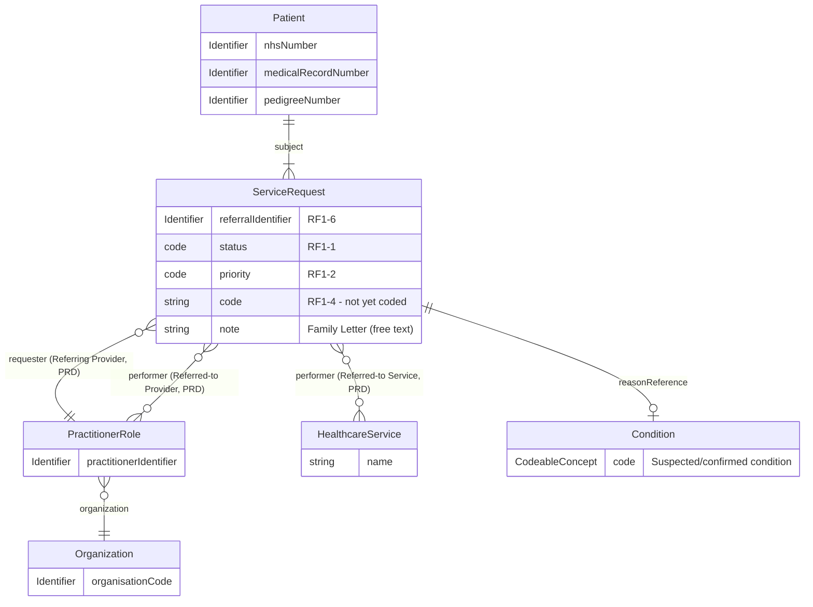

This is for information and analysis purposes only and is not an active or
planned project.

This Questionnaire sketches a computable data model for a closed-loop
clinical referral into a genomics/clinical genetics service - the narrative
use case is [Genetic Referrals](GeneticReferrals.html), and the underlying
HL7 v2 message this is modelled on is `REF_I12` (Patient Referral), per that
page's own [Referral Data Model](GeneticReferrals.html#referral-data-model)
and [Target Referral Model](GeneticReferrals.html#target-referral-model).

It is deliberately built the same way as [Genomic Test
Order](Questionnaire-GenomicTestOrder.html) and [Genomic Test
Report](Questionnaire-GenomicTestReport.html) - a computable FHIR
`Questionnaire`, not a spreadsheet or Word document - see [How To Engineer
(scale and deliver)
Interoperability](HowToEngineerInteroperability.html#documenting-the-data-model)
for why this IG prefers that approach. Where a data item is genuinely the
same one [Genomic Test Order](Questionnaire-GenomicTestOrder.html) already
captures (e.g. patient demographics, both populating HL7 v2 `PID`), this
Questionnaire reuses the same item rather than re-defining it, per the "check
for existing patterns" principle on that same page.

## Domain Archetype

<b>HL7 v2 Message:</b> `REF_I12` (Patient Referral)

This is a **level 2** (field-level) sketch of [Genetic Referrals'](GeneticReferrals.html)
own [Target Referral Model](GeneticReferrals.html#target-referral-model) - the
same entities, with the fields this Questionnaire actually asks.

## Differences from Genomic Test Order

Both Questionnaires exist for the same reason - a computable common core,
extended per scenario rather than re-modelled each time - but a clinical
referral and a laboratory order are genuinely different things. The table
below is the concrete comparison:

| Aspect | [Genomic Test Order](Questionnaire-GenomicTestOrder.html) | Genetic Clinical Referral |
|---|---|---|
| HL7 v2 basis | `OML_O21` (Laboratory Order), `ORC`/`OBR` | `REF_I12` (Patient Referral), `RF1`/`PRD` |
| What it requests | A specific laboratory test, from a Genomic Test Directory code | An assessment/service (e.g. genetic counselling, cascade testing) - not a specific lab test |
| Patient demographics | `PID` - Patient group | **Same** - reuses the identical items (both populate `PID`) |
| Who initiated it | Healthcare Professional group (`ORC-12`/`ORC-21`) - a single referrer | Referring Provider group (`PRD`, role = Referring Provider) - same shape, same reused items |
| Who it's going to | *(implicit - the destination LIMS is fixed, not chosen per-order)* | **Referred-to Provider/Service group (`PRD`, role = Referred-to Provider) - new, no equivalent in Genomic Test Order.** A referral explicitly names the receiving clinic/service; an order doesn't need to, because the Order Filler is already fixed |
| Test/order identifier | Order Placer/Filler Number (`ORC-2`/`ORC-3`), Order Group Number (`ORC-4`, pedigree/`G Number`) | Referral Identifier (`RF1-6`) - a single identifier, not a Placer/Filler pair, and no eRS UBRN equivalent modelled (see [Genetic Referrals - Notes on this sketch](GeneticReferrals.html#referral-data-model)) |
| Priority | `ServiceRequest.priority` (`LN/82768-3`) | **Same** - reuses the identical item (`RF1-2` maps onto the same FHIR element) |
| Reason | Suspected disease/CITT code (`LN/51967-8`) plus free-text clinical information (`NTE-1`) | **Same** reason-code item reused (`RF1-12`/`DG1`) |
| Specimen | **Specimen/Biopsy group** - detailed fields (type, body site, accession number, collection/received dates, shipment tracking) | **None.** A referral is a request for assessment, not a physical test - no specimen is collected until/unless it leads to an actual [Genomic Test Order](Questionnaire-GenomicTestOrder.html) later |
| Order/test-type-specific detail | **Ask At Order Entry Questionnaires** - structured, `derivedFrom`/extended per order/test type (see [Order Entry Questions](Questionnaire-GenomicTestOrder.html#order-entry-questions)) | **No structured equivalent.** The comparable detail - who else in the family is affected, inheritance pattern, at-risk relatives - travels today as free text in an unstructured **family letter** (see [Family History](#family-history) below), not a discrete sub-Questionnaire |
{:.grid}

### Family History

Genomic Test Order's Ask At Order Entry Questionnaires model order-type-specific
detail as structured, coded data. A referral's equivalent detail doesn't have
that today: per [Genetic Referrals](GeneticReferrals.html)'s "Genetic Counselling /
Cascade Testing Referral" section and [Cancer Background Information for Use
Cases - Genetic Counselling Referral Across
Regions](CancerNOS.html#genetic-counselling-referral-across-regions), this
detail is carried in an unstructured **family letter** - a dictated or
secure-email clinical letter summarising the variant/condition, the
inheritance pattern, and which relatives are thought to be at risk. This
Questionnaire represents that letter as a single free-text item (or an
attached document, if sent that way) rather than inventing a structured
family-history data model that doesn't exist in current practice.

A future, more structured representation could use a `FamilyMemberHistory`
resource per named relative - as already illustrated by the worked examples
on [Genomic Test Report](Questionnaire-GenomicTestReport.html#examples)
(`FamilyMemberHistory` for the son/mother in the Lynch syndrome example) -
but building that out is beyond the analysis this page attempts.

## Data Models

- [Genomic Test Order](Questionnaire-GenomicTestOrder.html) - the equivalent
  archetype for a laboratory order, compared above
- [Diagnostic Core](diagnostic-core.html) - the identifier profiles reused
  above ([NHS Identifier](StructureDefinition-NHSIdentifier.html), [Medical
  Record Number](StructureDefinition-MedicalRecordNumber.html), [Order
  Identifier](StructureDefinition-OrderIdentifier.html))
- [Genetic Referrals](GeneticReferrals.html) - the narrative use case, actors,
  transactions and REF_I12/eRS/BaRS mapping this Questionnaire is built from

Nothing on this page has been adopted as an active profile or interface in
this IG.
