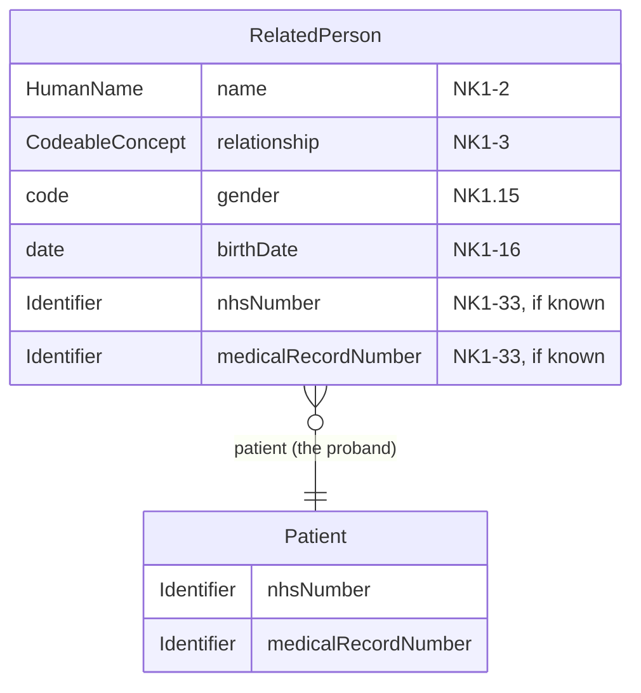

This is for information and analysis purposes only and is not an active or
planned project.

This Questionnaire `derivedFrom`/extends [Genetic Clinical
Referral](Questionnaire-GeneticClinicalReferral.html) the same way an Ask At
Order Entry Questionnaire extends [Genomic Test
Order](Questionnaire-GenomicTestOrder.html) - see [Genetic Clinical Referral -
Order Entry Questions](Questionnaire-GeneticClinicalReferral.html#order-entry-questions).
It structures a single named **consultand** (an at-risk relative of the
proband, per [Genetic Referrals](GeneticReferrals.html)'s Proband/Consultand
terminology) being referred alongside or instead of the proband, referenced
from `ServiceRequest.supportingInfo` on the referral itself.

**Scope note:** this is deliberately narrow. General family history - the
wider pedigree, who else in the family is affected - stays in the
unstructured family letter (see [Genetic Clinical Referral - Family
History](Questionnaire-GeneticClinicalReferral.html#family-history)). Only
the part of that information that names a *specific* consultand who is
themselves being referred is structured here, following the shape of an HL7
v2 `NK1` segment.

## Domain Archetype

<b>HL7 FHIR Profile:</b> <a href="StructureDefinition-RelatedPerson.html" _target="_blank">RelatedPerson</a> 

<b>HL7 v2 Segment:</b> `NK1` (Next of Kin/Associated Parties)

`RelatedPerson.patient` always references the *same* `Patient` as [Genetic
Clinical Referral](Questionnaire-GeneticClinicalReferral.html)'s own Patient
group - the proband. A consultand's own NHS Number/Medical Record Number is
only completed if they are themselves already a patient somewhere (e.g.
already known to the referring service) - it is not required, since many
consultands named at referral time won't yet have any record of their own.

## Field Mapping

| Name | HL7 v2 | Value Set / Data Type | FHIR `RelatedPerson` |
|---|---|---|---|
| Consultand Name | `NK1-2` | - | `RelatedPerson.name` |
| Relationship to Proband | `NK1-3` | [UKCorePersonRelationshipType](https://simplifier.net/hl7fhirukcorer4/valueset-ukcore-personrelationshiptype) | `RelatedPerson.relationship` |
| Administrative Sex | `NK1.15` | [AdministrativeGender](http://hl7.org/fhir/ValueSet/administrative-gender) | `RelatedPerson.gender` |
| Date of Birth | `NK1-16` | - | `RelatedPerson.birthDate` |
| NHS Number (if known) | `NK1-33` | [NHS Identifier](StructureDefinition-NHSIdentifier.html) | `RelatedPerson.identifier:nhsNumber` |
| Hospital Number (if known) | `NK1-33` | [Medical Record Number](StructureDefinition-MedicalRecordNumber.html) | `RelatedPerson.identifier:MedicalRecordNumber` |
{:.grid}

Real `RelatedPerson` examples already in this IG (e.g.
[RelatedPerson-MotherCerseiLondon](RelatedPerson-MotherCerseiLondon.html))
code `relationship` with HL7 v3 `RoleCode` (e.g. `MTH` "mother") rather than
`UKCore-PersonRelationshipType` - both are shown as options above since
neither is yet the confirmed convention for this specific Questionnaire.

## Data Models

- [Genetic Clinical Referral](Questionnaire-GeneticClinicalReferral.html) -
  the common core this Questionnaire extends
- [RelatedPerson](StructureDefinition-RelatedPerson.html) - the FHIR profile
  this Questionnaire structures
- [Genetic Referrals](GeneticReferrals.html) - the narrative use case,
  including the Proband/Consultand terminology this page relies on

Nothing on this page has been adopted as an active profile or interface in
this IG.
