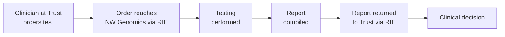
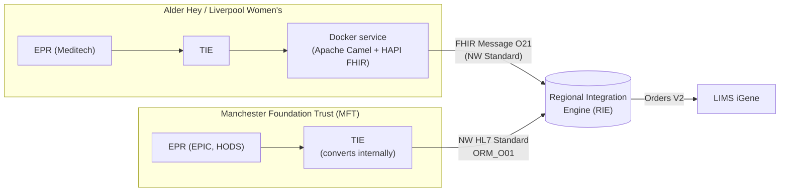
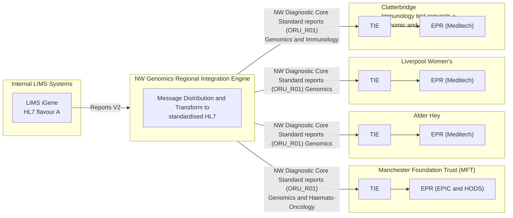

This is currently being elaborated and subject to change.

iGene Orders and Reports: how Alder Hey, Manchester Foundation Trust (MFT) and Liverpool Women's send genomic test orders directly to NW Genomics, and receive reports back, via the [Regional Integration Engine (RIE)](overview.html).

## References

1. [Regional Integration Engine (RIE)](overview.html) - the message-processing and routing infrastructure this use case relies on
2. [Genomic Test Order](Questionnaire-GenomicTestOrder.html)
3. [Ask At Order Entry Questions](Questionnaire-GenomicGeneralAskAtOrderEntry.html)
4. [LTW - Laboratory Order (LAB-1)](LTW.html#laboratory-order-lab-1) / [Laboratory Report (LAB-3)](LTW.html#laboratory-report-lab-3)
5. [Diagnostic Core](diagnostic-core.html)

## Clinical Pathway Overview

### What is being tested

This page isn't about one specific clinical test - it's about how three NHS
Trusts (Alder Hey, MFT and Liverpool Women's), plus Clatterbridge for
immunology, place genomic and immunology test orders directly with NW Genomics
and receive reports back, rather than via a national order comms system. The
underlying tests are whatever each Trust's clinicians order from the NW
Genomics test directory.

### The end-to-end clinical journey

1. **Order placed at the Trust** - a clinician at Alder Hey, MFT or Liverpool Women's orders a genomic test (or, for Clatterbridge, a genomic or immunology test) using the Trust's EPR.
2. **Order reaches NW Genomics** - the order is exported from the Trust's EPR and reaches NW Genomics via the Trust's own Trust Integration Engine (TIE) and the RIE, arriving at the destination LIMS (currently iGene).
3. **Testing performed** - NW Genomics carries out the requested test.
4. **Report compiled and returned** - a report is produced and routed back to the ordering Trust via the RIE, so it reaches the same EPR the order came from.
5. **Clinical decision** - the ordering clinician acts on the result.

### Why this matters for developers

- This use case describes the **NHS Trust side** of the relationship: which Trusts integrate directly, what they send, and how their TIE converts to the NW Standard before the order ever reaches the RIE.
- For what happens once the order or report is with the RIE (validation, enrichment, LIMS routing, shared care record wire-tap), see [Regional Integration Engine (RIE) - Current Process](overview.html#current-process) - this use case does not repeat that detail.
- iGene is the Order Filler for these Trusts today, but not necessarily the system that performs every test: iGene may sub-contract work out to other labs (see [Regional Integration Engine (RIE) - Sub-Contracted and Reflex Orders](overview.html#sub-contracted-and-reflex-orders-lab-35-and-reports-lab-36)), and the RIE may in future route some orders directly to StarLIMS instead of iGene - StarLIMS was the main LIMS for the Liverpool GLH, and iGene the main LIMS for the Manchester GLH, before the two merged into a single North West Genomics service. See [StarLIMS / iGene Integration](starLIMS.html) for that routing.

## Actors

| IHE Actor                                          | Role                                                                                              |
|---------------------------------------------------------|--------------------------------------------------------------------------------------------------------|
| [Order Placer](ActorDefinition-OrderPlacer.html)         | Manchester Foundation Trust (MFT) - NHS Trust, direct HL7 (EPIC and HODS)                              |
| [Order Placer](ActorDefinition-OrderPlacer.html)         | Alder Hey - NHS Trust, direct HL7 (EPR: Meditech)                                                       |
| [Order Placer](ActorDefinition-OrderPlacer.html)         | Liverpool Women's - NHS Trust, direct HL7 (EPR: Meditech)                                               |
| [Order Placer](ActorDefinition-OrderPlacer.html)         | Clatterbridge - NHS Trust, direct HL7 (EPR: Meditech) (Immunology test requests + Genomic and Immunology reports) |
| [Intermediary](ActorDefinition-Intermediary.html)        | Regional Integration Engine (RIE) - see [Regional Integration Engine (RIE)](overview.html) for its own use case detail |
| [Order Filler](ActorDefinition-OrderFiller.html)         | LIMS iGene - internal LIMS, master LIMS                                                                 |
{:.grid}

## Transactions

| Transaction                     | Description                            |
|--------------------------------------|-------------------------------------------|
| `OML_O21` / FHIR `O21`               | Laboratory order placement, Trust to RIE   |
| `ORU_R01`                            | Test report/result delivery, RIE to Trust  |
{:.grid}

## Current Process

Alder Hey, MFT and Liverpool Women's each send genomic orders directly to NW
Genomics and receive reports back, rather than via a national order comms
system - Clatterbridge does the same for immunology test requests, and
additionally receives combined genomic and immunology reports.

### Order Process

Each Trust exports its order from its EPR to its own Trust Integration Engine
(TIE) as a local HL7 v2 `ORM_O01` - see [Regional Integration Engine (RIE) -
Order Process](overview.html#order-process) for what happens from here
onwards. How each Trust converts that local `ORM_O01` into the NW Standard
before sending it to the RIE differs. The RIE then forwards the order to the
destination LIMS (iGene) as a V2 order:

- **Alder Hey** and **Liverpool Women's** - the EPR is Meditech; the TIE sends the order to a Docker service (built using Apache Camel and HAPI FHIR) which converts the local `ORM_O01` into a FHIR Message O21 (NW Standard).
- **Manchester Foundation Trust (MFT)** - the conversion from local `ORM_O01` to the NW HL7 Standard happens within the MFT TIE itself.

### Report Process and Technical Diagram

Reports flow back from the RIE to each Trust as `ORU_R01`, NW Standard - see
[Regional Integration Engine (RIE) - Report Process](overview.html#report-process)
for the RIE-side detail (LIMS conversion, PDS/ODT validation and enrichment,
ODS-code routing). The diagram below shows the four Trusts covered by this use
case alongside the RIE and its internal LIMS - for each Trust the report
flows from the RIE to the Trust's TIE and on to the Trust's EPR.

## Future Process

No Trust-specific future-state changes are planned beyond those already
described for the RIE as a whole - see [Regional Integration Engine (RIE) -
Future Process](overview.html#future-process), which covers potential
interfacing with National Genomic Order Comms systems.

## Data Models

This use case uses the same Diagnostic Core and Genomic Model (Placer Order
LAB-1 / Reports LAB-3) data models as the RIE generally - see [Regional
Integration Engine (RIE) - Data
Models](overview.html#data-models) for the full detail, including the Account
Number, Placer Order Number, NHS Number and Requested Procedure Code
identifiers these Trusts' orders and reports carry.

## Examples

FHIR examples for the Laboratory Order (LAB-1) and Laboratory Report (LAB-3)
interactions described above:

- [Example: Laboratory Order](artifacts.html#example-laboratory-order) - LAB-1 examples in FHIR format
- [Example: Laboratory Report](artifacts.html#example-laboratory-report) - LAB-3 examples in FHIR format

## Developer Guides

- [03 - Orders: Building a FHIR Order Message from a CSV](https://github.com/nw-gmsa/Testing/blob/main/notebooks/03-laboratory-order-from-csv.ipynb) - builds a laboratory-order `Bundle` following the `laboratory-order` `MessageDefinition`
- [04 - Reports: HL7 v2 `ORU^R01` into FHIR](https://github.com/nw-gmsa/Testing/blob/main/notebooks/04-laboratory-report-fhir-from-hl7v2.ipynb) - converts a lab's own HL7 v2 report into a FHIR `R01` Message
- [10 - Histocompatibility and Immunogenetics: HL7 v2 to and from the NW Standard](https://github.com/nw-gmsa/Testing/blob/main/notebooks/10-histocompatibility-immunogenetics-hl7v2-nw-standard.ipynb) - hand-builds the field-level conversion a Trust Integration Engine (TIE) does between its own Trust's local HL7 v2 flavour and the shared [NW HL7 v2 standard](hl7v2.html)

See [Developer Guides](DeveloperGuides.html) for the full notebook series.
