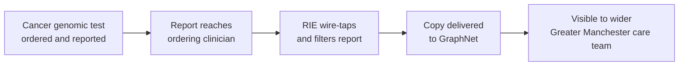
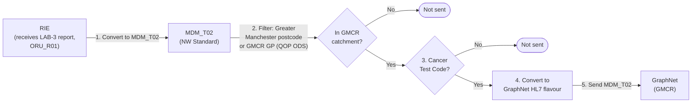
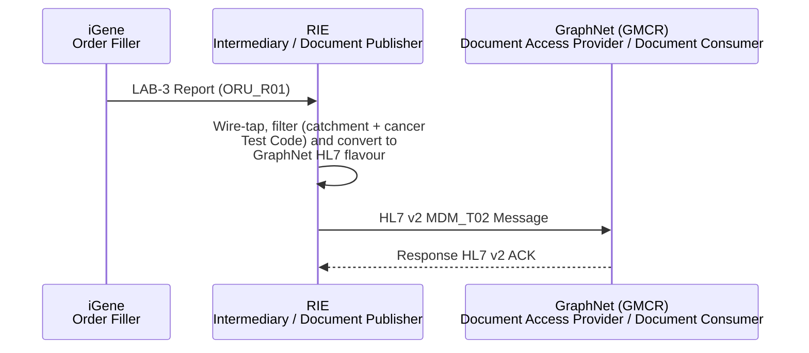
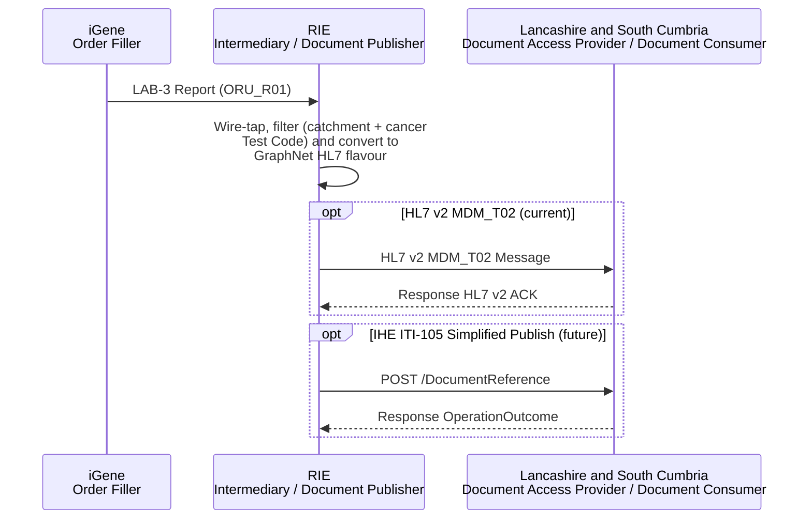
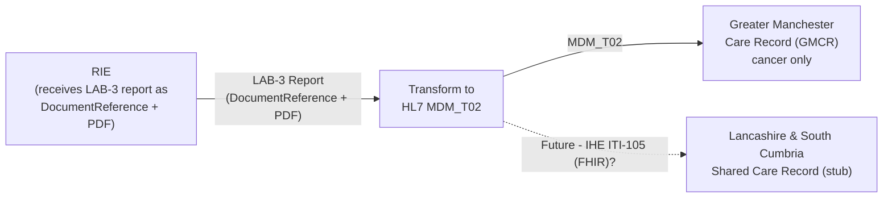

This is currently being elaborated and subject to change.

Regional Shared Care Records: sharing NW Genomics cancer reports into regional shared care records - currently the Greater Manchester Care Record (GMCR), with Lancashire and South Cumbria to follow - via a wire-tap on the Laboratory Report (LAB-3) feed.

## References

1. [Regional Integration Engine (RIE)](overview.html) - the RIE performs this wire-tap as part of its normal Report Process
2. [LTW - Laboratory Report (LAB-3)](LTW.html#laboratory-report-lab-3)
3. [HIE - Sharing Laboratory Reports (Document)](HIE.html#sharing-laboratory-reports-document-iti-105-and-mdm_t02) - the IHE ITI-105/`MDM_T02` pattern this follows
4. [Wire Tap](https://www.enterpriseintegrationpatterns.com/patterns/messaging/WireTap.html) - the Enterprise Integration Pattern this reuses
5. [ctDNA NHS England Unified Genomic Record (UGR)](ctDNAUGR.html) - Phase 1 of that use case reuses this same wire-tap

## Clinical Pathway Overview

### What is being tested

This page isn't about one specific clinical test - it's about making an
**existing** cancer genomics report, already reported to the ordering
clinician as usual, also visible to a patient's wider Greater Manchester care
team via GMCR (delivered into GraphNet).

### The end-to-end clinical journey

1. **Cancer genomic test ordered and reported as normal** - the usual [Regional Integration Engine (RIE)](overview.html) Order/Report process (LAB-1/LAB-3) applies; nothing about the original order or report changes.
2. **Report reaches the ordering clinician** - as usual.
3. **RIE wire-taps the report** - if the patient is in the GMCR catchment and the report is cancer-related, a copy is converted and filtered for GMCR.
4. **Copy delivered to GraphNet** - the converted copy is sent into GMCR/GraphNet.
5. **Visible to the wider care team** - a GP or another Greater Manchester clinician, not just the ordering team, can now see the report via GMCR.

### Why this matters for developers

- This is a **copy/sharing** mechanism layered on top of the existing LAB-3 report - it doesn't change how the test is ordered or reported to the originating clinician.
- Whether a given report reaches GMCR at all depends on the filtering rules in [Current Process](#current-process) below (patient catchment and cancer-only Test Codes) - not every report is copied.

## Actors

| IHE Actor                                                                | Role                                                                                              |
|-------------------------------------------------------------------------------|----------------------------------------------------------------------------------------------------|
| [Order Filler](ActorDefinition-OrderFiller.html)                                 | iGene (NW Genomics master LIMS) - originates the LAB-3 report that is wire-tapped                    |
| [Order Placer](ActorDefinition-OrderPlacer.html)                                 | NHS Trust - the original recipient of the LAB-3 report                                               |
| [Intermediary](ActorDefinition-Intermediary.html) / [Document Publisher](ActorDefinition-DocumentPublisher.html) | Regional Integration Engine (RIE) - wire-taps LAB-3/`ORU_R01`, filters and converts it, then publishes it for GMCR |
| [Document Access Provider](ActorDefinition-DocumentAccessProvider.html) / [Document Consumer](ActorDefinition-DocumentConsumer.html) | Greater Manchester Care Record (GMCR) / GraphNet and Lancashire and South Cumbria - Shared Care Record Providers, cancer only |
{:.grid}

## Transactions

| Transaction                                                          | Description                                                                                    | Direction              |
|--------------------------------------------------------------------------|----------------------------------------------------------------------------------------------------|----------------------------|
| Wire-tap on LAB-3/`ORU_R01`, converted to HL7 v2 `MDM_T02` (could become IHE ITI-105 FHIR) | RIE converts, filters and sends the wire-tapped report                                             | RIE → GraphNet (GMCR)      |
{:.grid}

## Current Process

For reports, the RIE will [wire-tap](https://www.enterpriseintegrationpatterns.com/patterns/messaging/WireTap.html)
the `ORU_R01` to send a copy of the report to GMCR. This involves:

1. Converting the `ORU_R01` to an `MDM_T02` message (NW Standard).
2. Filtering to only include patients who have a postcode in Greater Manchester, or who have a GP registered with GMCR (identified by the GP practice's ODS code, "QOP ODS").
3. Filtering out non-cancer reports (using the Test Codes carried in the `DiagnosticReport`).
4. Converting the message to the GraphNet-specific flavour of HL7.
5. Sending the `MDM_T02` message to GraphNet.

The sequence diagram below shows the same process as a message exchange,
following the same [HIE - Sharing Laboratory Reports
(Document)](HIE.html#sharing-laboratory-reports-document-iti-105-and-mdm_t02)
Document Publisher/Document Consumer pattern used elsewhere in this IG - the
`HL7 v2 MDM_T02` transaction is what's actually used today; `IHE ITI-105`
is the future/FHIR-based alternative the [Transactions](#transactions) table
above already flags as a possibility:

> **Note:** The `DocumentReference` + attachment on the LAB-3 report currently forms the basis for this feed - see [Data Models](#data-models) below.

## Future Process

### Lancashire and South Cumbria

Stub - Lancashire and South Cumbria's Shared Care Record integration has not yet been elaborated. This section will be filled in once that work progresses.

Lancashire and South Cumbria's Shared Care Record is expected to follow a
similar wire-tap/filter/convert pattern to the GMCR process described above -
the RIE wire-taps the same LAB-3/`ORU_R01` feed, applies a Lancashire and South
Cumbria-specific patient/report filter, and delivers the result to their
shared care record system. The destination format (HL7 v2 `MDM_T02`, or a
future IHE ITI-105 FHIR document) and the exact filtering rules are yet to be
defined - see [ctDNA NHS England Unified Genomic Record
(UGR)](ctDNAUGR.html) for how the NHS England Unified Genomic Record Phase 1
adapts this same wire-tap.

## Data Models

The `DocumentReference` + attachment on the LAB-3 report (see [Regional
Integration Engine (RIE) - Genomic Model - Placer Order (LAB-1) and Reports
(LAB-3)](overview.html#genomic-model---placer-order-lab-1-and-reports-lab-3))
currently forms the basis for this feed.

## Examples

No example is published yet for the `MDM_T02` feed itself. See [Example:
Laboratory Report](artifacts.html#example-laboratory-report) for the LAB-3
report this feed is wire-tapped from.

## Security Considerations

Includes:

- OAuth2 Standard for [Authorisation](api-security.html#authorisation---oauth2)
  - including use of JWT access tokens and future support for [SMART-on-FHIR Scopes](api-security.html#scopes)
- FHIR AuditEvent/IHE BALP for [Audit Logging](api-security.html#audit-logging)
- TLS for [Transport Security/Encryption](api-security.html#encryption)

## Developer Guides

- [04 - Reports: HL7 v2 `ORU^R01` into FHIR](https://github.com/nw-gmsa/Testing/blob/main/notebooks/04-laboratory-report-fhir-from-hl7v2.ipynb) - converts a lab's own HL7 v2 report into a FHIR `R01` Message, and on to the `MDM_T02` document feed this page describes

See [Developer Guides](DeveloperGuides.html) for the full notebook series.
