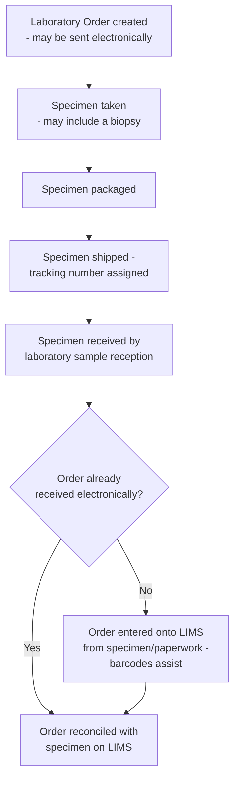

This is for background information only and is not an active project.

Specimen Transportation and Management: the physical logistics of getting a
specimen from the patient to the laboratory, alongside (but distinct from) the
electronic [Laboratory Order (LAB-1)](LTW.html#laboratory-order-lab-1) message.
Generally this is a manual process at present and does not feature in automated
interactions.

## References

1. IHE PaLM Technical Framework Supplement - [Specimen Event Tracking (SET)](https://www.ihe.net/uploadedFiles/Documents/PaLM/IHE_PaLM_Suppl_SET.pdf) - a specification for tracking specimen progress along this process (not adopted here - background/reference only)
2. [GS1 UK Healthcare](https://www.gs1uk.org/industries/healthcare) - UK barcode standards that can be used with this process/workflow (not mandated here - background/reference only)
3. [Laboratory Testing Workflow (LTW) - Laboratory Order (LAB-1)](LTW.html#laboratory-order-lab-1) - the electronic order this physical process runs alongside
4. [Diagnostic Core](diagnostic-core.html) - the identifiers referenced throughout this page
5. [Specimen](StructureDefinition-Specimen.html)

## Overview

A [Laboratory Order (LAB-1)](LTW.html#laboratory-order-lab-1) message and its
physical specimen travel to the laboratory by two different routes that have to be
**reconciled** when the specimen arrives - the order may arrive electronically ahead
of, behind, or (if it has not been sent electronically at all) not before the
specimen itself. The identifiers described below are what let sample reception match
a physical specimen back to the correct order (and, if the order was never sent
electronically, are what let the order be entered onto the LIMS from the specimen
and its paperwork alone).

## Current Process

This is generally a manual process today, and does not feature in automated
interactions:

1. **Laboratory Order is created** - this can be sent electronically (see
   [Laboratory Order (LAB-1)](LTW.html#laboratory-order-lab-1)).
2. **Specimen is taken**, which may include a biopsy.
3. **Specimen is packaged**.
4. **Specimen is shipped and assigned a tracking number.** The specimen is normally
   shipped with a printed copy of the laboratory order. Key identifiers - patient
   [NHS Number](StructureDefinition-NHSIdentifier.html),
   [MRN](StructureDefinition-MedicalRecordNumber.html), [Order Placer
   Number](StructureDefinition-OrderIdentifier.html), [Account
   Number](StructureDefinition-HospitalProviderSpellIdentifier.html), Specimen Number
   (see [Specimen](StructureDefinition-Specimen.html)) and [Shipment Tracking
   Number](StructureDefinition-ShipmentTrackingNumber.html) - are normally printed as
   barcodes on the printed order or the shipping container.
5. **Specimen is received** by the laboratory's sample reception.
6. **If the order has not been received electronically**, it is entered onto the
   LIMS from the specimen and its paperwork - barcodes normally assist with this.

### Key Identifiers

| Identifier             | Profile                                                                | Typically carried on                          |
|--------------------------|---------------------------------------------------------------------------|----------------------------------------------------|
| NHS Number               | [NHSIdentifier](StructureDefinition-NHSIdentifier.html)                   | Printed order, shipping container                   |
| Medical Record Number (MRN) | [MedicalRecordNumber](StructureDefinition-MedicalRecordNumber.html)     | Printed order, shipping container                   |
| Order Placer Number      | [OrderIdentifier](StructureDefinition-OrderIdentifier.html)               | Printed order, shipping container                   |
| Account Number           | [HospitalProviderSpellIdentifier](StructureDefinition-HospitalProviderSpellIdentifier.html) | Printed order, shipping container   |
| Specimen Number          | [Specimen](StructureDefinition-Specimen.html).identifier                  | Specimen label, shipping container                  |
| Shipment Tracking Number | [ShipmentTrackingNumber](StructureDefinition-ShipmentTrackingNumber.html) | Shipping container                                  |
| Specimen Accession Number | [SpecimenAccessionNumber](StructureDefinition-SpecimenAccessionNumber.html) | Assigned by the laboratory on receipt, not shipped with the specimen |
{:.grid}

## IHE Specimen Event Tracking (SET)

[IHE Specimen Event Tracking (SET)](https://www.ihe.net/uploadedFiles/Documents/PaLM/IHE_PaLM_Suppl_SET.pdf)
is a specification for tracking the progress of specimens along this process, from
collection through to storage, biobanking or disposal. It defines a **Specimen Event
Informer (SEI)** actor, which sends specimen lifecycle event messages (`LAB-40`) to a
**Specimen Event Tracker (SET)** actor - covering around 15 distinct event types
across collecting, shipping, receiving and accepting a specimen. This would be the
natural specification to formalise the manual steps above, were this process ever
automated - not adopted here.

## Barcoding (GS1 UK Healthcare)

[GS1 UK Healthcare](https://www.gs1uk.org/industries/healthcare) publishes UK
barcode standards (e.g. GS1 DataMatrix / GS1-128) that could be used to encode the
[key identifiers](#key-identifiers) above on the printed order or shipping
container, so they can be scanned rather than re-keyed - not mandated here.

## Data Models

- [Specimen](StructureDefinition-Specimen.html)
- The identifier profiles listed under [Key Identifiers](#key-identifiers) above
