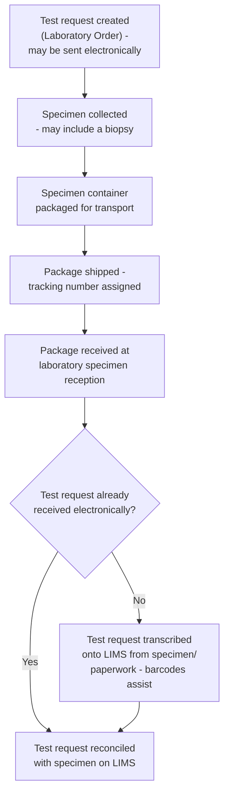

This is for background information only and is not an active project.

Specimen Transportation and Management: the physical logistics of getting a
specimen from the patient to the laboratory, alongside (but distinct from) the
electronic [Laboratory Order (LAB-1)](LTW.html#laboratory-order-lab-1) message.
Generally this is a manual process at present and does not feature in automated
interactions.

<b>Known gap:</b> the process described below is a generic/vendor-neutral
description, using common laboratory/logistics terminology rather than any single
Trust's own procedure. It has not yet been aligned with Manchester Foundation
Trust's actual specimen shipment procedure (courier, packaging/labelling
conventions, specimen reception process) - that alignment is left for a future pass.

## References

1. IHE PaLM Technical Framework Supplement - [Specimen Event Tracking (SET)](https://www.ihe.net/uploadedFiles/Documents/PaLM/IHE_PaLM_Suppl_SET.pdf) - a specification for tracking specimen progress along this process (not adopted here - background/reference only)
2. [GS1 UK Healthcare](https://www.gs1uk.org/industries/healthcare) - UK barcode standards that can be used with this process/workflow (not mandated here - background/reference only)
3. [Laboratory Testing Workflow (LTW) - Laboratory Order (LAB-1)](LTW.html#laboratory-order-lab-1) - the electronic order this physical process runs alongside
4. [Diagnostic Core](diagnostic-core.html) - the identifiers referenced throughout this page
5. [Specimen](StructureDefinition-Specimen.html)

## Overview

A [Laboratory Order (LAB-1)](LTW.html#laboratory-order-lab-1) message and its
physical specimen travel to the laboratory by two different routes that have to be
**reconciled** when the specimen arrives - the order may arrive electronically ahead
of, behind, or (if it has not been sent electronically at all) not before the
specimen itself. The identifiers described below are what let sample reception match
a physical specimen back to the correct order (and, if the order was never sent
electronically, are what let the order be entered onto the LIMS from the specimen
and its paperwork alone).

## Current Process

This is generally a manual process today, and does not feature in automated
interactions. The terms below follow common laboratory/logistics usage, with the
equivalent term used elsewhere in this IG noted in brackets where it differs:

1. **A test request is created** (a laboratory order, or requisition - see
   [Laboratory Order (LAB-1)](LTW.html#laboratory-order-lab-1)). This can be sent
   electronically, ahead of the specimen, or printed and sent with it.
2. **A specimen is collected** from the patient (which may include a biopsy) into a
   labelled specimen container.
3. **The specimen container is packaged** for transport, generally alongside a
   printed copy of the test request.
4. **The package is shipped and given a tracking number.** Key identifiers -
   patient [NHS Number](StructureDefinition-NHSIdentifier.html), [hospital/medical
   record number (MRN)](StructureDefinition-MedicalRecordNumber.html), [order/
   requisition number](StructureDefinition-OrderIdentifier.html), [episode/account
   number](StructureDefinition-HospitalProviderSpellIdentifier.html), the specimen's
   own identifier (see [Specimen](StructureDefinition-Specimen.html)), and the
   [shipment tracking
   number](StructureDefinition-ShipmentTrackingNumber.html) itself - are normally
   printed as barcodes on the test request paperwork and/or the shipping package.
5. **The package is received** at the laboratory (specimen reception/accessioning).
6. **If the test request has not already arrived electronically**, it is transcribed
   onto the LIMS from the specimen and its paperwork - barcodes normally speed this
   up by letting reception scan rather than re-key each identifier.

### Key Identifiers

| Identifier             | Profile                                                                | Typically carried on                          |
|--------------------------|---------------------------------------------------------------------------|----------------------------------------------------|
| NHS Number               | [NHSIdentifier](StructureDefinition-NHSIdentifier.html)                   | Printed order, shipping container                   |
| Medical Record Number (MRN) | [MedicalRecordNumber](StructureDefinition-MedicalRecordNumber.html)     | Printed order, shipping container                   |
| Order Placer Number      | [OrderIdentifier](StructureDefinition-OrderIdentifier.html)               | Printed order, shipping container                   |
| Account Number           | [HospitalProviderSpellIdentifier](StructureDefinition-HospitalProviderSpellIdentifier.html) | Printed order, shipping container   |
| Specimen Number          | [Specimen](StructureDefinition-Specimen.html).identifier                  | Specimen label, shipping container                  |
| Shipment Tracking Number | [ShipmentTrackingNumber](StructureDefinition-ShipmentTrackingNumber.html) | Shipping container                                  |
| Specimen Accession Number | [SpecimenAccessionNumber](StructureDefinition-SpecimenAccessionNumber.html) | Assigned by the laboratory on receipt, not shipped with the specimen |
{:.grid}

## IHE Specimen Event Tracking (SET)

[IHE Specimen Event Tracking (SET)](https://www.ihe.net/uploadedFiles/Documents/PaLM/IHE_PaLM_Suppl_SET.pdf)
is a specification for tracking the progress of specimens along this process, from
collection through to storage, biobanking or disposal. It defines a **Specimen Event
Informer (SEI)** actor, which sends specimen lifecycle event messages (`LAB-40`) to a
**Specimen Event Tracker (SET)** actor - covering around 15 distinct event types
across collecting, shipping, receiving and accepting a specimen. This would be the
natural specification to formalise the manual steps above, were this process ever
automated - not adopted here.

## Barcoding (GS1 UK Healthcare)

[GS1 UK Healthcare](https://www.gs1uk.org/industries/healthcare) publishes UK
barcode standards (typically carried in a GS1 DataMatrix or GS1-128 symbol) that
could be used to encode the [key identifiers](#key-identifiers) above on the test
request paperwork or shipping package, so they can be scanned rather than re-keyed -
not mandated here. GS1 identifies people, places and things using a small number of
standard identification keys, each with its own numeric Application Identifier (AI,
shown in brackets) inside the barcode:

| Key Identifier            | GS1 Identifier                                                                                   | Notes                                                                                                    |
|------------------------------|-------------------------------------------------------------------------------------------------------|----------------------------------------------------------------------------------------------------------|
| NHS Number (patient)         | **GSRN - Recipient** `AI (8018)` - Global Service Relation Number, identifying the patient as recipient of the service | Printed on a [GS1-compliant patient wristband](https://www.gs1uk.org/industries/healthcare/people) under the NHS Scan4Safety programme; the NHS Number itself is the local reference the GSRN resolves to, not encoded directly |
| Ordering organisation (Account Number context) | **GSRN - Provider** `AI (8017)` - identifies the organisation/service providing the test | Less commonly implemented than the recipient GSRN in current NHS deployments |
| Hospital/Medical Record Number (MRN) | *(no dedicated AI)*                                                                     | Held locally behind the GSRN-Recipient linkage above, rather than encoded as its own GS1 key            |
| Order/Requisition Number     | *(no dedicated AI - see note)*                                                                     | GS1's [GDTI](https://ref.gs1.org/ai/253) `AI (253)` (Global Document Type Identifier) could identify the test request *document* itself, but is not commonly used for this in UK pathology; more often carried as free text/local barcode alongside the GS1 keys above |
| Episode/Account Number       | *(no dedicated AI)*                                                                     | As above - a local identifier, not a distinct GS1 key                                                    |
| Specimen Number              | **GIAI** `AI (8004)` - Global Individual Asset Identifier                                          | [GS1 UK's own pathology guidance](https://www.gs1uk.org/sites/default/files/The_Management_of_Pathology_using_GS1_Standards.pdf) recommends a GIAI per specimen carrier (tube, slide, etc.), assigned when the specimen is taken or the carrier manufactured, and unchanged as it passes between laboratories |
| Shipment Tracking Number     | **SSCC** `AI (00)` - Serial Shipping Container Code                                               | GS1's standard identifier for a logistic unit (the shipping package) - a natural fit for a specimen shipment's own tracking number |
| Specimen Accession Number    | *(reuses GIAI, if barcoded at all)*                                                                | Usually assigned by the LIMS after receipt rather than printed as a fresh barcode - if the laboratory does re-label at that point, it would typically reuse the same GIAI identifier scheme as the original Specimen Number |
{:.grid}

Only NHS Number (via GSRN-Recipient) and Specimen Number (via GIAI) have well-established, GS1 UK-documented healthcare mappings; the remaining identifiers are locally-defined numbers that GS1 UK Healthcare does not itself standardise a barcode for - they would typically continue to be carried as plain text or a locally-agreed barcode alongside the GS1 keys above.

## Data Models

- [Specimen](StructureDefinition-Specimen.html)
- The identifier profiles listed under [Key Identifiers](#key-identifiers) above
