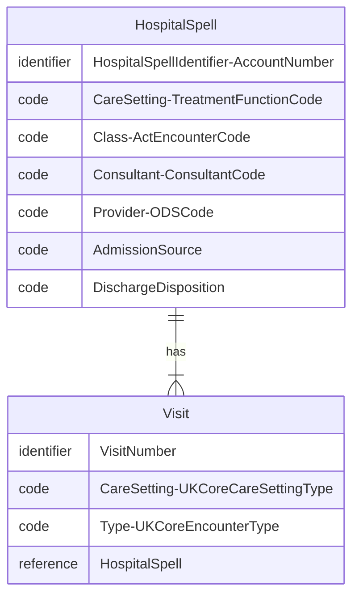

<b>HL7 v2 Segment:</b> <a href="hl7v2.html#pv1" _target="_blank">PV1</a>

## Reference

- **NHS England HL7 v2** PV1 [ADT Message Specification](https://drive.google.com/drive/folders/1FRkyZvWpZB1nCKbvQbo-eW_q9VtlR3Ws)

For detailed notes on FHIR Encounter in a NHS region, see [Yorkshire and Humberside Care Record (YHCR) - FHIR Encounter](https://fhir.interweavedigital.com/R4/StructureDefinition-Interweave-Encounter.html) ([YHCR GitHub Repository](https://github.com/yorkshire-and-humber-care-record/fhir-ig-r4))

## Entity Diagram

