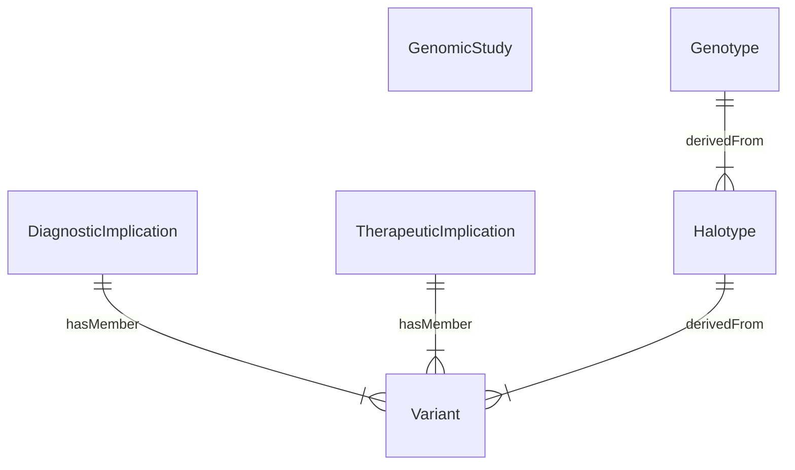

| Type      | Name                                                                     |
|-----------|--------------------------------------------------------------------------|
| Finding   | [Variant](StructureDefinition-Variant.html)                              | 
|           | Halotype                             |
|           | [Genotype](StructureDefinition-Genotype.html)                            |
| Anotation | [DiagnosticImplication](StructureDefinition-DiagnosticImplication.html)  | 
|           | [TherapeuticImplication](StructureDefinition-TherapeuticImplication.html) | 
{:.grid}
