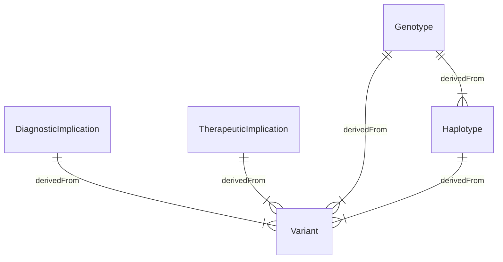

## Entity Relationships

| Type                | Name                                                                      |
|---------------------|---------------------------------------------------------------------------|
| Genomic Finding     | [Variant](StructureDefinition-Variant.html)                               | 
|                     | [Haplotype](StructureDefinition-Haplotype.html)                           |
|                     | [Genotype](StructureDefinition-Genotype.html)                             |
| Genomic Implication | [DiagnosticImplication](StructureDefinition-DiagnosticImplication.html)   | 
|                     | [TherapeuticImplication](StructureDefinition-TherapeuticImplication.html) | 
{:.grid}
