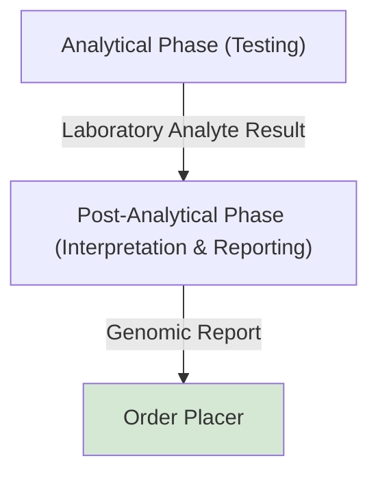

This is currently being elaborated and subject to change.

## Reference

1. [openEHR Laboratory analyte result](https://ckm.openehr.org/ckm/archetypes/1013.1.2881)

## Overview

> BCR-ABL1 concentration testing is used to monitor the amount of the fusion gene (Philadelphia chromosome) in chronic myeloid leukemia (CML) patients, with results typically reported on an International Scale (%IS) to measure treatment response.

### Analytical Phase (Testing)

This is the core stage where the targeted substance (analyte) is actually measured.
- Calibration & Quality Control (QC): Before testing patient samples, laboratory technicians calibrate the instrument and run Quality Control materials with known values to ensure the equipment is operating perfectly.
- Analysis: The processed sample is placed into an automated analyzer. Depending on the analyte, the machine uses techniques like mass spectrometry, chromatography, or colorimetric spectroscopy to quantify or detect the substance.
- Validation: The instrument produces raw data which is processed and mathematically converted into a meaningful concentration.

Output: [Laboratory Analyte Result](#laboaratory-analyte-result)

### Post-Analytical Phase (Interpretation & Reporting)

Once the analyzer generates a value, the results must be evaluated and distributed to the requesting physician or client.
- Verification: The laboratory scientist reviews the result against the laboratory's reference ranges (what is considered "normal") and validates the data quality.
- Reporting: The final validated result is transmitted to the clinician's health record or client file.
- Critical Action: If the analyte is at a dangerously abnormal level, immediate protocols (e.g., direct calls to the doctor) are enacted.Would you like to know more about how a specific clinical test (like a Comprehensive Metabolic Panel or Complete Blood Count) works, or are you interested in a specific analytical technology (like Mass Spectrometry)?

Output: [Genomic Test Report](StructureDefinition-DiagnosticReport.html)
Process Flow: [Test Results Management (LAB-5)](LTW.html#test-results-management-lab-5)

## Data Mapping

### Laboaratory Analyte Result

| openEHR                  | Data Element                                                     | HL7 v2 R32                              | LOINC / SNOMED    | HL7 FHIR                                                               | iGene                                     | Example            |
|--------------------------|------------------------------------------------------------------|-----------------------------------------|-------------------|------------------------------------------------------------------------|-------------------------------------------|--------------------|
|                          | [Patient Identifier](StructureDefinition-PatientIdentifier.html) | PID-3 Patient Identifier                |                   |                                                                        |                                            P-Number           |                                   | 
| Specimen                 |                                                                  | Specimen Number (Order Filler)          | SPM-2 Specimen ID |                                                                         DiagnosticReport.specimen                 | S-Number           |                                   |
|                          | [Report Identifier](StructureDefinition-ReportIdentifier.html)   |                                         |                   |                                                                        DiagnosticReport.identifier[PlacerNumber] | T-Number           |                                   |
|                          | [Order Number](StructureDefinition-OrderIdentifier.html)         | ORC-2 Placer Order Number               |                   |                                                                         DiagnosticReport.basedOn.identifier       | R-Number           |                                   |  
|                          | [Test Code](ValueSet-GenomicTestCodes.html)                      | OBR-4 Universalserviceidentifier        | Recommended       |                                                                       DiagnosticReport.code                     |                    | BCRABL                            |   
| Result Status            | Result Status                                                    | OBR-25 ResultStatus                     |                   | DiagnosticReport.status                                                |                                           | F                  |
| **Result**               |                                                                  |                                         |                   | DiagnosticReport.result referencing Observation                        |                                           |                    |
| - Variant                |                                                                  |                                         |                   | Observation.derivedFrom(Variant) - BCR::ABL Major (e14a2/e13a2)        |                                           |                    |
| Analysis performed time  | - Test Start DateTime                                            | TQ1-7 Startdatetime                     |                   | Observation.effectivePeriod.start and DiagnosticReport.effectivePeriod |                                           |                    |
| Analysis performed time  | - Test End DateTime                                              | TQ1-8 Enddatetime                       |                   | Observation.effectivePeriod.end and DiagnosticReport.effectivePeriod   |                                           |                    |
|                          | - Performer                                                      | OBX-16 ResponsibleObserver              |                   |                                                                         Observation.performer                     |                    |                                   |
|                          | - Status                                                         |
| Analyte name             | - Code                                                           | OBX-3 ObservationIdentifier             | Recommended       | Observation.code                                                       |                                           | BCRABL             |
| Reference range guidance | - Reference Range                                                | OBX-7 ReferenceRange                    |                   | Observation.referenceRange                                             |                                           | 0.0030-55.00       |
| Analyte result           | - Value                                                          | OBX-5 Observation Value                 |                   | Observation.valueQuantity.value                                        | (IS)                                      | 0.011              |
|                          | - Value Absent                                                   | OBX-5 Observation Value                 |                   |                                                                         Observation.dataAbsentReason.text         | (Test Description) | INVALID [Too high ABL transcript] |
|                          | - Unit                                                           | OBX-6 Units                             |                   |                                                                         Obsevation.valueQuantity.unit             |                    | % (IS)                            |
| Analyte result detail    | - **Result Detail** (see below)                                  | OBX-4 ObservationSubID (when populated) | Recommended       | Observation.component                                                  |                                           |                    |                                                              
|                          | - Device Identifier                                              | ?? OBX-18 EquipmentInstanceIdentifier   |                   |                                                                         Observation.device                        |                    |                                   |
{:.grid}

### Result Detail

These entries are expressed in Observation.component

#### BCRABL

Possible LOINC Codes for BCR-ABL:

- [69380-4](https://loinc.org/69380-4/) t(9;22)(q34.1;q11)(ABL1,BCR) b2a2+b3a2 fusion transcript/control transcript (International Scale) [# Ratio] in Blood or Tissue by Molecular genetics method

| Data Element     | Local Code    | LOINC | SNOMED | iGene                      | Data Type | Unit    | Example |
|------------------|---------------|-------|--------|----------------------------|-----------|---------|---------|
| MR                         | MR               |       |        | MR                         | String    |      | 4.52    |
| ABL_Analyte_Result         | ??               |       |        | ABL_Analyte_Result         | String    |      | ?? PASS |
| ABL_Ct                     | ABL&Ct           |       |        | ABL_Ct                     | String    |      | 12.2    |
| ABL_EndPt                  | ABL&EndPt        |       |        | ABL_EndPt                  | String    |      | 434     |
| ABL_Probe_Check_Result     | ABL&             |       |        | ABL_Probe_Check_Result     | String    |      | PASS    |
| BCR-ABL_Analyte_Result     | BCR-ABL&         |       |        | BCR-ABL_Analyte_Result     | String    |      | POS     |
| BCR-ABL_Ct                 | BCR-ABL&Ct       |       |        | BCR-ABL_Ct                 | String    |      | 30.3    |
| BCR-ABL_EndPt              | BCR-ABL&EndPt    |       |        | BCR-ABL_EndPt              | String    |      | 164     |
| BCR-ABL_Probe_Check_Result | ??               |       |        | BCR-ABL_Probe_Check_Result | String    |      | ?? PASS     |
| BCR-ABL_Target_Delta_Ct    | BCR-ABL&Delta Ct |       |        | BCR-ABL_Target_Delta_Ct    | String    |      | -18.1        |
{:.grid}
