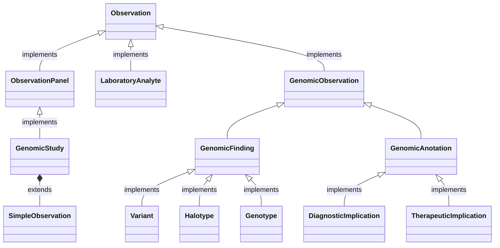
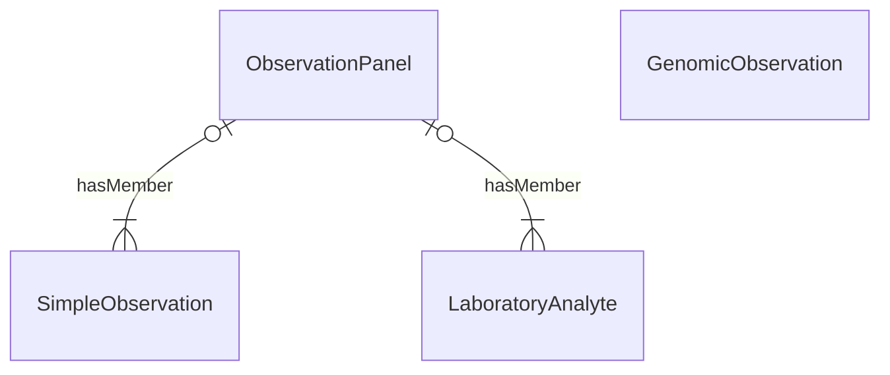

<b>HL7 v2 Segment:</b> <a href="hl7v2.html#obx" _target="_blank">OBX</a>

## Reference

- **NHS England HL7 v2** OBX [ADT Message Specification](https://drive.google.com/drive/folders/1FRkyZvWpZB1nCKbvQbo-eW_q9VtlR3Ws)

## Class Diagram

## Entity Relationships

### Logical Models

| Type                                                                                                | Use                                                                                                                                                                           | value | hasMember | component |
|-----------------------------------------------------------------------------------------------------|-------------------------------------------------------------------------------------------------------------------------------------------------------------------------------|-------|-----------|-----------|
| Simple Observation                                                                                  | Simple observations with code and values                                                                                                                                      | &#10004;      | &#x274c;          |           |
| Component Observation [Laboratory Analyte Result](StructureDefinition-LaboratoryAnalyteResult.html) | Used for transmission of results from analysers to LIMS                                                                                                                       | &#10004;      | &#x274c;        | &#10004;            |
| [Genomic Observation](StructureDefinition-GenomicObservation.html)                                  | Used for Genomic Results e.g. Variants and Diagnostic Implications                                                                                                            |       | &#x274c;          | &#10004;            |
| [Observation Panel](StructureDefinition-Observation-Panel.html)                                     | Used to group Laboratory Results (also known as battery results) e.g. Full Blood Count (FBC) and Ask At Order Questions. In HL7 v2 this is similar to the use of OBR segments |&#x274c;       |  &#10004;         |  &#x274c;         |
{:.grid}

| Type                | Name                                                                      |
|---------------------|---------------------------------------------------------------------------|
| Observation Panel | [Genomic Study](StructureDefinition-GenomicStudyPanel.html)               |
| Genomic Finding     | [Variant](StructureDefinition-Variant.html)                               | 
|                     | [Haplotype](StructureDefinition-Haplotype.html)                           |
|                     | [Genotype](StructureDefinition-Genotype.html)                             |
| Genomic Implication | [DiagnosticImplication](StructureDefinition-DiagnosticImplication.html)   | 
|                     | [TherapeuticImplication](StructureDefinition-TherapeuticImplication.html) | 
{:.grid}

