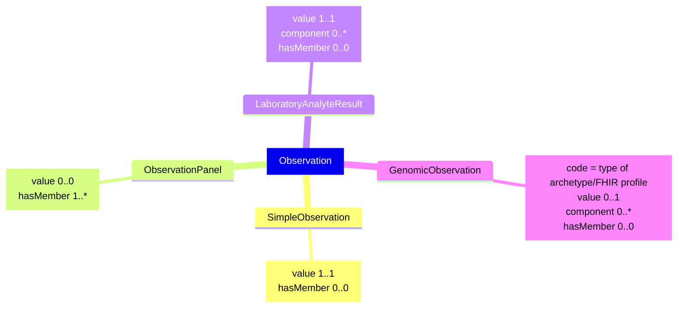

<b>HL7 v2 Segment:</b> <a href="hl7v2.html#obx" _target="_blank">OBX</a>

## Reference

- **NHS England HL7 v2** OBX [ADT Message Specification](https://drive.google.com/drive/folders/1FRkyZvWpZB1nCKbvQbo-eW_q9VtlR3Ws)

