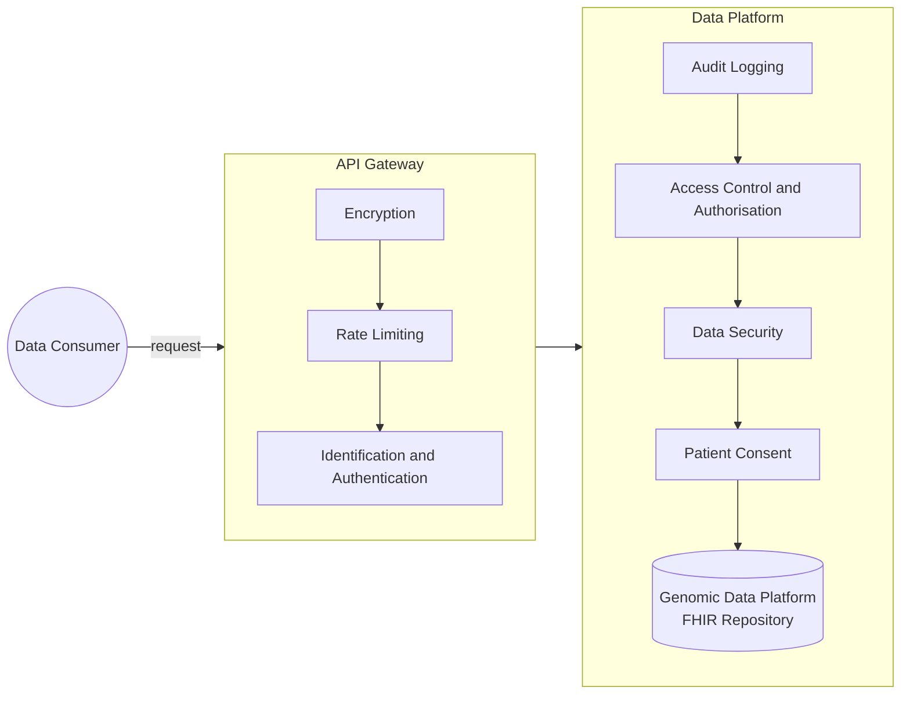
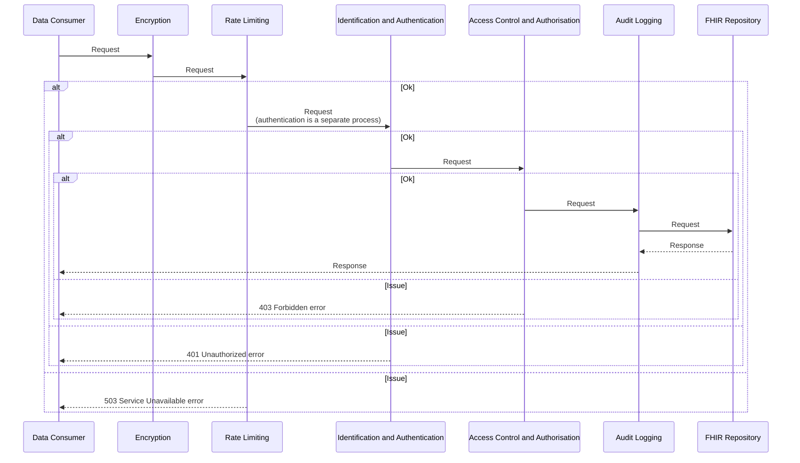
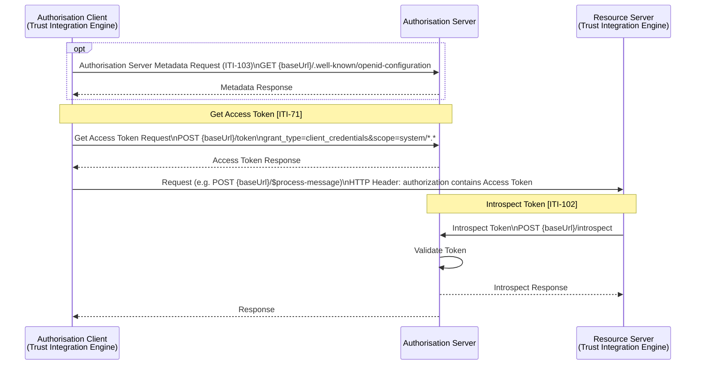
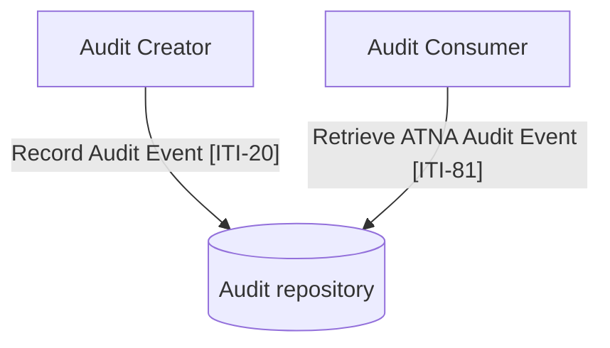
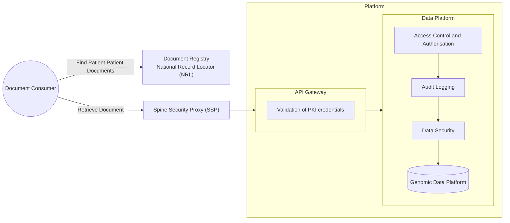

### References

- https://digital.nhs.uk/developer/guides-and-documentation/security-and-authorisation/keep-your-software-secure

### Overview

## API Gateway 

### Encryption

| Transport level integration | Requirement                                                                                                                                                                                                                                                                                                                      | 
|-----------------------------|----------------------------------------------------------------------------------------------------------------------------------------------------------------------------------------------------------------------------------------------------------------------------------------------------------------------------------|
| Protocols | TLS 1.3 is the minimum.                                                                                                                                                                                                                                                                                  |
| Prohibitions | TLS 1.0, 1.1, and SSL are forbidden.                                                                                                                                                                                                                                                                                             |
| Authentication | Mutual authentication (TLS-MA) is frequently required for API interactions. Note NHS England APIM recommends using Signed JWT Authentication.                                                                                                                                                                                    |
| Ciphers | TLS_AES_256_GCM_SHA384                                                                                                                                                                                                                                                                                                           |
| Mutual Authentication | MUST only accept client certificates issued by the NHS England Digital Deployment Issue and Resolution (DIR) team  MUST only accept client certificates with a valid Spine ‘chain of trust’ (that is, linked to the Spine SubCA and RootCA)  MUST only accept client certificates which have not expired or been revoked |
| Content compression | MUST support GZIP compression                                                                                                                                                                                                                                                                                                    |
| Transfer encoding | MUST support chunked transfer encoding                                                                                                                                                                                                                                                                                           |
{:.grid}

### Rate Limiting

This section is currently being elaborated and subject to change.

### Identification and Authentication

At present, only system-to-system identification is currently supported using OAuth2 client credentials.

NHS England user identification and authentication is: 

- Practitioner openID [NHS England CIS2 Authentication](https://digital.nhs.uk/services/care-identity-service/applications-and-services/cis2-authentication)
- Patient openID [NHS England NHS login](https://digital.nhs.uk/services/nhs-login)

## Data Platform

### Access Control and Authorisation

#### Authorisation - OAuth2

<b>Interaction:</b> <a href="IUA.html" _target="_blank">Authorisation [IUA]</a> 

Is based on [IHE Internet User Authorization (IUA)](https://profiles.ihe.net/ITI/IUA/index.html) but using `client-credentials` grant only (at present).

The authorisation will be hosted on the Regional Orchestration Engine. This is responsible for maintaining all the clients for the region.

Any Trust Integration can act as the Authorisation Client or Resource Server in the diagram below.

- **Authorisation Server Metadata Request (ITI-103)** is an optional step to retrieve the metadata for the Authorisation Server
- **Get Access Token (ITI-71)** is used to obtain the `Access Token`, the request uses basic authentication using the client id as username and client secret as the password.
- The client then performs requests to the resource server using the `Access Token` (authorisation = Bearer {accessToken})
- The resource **MUST** check the token is valid using **Introspect Token (ITI-102)**, invalid tokens will be rejected using a 403 Forbidden http code.

#### Access Control - JWT

See also [NHS England Security and authorisation](https://digital.nhs.uk/developer/guides-and-documentation/security-and-authorisation)
NHS England does not currently support detailed JWT tokens in APIM, the previous documentation can be found on [JSON Web Token Guidance](https://webarchive.nationalarchives.gov.uk/ukgwa/20250306002836/https://developer.nhs.uk/apis/nrl/guidance_jwt.html) and [Access Tokens and Audit (JWT)](https://webarchive.nationalarchives.gov.uk/ukgwa/20250307104717/https://developer.nhs.uk/apis/spine-core/security_jwt.html)

##### Scopes

FHIR Resource Scopes are used to define the permissions a client has to access a FHIR resource. See [SMART - App Launch: Scopes and Launch Context](https://build.fhir.org/ig/HL7/smart-app-launch/scopes-and-launch-context.html)

| Role Type          | Authentication Type                                                                                                                                      | Scope        | 	Grants                                                                                                           |
|--------------------|----------------------------------------------------------------------------------------------------------------------------------------------------------|--------------|-------------------------------------------------------------------------------------------------------------------|
| Patient or Citizen | User Restricted - [NHS England NHS login](https://digital.nhs.uk/services/nhs-login)                                                                     | `patient/*.rs` | Permission to read and search any resource for the current patient (see notes on wildcard scopes below).          |
| Practitioner       | User Restricted - [NHS England CIS2 Authentication](https://digital.nhs.uk/services/care-identity-service/applications-and-services/cis2-authentication) | `user/*.cruds` | Permission to read and write all resources that the current user can access (see notes on wildcard scopes below). |
| System             | Application Restricted - OAuth2 client credentials                                                                                                       | `system/*.*`   | Permission to read and write any resource.|
{:.grid}

### Audit Logging

<b>Domain Archetype:</b> <a href="StructureDefinition-AuditEvent.html" _target="_blank">AuditEvent</a> 

See [IHE Basic Audit Log Patterns (BALP)](https://profiles.ihe.net/ITI/BALP/volume-1.html)

### Patient Consent

This section is currently being elaborated and subject to change. See <a href="https://profiles.ihe.net/ITI/PCF/volume-1.html" _target="_blank">IHE Privacy Consent on FHIR (PCF)</a>.

### Data Security

All interactions must conform to this Implementation Guide, details on testing and validation are available in the [Testing](testing.html) section.

This implementation guide conforms to the following information standards:

| Guide                                                                      | Notes                                                                                                                                                                                                                                                                   |
|----------------------------------------------------------------------------|-------------------------------------------------------------------------------------------------------------------------------------------------------------------------------------------------------------------------------------------------------------------------|
| [HL7 Europe Laboratory Report](https://hl7.eu/fhir/laboratory/2.0.0/)      | EHDS                                                                                                                                                                                                                                                                    |
| [HL7 Europe Base and Core FHIR IG](https://build.fhir.org/ig/hl7-eu/base/) | EHDS                                                                                                                                                                                                                                                                    |
| [NHS Data Dictionary](https://www.datadictionary.nhs.uk/)                  |                                                                                                                                                                                                                                                                         |
| NHS England Canonical Data Model (not yet published)                       | Single Patient Record                                                                                                                                                                                                                                                   |
| [HL7 UK Core](https://digital.nhs.uk/services/fhir-uk-core)                | NHS England [DAPB4020: UK Core Fast Healthcare Interoperability Resources (FHIR) Release 4 (R4) Governance](https://digital.nhs.uk/data-and-information/information-standards/governance/latest-activity/standards-and-collections/dapb4020-uk-core-fhir-r4-governance) |
{:.grid}

## NRL and Spine Security Proxy (SSP)

Based on [National Record Locator - FHIR API v3 - Producer](https://digital.nhs.uk/developer/api-catalogue/national-record-locator-fhir/v3/producer)
and [SSP Retrieval](https://webarchive.nationalarchives.gov.uk/ukgwa/20250306000638/https://developer.nhs.uk/apis/nrl/retrieval_ssp.html)

 

### SSP Mapping 

| SSP                                        | Description                                                                                                                                                                                                          | NW FHIR AuditEvent         | Http Header      |
|--------------------------------------------|----------------------------------------------------------------------------------------------------------------------------------------------------------------------------------------------------------------------|----------------------------|------------------|
| Ssp-TraceID                                | Consumer’s TraceID - a unique identifier provided by the consumer (i.e. GUID/UUID).                                                                                                                                  | entity[transaction]        | X-Request-ID     |
| Ssp-From	                                  | Consumer’s ASID                                                                                                                                                                                                      | agent[client].who (Device) |                  |
| Ssp-To                                     | Provider’s ASID.                                                                                                                                                                                                     | agent[server].who (Device) |                  |
| Ssp-InteractionID	                         | Spine’s Interaction ID.   The interaction ID for retrieving a record referenced in an NRL pointer is a fixed value, specific to the NRL service:   urn:nhs:names:services:nrl:DocumentReference.content.read | action (and?)              |                  |
| HTTP Response Body (if the request failed) |                                                                                                                                                                                                                      | outcomeDesc                |                  |
| HTTP Status Code                           |                                                                                                                                                                                                                      | outcome                    |                  |
| Response Datetime                          |                                                                                                                                                                                                                      | recorded                   |                  |
| HTTP Request URL                           |                                                                                                                                                                                                                      | 	entity[restful]           |                  |
| ODS Code                                   |                                                                                                                                                                                                                      | agent[client]              |                  |
| Record version or equivalent               |                                                                                                                                                                                                                      |                            |                  |
| Request Datetime                           |                                                                                                                                                                                                                      | recorded                   |                  |
| Trace ID                                   |                                                                                                                                                                                                                      | entity[message]            | X-Correlation-ID |
| User ID                                    |                                                                                                                                                                                                                      | agent[user]                           |                  |
{:.grid}

Initial NW Genomics Design.

