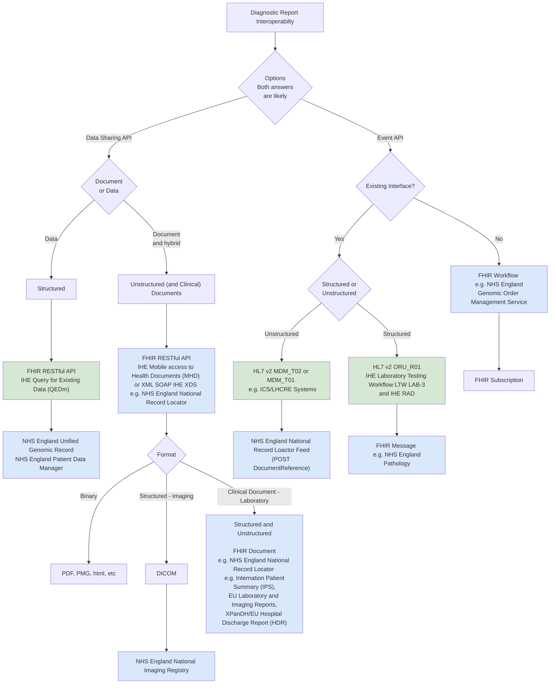

## Introduction

The architecture generally follows [Domain Driven Design [DDD]](https://en.wikipedia.org/wiki/Domain-driven_design), [Domain Driven Design](https://martinfowler.com/bliki/DomainDrivenDesign.html) and [Data Mesh](https://en.wikipedia.org/wiki/Data_mesh)

The general architecture is shown below:

 

Data Mesh
 
 

Data Sharing is based on FHIR RESTful API's, and asynchronous messaging used to deliver the orders and reports in mostly HL7 v2 and IHE Laboratory Testing Workflow (LTW) based .

The diagram below shows multiple interoperability pathways for exchanging diagnostic reports—either as structured data or documents—between systems.
It maps out which standards (FHIR, HL7 v2, IHE, XDS/MHD), APIs, and NHS England national services (UGR, NIR, NRL, Genomic OMS, etc.) are involved depending on:

- Which API is used
   - Event API
   - Data Sharing API
- Whether an existing interface already exists
- Whether the exchange is structured data or unstructured documents

NHS England services are coded in blue, while currently implemented services are coded in green.

## Enterprise Integration

The [Intermediary](ActorDefinition-Intermediary.html), North West GMSA Regional Orchestration Engine (RIE) is an [Enterprise Service Bus](https://en.wikipedia.org/wiki/Enterprise_service_bus) most commonly known in the NHS as a Trust Integration Engine (TIE).

This implements as series of [Enterprise Integration Patterns](https://www.enterpriseintegrationpatterns.com/patterns/messaging/) based around messaging; the diagrams below follow conventions used for these patterns.

The ESB has a [Canonical Data Model](https://www.enterpriseintegrationpatterns.com/patterns/messaging/CanonicalDataModel.html) which is expressed in this Implementation Guide using HL7 FHIR. This model is common to all the exchange formats used in the ESB:

- JSON [HL7 FHIR](https://hl7.org/fhir/)
- pipe+hat [HL7 v2](https://en.wikipedia.org/wiki/Health_Level_7)
- potential use case for sharing reports: XML [IHE XDS.b](https://profiles.ihe.net/ITI/TF/Volume1/ch-10.html)

### Enterprise Data Contracts

This canonical model is a mandatory extension to [HL7 UK Core](https://simplifier.net/guide/ukcoreversionhistory) and includes requirements from 
- [NHS England HL7 v2 ADT Message Specification](https://drive.google.com/drive/folders/1FRkyZvWpZB1nCKbvQbo-eW_q9VtlR3Ws)
- [Digital Health and Care Wales - HL7 ORU_R01 2.5.1 Implementation Guide](https://nw-gmsa.github.io/R4/DHCW-HL7-v2-5-1-ORUR01-Specification.pdf)
- [Royal College of Radiologist](https://www.rcr.ac.uk/media/wwtp2mif/rcr-publications_radiology-reporting-networks-understanding-the-technical-options_march-2022.pdf)
- [IHE Europe Metadata for exchange medical documents and images](https://www.ihe-europe.net/sites/default/files/2017-11/IHE_ITI_XDS_Metadata_Guidelines_v1.0.pdf) see UK content.
- [NHS Data Model and Dictionary](https://www.datadictionary.nhs.uk/)
- [NHS Canonical Data Model](https://future.nhs.uk/DataArchitecture/view?objectId=59464656)

These are detailed in [Data Contracts](data-intro.html) with standard-specific versions:

- [HL7 FHIR (R4)](artifacts.html)
- [HL7 v2 (2.5.1)](hl7v2.html)
- [IHE XDS](StructureDefinition-DocumentReference.html)

> This canonical model is not specific to Genomics. It is focused on standard message construction patterns in particular [CorrelationIdentifier](https://www.enterpriseintegrationpatterns.com/patterns/messaging/CorrelationIdentifier.html) such as Order Numbers and Episode/Stay Identifiers and use of Clinical Coding Systems such as UK SNOMED CT. 
> 
> Genomic-Specific modeling, which this model supports, can be found on [NHS England FHIR Genomics Implementation Guide](https://simplifier.net/guide/fhir-genomics-implementation-guide)

### Enterprise Workflow Interactions

To support genomics workflow, this guide is aligned to enterprise workflow processes described in [IHE Laboratory Testing Workflow](LTW.html), terminology from this guide especially around Actors is used throughout this Implementation Guide.

### Security

See [API Security](api-security.html)
