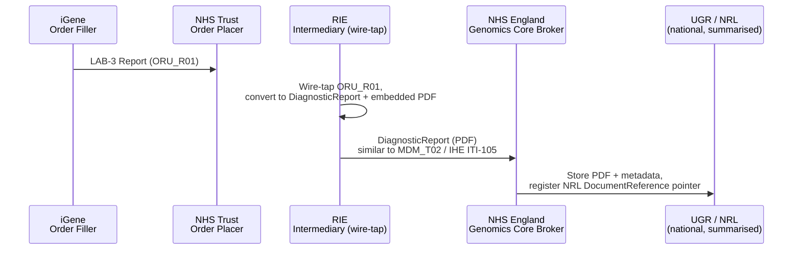
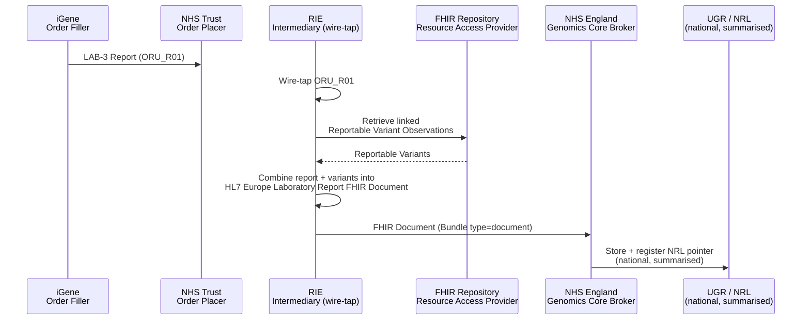

This is currently being elaborated and subject to change.

ctDNA reports to the NHS England Unified Genomic Record (UGR) - future integration.

## References

1. NHS England - ctDNA UGR Solution Design (internal NHS England document, not publicly linked)
2. [06 - EU Laboratory Report: FHIR Messages to a FHIR Document](https://github.com/nw-gmsa/Testing/blob/main/notebooks/06-eu-laboratory-report-fhir-document.ipynb) - Phase 2 worked example
3. [Regional Integration Engine (RIE) - Shared Care Record Feeds](overview.html#shared-care-record-feeds---wire-tap-on-lab-3oru_r01) - the existing wire-tap this reuses
4. [HIE - Sharing Laboratory Reports (Document)](HIE.html#sharing-laboratory-reports-document-iti-105-and-mdm_t02) - the IHE ITI-105/MDM_T02 pattern Phase 1 resembles
5. [OMICS DSS Result Integration](reportable-variants.html) - source of the Reportable Variant Observations Phase 2 combines with the report
6. [nw-gmsa/Testing - ctdna9737383222-eulab-document.json](https://github.com/nw-gmsa/Testing/blob/main/Input/FHIR/R01/ctdna9737383222-eulab-document.json) - Phase 2 example

## Actors

| IHE Actor                                                                | Role                                                                                                          |
|-------------------------------------------------------------------------------|----------------------------------------------------------------------------------------------------------------|
| [Order Filler](ActorDefinition-OrderFiller.html)                                 | iGene (NW Genomics master LIMS) - originates the LAB-3 report that is wire-tapped                              |
| [Order Placer](ActorDefinition-OrderPlacer.html)                                 | NHS Trust - the original recipient of the LAB-3 report                                                         |
| [Intermediary](ActorDefinition-Intermediary.html)                              | Regional Integration Engine (RIE) - wire-taps LAB-3/`ORU_R01` and builds the document sent to the national solution |
| [Resource Access Provider](ActorDefinition-ResourceAccessProvider.html)          | FHIR Repository - source of the Reportable Variant Observations Phase 2 combines with the report                |
| [Document Consumer](ActorDefinition-DocumentConsumer.html)                       | NHS England Genomics Core Broker / Unified Genomic Record (UGR) - national solution, stores the report and registers a National Record Locator (NRL) pointer |
{:.grid}

## Transactions

| Transaction                                                          | Description                                                                                    | Direction              |
|--------------------------------------------------------------------------|----------------------------------------------------------------------------------------------------|----------------------------|
| Wire-tap on LAB-3/`ORU_R01`, similar to HL7 v2 `MDM_T02` (could become IHE ITI-105 FHIR) | RIE converts the wire-tapped report into a `DiagnosticReport` with an embedded PDF (Phase 1)         | RIE → NHS England Genomics Core Broker |
| FHIR Document (`Bundle` type `document`)                                 | RIE combines the wire-tapped report with Reportable Variant Observations and wraps the result in an HL7 Europe Laboratory Report FHIR Document (Phase 2) | RIE → NHS England Genomics Core Broker |
| National processing (summarised only)                                    | The Core Broker stores the report/PDF in the UGR and registers a `DocumentReference` pointer with the National Record Locator (NRL) | Core Broker → UGR / NRL    |
| HL7 v2 `ORU_R01` (future, proposed NW Genomics service)                  | Converts a stored ctDNA report (Phase 1 or 2) back into an `ORU_R01`, reusing the [established LAB-3 feed](LTW.html#lab-3-process-flow) | UGR → RIE → NHS Trust      |
{:.grid}

## Current Process

There is currently no integration with the NHS England Unified Genomic Record (UGR). ctDNA Laboratory Reports (LAB-3) are distributed to NHS Trusts as usual - see [Regional Integration Engine (RIE) - Current Process](overview.html#current-process). The same LAB-3 wire-tap that generates the [Greater Manchester Care Record MDM_T02 feed](overview.html#shared-care-record-feeds---wire-tap-on-lab-3oru_r01) does not yet extend to the UGR; this page describes the two planned phases for adding that feed.

## Future Process

### Phase 1: PDF Report + NRL Pointer

The RIE wire-taps the LAB-3/`ORU_R01` feed (the same wire-tap already used for the Greater Manchester Care Record) and converts it into a `DiagnosticReport` with the report PDF embedded as an attachment. This is sent to the NHS England Genomics Core Broker - at a high level this is similar to both HL7 v2 `MDM_T02` and IHE ITI-105 (Simplified Publish); ITI-105, being FHIR-based, could in principle be used instead of a bespoke feed.

The Core Broker (a national component, summarised only - see [References](#references) for the NHS England solution design) verifies the patient, stores the PDF and report metadata in the UGR, and converts the report into a `DocumentReference` pointer registered with the National Record Locator (NRL), making it discoverable by other care settings.

### Phase 2: Structured FHIR Document (EU Laboratory Report)

Phase 2, elaborated in notebook [06 - EU Laboratory Report: FHIR Messages to a FHIR Document](https://github.com/nw-gmsa/Testing/blob/main/notebooks/06-eu-laboratory-report-fhir-document.ipynb), again wire-taps the LAB-3/`ORU_R01` feed, but this time the RIE also retrieves the linked Reportable Variant Observations (see [OMICS DSS Result Integration](reportable-variants.html)) from the FHIR Repository and combines them with the report. The result is wrapped in an HL7 Europe Laboratory Report FHIR Document - a `Composition`-led `Bundle` of type `document` - and sent to the national solution, corresponding to the "Future Composition / Aggregated Laboratory Report" placeholder in [overview.md](overview.html#future-composition--aggregated-laboratory-report).

### Future: Converting UGR Reports back to ORU_R01

It is likely that NHS Trusts' EPRs will continue to require `ORU_R01` for the foreseeable future, so there is likely to be a need to convert ctDNA reports - from either phase - back into `ORU_R01`. This conversion, and delivery of the resulting LAB-3 report, is potentially a service NW Genomics could provide for NHS Trusts, reusing the [established LAB-3 feed](LTW.html#lab-3-process-flow) already used to distribute reports (see [overview.md](overview.html)).

## Data Models

- [DiagnosticReport](StructureDefinition-DiagnosticReport.html) - Phase 1's report, with the PDF carried as an embedded attachment
- [Variant (Reportable Variant)](StructureDefinition-Variant.html) - the discrete result Observations Phase 2 combines into the report, following the [HL7 Genomics Reporting IG](https://build.fhir.org/ig/HL7/genomics-reporting/)
- HL7 Europe Laboratory Report FHIR Document (`Composition`-led `Bundle`, type `document`) - see [HIE - Document Exchange (MHD)](HIE.html#document-exchange-mhd) for the general document-sharing pattern this follows

The `DocumentReference` NRL pointer is a national NHS England resource, registered by the Core Broker - not a resource this IG defines or produces.

## Examples

| Phase   | Example                                                                                     | Source                                                                                                             |
|-------------|--------------------------------------------------------------------------------------------------|--------------------------------------------------------------------------------------------------------------------|
| Phase 2 | [Bundle-ctdna9737383222-eulab-document](Bundle-ctdna9737383222-eulab-document.html)              | [ctdna9737383222-eulab-document.json](https://github.com/nw-gmsa/Testing/blob/main/Input/FHIR/R01/ctdna9737383222-eulab-document.json) |
{:.grid}

No Phase 1 example (`DiagnosticReport` with embedded PDF) is published yet for this scenario.

## Developer Guides

- [06 - EU Laboratory Report: FHIR Messages to a FHIR Document](https://github.com/nw-gmsa/Testing/blob/main/notebooks/06-eu-laboratory-report-fhir-document.ipynb) - builds the Phase 2 FHIR Document from the same ctDNA source data as notebooks 04/05
- [04 - Reports: HL7 v2 `ORU^R01` into FHIR](https://github.com/nw-gmsa/Testing/blob/main/notebooks/04-laboratory-report-fhir-from-hl7v2.ipynb) - the wire-tap conversion both phases build on

See [Developer Guides](DeveloperGuides.html) for the full notebook series.
