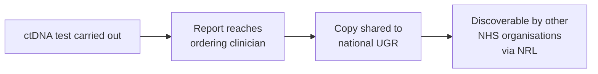
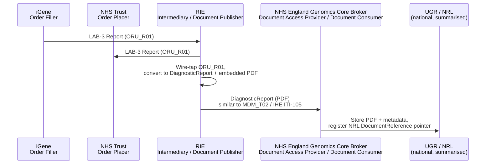
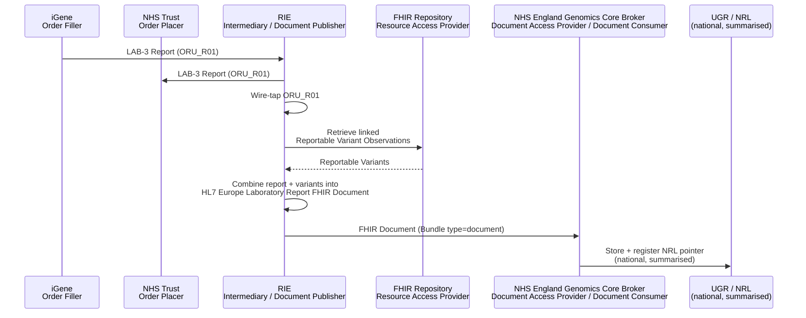
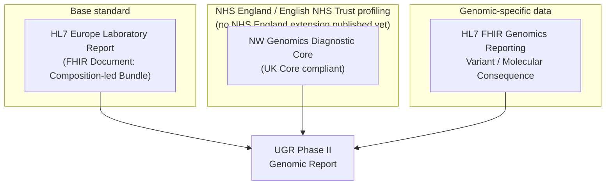
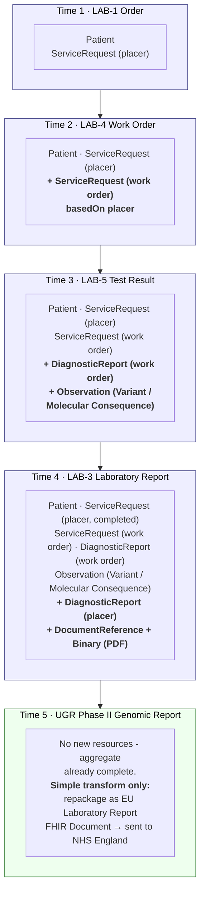

This is for information and analysis purposes only and is not in active development.

ctDNA reports to the NHS England Unified Genomic Record (UGR) - future integration.

## References

1. NHS England - ctDNA UGR Solution Design (internal NHS England document, not publicly linked)
2. [06 - EU Laboratory Report: FHIR Messages to a FHIR Document](https://github.com/nw-gmsa/Testing/blob/main/notebooks/06-eu-laboratory-report-fhir-document.ipynb) - Phase 2 worked example
3. [Regional Shared Care Records](RegionalSharedCareRecords.html) - the existing wire-tap this reuses
4. [HIE - Sharing Laboratory Reports (Document)](HIE.html#sharing-laboratory-reports-document-iti-105-and-mdm_t02) - the IHE ITI-105/MDM_T02 pattern Phase 1 resembles
5. [OMICS DSS Result Integration](reportable-variants.html) - source of the Reportable Variant Observations Phase 2 combines with the report
6. [nw-gmsa/Testing - ctdna9737383222-eulab-document.json](https://github.com/nw-gmsa/Testing/blob/main/Input/FHIR/R01/ctdna9737383222-eulab-document.json) - Phase 2 example
7. [HL7 Europe Laboratory Report FHIR IG](https://build.fhir.org/ig/hl7-eu/laboratory/) - the base standard Phase 2 assumes NHS England will adopt for UGR
8. [NHS England Pathology FHIR Implementation Guide](https://simplifier.net/guide/pathology-fhir-implementation-guide?version=0.5.1) (Simplifier) - the same base standard, already adopted for NHS England Pathology
9. [HL7 FHIR Genomics Reporting IG](https://build.fhir.org/ig/HL7/genomics-reporting/) - supplies the genomic-specific data (Variant/Molecular Consequence) Phase 2 adds to the EU Laboratory Report base

## Clinical Pathway Overview

### What is being tested

This page is about making a **copy** of an existing ctDNA report discoverable
nationally - it isn't about the test itself. The underlying test is the same
ctDNA (circulating tumour DNA) blood test used to select or monitor targeted
cancer treatment (for example the M4.14 Non-Small Cell Lung Cancer panel) - see
[NE&Y Management Information (ctDNA)](NEYManagementInformation.html#what-is-being-tested)
for the clinical detail of what that test looks for.

### The end-to-end clinical journey

1. **ctDNA test carried out** - a patient has ctDNA testing as part of cancer diagnosis, treatment selection or monitoring, following the same journey as any other ctDNA test.
2. **Report reaches the ordering clinician** - NW Genomics reports the result as usual.
3. **Copy shared to the national UGR** - a copy of the report is also shared to the NHS England Unified Genomic Record: as a PDF with a discovery pointer (Phase 1), or as a structured FHIR Document combining the report with its Reportable Variants (Phase 2).
4. **Discoverable elsewhere** - if the patient is later seen at a different NHS organisation, an authorised clinician there - not just the original ordering team - can discover and view the report via the National Record Locator.

```mermaid
flowchart LR
    A[ctDNA test carried out] --> B[Report reaches<br/>ordering clinician]
    B --> C[Copy shared to<br/>national UGR]
    C --> D[Discoverable by other<br/>NHS organisations<br/>via NRL]
```

### Why this matters for developers

- This is a **copy/sharing** mechanism layered on top of the existing report - it doesn't change how the test is ordered or reported to the originating clinician.
- Phase 1 shares only the PDF and minimal metadata; Phase 2 additionally shares the structured Reportable Variant data - see [Future Process](#future-process) below for what that difference means for a receiving clinician.

## Actors

| IHE Actor                                                                | Role                                                                                                          |
|-------------------------------------------------------------------------------|----------------------------------------------------------------------------------------------------------------|
| [Order Filler](ActorDefinition-OrderFiller.html)                                 | iGene (NW Genomics master LIMS) - originates the LAB-3 report that is wire-tapped                              |
| [Order Placer](ActorDefinition-OrderPlacer.html)                                 | NHS Trust - the original recipient of the LAB-3 report                                                         |
| [Intermediary](ActorDefinition-Intermediary.html) / [Document Publisher](ActorDefinition-DocumentPublisher.html) | Regional Integration Engine (RIE) - wire-taps LAB-3/`ORU_R01`, builds the document and publishes it to the national solution |
| [Resource Access Provider](ActorDefinition-ResourceAccessProvider.html)          | FHIR Repository - source of the Reportable Variant Observations Phase 2 combines with the report                |
| [Document Access Provider](ActorDefinition-DocumentAccessProvider.html) / [Document Consumer](ActorDefinition-DocumentConsumer.html) | NHS England Genomics Core Broker / Unified Genomic Record (UGR) / National Record Locator (NRL) - national solution: stores the report, indexes and registers a discovery pointer (Document Access Provider), and is itself the initial recipient of the RIE's published document (Document Consumer) |
{:.grid}

## Transactions

| Transaction                                                          | Description                                                                                    | Direction              |
|--------------------------------------------------------------------------|----------------------------------------------------------------------------------------------------|----------------------------|
| Wire-tap on LAB-3/`ORU_R01`, similar to HL7 v2 `MDM_T02` (could become IHE ITI-105 FHIR) | RIE converts the wire-tapped report into a `DiagnosticReport` with an embedded PDF (Phase 1)         | RIE → NHS England Genomics Core Broker |
| FHIR Document (`Bundle` type `document`)                                 | RIE combines the wire-tapped report with Reportable Variant Observations and wraps the result in an HL7 Europe Laboratory Report FHIR Document (Phase 2) | RIE → NHS England Genomics Core Broker |
| National processing (summarised only)                                    | The Core Broker stores the report/PDF in the UGR and registers a `DocumentReference` pointer with the National Record Locator (NRL) | Core Broker → UGR / NRL    |
| HL7 v2 `ORU_R01` (future, proposed NW Genomics service)                  | Converts a stored ctDNA report (Phase 1 or 2) back into an `ORU_R01`, reusing the [established LAB-3 feed](LTW.html#lab-3-process-flow) | UGR → RIE → NHS Trust      |
{:.grid}

## Current Process

There is currently no integration with the NHS England Unified Genomic Record (UGR). ctDNA Laboratory Reports (LAB-3) are distributed to NHS Trusts as usual - see [Regional Integration Engine (RIE) - Current Process](overview.html#current-process). The same LAB-3 wire-tap used for [Regional Shared Care Records](RegionalSharedCareRecords.html) does not yet extend to the UGR; this page describes the two planned phases for adding that feed.

## Future Process

### Phase 1: PDF Report + NRL Pointer

The RIE (also acting as [Document Publisher](ActorDefinition-DocumentPublisher.html) here, the same role it plays on [Regional Shared Care Records](RegionalSharedCareRecords.html)) wire-taps the LAB-3/`ORU_R01` feed (the same wire-tap already used for [Regional Shared Care Records](RegionalSharedCareRecords.html) - see that page for the existing filter/convert process this reuses) and converts it into a `DiagnosticReport` with the report PDF embedded as an attachment. This is sent to the NHS England Genomics Core Broker - at a high level this is similar to both HL7 v2 `MDM_T02` and IHE ITI-105 (Simplified Publish); ITI-105, being FHIR-based, could in principle be used instead of a bespoke feed.

The Core Broker (a national component, summarised only - see [References](#references) for the NHS England solution design) verifies the patient, stores the PDF and report metadata in the UGR, and converts the report into a `DocumentReference` pointer registered with the National Record Locator (NRL), making it discoverable by other care settings.

```mermaid
sequenceDiagram
    participant iGene as iGene<br/>Order Filler
    participant Trust as NHS Trust<br/>Order Placer
    participant RIE as RIE<br/>Intermediary / Document Publisher
    participant Broker as NHS England Genomics Core Broker<br/>Document Access Provider / Document Consumer
    participant UGR as UGR / NRL<br/>(national, summarised)

    iGene ->> RIE: LAB-3 Report (ORU_R01)
    RIE ->> Trust: LAB-3 Report (ORU_R01)
    RIE ->> RIE: Wire-tap ORU_R01,<br/>convert to DiagnosticReport + embedded PDF
    RIE ->> Broker: DiagnosticReport (PDF)<br/>similar to MDM_T02 / IHE ITI-105
    Broker ->> UGR: Store PDF + metadata,<br/>register NRL DocumentReference pointer
```

### Phase 2: Structured FHIR Document (EU Laboratory Report)

Phase 2, elaborated in notebook [06 - EU Laboratory Report: FHIR Messages to a FHIR Document](https://github.com/nw-gmsa/Testing/blob/main/notebooks/06-eu-laboratory-report-fhir-document.ipynb), again wire-taps the LAB-3/`ORU_R01` feed, but this time the RIE also retrieves the linked Reportable Variant Observations (see [OMICS DSS Result Integration](reportable-variants.html)) from the FHIR Repository and combines them with the report. The result is wrapped in an HL7 Europe Laboratory Report FHIR Document - a `Composition`-led `Bundle` of type `document` - and sent to the national solution, corresponding to the "Future Composition / Aggregated Laboratory Report" placeholder in [overview.md](overview.html#future-composition--aggregated-laboratory-report).

```mermaid
sequenceDiagram
    participant iGene as iGene<br/>Order Filler
    participant Trust as NHS Trust<br/>Order Placer
    participant RIE as RIE<br/>Intermediary / Document Publisher
    participant FHIRRepo as FHIR Repository<br/>Resource Access Provider
    participant Broker as NHS England Genomics Core Broker<br/>Document Access Provider / Document Consumer
    participant UGR as UGR / NRL<br/>(national, summarised)

    iGene ->> RIE: LAB-3 Report (ORU_R01)
    RIE ->> Trust: LAB-3 Report (ORU_R01)
    RIE ->> RIE: Wire-tap ORU_R01
    RIE ->> FHIRRepo: Retrieve linked<br/>Reportable Variant Observations
    FHIRRepo -->> RIE: Reportable Variants
    RIE ->> RIE: Combine report + variants into<br/>HL7 Europe Laboratory Report FHIR Document
    RIE ->> Broker: FHIR Document (Bundle type=document)
    Broker ->> UGR: Store + register NRL pointer<br/>(national, summarised)
```

### Future: Converting UGR Reports back to ORU_R01

It is likely that NHS Trusts' EPRs will continue to require `ORU_R01` for the foreseeable future, so there is likely to be a need to convert ctDNA reports - from either phase - back into `ORU_R01`. This conversion, and delivery of the resulting LAB-3 report, is potentially a service NW Genomics could provide for NHS Trusts, reusing the [established LAB-3 feed](LTW.html#lab-3-process-flow) already used to distribute reports (see [overview.md](overview.html)).

## Data Architecture

This is an assumption, based on public information and analysis only - NHS England has not confirmed this design for UGR Phase II.

### Standards composition

We assume NHS England will adopt, for UGR Phase II, a FHIR Document conforming to the [HL7 Europe Laboratory Report](https://build.fhir.org/ig/hl7-eu/laboratory/) - the same base standard already adopted for [NHS England Pathology](https://simplifier.net/guide/pathology-fhir-implementation-guide?version=0.5.1). This forms the base of the aggregate, supplemented with genomics-specific data models from the [HL7 FHIR Genomics Reporting IG](https://build.fhir.org/ig/HL7/genomics-reporting/).

NHS England has not specified an England-specific extension to EU Core/Laboratory Report. The NW Genomics core data model - see [Diagnostic Core](overview.html#diagnostic-core) - already contains a proven set of profiles matching numerous NHS England and English NHS Trust core data requirements. UK Core on its own is not considered sufficient for this purpose (it is a base HL7 standard, not a laboratory data contract), and the NW Core profiles are themselves UK Core compliant.

In short:

> UGR Phase II = EU Laboratory Report **+** (NHS England / English NHS Trust profiling) **+** HL7 FHIR Genomic Reporting

```mermaid
flowchart TB
    subgraph Base["Base standard"]
        EU["HL7 Europe Laboratory Report<br/>(FHIR Document: Composition-led Bundle)"]
    end
    subgraph Profiling["NHS England / English NHS Trust profiling<br/>(no NHS England extension published yet)"]
        NW["NW Genomics Diagnostic Core<br/>(UK Core compliant)"]
    end
    subgraph Genomic["Genomic-specific data"]
        GR["HL7 FHIR Genomics Reporting<br/>Variant / Molecular Consequence"]
    end
    UGR["UGR Phase II<br/>Genomic Report"]

    EU --> UGR
    NW --> UGR
    GR --> UGR
```

*NHS England Pathology follows the same EU Laboratory Report base - UGR Phase II adds genomic-specific data and NW's own NHS England/Trust-aligned profiling on top of it.*

### Building the aggregate: Domain Driven Design

The overall design follows the [Domain Driven Design Aggregate pattern already used elsewhere in this IG](overview.html#future-composition--aggregated-laboratory-report): the events below assemble, over time, the aggregate that the UGR Phase II Genomic Report needs, in the FHIR Repository.

1. **LAB-1 - Order.** NHS Trusts order in either electronic or paper form. This creates/updates `Patient`, and (electronic orders only) creates the placer `ServiceRequest`. The order is also sent to iGene (future: StarLIMS) LIMS. See [Regional Orders and Reports](RegionalOrdersAndReports.html).
2. **LAB-4 - Work Order.** ctDNA work orders are exported from iGene and used to create child `ServiceRequest`s, `basedOn` the original LAB-1 order above. For manual (paper) orders, the `Patient` and the original order are created/updated at this step instead. See [NE&Y Management Information](NEYManagementInformation.html) and [OMICS DSS Result Integration](reportable-variants.html) for example use cases.
3. **LAB-5 - Test Result.** The first step to follow the [HL7 FHIR Genomics Reporting IG](https://build.fhir.org/ig/HL7/genomics-reporting/) - a work in progress, described in [OMICS DSS Result Integration](reportable-variants.html). Produces a `DiagnosticReport` (linked to the LAB-4 work order `ServiceRequest`) and results as FHIR `Observation`s conforming to the [Variant](StructureDefinition-Variant.html) and Molecular Consequence profiles. Stored in the FHIR Repository and sent to iGene.
4. **LAB-3 - Laboratory Report.** A further `DiagnosticReport` (in the FHIR Repository), linked to the original LAB-1 order, plus a `DocumentReference` with an attached `Binary` holding the PDF. The original placer `ServiceRequest` is updated to `completed`. As well as being stored in the FHIR Repository, this is sent back to the order-placing NHS Trust. See [Regional Orders and Reports](RegionalOrdersAndReports.html).
5. **Create UGR Phase II Genomic Report.** By this point the aggregate is already complete - the previous four steps have created every FHIR resource needed. Triggered by the LAB-3 event message, this step is therefore a simple transform, not further assembly: the same resources are repackaged (with whatever changes are needed to meet NHS England's requirements) into an EU Laboratory Report FHIR Document and sent to NHS England for national sharing of the report - see [Phase 2: Structured FHIR Document (EU Laboratory Report)](#phase-2-structured-fhir-document-eu-laboratory-report) below.

```mermaid
flowchart TB
    subgraph T1["Time 1 · LAB-1 Order"]
        R1["Patient<br/>ServiceRequest (placer)"]
    end
    subgraph T2["Time 2 · LAB-4 Work Order"]
        R2["Patient · ServiceRequest (placer)<br/><b>+ ServiceRequest (work order)</b><br/><b>basedOn placer</b>"]
    end
    subgraph T3["Time 3 · LAB-5 Test Result"]
        R3["Patient · ServiceRequest (placer)<br/>ServiceRequest (work order)<br/><b>+ DiagnosticReport (work order)</b><br/><b>+ Observation (Variant /<br/>Molecular Consequence)</b>"]
    end
    subgraph T4["Time 4 · LAB-3 Laboratory Report"]
        R4["Patient · ServiceRequest (placer, completed)<br/>ServiceRequest (work order) · DiagnosticReport (work order)<br/>Observation (Variant / Molecular Consequence)<br/><b>+ DiagnosticReport (placer)</b><br/><b>+ DocumentReference + Binary (PDF)</b>"]
    end
    subgraph T5["Time 5 · UGR Phase II Genomic Report"]
        R5["No new resources - aggregate<br/>already complete.<br/><b>Simple transform only:</b><br/>repackage as EU Laboratory Report<br/>FHIR Document → sent to NHS England"]
    end

    T1 --> T2 --> T3 --> T4 --> T5

    classDef stage fill:#eef,stroke:#448,color:#000;
    class T1,T2,T3,T4 stage;
    classDef final fill:#efe,stroke:#484,color:#000;
    class T5 final;
```

*The aggregate held in the FHIR Repository only ever grows - each stage carries forward every resource from the stage before it (plain text) and adds the new resources that stage's event contributes (**bold**). By LAB-3 (Time 4) the aggregate is already complete, so the LAB-3 event simply triggers Time 5 - a transform, not further assembly.*

## Data Models

- [DiagnosticReport](StructureDefinition-DiagnosticReport.html) - Phase 1's report, with the PDF carried as an embedded attachment
- [Variant (Reportable Variant)](StructureDefinition-Variant.html) - the discrete result Observations Phase 2 combines into the report, following the [HL7 Genomics Reporting IG](https://build.fhir.org/ig/HL7/genomics-reporting/)
- HL7 Europe Laboratory Report FHIR Document (`Composition`-led `Bundle`, type `document`) - see [HIE - Document Exchange (MHD)](HIE.html#document-exchange-mhd) for the general document-sharing pattern this follows

The `DocumentReference` NRL pointer is a national NHS England resource, registered by the Core Broker - not a resource this IG defines or produces.

## Examples

| Phase   | Example                                                                                     | Source                                                                                                             |
|-------------|--------------------------------------------------------------------------------------------------|--------------------------------------------------------------------------------------------------------------------|
| Phase 2 | [Bundle-ctdna9737383222-eulab-document](Bundle-ctdna9737383222-eulab-document.html)              | [ctdna9737383222-eulab-document.json](https://github.com/nw-gmsa/Testing/blob/main/Input/FHIR/R01/ctdna9737383222-eulab-document.json) |
{:.grid}

No Phase 1 example (`DiagnosticReport` with embedded PDF) is published yet for this scenario.

## Security Considerations

Includes:

- OAuth2 Standard for [Authorisation](api-security.html#authorisation---oauth2)
  - including use of JWT access tokens and future support for [SMART-on-FHIR Scopes](api-security.html#scopes)
- FHIR AuditEvent/IHE BALP for [Audit Logging](api-security.html#audit-logging)
- TLS for [Transport Security/Encryption](api-security.html#encryption)

## Developer Guides

- [06 - EU Laboratory Report: FHIR Messages to a FHIR Document](https://github.com/nw-gmsa/Testing/blob/main/notebooks/06-eu-laboratory-report-fhir-document.ipynb) - builds the Phase 2 FHIR Document from the same ctDNA source data as notebooks 04/05
- [04 - Reports: HL7 v2 `ORU^R01` into FHIR](https://github.com/nw-gmsa/Testing/blob/main/notebooks/04-laboratory-report-fhir-from-hl7v2.ipynb) - the wire-tap conversion both phases build on

See [Developer Guides](DeveloperGuides.html) for the full notebook series.
