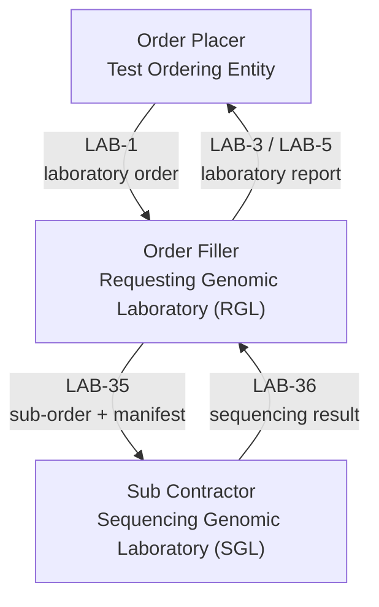

This is currently being elaborated and subject to change.

## References

1. [Inter-Laboratory Workflow (ILW) - Sub-orders LAB-35 and LAB-36](ILW.html#sub-orders-lab-35-and-lab-36)
2. [laboratory-order MessageDefinition](MessageDefinition-laboratory-order.html)
3. [HL7 v2 Standards](hl7v2.html)
4. NHS England `RGL to SGL SOP` (37-field national digital manifest, Appendix 3) - referenced by name only, not publicly linked

## Actors

| IHE Actor (ILW)                                     | Role in dWGS                                    | System (worked examples)             |
|-------------------------------------------------------|----------------------------------------------------|------------------------------------------|
| [Requestor](ActorDefinition-Requestor.html) (Order Placer) | Requesting Genomic Laboratory (RGL)             | NE&Y Genomics                            |
| [Subcontractor](ActorDefinition-Subcontractor.html) (Order Filler) | Sequencing Genomic Laboratory (SGL)     | NW Genomics (iGene)                      |
{:.grid}

## Transactions

| Transaction | Description                          | Direction         |
|-------------|-----------------------------------------|------------------------|
| `LAB-1`     | Laboratory Order (original clinical order, upstream of this sub-order) | Test Ordering Entity → RGL |
| `LAB-35`    | Sub-order Management (sample + digital manifest) | RGL → SGL          |
| `LAB-36`    | Sub-order Results Delivery (sequencing result)   | SGL → RGL          |
| `LAB-3` / `LAB-5` | Laboratory Report (downstream of this sub-order) | RGL → Test Ordering Entity |
{:.grid}

## Current Process

Whole Genome Sequencing (WGS) for rare and inherited disease is being moved by NHS
England from a single centralised laboratory to a **distributed model (dWGS)**: each
NHS Genomic Medicine Service (GMS) geography's own laboratory acts as a
**Requesting Genomic Laboratory (RGL)**, submitting DNA samples and a digital manifest
directly to whichever laboratory is acting as **Sequencing Genomic Laboratory (SGL)**
for that sample - which may be another GMS's laboratory rather than the RGL's own.

Where the RGL and SGL are different organisations, this is a **sub-contracted order**:
in NW-GMSA's own [Inter-Laboratory Workflow (ILW)](ILW.html#sub-orders-lab-35-and-lab-36)
terms, the RGL is the *Order Placer* sending a `LAB-35` sub-order to the SGL (the
*Order Filler*), with the sequencing result returned as `LAB-36`. That sub-order can be
sent as either a FHIR `Bundle` (`POST [base]/$process-message`, the
[laboratory-order `MessageDefinition`](MessageDefinition-laboratory-order.html)) or
HL7 v2 `OML^O21` (see [HL7 v2 Standards](hl7v2.html)) - both follow the same underlying
NW-GMSA order model, so the choice is purely about what the sending system can produce.

### Singleton, Duo and Trio testing

A WGS referral tests one or more people together as a single family group, so that
variants found in the person affected by the suspected condition (the **Proband**) can
be interpreted in the context of their close relatives. NW-GMSA's dWGS examples use two
"ask at order" data items to describe this, carried as `Observation` resources
referenced from `ServiceRequest.supportingInfo`:

- **Family Structure** - how many people are being tested together as part of this
  referral: `Singleton`, `Duo` or `Trio`.
- **Participant Type** - this individual's role within that family structure:
  `Proband` or `Family Member`.

| Family Structure | Participants tested                          | Typical use                                                                                       |
|-------------------|-----------------------------------------------|-----------------------------------------------------------------------------------------------------|
| Singleton         | Proband only                                   | No parental samples available, or a family structure isn't expected to aid interpretation           |
| Duo               | Proband + one Family Member (usually a parent) | Narrows candidate variants by comparing against one relative                                        |
| Trio              | Proband + two Family Members (usually both parents) | The strongest common design for rare/inherited disease - directly identifies *de novo* (new, not inherited) variants by comparing the Proband against both biological parents |
{:.grid}

Each participant in a Duo or Trio is sequenced and submitted as their own **separate**
sub-order (their own `Patient`, `Specimen` and `ServiceRequest`, each with their own
NGIS participant identifier), not combined into one message. What ties the participants
of the same referral together is a **shared referral/requisition number**
(`ServiceRequest.requisition`), assigned by the RGL - every sub-order from the same
family structure carries the same requisition value, distinguished by each participant's
own identifier.

<b>FHIR Profile:</b> <a href="StructureDefinition-ServiceRequest.html">ServiceRequest</a>

Each example also demonstrates identifying the **specimen container** separately from
the specimen itself, using the local `ZCID` "Container Identifier" code from
[NW IdentifierType](ValueSet-NWIdentifierType.html) on `Specimen.container.identifier.type`
- see the [Container Identifier note](hl7v2.html#spm) on the HL7 v2 SPM segment page for
why this is only needed as a type code on the HL7 v2 side.

## Future Process

No distinct future-state changes are currently defined for this pathway beyond what
`RGL to SGL SOP v0.4` and the worked examples above already describe - this section
will be populated as NHS England's national dWGS rollout matures.

## Data Models

- [ServiceRequest](StructureDefinition-ServiceRequest.html) - the `LAB-35` sub-order, `requisition` shared across a family's participants
- [Specimen](StructureDefinition-Specimen.html) - primary and dispatched specimen identifiers on a single resource
- [Patient](StructureDefinition-Patient.html) - NHS number and NGIS participant identifier
- [dWGS Sub-Order Manifest](Questionnaire-dWGSSubOrder.html) - the Ask at Order Entry Questionnaire for this manifest
- [NW IdentifierType](ValueSet-NWIdentifierType.html) - the `ZCID` container identifier type code

### Ask at Order Entry: the dWGS digital manifest

<b>FHIR Questionnaire:</b> <a href="Questionnaire-dWGSSubOrder.html">dWGS Sub-Order Manifest</a>

A `LAB-35` sub-order like the worked examples above is built from a **digital
manifest**: NHS England's `RGL to SGL SOP` defines 37 national manifest fields
(Appendix 3), and a Requesting Genomic Laboratory may add further local-extension
fields for the Sequencing Genomic Laboratory's benefit - the worked examples on this
page add 5. Together these are the same "Ask at Order Entry" pattern used by the
[core Genomic Test Order](ServiceRequest.html#order-entry-questions) form: additional
questions captured at the point of ordering, modelled as an [SDC
Questionnaire](Questionnaire-dWGSSubOrder.html) with an `item.definition` on each item
that has a confirmed FHIR mapping, following the same convention as [Genomic Test
Order](Questionnaire-GenomicTestOrder.html).

The two fields specific to dWGS - **Family Structure** and **Participant Type** (see
[Singleton, Duo and Trio testing](#singleton-duo-and-trio-testing) above) - are this
manifest's main Ask at Order Entry questions: enumerated-string answers with no
NW-GMSA-confirmed coding system, carried as `Observation.valueCodeableConcept` (text
only) referenced from `ServiceRequest.supportingInfo`.

#### Field mapping: CSV → HL7 v2 → FHIR

The table below is the full 42-field mapping (37 national fields plus 5 local
extension fields), consistent with `dWGSSubOrder`'s `item.definition` values. Where the
`FHIR Field` column is blank, the field is carried in the manifest and in the
`dWGSSubOrder` Questionnaire but has no confirmed FHIR mapping yet - a genuine open
question for a future pass, not an oversight.

| CSV Field | Common Name | Cardinality | Type | HL7 v2 Field | FHIR Field |
|-----------|-------------|-------------|------|--------------|------------|
| `referral_id` | Original Order Placer Group Number | MUST | String | OBX-5 (OBX-3=NGIS_REFERRAL_ID) | ServiceRequest.requisition |
| `clinical_indication_test_type_id` | Test Code | OPTIONAL | String | OBR-4.1 | ServiceRequest.code.coding (England-GenomicTestDirectory) |
| `patient_nhs_number` | NHS Number | OPTIONAL | String | PID-3 (NH) | Patient.identifier (NHS number) |
| `patient_ngis_id` | Patient Identifier | MUST | String | PID-3 (NGIS) | Patient.identifier.assigner (Genomics England, ODS 8J834) |
| `patient_date_of_birth` | Date Of Birth | OPTIONAL | Date | PID-7.1 | Patient.birthDate |
| `ordering_entity_id` | Original Ordering Facility Code | OPTIONAL | Code (ODS Code) | ORC-21 | Specimen.identifier (as received) assigner |
| `glh_laboratory_id` | Filler Order Ordering Facility Code | MUST | Code (ODS Code) | ORC-21 | ServiceRequest.requester / requisition assigner / Specimen.identifier (LIMS) assigner |
| `primary_sample_received_date` | Sample Received Date | OPTIONAL | Date | SPM-18 (primary SPM) | Specimen.receivedTime (primary specimen) |
| `primary_sample_id_as_received_by_glh` | Received Sample Identifier | OPTIONAL | String | SPM-2.1 (primary SPM) | Specimen.identifier (as received) |
| `primary_sample_id_in_glh_lims` | LIMS Sample Identifier | OPTIONAL | String | SPM-2.2 (primary SPM) | Specimen.identifier (GLH LIMS) |
| `primary_sample_type` | Sample Type | MUST | Code (Specimen Type SNOMED CT) | SPM-11 (primary SPM, low confidence) | Specimen.type / extension (germline vs tumour, low confidence) |
| `primary_sample_state` | Sample Material Type | MUST | Code (Specimen Type SNOMED CT) | SPM-4.1 (primary SPM) | Specimen.type (SNOMED CT coding) |
| `received_sample_topography` | Sample Topography | MUST (cancer only) | String | SPM-8 (primary SPM, cancer only) | Specimen.bodySite (cancer only) |
| `received_sample_morphology` | Sample Morphology | OPTIONAL | String | - | - |
| `received_sample_tumour_content_%` | Tumour Content | MUST (cancer only) | Number | - | - |
| `received_sample_comments` | Sample Comments | OPTIONAL | String | - | - |
| `received_sample_collection_date` | Specimen Collection Date | OPTIONAL | Date | SPM-17 | Specimen.collection.collectedDateTime |
| `dispatched_sample_id_in_glh_lims` | Dispatched Sample Identifier | OPTIONAL | String | - | - |
| `dispatched_sample_lsid` | Specimen Barcode | MUST | String | SPM-2.1 (type=ZCID) and OBX-5 (OBX-3=DISPATCHED_SAMPLE_LSID) | Specimen.container.identifier |
| `dispatched_sample_type` | Dispatched Sample Type | MUST | Code (Specimen Type SNOMED CT) | - | - |
| `dispatched_sample_state` | Dispatched Material Type | MUST | Code (Specimen Type SNOMED CT) | SPM-4.1 (dispatched SPM, not built in this worked example) | Specimen.type (not built - single Specimen only carries primary_sample_state) |
| `dispatched_sample_volume_(ul)` | Sample Volume | OPTIONAL | Number | SPM-12 | Specimen.collection.quantity |
| `laboratory_remaining_volume_banked_(ul)` | Remaining Banked Volume | OPTIONAL | Number | - | - |
| `glh_concentration_(ng/ul)` | DNA Concentration | OPTIONAL | Number | - | - |
| `glh_od260/280` | DNA Purity | OPTIONAL | Number | - | - |
| `glh_din_value` | DNA Integrity Number | OPTIONAL | Number | - | - |
| `glh_percentage_DNA_over_23kb` | DNA Fragment Size | OPTIONAL | Number | - | - |
| `glh_qc_status` | QC Status | OPTIONAL | String | - | - |
| `glh_sample_dispatch_date` | Dispatch Date | OPTIONAL | Date | - | - |
| `glh_sample_consignment_number` | Consignment Number | OPTIONAL | String | SPM-32 | Specimen.identifier (type=STN) |
| `plating_organisation` | Plating Organisation | OPTIONAL | Enum | - | - |
| `gmc_rack_id` | Rack Identifier | OPTIONAL | String | - | - |
| `gmc_rack_well` | Rack Well Position | OPTIONAL | String (pattern) | - | - |
| `dna_extraction_protocol` | DNA Extraction Method | OPTIONAL | String | SPM-7 | Specimen.collection.method |
| `prolonged_sample_storage` | Sample Storage Method | OPTIONAL | String | - | - |
| `retrospective_sample` | Retrospective Sample Flag | OPTIONAL | Enum | (no clean v2 field) | ServiceRequest.intent (reflex-order when Retrospective) |
| `approved_by` | Approved By | OPTIONAL | String | - | - |
| `patient_forename` | Forename | MUST | String | PID-5.2 | Patient.name.given |
| `patient_surname` | Surname | MUST | String | PID-5.1 | Patient.name.family |
| `family_structure` | Family Structure | MUST | Enumerated string | OBX-5 (OBX-3=FAMILY_STRUCTURE) | Observation (via ServiceRequest.supportingInfo) |
| `participant_type` | Participant Type | MUST | Enumerated string | OBX-5 (OBX-3=PARTICIPANT_TYPE) | Observation (via ServiceRequest.supportingInfo) |
| `clinical_information` | Clinical Information | OPTIONAL | String | NTE-3 | ServiceRequest.note |
{:.grid}

**Two specimens, not one**: `primary_sample_*` fields describe the specimen as
originally received at the GLH (blood/tissue, before extraction); `dispatched_sample_*`
describes the extracted DNA sent onward. The worked examples below carry both as
identifiers/values on a single `Specimen` resource rather than two linked resources.

## Examples

The dWGS example Bundles cover one referral of each family structure, sent as `LAB-35`
sub-orders from a Requesting Genomic Laboratory to NW Genomics acting as Sequencing
Genomic Laboratory:

| Referral       | Family Structure | Participants                                                                                                                                                                          |
|----------------|-------------------|----------------------------------------------------------------------------------------------------------------------------------------------------------------------------------------|
| `r2026000201`  | Singleton         | Proband (`p2026000101`) - [Bundle-dWGS-Singleton-r2026000201](Bundle-dWGS-Singleton-r2026000201.html)                                                                                  |
| `r2026000202`  | Duo               | Proband (`p2026000102`) - [Bundle-dWGS-Duo-r2026000202-p2026000102](Bundle-dWGS-Duo-r2026000202-p2026000102.html)   Family Member (`p2026000103`) - [Bundle-dWGS-Duo-r2026000202-p2026000103](Bundle-dWGS-Duo-r2026000202-p2026000103.html) |
| `r2026000203`  | Trio              | Proband (`p2026000104`) - [Bundle-dWGS-Trio-r2026000203-p2026000104](Bundle-dWGS-Trio-r2026000203-p2026000104.html)   Family Member (`p2026000105`) - [Bundle-dWGS-Trio-r2026000203-p2026000105](Bundle-dWGS-Trio-r2026000203-p2026000105.html)   Family Member (`p2026000106`) - [Bundle-dWGS-Trio-r2026000203-p2026000106](Bundle-dWGS-Trio-r2026000203-p2026000106.html) |
{:.grid}

Each row of the source manifest (`Input/dWGS.csv`) gives one referral participant,
shown below in three forms: the `QuestionnaireResponse` answering [dWGS Sub-Order
Manifest](Questionnaire-dWGSSubOrder.html), the `LAB-35` sub-order `Bundle` it was
extracted into (same referrals and participants as the table above), and the HL7 v2
`OML^O21` equivalent of that same Bundle (from
[nw-gmsa/Testing](https://github.com/nw-gmsa/Testing/tree/main/Output/V2/O21)):

| Referral       | Participant                    | QuestionnaireResponse                                                                                                             | FHIR Laboratory Order Message                                                             | HL7 v2 Example                                                                                                        |
|----------------|---------------------------------|-------------------------------------------------------------------------------------------------------------------------------------|-------------------------------------------------------------------------------------------------|----------------------------------------------------------------------------------------------------------------------|
| `r2026000201`  | Proband (`p2026000101`)         | [QuestionnaireResponse-dWGS-Singleton-r2026000201-p2026000101](QuestionnaireResponse-dWGS-Singleton-r2026000201-p2026000101.html)   | [Bundle-dWGS-Singleton-r2026000201](Bundle-dWGS-Singleton-r2026000201.html)                    | [dWGS_r2026000201.txt](https://github.com/nw-gmsa/Testing/blob/main/Output/V2/O21/dWGS_r2026000201.txt)                 |
| `r2026000202`  | Proband (`p2026000102`)         | [QuestionnaireResponse-dWGS-Duo-r2026000202-p2026000102](QuestionnaireResponse-dWGS-Duo-r2026000202-p2026000102.html)               | [Bundle-dWGS-Duo-r2026000202-p2026000102](Bundle-dWGS-Duo-r2026000202-p2026000102.html)         | [dWGS_r2026000202_p2026000102.txt](https://github.com/nw-gmsa/Testing/blob/main/Output/V2/O21/dWGS_r2026000202_p2026000102.txt) |
| `r2026000202`  | Family Member (`p2026000103`)   | [QuestionnaireResponse-dWGS-Duo-r2026000202-p2026000103](QuestionnaireResponse-dWGS-Duo-r2026000202-p2026000103.html)               | [Bundle-dWGS-Duo-r2026000202-p2026000103](Bundle-dWGS-Duo-r2026000202-p2026000103.html)         | [dWGS_r2026000202_p2026000103.txt](https://github.com/nw-gmsa/Testing/blob/main/Output/V2/O21/dWGS_r2026000202_p2026000103.txt) |
| `r2026000203`  | Proband (`p2026000104`)         | [QuestionnaireResponse-dWGS-Trio-r2026000203-p2026000104](QuestionnaireResponse-dWGS-Trio-r2026000203-p2026000104.html)             | [Bundle-dWGS-Trio-r2026000203-p2026000104](Bundle-dWGS-Trio-r2026000203-p2026000104.html)       | [dWGS_r2026000203_p2026000104.txt](https://github.com/nw-gmsa/Testing/blob/main/Output/V2/O21/dWGS_r2026000203_p2026000104.txt) |
| `r2026000203`  | Family Member (`p2026000105`)   | [QuestionnaireResponse-dWGS-Trio-r2026000203-p2026000105](QuestionnaireResponse-dWGS-Trio-r2026000203-p2026000105.html)             | [Bundle-dWGS-Trio-r2026000203-p2026000105](Bundle-dWGS-Trio-r2026000203-p2026000105.html)       | [dWGS_r2026000203_p2026000105.txt](https://github.com/nw-gmsa/Testing/blob/main/Output/V2/O21/dWGS_r2026000203_p2026000105.txt) |
| `r2026000203`  | Family Member (`p2026000106`)   | [QuestionnaireResponse-dWGS-Trio-r2026000203-p2026000106](QuestionnaireResponse-dWGS-Trio-r2026000203-p2026000106.html)             | [Bundle-dWGS-Trio-r2026000203-p2026000106](Bundle-dWGS-Trio-r2026000203-p2026000106.html)       | [dWGS_r2026000203_p2026000106.txt](https://github.com/nw-gmsa/Testing/blob/main/Output/V2/O21/dWGS_r2026000203_p2026000106.txt) |
{:.grid}
