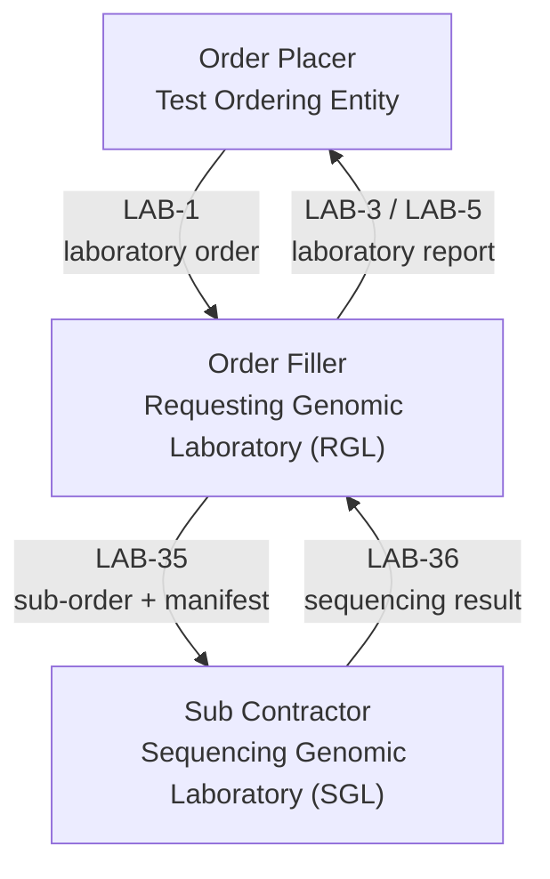

This is currently being elaborated and subject to change.

## Overview

Whole Genome Sequencing (WGS) for rare and inherited disease is being moved by NHS
England from a single centralised laboratory to a **distributed model (dWGS)**: each
NHS Genomic Medicine Service (GMS) geography's own laboratory acts as a
**Requesting Genomic Laboratory (RGL)**, submitting DNA samples and a digital manifest
directly to whichever laboratory is acting as **Sequencing Genomic Laboratory (SGL)**
for that sample - which may be another GMS's laboratory rather than the RGL's own.

Where the RGL and SGL are different organisations, this is a **sub-contracted order**:
in NW-GMSA's own [Inter-Laboratory Workflow (ILW)](ILW.html#sub-orders-lab-35-and-lab-36)
terms, the RGL is the *Order Placer* sending a `LAB-35` sub-order to the SGL (the
*Order Filler*), with the sequencing result returned as `LAB-36`. That sub-order can be
sent as either a FHIR `Bundle` (`POST [base]/$process-message`, the
[laboratory-order `MessageDefinition`](MessageDefinition-laboratory-order.html)) or
HL7 v2 `OML^O21` (see [HL7 v2 Standards](hl7v2.html)) - both follow the same underlying
NW-GMSA order model, so the choice is purely about what the sending system can produce.

## Singleton, Duo and Trio testing

A WGS referral tests one or more people together as a single family group, so that
variants found in the person affected by the suspected condition (the **Proband**) can
be interpreted in the context of their close relatives. NW-GMSA's dWGS examples use two
"ask at order" data items to describe this, carried as `Observation` resources
referenced from `ServiceRequest.supportingInfo`:

- **Family Structure** - how many people are being tested together as part of this
  referral: `Singleton`, `Duo` or `Trio`.
- **Participant Type** - this individual's role within that family structure:
  `Proband` or `Family Member`.

| Family Structure | Participants tested                          | Typical use                                                                                       |
|-------------------|-----------------------------------------------|-----------------------------------------------------------------------------------------------------|
| Singleton         | Proband only                                   | No parental samples available, or a family structure isn't expected to aid interpretation           |
| Duo               | Proband + one Family Member (usually a parent) | Narrows candidate variants by comparing against one relative                                        |
| Trio              | Proband + two Family Members (usually both parents) | The strongest common design for rare/inherited disease - directly identifies *de novo* (new, not inherited) variants by comparing the Proband against both biological parents |
{:.grid}

Each participant in a Duo or Trio is sequenced and submitted as their own **separate**
sub-order (their own `Patient`, `Specimen` and `ServiceRequest`, each with their own
NGIS participant identifier), not combined into one message. What ties the participants
of the same referral together is a **shared referral/requisition number**
(`ServiceRequest.requisition`), assigned by the RGL - every sub-order from the same
family structure carries the same requisition value, distinguished by each participant's
own identifier.

<b>FHIR Profile:</b> <a href="StructureDefinition-ServiceRequest.html">ServiceRequest</a>

## Worked examples

The dWGS example Bundles cover one referral of each family structure, sent as `LAB-35`
sub-orders from a Requesting Genomic Laboratory to NW Genomics acting as Sequencing
Genomic Laboratory:

| Referral       | Family Structure | Participants                                                                                                                                                                          |
|----------------|-------------------|----------------------------------------------------------------------------------------------------------------------------------------------------------------------------------------|
| `r2026000201`  | Singleton         | Proband (`p2026000101`) - [Bundle-dWGS-Singleton-r2026000201](Bundle-dWGS-Singleton-r2026000201.html)                                                                                  |
| `r2026000202`  | Duo               | Proband (`p2026000102`) - [Bundle-dWGS-Duo-r2026000202-p2026000102](Bundle-dWGS-Duo-r2026000202-p2026000102.html)   Family Member (`p2026000103`) - [Bundle-dWGS-Duo-r2026000202-p2026000103](Bundle-dWGS-Duo-r2026000202-p2026000103.html) |
| `r2026000203`  | Trio              | Proband (`p2026000104`) - [Bundle-dWGS-Trio-r2026000203-p2026000104](Bundle-dWGS-Trio-r2026000203-p2026000104.html)   Family Member (`p2026000105`) - [Bundle-dWGS-Trio-r2026000203-p2026000105](Bundle-dWGS-Trio-r2026000203-p2026000105.html)   Family Member (`p2026000106`) - [Bundle-dWGS-Trio-r2026000203-p2026000106](Bundle-dWGS-Trio-r2026000203-p2026000106.html) |
{:.grid}

Each example also demonstrates identifying the **specimen container** separately from
the specimen itself, using the local `ZCID` "Container Identifier" code from
[NW IdentifierType](ValueSet-NWIdentifierType.html) on `Specimen.container.identifier.type`
- see the [Container Identifier note](hl7v2.html#spm) on the HL7 v2 SPM segment page for
why this is only needed as a type code on the HL7 v2 side.
