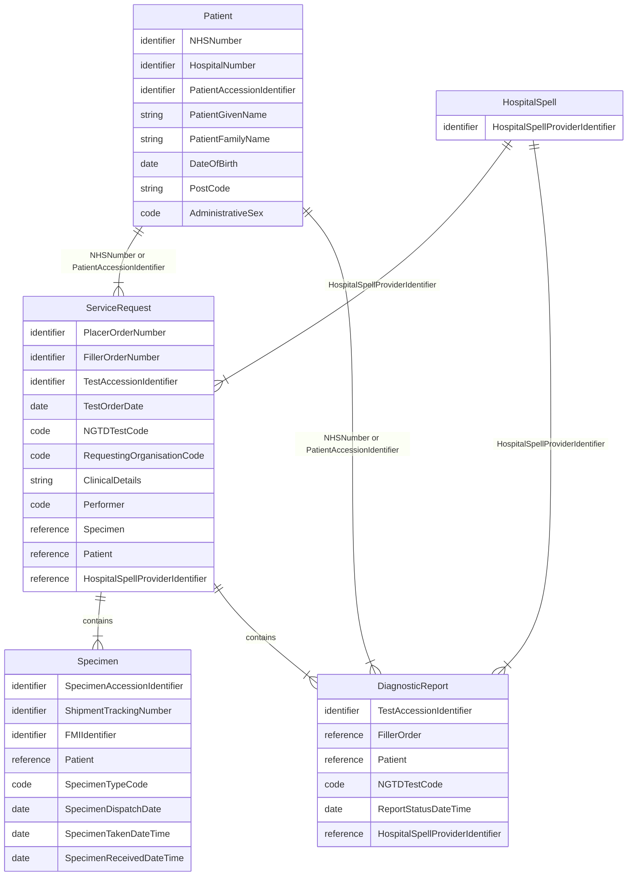
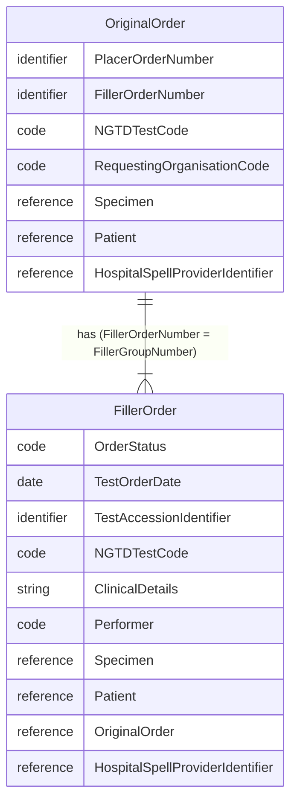

This implementation guide primarily focuses on the **Diagnostic Workflow** and how it integrates within the broader **health data model**, as illustrated in the diagram above.
- **Patient Care** and **Patient Administration** are typically found in NHS providers **Electronic Patient Record** systems
- **Care Directory Service** on the other hand, are centrally defined by NHS England, with supporting APIs also provided by NHS England (for example, the ODS API).

In software design, these areas are often referred to as [domains](https://en.wikipedia.org/wiki/Domain-driven_design). The **Genomic Diagnostic Workflow** operates across several of these domains — in software architecture terms, this is known as a [bounded context](https://martinfowler.com/bliki/BoundedContext.html).

<figure>


Diagnostic Workflow - MindMap

</figure>
 

## Entity Relationship Diagram

### Patient 

<b>HL7 FHIR Profile:</b> <a href="StructureDefinition-Patient.html" _target="_blank">Patient</a> 

<b>HL7 v2 Segment:</b> <a href="hl7v2.html#pid" _target="_blank">PID</a>

| Type       | Name                       | Description                                 | FHIR [Patient](StructureDefinition-Patient.html) |
|------------|----------------------------|---------------------------------------------|--------------------------------------------------|
| identifier | NHSNumber                  | Primary patient identifier                  | Patient.identifier (type=NH)                     |
| identifier | HospitalNumber             | Referring organisation local MRN identifier | Patient.identifier (type=MR)                     |
| identifier | PatientAccessionIdentifier | LIMS Patient identifier                     | Patient.identifier (type=PI)                     |
| string     | PatientGivenName           |                                             | Patient.name.given                               |
| string     | PatientFamilyName          |                                             | Patient.name.family                              |
| date       | DateOfBirth                |                                             | Patient.birthDate                                |
| code       | AdministrativeSex          |                                             | Patient.gender                                   |
| string     | PostCode                   |                                             | Patient.address.postalCode                       |
{:.grid}

### Hospital Spell

<b>HL7 FHIR Profile:</b> <a href="StructureDefinition-HospitalSpell.html" _target="_blank">Hospital Spell</a> 

<b>HL7 v2 Segment:</b> <a href="hl7v2.html#pv1" _target="_blank">PV1</a>

| Type       | Name                                                                                        | Description                       | FHIR [Hospital Spell](StructureDefinition-HospitalSpell.html) |
|------------|---------------------------------------------------------------------------------------------|-----------------------------------|---------------------------------------------------------------|
| identifier | [HospitalSpellProviderIdentifier](StructureDefinition-HospitalProviderSpellIdentifier.html) | Identifier from ordering hospital | Encounter.identifier (type = AN)                              |
{:.grid}

### ServiceRequest (Order)

<b>HL7 FHIR Profile:</b> <a href="StructureDefinition-ServiceRequest.html" _target="_blank">ServiceRequest</a> 

<b>HL7 v2 Segment:</b> <a href="hl7v2.html#orc" _target="_blank">ORC</a>

The original order is the order sent from the Order Placer to the Order Filler; in IHE Laboratory Testing Workflow this is the key entity in [LAB-1](LTW.html#diagnostic-testing)

| Type       | Name                                          | Description                         | FHIR [ServiceRequest](StructureDefinition-ServiceRequest.html) |
|------------|-----------------------------------------------|-------------------------------------|----------------------------------------------------------------|
| identifier | PlacerOrderNumber                             |                                     | ServiceRequest.identifier (type = PLAC)                        |
| identifier | FillerOrderNumber                             |                                     | ServiceRequest.identifier (type = FILL)                        |
| code       |                                               |                                     | ServiceRequest.intent (code = original-order)                  | 
| code       | Procedure Code - NGTDTestCode                 | NGTD code for test                  | ServiceRequest.code                                            |
| string     | ClinicalDetails                               | Referrer clinical notes             | ServiceRequest.note                                            |
| code       | RequestingOrganisationCode                    | ODS code of requesting organisation | ServiceRequest.requester (ODS Code)                            |
| code       | Performer                                     |                                     | ServiceRequest.performer (fixed ODS code = 699X0)              |
| reference  | Specimen                                      |                                     | ServiceRequest.specimen                                        |
| reference  | Patient                                       |                                     | ServiceRequest.subject                                         |
| reference  | Hospital Spell                                |                                     | ServiceRequest.encounter (Hospital Spell)                      |
| code       | Reason Code - Clinical Indication Code (CITT) |                                     | ServiceRequest.reasonCode                                      | 
{:.grid}

#### Filler Order

<b>HL7 FHIR Profile:</b> <a href="StructureDefinition-ServiceRequest.html" _target="_blank">ServiceRequest</a> 

<b>HL7 v2 Segment:</b> <a href="hl7v2.html#orc" _target="_blank">ORC</a>

ServiceRequest may also be split into two logical entities called `OriginalOrder` and `FillerOrder`. The former represents the order received by the Order Filler from the Order Placer, and the latter is orders the `Order Filler` creates to fulfil that order. These are often also called `reflex`, `work-order` or `sub-contract` orders.

In IHE Laboratory Testing Workflow, this is the key entity in [LAB-4](LTW.html#work-order-and-test-result-management-lab-4-and-lab-5)

| Type       | Name                          | Description                         | FHIR [ServiceRequest](StructureDefinition-ServiceRequest.html) |
|------------|-------------------------------|-------------------------------------|----------------------------------------------------------------|
| code       | OrderStatus                   | Order/test status                   | ServiceRequest.status                                          |
| date       | TestOrderDate                 |                                     | ServiceRequest.authoredOn                                      |
| identifier | TestAccessionIdentifier       |                                     | ServiceRequest.identifier                                      |
| code       | Procedure Code - NGTDTestCode | NGTD code for test                  | ServiceRequest.code                                            |
| code       | RequestingOrganisationCode    | ODS code of requesting organisation | ServiceRequest.requester (fixed ODS code = 699X0)              |
| code       | Performer                     |                                     | ServiceRequest.performer (ODS Code)                            |
| reference  | Specimen                      |                                     | ServiceRequest.specimen                                        |
| reference  | Patient                       |                                     | ServiceRequest.subject                                         |
| reference  | OriginalOrder                 |                                     | ServiceRequest.requisition and ServiceRequest.basedOn          |
| reference | Hospital Spell                | | ServiceRequest.encounter (Hospital Spell) |
{:.grid}

#### Filler Order Intent

| Type                | Description                                                                                                                                                     | IHE PALM | Created by   | Original Order Intent | Filler Order Intent   |
|---------------------|-----------------------------------------------------------------------------------------------------------------------------------------------------------------|----------|--------------|----------------------------------------|-----------------------|
| Laboratory Order    | A request for one or more laboratory investigations submitted by the requesting clinician or system.                                                            | LAB-1    | Order Placer | order / reflex                         |                       | 
| Work Order          | A subordinate order created by the laboratory to organise and fulfil part of the overall Laboratory Order.                                                      | LAB-4    | Order Filler |                                        | instance-order?       | 
| Subcontracted Order | A laboratory order forwarded to another laboratory for fulfilment, for example when a specialised test is referred to an external provider.                     | LAB-35   | Order Filler |                                        | order (filler-order?) |
| Reflex Order        | A new order created automatically by the Order Filler based on previous test results, for example when pathology findings automatically trigger a genomic test. | LAB-35   | Order Filler |                                        | reflex                | 
{:.grid}

### Specimen 

<b>HL7 FHIR Profile:</b> <a href="StructureDefinition-Specimen.html" _target="_blank">Specimen</a> 

<b>HL7 v2 Segment:</b> <a href="hl7v2.html#spm" _target="_blank">SPM</a>

| Type       | Name                        | Description             | FHIR [Specimen](StructureDefinition-Specimen.html)       |
|------------|-----------------------------|-------------------------|----------------------------------------------------------|
| identifier | SpecimenAccessionIdentifier |                         | Specimen.identifier                                      |
| identifier | ShipmentTrackingNumber      | Courier tracking number | Specimen.identifier[ShipmentTrackingNumber] (type = STN) |
| identifier | FMIIdentifier               |                         | Specimen.container.identifier                            |
| reference  | Patient                     |                         | Specimen.subject                                         |
| code       | SpecimenTypeCode            |                         | Specimen.type                                            |
| date       | SpecimenDispatchDate        |                         |                                                          |
| date       | SpecimenTakenDateTime       | Collection date/time    | Specimen.collection.collectedDateTime                    |
| date       | SpecimenReceivedDateTime    | Received date/time      | Specimen.receivedTime                                               |
{:.grid}

### Diagnostic Report

<b>HL7 FHIR Profile:</b> <a href="StructureDefinition-DiagnosticReport.html" _target="_blank">DiagnosticReport</a> 

<b>HL7 v2 Segment:</b> <a href="hl7v2.html#obr" _target="_blank">OBR</a>

This is the key entity for the reports/results which are generated when the Placer Order and Filler Order are fulfilled, which are [LAB-3](LTW.html#laboratory-report-lab-3) and [LAB-5](LTW.html#test-results-management-lab-5) respectively.

| Type          | Name                                                                         | Description | FHIR [DiagnosticReport](StructureDefinition-DiagnosticReport.html)                          |
|---------------|------------------------------------------------------------------------------|-------------|---------------------------------------------------------------------------------------------|
| identifier    | TestAccessionIdentifier                                                      |             | DiagnosticReport.identifier                                                                 |
| reference     | FillerOrder                                                                  |             | DiagnosticReport.basedOn (FillerOrder)                                                      |
| reference     | Patient                                                                      |             | DiagnosticReport.subject                                                                    |
| code          | Procedure Code - NGTDTestCode                                                |             | DiagnosticReport.code (system = https://fhir.nhs.uk/CodeSystem/England-GenomicTestDirectory) |
| date          | ReportStatusDateTime                                                         |             | DiagnosticReport.effectiveDateTime                                                          |
| reference     | Hospital Spell - Account Number                                              |             | DiagnosticReport.encounter (Hospital Spell)                                                 |
| code          | Conclusion Code - [Test Outcome Code](ValueSet-GenomicTestOutcomeCodes.html) |             | DiagnosticReport.conclusionCode                                                             |
| result        | See [Observations](StructureDefinition-Observation.html)                     |             | DiagnosticReport.result                                                                     | 
| presentedForm | See [DocumentReference](StructureDefinition-DocumentReference.html)          |             | DiagnosticReport.presentedForm                                                              |
{:.grid}
