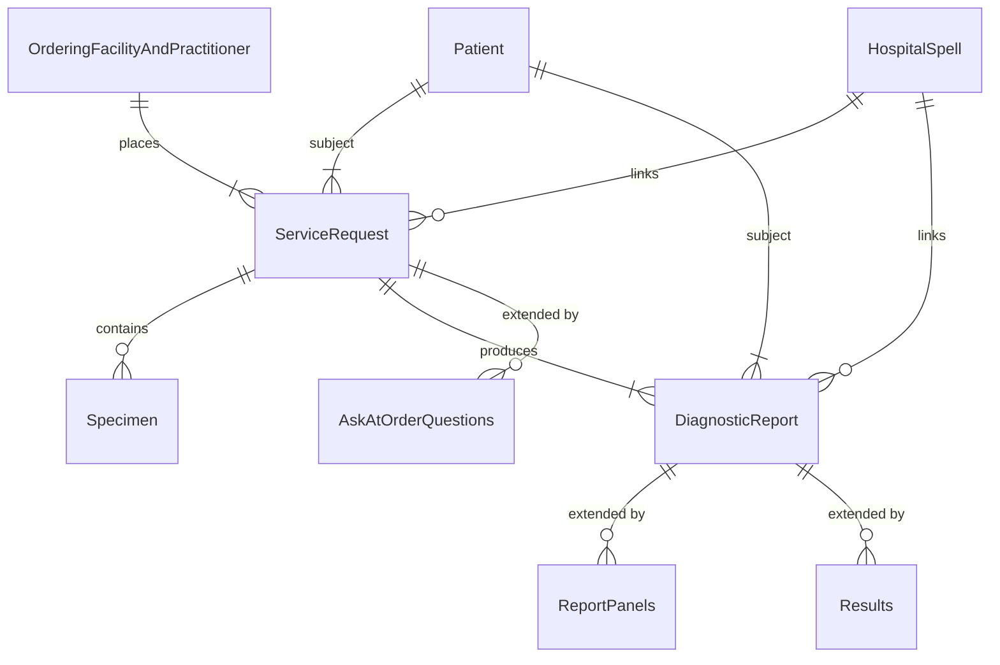
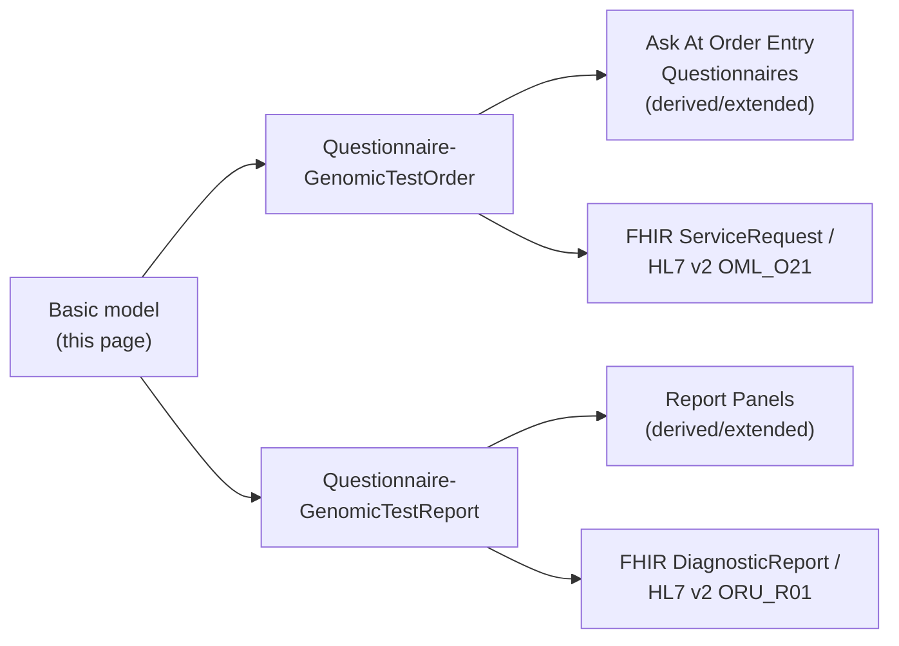
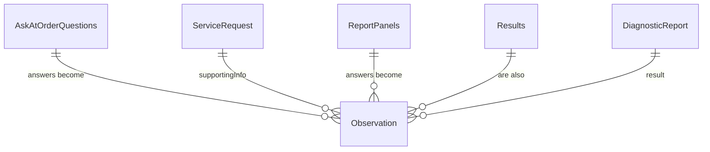

This implementation guide primarily focuses on the **Diagnostic Workflow** and how it integrates within the broader **health data model**.
- **Patient Care** and **Patient Administration** are typically found in NHS providers **Electronic Patient Record** systems
- **Care Directory Service** on the other hand, are centrally defined by NHS England, with supporting APIs also provided by NHS England (for example, the ODS API).

In software design, these areas are often referred to as [domains](https://en.wikipedia.org/wiki/Domain-driven_design). The **Genomic Diagnostic Workflow** operates across several of these domains — in software architecture terms, this is known as a [bounded context](https://martinfowler.com/bliki/BoundedContext.html).

## National Reference Data

Rather than every consuming system resolving these against the national
service directly, this guide's resources carry identifiers that *reference*
nationally-held data, while a **local copy** of the resource itself is still
maintained where a genuine local need requires it:

- **Master Patient Index** - [Patient](StructureDefinition-Patient.html)
  references NHS England's Personal Demographics Service (PDS) via the
  patient's NHS Number - see [NHS Identifier](StructureDefinition-NHSIdentifier.html).
  A local copy of `Patient` is still maintained, rather than resolving PDS on
  every use, because this guide also needs to support identifiers PDS itself
  doesn't carry - CHI (Scotland) and HSC/HSNI (Northern Ireland) numbers, and
  locally-assigned [Medical Record Numbers](StructureDefinition-MedicalRecordNumber.html) -
  see [NHS Identifier](StructureDefinition-NHSIdentifier.html) for how these
  are represented together. The Regional Integration Engine (RIE) performs
  the actual PDS check/enrichment - see [Regional Integration Engine (RIE) -
  Order Process](overview.html#order-process) and [Report
  Process](overview.html#report-process).
- **Care Directory Services** - [Organization](StructureDefinition-Organization.html)
  and [Practitioner](StructureDefinition-Practitioner.html) reference NHS
  England's centrally-held Organisation Data Service/Transfer (ODS/ODT), via
  [Organisation Code](StructureDefinition-OrganisationCode.html) (ODS Code)
  and [Practitioner Identifier](StructureDefinition-PractitionerIdentifier.html)
  (GMP/GMC Number). As with the Master Patient Index above, the RIE performs
  this check/enrichment against the live ODT API rather than every consuming
  system doing so individually - see [Regional Integration Engine (RIE) -
  Order Process](overview.html#order-process) and [Report
  Process](overview.html#report-process).

## Entity Relationship Diagram

This is the **basic model** this guide is built on: an `OrderingFacilityAndPractitioner`
places a `ServiceRequest` (order) for a `Patient`, which references a
`Specimen` and produces a `DiagnosticReport`, with a `HospitalSpell` linking
orders and reports back to the episode of care they belong to. Both the order
and the report are extended with further detail beyond this basic model -
`AskAtOrderQuestions` for the order, `ReportPanels` and `Results` for the
report - see [Archetype Questionnaires](#archetype-questionnaires) below.

`ServiceRequest` and `DiagnosticReport` are the two separate **aggregates**
(in the [Domain-Driven Design](https://martinfowler.com/bliki/DDD_Aggregate.html)
sense) this model is built around - each with its own extension mechanism.
<!-- Colouring these two aggregates differently was attempted here using
mermaid erDiagram classDef/class styling, but that syntax is not supported by
the mermaid renderer this IG's build uses - reverted rather than risk a
broken build. -->

This is deliberately a **high-level (level 1) view** - just the entities and
how they relate. Field-level (level 2) diagrams, showing the actual
attributes each entity carries, are on the two archetype Questionnaire pages
below.

## Archetype Questionnaires

This basic model is deliberately abstract - it doesn't yet say which specific
fields an order or report needs, or how those fields map onto HL7 v2 segments
and FHIR profiles. That detail is added by two **archetype Questionnaires**,
one for each side of the `ServiceRequest`/`DiagnosticReport` relationship
above:

Answering an Ask At Order Entry or Report Panel Questionnaire produces
`Observation` resources - the same resource type on both sides, just
referenced back from a different aggregate:

- On the order side, an Ask At Order Entry answer becomes an `Observation`,
  which the order references via `ServiceRequest.supportingInfo` - see the
  [Observation](Questionnaire-GenomicTestOrder.html#domain-archetype) entity
  on that page's own level-2 diagram.
- On the report side, a Report Panel finding is also an `Observation`, which
  the report references via `DiagnosticReport.result`. [Genomic
  Results](Questionnaire-GenomicTestReport.html#genomic-results) (the
  underlying HL7 FHIR Genomics Reporting profiles) are themselves `Observation`
  resources too, and are referenced from `DiagnosticReport.result` the same
  way - whether a given finding came from a Report Panel Questionnaire or
  directly from a Genomics Reporting profile, it ends up in the same place.

- **[Genomic Test Order](Questionnaire-GenomicTestOrder.html)** - the common
  core order form (Patient, Hospital Spell, Diagnostic Workflow, Specimen)
  shared by every order, regardless of test type. Order/test-type-specific
  questions are added by **Ask At Order Entry Questionnaires**, which
  `derivedFrom`/extend this common core - see [Order Entry
  Questions](Questionnaire-GenomicTestOrder.html#order-entry-questions) for
  the full list. `ServiceRequest` itself also splits into `OriginalOrder` and
  `FillerOrder` - see [Original Order and Filler
  Order](Questionnaire-GenomicTestOrder.html#original-order-and-filler-order).
- **[Genomic Test Report](Questionnaire-GenomicTestReport.html)** - the common
  core report metadata (patient, order/report identifiers, dates, status,
  conclusion, performers) shared by every report. Individual test findings are
  added by **Report Panel Questionnaires**, which are likewise
  `derivedFrom`/extended from this common core - see [Report
  Panels](Questionnaire-GenomicTestReport.html#report-panels) for the full
  list.

Each archetype's own page carries the field-by-field detail this summary page
doesn't: which [HL7 FHIR profile](artifacts.html) and [HL7 v2
segment](hl7v2.html) each field maps onto, ready to implement against.
