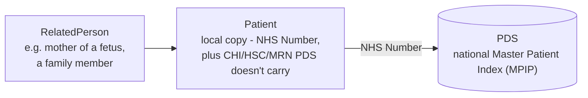
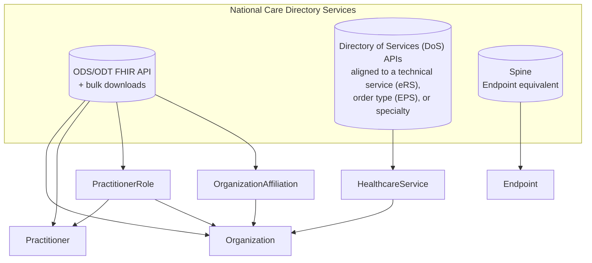
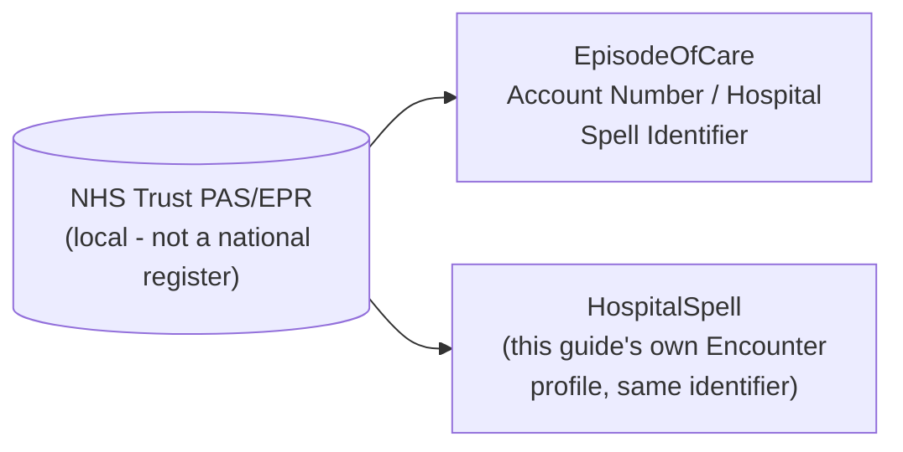
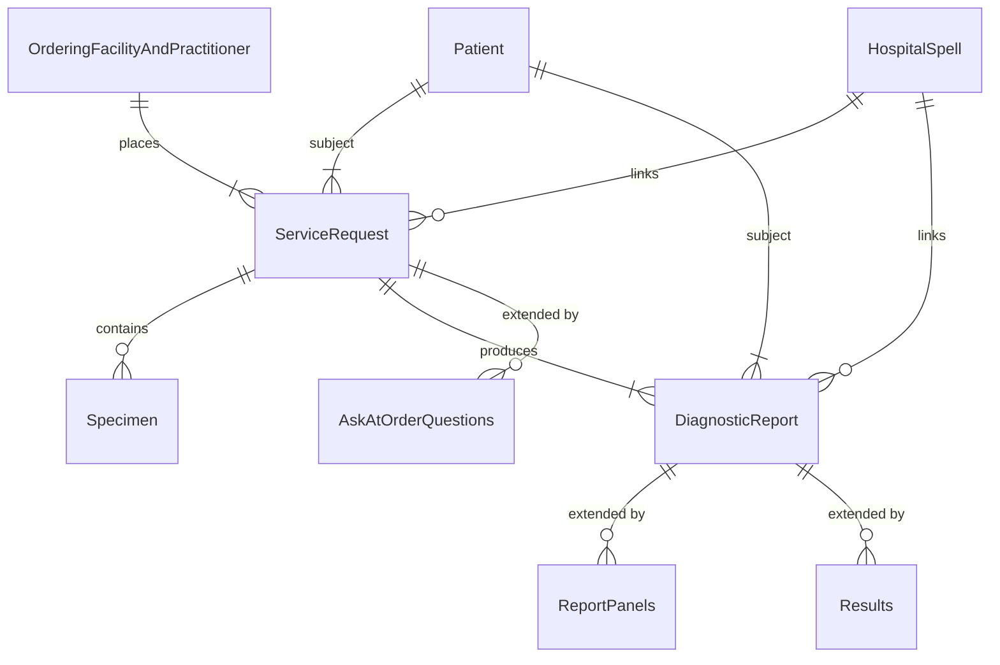
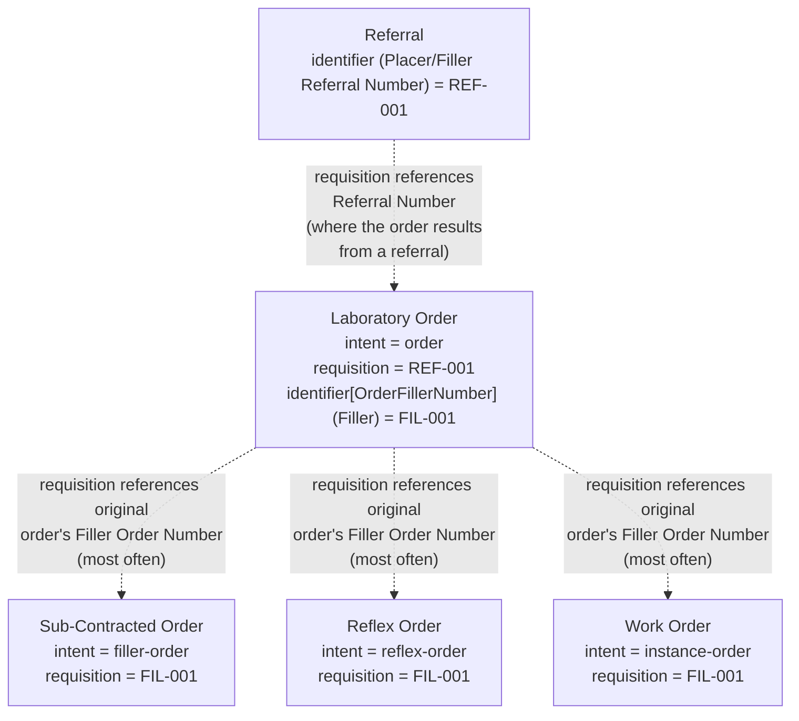
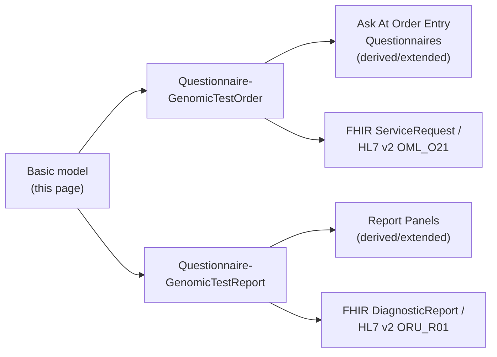
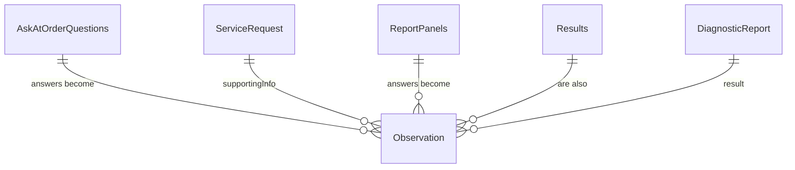

This implementation guide primarily focuses on the **Diagnostic Workflow** and how it integrates within the broader **health data model**.
- **Patient Care** and **Patient Administration** are typically found in NHS providers **Electronic Patient Record** systems
- **Care Directory Service** on the other hand, are centrally defined by NHS England, with supporting APIs also provided by NHS England (for example, the ODS API).

In software design, these areas are often referred to as [domains](https://en.wikipedia.org/wiki/Domain-driven_design). The **Genomic Diagnostic Workflow** operates across several of these domains — in software architecture terms, this is known as a [bounded context](https://martinfowler.com/bliki/BoundedContext.html).

## National Reference Data

Rather than every consuming system resolving these against the national
service directly, this guide's resources carry identifiers that *reference*
nationally-held data, while a **local copy** of the resource itself is still
maintained where a genuine local need requires it. The three registers below
follow the same shape as HL7 FHIR's own [Administration
Module](https://hl7.org/fhir/administration-module.html) registry pattern -
Patient Registry, Service Provider Directory Registry and Clinical
Categorization Registry - scoped down to what the UK's own national services
actually provide, plus what stays genuinely local.

### Patient Registry (PDS/MPIP)

Analogous to FHIR's own [Patient
Registry](https://hl7.org/fhir/administration-module.html#patient-reg), but
scoped to just `Patient` and `RelatedPerson` - this guide has no need for the
generic `Person`/`Group` resources that page also shows.
[Patient](StructureDefinition-Patient.html) references NHS England's
Personal Demographics Service (PDS) - the UK's Master Patient Index (MPIP) -
via the patient's NHS Number - see [NHS
Identifier](StructureDefinition-NHSIdentifier.html). A local copy of
`Patient` is still maintained, rather than resolving PDS on every use,
because this guide also needs to support identifiers PDS itself doesn't
carry - CHI (Scotland) and HSC/HSNI (Northern Ireland) numbers, and
locally-assigned [Medical Record
Numbers](StructureDefinition-MedicalRecordNumber.html) - see [NHS
Identifier](StructureDefinition-NHSIdentifier.html) for how these are
represented together. The Regional Integration Engine (RIE) performs the
actual PDS check/enrichment - see [Regional Integration Engine (RIE) - Order
Process](overview.html#order-process) and [Report
Process](overview.html#report-process).

### Care Directory Services

Analogous to FHIR's own [Service Provider Directory
Registry](https://hl7.org/fhir/administration-module.html#dir-reg), with
each resource sourced from a different national service rather than one
single directory:

- [Organization](StructureDefinition-Organization.html),
  [Practitioner](StructureDefinition-Practitioner.html),
  `PractitionerRole` and `OrganizationAffiliation` are provided by NHS
  England's centrally-held Organisation Data Service/Transfer (ODS/ODT) FHIR
  API and its associated bulk downloads, via [Organisation
  Code](StructureDefinition-OrganisationCode.html) (ODS Code) and
  [Practitioner Identifier](StructureDefinition-PractitionerIdentifier.html)
  (GMP/GMC Number).
- `HealthcareService` is instead provided by a mix of Directory of Services
  (DoS) APIs, which tend to be aligned to a particular technical service
  (e.g. the NHS e-Referral Service, eRS), a particular order type (e.g. the
  Electronic Prescription Service, EPS) or a clinical specialty, rather than
  one single national HealthcareService directory.
- `Endpoint` has no direct NHS England equivalent used here, but Spine holds
  an equivalent concept for routing technical endpoints.

As with the Patient Registry above, the RIE performs this check/enrichment
against the live ODT API rather than every consuming system doing so
individually - see [Regional Integration Engine (RIE) - Order
Process](overview.html#order-process) and [Report
Process](overview.html#report-process).

### Clinical Categorisation (Trust-Local, not a National Register)

Analogous to FHIR's own [Clinical Categorization
Registry](https://hl7.org/fhir/administration-module.html#clinical-reg) -
`EpisodeOfCare`, `Encounter`, `Account` - but unlike the two registers above,
this one is **not** a national service: it is normally handled locally by
each NHS Trust's own PAS/EPR. In the UK, **Account Number** normally refers
to `EpisodeOfCare.identifier` - also known as the **Hospital Spell
Identifier** - see [Hospital Provider Spell
Identifier](StructureDefinition-HospitalProviderSpellIdentifier.html). This
guide's own [HospitalSpell](StructureDefinition-HospitalSpell.html) profile
(built on `Encounter`, per the [Entity Relationship
Diagram](#entity-relationship-diagram) below) carries that same identifier
value, since no single national register of episodes/spells exists to
reference instead.

## Entity Relationship Diagram

This is the **basic model** this guide is built on: an `OrderingFacilityAndPractitioner`
places a `ServiceRequest` (order) for a `Patient`, which references a
`Specimen` and produces a `DiagnosticReport`, with a `HospitalSpell` linking
orders and reports back to the episode of care they belong to. Both the order
and the report are extended with further detail beyond this basic model -
`AskAtOrderQuestions` for the order, `ReportPanels` and `Results` for the
report - see [Archetype Questionnaires](#archetype-questionnaires) below.

`ServiceRequest` and `DiagnosticReport` are the two separate **aggregates**
(in the [Domain-Driven Design](https://martinfowler.com/bliki/DDD_Aggregate.html)
sense) this model is built around - each with its own extension mechanism.
<!-- Colouring these two aggregates differently was attempted here using
mermaid erDiagram classDef/class styling, but that syntax is not supported by
the mermaid renderer this IG's build uses - reverted rather than risk a
broken build. -->

This is deliberately a **high-level (level 1) view** - just the entities and
how they relate. Field-level (level 2) diagrams, showing the actual
attributes each entity carries, are on the two archetype Questionnaire pages
below.

## Closed-Loop Referrals

Every order/report relationship in this guide is a **closed loop**: something
requests work (a `ServiceRequest`), and something else closes that loop with
a result (usually a `DiagnosticReport`, sometimes a Test Result or a
report/clinic letter). The generic `ServiceRequest`/`DiagnosticReport` pair
in the [Entity Relationship Diagram](#entity-relationship-diagram) above
takes several different concrete shapes in genomics, depending on who is
placing the request and why - summarised below, with how
`ServiceRequest.intent` changes to reflect that.

| Order / Referral | Report / Result                                                                              | Interaction(s)                                                                                                                                                                                                               | Description | Data Model | Use Case(s) |
|---|----------------------------------------------------------------------------------------------|------------------------------------------------------------------------------------------------------------------------------------------------------------------------------------------------------------------------------|---|---|---|
| Laboratory Order | Laboratory Report                                                                            | [LAB-1](LTW.html#laboratory-order-lab-1) / [LAB-3](LTW.html#laboratory-report-lab-3)                                                                                                                                         | The requesting clinician/system places a genomic test order directly with the laboratory; once testing is complete, the laboratory reports the result straight back to that same requester. This is the "root" of every closed loop below - every other pattern either sits underneath one of these, or (for a Referral) stands in place of one. | `ServiceRequest.intent` = `order` (or `reflex-order`, if this Laboratory Order was itself automatically generated by an upstream reflex decision, before LAB-1 is even sent); the Laboratory Report follows [HL7 Europe Laboratory Report](https://build.fhir.org/ig/hl7-eu/laboratory/) (plus the additional genomic content this IG itself defines) | [Regional Integration Engine (RIE)](overview.html), [iGene Orders and Reports (Alder Hey, MFT, Liverpool)](RegionalOrdersAndReports.html), [Whole Genome Sequencing (Proposed - Alder Hey, MFT, Liverpool)](WholeGenomicSequence.html), [Histocompatibility and Immunogenetics (Clatterbridge to Histotrac)](HistocompatibilityAndImmunogenetics.html) |
| Laboratory Order (Sub-Contracted) | Laboratory Report                                                                            | [LAB-35](ILW.html#sub-order-management-lab-35) / [LAB-36](ILW.html#sub-order-results-delivery-lab-36)                                                                                                                        | The Order Filler cannot fulfil the Laboratory Order itself, so it forwards it as a new order to another laboratory (a different Genomic Laboratory Hub) - the same test the original requester asked for, just performed elsewhere. The result closes the loop back to the subcontracting lab, which remains responsible for the LAB-3 report to the original requester. | `ServiceRequest.intent` = `filler-order` - a new `ServiceRequest`, referencing the original order, created *by* the Order Filler rather than by the original requester; the Laboratory Report follows [HL7 Europe Laboratory Report](https://build.fhir.org/ig/hl7-eu/laboratory/) (plus the additional genomic content this IG itself defines) | [Distributed WGS (dWGS)](dWGS.html), [StarLIMS / iGene Integration](starLIMS.html) |
| Laboratory Order (Reflex Order) | Laboratory Report                                                                            | [LAB-35](ILW.html#sub-order-management-lab-35) / [LAB-36](ILW.html#sub-order-results-delivery-lab-36)                                                                                                                        | The Order Filler automatically triggers a **further** test based on an earlier result, without any new request from the original requester - e.g. a pathology finding reflexing on to a genomic test. Uses the same LAB-35/LAB-36 sub-order transactions as a subcontracted order, but the trigger is a result, not a forwarding decision. | `ServiceRequest.intent` = `reflex-order` - a new `ServiceRequest`, created automatically, not requested by the original placer; the Laboratory Report follows [HL7 Europe Laboratory Report](https://build.fhir.org/ig/hl7-eu/laboratory/) (plus the additional genomic content this IG itself defines) | [Cheshire and Merseyside Pathology](CheshireAndMerseysidePathology.html), [Haemato-Oncology Diagnostic Pathway](HaematoOncologyPathway.html) |
| Work Order | Test Result                                                                                  | [LAB-4 / LAB-5](LTW.html#work-order-and-test-result-management-lab-4-and-lab-5)                                                                                                                                              | Purely internal to the Order Filler: it splits its own Laboratory Order into one or more Work Orders to organise the actual analytical work (which analyser, which specimen aliquot), and the analyser/automation manager returns Test Results against that Work Order. Several Work Orders/Test Results can feed into a single Laboratory Report. | `ServiceRequest.intent` = `instance-order` - an internal *instance* of doing the analytical work, not a new order relationship with an external party; the Test Result follows [HL7 FHIR Genomics Reporting](https://build.fhir.org/ig/HL7/genomics-reporting/index.html) and this IG's own [Report Panels](Questionnaire-GenomicTestReport.html#report-panels) | [OMICS DSS Result Integration](reportable-variants.html), [BCR-ABL Monitoring (Cepheid ASTM to iGene)](BCRABLMonitoring.html), [Cytogenetics and Haemato-Oncology Diagnostic Pathway](HaematoOncologyPathway.html) |
| Referral | Discharge/Hospital Report                                                                    | `REF_I12` / `ORU_R01` (or [IHE 360X](https://www.ihe.net/uploadedFiles/Documents/PCC/IHE_PCC_Suppl_360X.pdf))                                                                                                                | Not a diagnostic test order at all - a referral for clinical assessment, genetic counselling and/or cascade testing, closed by a report/clinic letter rather than a `DiagnosticReport`-shaped lab result. Analysis-only in this IG - if ever modelled as a `ServiceRequest`, see [Genetic Referrals - Referral Data Model](GeneticReferrals.html#referral-data-model). | `ServiceRequest.intent` not currently modelled - FHIR's `request-intent` value set has no distinct "referral" code, so a referral `ServiceRequest` would most likely reuse `order`, the same as a Laboratory Order; the report/clinic letter back could instead follow [HL7 Europe Hospital Discharge Report (HDR)](https://build.fhir.org/ig/hl7-eu/hdr/) as a FHIR-native alternative to `ORU_R01` | [Genetic Referrals](GeneticReferrals.html) |
| *(none - not order-driven)* | [Laboratory Report (Composition or PDF)](StructureDefinition-Composition-GenomicReport.html) | MDM_T02 or ITI-105 with the report in PDF or FHIR Document format (i.e. modern version of CDA/XD-LAB) | **Not a closed loop at all** - an *aggregation*, downstream of the closed loops above rather than a response to any of them: it collates one or more existing Laboratory Report(s) (`DiagnosticReport`) and their Test Results (`Observation`s) into a single `Composition`-led document. See [overview.md - Future Composition / Aggregated Laboratory Report](overview.html#future-composition--aggregated-laboratory-report). | `ServiceRequest.intent` not applicable - no `ServiceRequest` is created or referenced, and `Composition` has no `intent` element; the document itself follows [HL7 Europe Laboratory Report](https://build.fhir.org/ig/hl7-eu/laboratory/), while the aggregated Test Results it carries follow [HL7 FHIR Genomics Reporting](https://build.fhir.org/ig/HL7/genomics-reporting/index.html) | [ctDNA NHS England Unified Genomic Record (UGR) - Phase 2](ctDNAUGR.html#phase-2-structured-fhir-document-eu-laboratory-report), [Shared Genomic Reports - Greater Manchester Care Record (GMCR)](GMCR.html), [Shared Genomic Reports - Lancashire and South Cumbria](GMCR.html#lancashire-and-south-cumbria) |
{:.grid}

Summary of the modelling differences:

- **Who creates the request** is the real distinguishing factor, not the
  message type: a Laboratory Order and a Referral are both created by an
  external requester (`order`); a Sub-Contracted Order and a Reflex Order are
  both created *by the Order Filler itself*, just for different reasons
  (forwarding work it can't do, versus reacting to a result) - both use a
  `ServiceRequest.intent` value that signals "this was not the original ask"
  (`filler-order`, `reflex-order`); a Work Order is created by the Order
  Filler too, but stays entirely internal, hence its own distinct
  `instance-order` value rather than reusing `filler-order`.
- **`ServiceRequest.intent` tracks position in the chain, not clinical
  urgency or type of test** - the same genomic test could arrive as `order`
  (direct), `filler-order` (subcontracted) or `reflex-order` (reflexed), and
  the FHIR resource shape doesn't otherwise change.
- **Not every closed loop ends in a `DiagnosticReport`** - LAB-5 returns a
  Test Result (which may be represented as `Observation`s rather than a full
  report), and a Referral closes with a report/clinic letter that may not be
  lab-shaped at all - see [HL7 Europe Hospital Discharge
  Report](https://build.fhir.org/ig/hl7-eu/hdr/) as a possible FHIR-native
  alternative.
- **The Referral pathway is one outlier**: it is not built on the
  `ServiceRequest`/`DiagnosticReport` pair this page's [Entity Relationship
  Diagram](#entity-relationship-diagram) is otherwise built around, and is
  not yet backed by a profile in this IG.
- **Laboratory Report (Composition) is the other outlier, in the opposite
  direction**: every other row in the table above *is* a closed loop -
  something requests, something responds. Laboratory Report (Composition)
  isn't a loop at all, it's an **aggregation** step that runs downstream of
  one, republishing Laboratory Report(s)/Test Results already produced by the
  loops above into a single FHIR Document - there is no `ServiceRequest`
  behind it and nothing for `ServiceRequest.intent` to describe.

### Linking Related Orders: ServiceRequest.requisition

`ServiceRequest.intent` says what *kind* of order a given `ServiceRequest`
is, but not which original Laboratory Order it belongs to - that's a separate
job, done by `ServiceRequest.requisition` (HL7 v2 `ORC-4`, Placer Group
Number - see [Order Group Number](StructureDefinition-OrderGroupNumber.html)).
A Sub-Contracted Order, a Reflex Order and a Work Order are each their own
`ServiceRequest` resource, with their own identifier and their own `intent`
value (`filler-order`, `reflex-order`, `instance-order` respectively - see
the table above) - but its `requisition` most often carries the **original**
Laboratory Order's own **Filler Order Number** ([Order
Identifier](StructureDefinition-OrderIdentifier.html), `ORC-3`) - the
identifier the Order Filler itself already assigned when it first received
that order - rather than a new group number invented for the child order. It
may instead carry the original order's **Placer Order Number** (`ORC-2`)
where that's what the receiving system expects, but Filler Order Number is
the more common choice, since it's the identifier already under the Order
Filler's own control. Either way, this is what lets every order in the
family be found and correlated back to the one original Laboratory Order,
however many sub-contract/reflex/work-order hops it went through.

The same logic applies one level further up the chain, for [Genetic
Referrals - Referral Data Model](GeneticReferrals.html#referral-data-model):
a Referral's own Referral Number - Placer (`RF1-6`, analogous to a Laboratory
Order's Placer Order Number) or Filler (analogous to its Filler Order
Number) - becomes the `requisition` on any Laboratory Order(s) that result
from that referral, the same way a Laboratory Order's own number becomes the
`requisition` on any Sub-Contracted Order, Reflex Order or Work Order beneath
it.

[Distributed WGS (dWGS)](dWGS.html#singleton-duo-and-trio-testing) uses
`requisition` slightly differently again - there, several sibling
participants' sub-orders (Proband, Family Member(s)) each get their **own**
new `ServiceRequest`, and all of them share **one** requisition value
assigned by the Requesting Genomic Laboratory for the referral as a whole,
rather than each one referencing back to a single parent order's own Filler
Order Number.

### Linking Across Diagnostic Services

`ServiceRequest.requisition` links one order to the order it was *derived
from*, within a single family descending from one Laboratory Order (or
Referral). Two other identifiers link work together in a different way -
correlating genuinely separate, independently-placed orders that happen to
share the same patient episode or the same physical specimen, potentially
across *different* diagnostic services entirely (genomics, pathology,
radiology):

- **Account Number / Hospital Spell Identifier** ([Hospital Provider Spell
  Identifier](StructureDefinition-HospitalProviderSpellIdentifier.html)) -
  not a copied identifier value at all, but a shared resource reference:
  `ServiceRequest.encounter`/`DiagnosticReport.encounter` point to the same
  `HospitalSpell` resource. Every Referral, Episode/Stay and Laboratory
  Order placed by any diagnostic service during that one hospital spell can
  be found by following that shared reference back.
- **Specimen Accession Number** ([Specimen Accession
  Number](StructureDefinition-SpecimenAccessionNumber.html),
  `Specimen.accessionIdentifier`) - links Laboratory Orders together
  whenever the *same physical specimen* is reused across more than one
  order (e.g. a single blood draw used for both a pathology test and a
  genomics test) - each order's `ServiceRequest.specimen` references the
  same `Specimen` resource, or its `Specimen.accessionIdentifier` value is
  repeated across separately-tracked `Specimen` resources per service.

## Archetype Questionnaires

This basic model is deliberately abstract - it doesn't yet say which specific
fields an order or report needs, or how those fields map onto HL7 v2 segments
and FHIR profiles. That detail is added by two **archetype Questionnaires**,
one for each side of the `ServiceRequest`/`DiagnosticReport` relationship
above:

Answering an Ask At Order Entry or Report Panel Questionnaire produces
`Observation` resources - the same resource type on both sides, just
referenced back from a different aggregate:

- On the order side, an Ask At Order Entry answer becomes an `Observation`,
  which the order references via `ServiceRequest.supportingInfo` - see the
  [Observation](Questionnaire-GenomicTestOrder.html#domain-archetype) entity
  on that page's own level-2 diagram.
- On the report side, a Report Panel finding is also an `Observation`, which
  the report references via `DiagnosticReport.result`. [Genomic
  Results](Questionnaire-GenomicTestReport.html#genomic-results) (the
  underlying HL7 FHIR Genomics Reporting profiles) are themselves `Observation`
  resources too, and are referenced from `DiagnosticReport.result` the same
  way - whether a given finding came from a Report Panel Questionnaire or
  directly from a Genomics Reporting profile, it ends up in the same place.

- **[Genomic Test Order](Questionnaire-GenomicTestOrder.html)** - the common
  core order form (Patient, Hospital Spell, Diagnostic Workflow, Specimen)
  shared by every order, regardless of test type. Order/test-type-specific
  questions are added by **Ask At Order Entry Questionnaires**, which
  `derivedFrom`/extend this common core - see [Order Entry
  Questions](Questionnaire-GenomicTestOrder.html#order-entry-questions) for
  the full list. `ServiceRequest` itself also splits into `OriginalOrder` and
  `FillerOrder` - see [Original Order and Filler
  Order](Questionnaire-GenomicTestOrder.html#original-order-and-filler-order).
- **[Genomic Test Report](Questionnaire-GenomicTestReport.html)** - the common
  core report metadata (patient, order/report identifiers, dates, status,
  conclusion, performers) shared by every report. Individual test findings are
  added by **Report Panel Questionnaires**, which are likewise
  `derivedFrom`/extended from this common core - see [Report
  Panels](Questionnaire-GenomicTestReport.html#report-panels) for the full
  list.

Each archetype's own page carries the field-by-field detail this summary page
doesn't: which [HL7 FHIR profile](artifacts.html) and [HL7 v2
segment](hl7v2.html) each field maps onto, ready to implement against.
