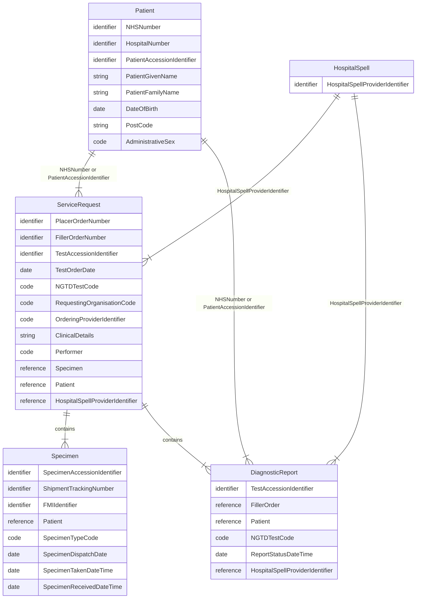
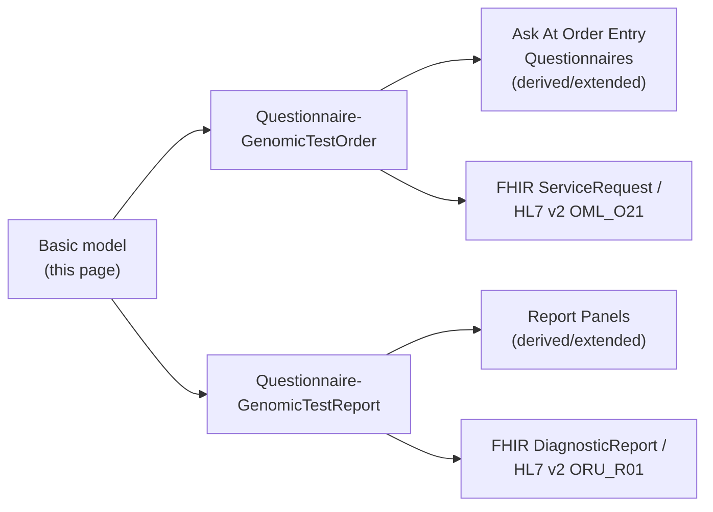
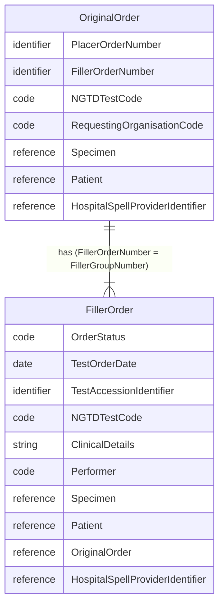

This implementation guide primarily focuses on the **Diagnostic Workflow** and how it integrates within the broader **health data model**, as illustrated in the diagram above.
- **Patient Care** and **Patient Administration** are typically found in NHS providers **Electronic Patient Record** systems
- **Care Directory Service** on the other hand, are centrally defined by NHS England, with supporting APIs also provided by NHS England (for example, the ODS API).

In software design, these areas are often referred to as [domains](https://en.wikipedia.org/wiki/Domain-driven_design). The **Genomic Diagnostic Workflow** operates across several of these domains — in software architecture terms, this is known as a [bounded context](https://martinfowler.com/bliki/BoundedContext.html).

<figure style="overflow-x:auto;">


Diagnostic Workflow - MindMap

</figure>
 

## Entity Relationship Diagram

This is the **basic model** this guide is built on: a `Patient` has one or more
`ServiceRequest`s (orders), each of which references a `Specimen` and produces
a `DiagnosticReport`, with a `HospitalSpell` linking orders and reports back
to the episode of care they belong to.

## Archetype Questionnaires

This basic model is deliberately abstract - it doesn't yet say which specific
fields an order or report needs, or how those fields map onto HL7 v2 segments
and FHIR profiles. That detail is added by two **archetype Questionnaires**,
one for each side of the `ServiceRequest`/`DiagnosticReport` relationship
above:

- **[Genomic Test Order](Questionnaire-GenomicTestOrder.html)** - the common
  core order form (Patient, Hospital Spell, Diagnostic Workflow, Specimen)
  shared by every order, regardless of test type. Order/test-type-specific
  questions are added by **Ask At Order Entry Questionnaires**, which
  `derivedFrom`/extend this common core - see [Order Entry
  Questions](Questionnaire-GenomicTestOrder.html#order-entry-questions) for
  the full list.
- **[Genomic Test Report](Questionnaire-GenomicTestReport.html)** - the common
  core report metadata (patient, order/report identifiers, dates, status,
  conclusion, performers) shared by every report. Individual test findings are
  added by **Report Panel Questionnaires**, which are likewise
  `derivedFrom`/extended from this common core - see [Report
  Panels](Questionnaire-GenomicTestReport.html#report-panels) for the full
  list.

Each archetype's own page carries the field-by-field detail this summary page
doesn't: which [HL7 FHIR profile](artifacts.html) and [HL7 v2
segment](hl7v2.html) each field maps onto, ready to implement against.

### Original Order and Filler Order

`ServiceRequest` may also be split into two logical entities called
`OriginalOrder` and `FillerOrder`. The former represents the order received by
the Order Filler from the Order Placer, and the latter is orders the `Order
Filler` creates to fulfil that order. These are often also called `reflex`,
`work-order` or `sub-contract` orders - both are structurally the same
[Genomic Test Order](Questionnaire-GenomicTestOrder.html) archetype, just
created by a different actor.

In IHE Laboratory Testing Workflow, the Original Order is the key entity in
[LAB-1](LTW.html#diagnostic-testing), and the Filler Order is the key entity
in [LAB-4](LTW.html#work-order-and-test-result-management-lab-4-and-lab-5) -
see [Genomic Test Order](Questionnaire-GenomicTestOrder.html) for the
field-by-field mapping both share.

#### Filler Order Intent

| Type                | Description                                                                                                                                                     | IHE PALM | Created by   | Original Order Intent | Filler Order Intent   |
|---------------------|-----------------------------------------------------------------------------------------------------------------------------------------------------------------|----------|--------------|----------------------------------------|-----------------------|
| Laboratory Order    | A request for one or more laboratory investigations submitted by the requesting clinician or system.                                                            | LAB-1    | Order Placer | order / reflex                         |                       | 
| Work Order          | A subordinate order created by the laboratory to organise and fulfil part of the overall Laboratory Order.                                                      | LAB-4    | Order Filler |                                        | instance-order       | 
| Subcontracted Order | A laboratory order forwarded to another laboratory for fulfilment, for example when a specialised test is referred to an external provider.                     | LAB-35   | Order Filler |                                        | filler-order |
| Reflex Order        | A new order created automatically by the Order Filler based on previous test results, for example when pathology findings automatically trigger a genomic test. | LAB-35   | Order Filler |                                        | reflex                | 
{:.grid}
